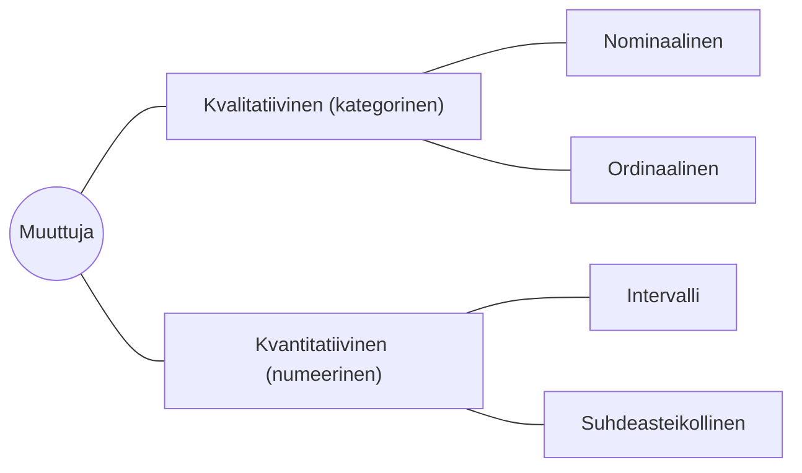

# Data

Koneoppimisen yhteydessä data vaatii esikäsittelyä ennen kuin se voidaan syöttää koneoppimismalliin. Kurssin ensimmäisen viikon aikana tutustumme datan lataamisen ja käsittelyn aivan tärkeimpiin vaiheisiin. Myöhemmin kurssin aikana opit eri tapoja käsitellä dataa vaiheittain, kunkin algoritmin vaatimusten sekä datan muodon mukaisesti.

Esikäsittely voi sisältää datan puhdistamista, skaalaamista, muuttujien valintaa ja monia muita vaiheita. Termi *datasetti* tarkoittaa jotakin kokoelmaa dataa. Data ei välttämättä ole esimerkiksi *taulukkomuodossa* - mutta usein se joko on, tai se muokataan taulukkomuotoon ennen koneoppimismallin soveltamista. Tabulaarisella datalla tarkoitetaan sellaista dataa, joka on organisoitu riveiksi ja sarakkeiksi.

> "Tabular data is simply data that is organized in rows and columns. A collection of tabular data can be called a tabular dataset or a table"
>
> Luca Massaron & Mark Ryan [^ml-for-tabular]

## Järjestyneisyys

### Strukturoitu data

Aloitetaan strukturoidusta datasta, koska sitä on helppo käsitellä ja ymmärtää.  Tyypillisesti strukturoitu data on tallennettu tietokantaan (esim. PostgreSQL, MySQL, SQLite) tai tietovarastoon (esim. Snowflake, Redshift). Se voi olla myös taulukkolaskentaohjelman taulukossa (esim. Excel, Google Sheets), mutta tällöin voitaisiin väitellä siitä, tippuuko se osittain strukturoidun datan kategoriaan (ks. alla). Tietokannat ovat tyypillisesti vahvasti tyypitettyjä, kun taas taulukkolaskentaohjelmat ovat usein heikosti tyypitettyjä. Vahvalla tyypityksellä tarkoitetaan sitä, että jos kenttä on muotoa `INTEGER`, siihen ==ei voi== tallentaa mitään muuta. Tyypillisesti Excel-taulukon soluun voi kirjoittaa aivan mitä mielii, ellei taulukossa ole erikseen käyttössä datavalidaatiosääntöjä... joita ei usein ole.

#### Tabulaarinen

Kuten yllä on jo todettu, tabulaarinen data on dataa, joka on järjestetty taulukkomuotoon. Taulukko koostuu riveistä (*engl. row*) ja sarakkeista (**engl. column**) – joskus kutsutaan myös nimellä pystyrivi. Vaakasuuntainen entiteetti eli rivi on tyypillisesti *näyte* eli *sample* tai *havainto* – mutta voi olla myös *record*, *case*, *instance* tai *example* [^practical-stats]. Jos meidän datasetti on **opiskelijat.xlsx**, niin yksittäinen rivi on opiskelija, ja yksittäinen sarake on esimerkiksi opiskelijan pituus.

Excel-tiedosto on toki tabulaarista dataa, mutta paremmassa tapauksessa data on jossakin vahvasti tyypitetyssä muodossa, kuten SQL-tauluna (`opiskelijat.db`) tai vaikkapa Parquet-tiedostossa (`opiskelijat.parquet`). Tietokannassa (ja Parquet-tiedostossa) jokaisella sarakkeella on tyyppi (esim. `INTEGER`, `VARCHAR`, `DATE`), kun taas taulukkolaskentaohjelmassa sarakkeen tyyppi voi muuttua dynaamisesti. Mikäli kentän "Pituus" arvo voi olla merkkijono `182 cm`, tai kvalitatiivinen arvo `pitkä`, data ei sisällä varsinaista lukkoon lyötyä struktuuria. Näin ollen Excel-tiedosto voi sinänsä tippua kategoriaan [Osittain strukturoitu data](#osittain-strukturoitu-data). Tiedostomuoto ei siis sinällään ole aivan sama asia kuin datan järjestyneisyyden taso.

| $x_0$ | $x_1$  | $x_2$  | $x_3$ |
| ----- | ------ | ------ | ----- |
| 1.01  | 512    | R      | 1     |
| 1.10  | 124124 | Python | 0     |
| 0.99  | 42     | R      | 1     |
| 0.97  | N/A    | R      | 1     |
| 1.00  | 96141  | Python | 0     |

Yllä olevassa taulukossa on neljä saraketta ($X = [\, x_0 \; x_1 \; x_2 \; x_3 \,]$). Tässä tapauksessa voi siis sanoa, että taulu $X$ on reaaliluvuista koostuva $n$-rivin ja 4-sarakkeen taulukko. ($X \in \mathbb{R}^{n \times 4}$)

Taulukon ensimmäinen olio, eli `X[0]` on siis silloin monikko eli *tuple* `(1.01, 512, R, 1)`, jonka skeema on `tuple[float, int, str, bool]`. 

### Osittain strukturoitu data

Osittain strukturoitu data (engl. semi-structured data) on dataa, joka ei ole täysin taulukkomuotoista, mutta sillä on kuitenkin pääosin koneluettava rakenne tai skeema. Esimerkiksi HTML-tiedostot ovat osittain strukturoitunutta dataa. Alla on esimerkki hyvin, hyvin yksinkertaisesta HTML-sivusta:

```html title="index.html"
<!DOCTYPE html>
<html>
    <head>
        <title>Pizza e-Bible</title>
    </head>
    <h1>Pizza Ingredients</h1>
    <ul>
        <li>Egg</li>
        <li>Ham</li>
        <li>Spam</li>
    </ul>
</html>
```

Yllä näkyvän kaltaista dataa voi louhia koneellisesti esimerkiksi Wikipediasta. Osittain strukturoitu data vaatii huomattavasti enemmän käsittelyä kuin strukturoitu data. Tämä käsittely on luonnollisesti virheherkkä prosessi. Datan skeema voi ajan kanssa elää. Esimerkiksi jos Wikipedian sivun HTML-rakenne muuttuu, koneellinen louhinta voi epäonnistua, tai voit päätyä kirjoittamaan väärää tietoa tietokantaan.

!!! info

    Tiedostopääte tai tiedoston formaatti ei itsessään tee datasta kokonaan tai osittain strukturoitua. Esimerkiksi JSON-tiedosto voi olla täysin strukturoitua dataa, jos se on koneellisesti kirjoitettu skeemaa noudattaen. Löytyy jopa projekti [JSON Schema](https://json-schema.org/), joka on JSON-tiedostojen skeemakieli. Toisaalta JSON voi olla myös hyvinkin muodoton, ihmisen kirjoittama köntti dataa, jonka tulkinta vaatii ihmisen kaltaista älyä.


### Epästrukturoitu data

Data, joka on täysin vailla struktuuria (engl. unstructured data), on kaikkein haastavinta käsitellä. Sanat *täysin vailla struktuuria* eivät suinkaan tarkoita, että kyseessä olisi täysin kaoottinen data. Yksittäinen havainto voi olla esimerkiksi äänitiedosto, kuva, video tai täysin vapaamuotoinen teksti. Tiedostolla itsellään, kuten `.JPG`-tiedostolla, on oma rakenne, mutta *informaatio* tiedostossa on epästrukturoitua. Esimerkiksi kuvan pikseli xy-koordinaatissa `(100, 100)` ei itsessään kerro mitään siitä, onko kyseessä kissa vai koira. Kuvan sisältöä tulee siis *kuvailla* jollakin muulla tavalla numeraalisesti.

Mikäli koulutat tekoälyä, joka pyrkii tunnistamaan onko kuvassa kissa vai koira, sinun dataset voi vaikkapa hakemistorakenne:

```
dataset/
    cat/
        DSC_0123.jpg
        web_fluffy.jpg
        ...
    dog/
        IMG_0473.jpg
        P129719088.jpg
        ...
```

Se, kuuluuko kuva hakemistoon `cat/` vai `dog/`, on datasetin selitettävä muuttuja. Kuvan pikseleistä ==muodostetaan myöhemmin== selittäviä muuttujia. Tähän soveltuvat eri feature descriptorit eli piirrekuvaajat, kuten HOG, SIFT, SURF, ORB, LBP, jne.

Huomaa, että saman datan voi tallentaa tietokantaan, mutta se ei tee datasta sen enempää strukturoitua. Käytännössä tässä tapauksessa vain indeksoit kuvat – mikä oli jo tehtynä aiemmin hakemistopuun avulla. Alla esimerkki, jossa kullakin kuvalla on `id`, `label` ja `data`, joista jälkimmäisin on binäärimuodossa tallennettu kuva.

| id  | label | data                |
| --- | ----- | ------------------- |
| 1   | cat   | 0x111001010...00111 |
| 2   | dog   | 0x001001010...11010 |
| ... | ...   | ...                 |


## Muuttujat

Muuttujat eli piirteet ovat keskeinen osa koneoppimista. Yllä opit, että rivi on *näyte* (esim. opiskelija) ja sarake on *muuttuja* (esim. opiskelijan pituus). Muuttujat ovat siis havaintojen *piirteitä* tai *dimensioita*. Nyt tulee tärkeä lause: ==piirteet käännetään numeroiksi ennen kuin ne voidaan syöttää koneoppimismalliin==. Tämä pätee kaikkiin koneoppimismalleihin, mukaan lukien ChatGPT:n kaltaisiin kielimalleihin. Loppukäyttäjän näkökulmasta voi näyttää siltä, että syötät mallille tekstiä, kuvia, ääntä, tekstisarakkeita sisältäviä SQL-tauluja tai mitä tahansa muuta, mutta data käännetään numeroiksi *piirremuotoilun* avulla. Englanniksi tarvitsemasi sana on *feature engineering*. [^feature-engineering]

Muuttujat ovat datasetin **sarakkeita**, toiselta nimeltään **pystyrivejä**, jotka ==kuvaavat havaintoja==. Ne ovat siis havaintojen piirteitä tai dimensioita. Strukturoidun datan tapauksessa muuttujalla on jokin tyyppi, kuten `INTEGER`, `VARCHAR` tai `DATE`. Tyypin lisäksi arvo voi useimmiten olla myös `NULL` tai `N/A`, mikä tarkoittaa, että arvoa ei ole määritetty – joko se puuttuu vahingossa, tai voi olla, että arvo voi ihan tosielämän logiikalla puuttua.

Data on tyypillisesti joko *kvantitatiivista* (numeerista luonnostaan) tai *kvalitatiivista* (kategorista luonnostaan) [^feature-engineering]. Tämä jako on usein ihmiselvä. Nämä tyypit jakautuvat neljään tasoon, jotka ovat *nominaalinen*, *ordinaalinen*, *intervalli* ja *suhdeasteikollinen*. Nämä S. S. Stevensin määrittelemät tasot kuvaavat datan järjestyneisyyttä ja mittaustasoa [^levels-of-measurement].




Ennen kuin edetään tässä pidemmälle, mietitään ongelmaa, mikä voi syntyä, jos pohditaan kaikkia lukuja siten, että niitä voi ynnätä ja kertoa vapaasti.

!!! info "Fahrenheit ja Celcius ongelma"

    Aloitetaan väitteillä:

    * 0 °C on 32 F
    * 32 F + 32 F = 64 F
    * 64 F on 17.78 °C
    * Täten, 0 °C + 0 °C = 17.78 °C

    Ei se tietenkään näin mene. Syy tälle löytyy alta selityksestä, eli lämpötila on *intervallimuuttuja*, eikä *suhteellinen muuttuja*. Intervallimuuttujalla on nollapiste, mutta se ei varsinaisesti ole tilanne, jossa *ei olisi mitään*. Jos lämpötilaa tarkastellaan kelvin-asteina, niin silloin 0 K on tilanne, jossa ei ole lainkaan lämpöä. Näin ollen kelvin-asteet ovat suhteellisia, ja niillä voi suorittaa vapaasti laskuoperaatioita. Celsius- ja Fahrenheit-asteet ovat intervallimuuttujia, eikä niillä voi suorittaa vapaasti laskuoperaatioita.

### Nominaalinen

Jos tarkistat sanan [nominal](https://en.wiktionary.org/wiki/nominal) wiktionarystä, huomaat, että se tarkoittaa jotakin nimestä tai nimistä koostuvaa. Tämä kategorinen datan tyyppi on siis dataa, joka koostuu nimistä, joilla ei ole sen enempää järjestystä kuin vaikkapa nimillä `Alice`, `Bob` ja `Charlie`. Voit esimerkiksi laskea Suomen kaikki etunimet ja niiden esiintymismäärät, mutta et voi sanoa, että `Alice` on suurempi kuin `Bob`. Muita esimerkkejä ovat verityypit, asuinkunta tai puhelimen brändi [^feature-engineering].

**Tyypillinen käsittelytapa:** *One-hot encoding* eli *dummy encoding*. Tämä käsitellään myöhemmin.

### Ordinaalinen

Kuten sanasta voi päätellä, ordinaalinen noudattaa järjestystä (*engl. order*). Tyypillinen esimerkki on kyselylomakkeista tuttu Likert-asteikko, jossa vastausvaihtoehdot ovat esimerkiksi `Erittäin tyytyväinen`, `Tyytyväinen`, `Neutraali`, `Tyytymätön` ja `Erittäin tyytymätön`. Näitä ei voi kääntää numeroiksi tai kategorioiksi satunnaisjärjestyksessä menettämällä tärkeää informaatiota. Muita vaihtoehtoja ovat esimerkiksi arvosanat (`A, B, ... F`), t-paitakoot (`S`, `M`, `L`, `XL`), elokuva-arvostelun tähdet (`*`, `**`, `***`) tai henkilön asema yrityshierarkiassa (`intern`, `entry level`, `director`, `VP`, `C-level`). [^feature-engineering]

**Datalle natiivi käsittelytapa:** *Ordinal encoding* (tai *label encoding*). Tämä on hyvinkin simppeliä:

| Rank at company | Encoded Value |
| --------------- | ------------- |
| Intern          | 0             |
| Entry           | 1             |
| Director        | 2             |
| VP              | 3             |
| C-level         | 4             |

!!! tip

    Tämällä on vaarana olla liian edistynyt konsepti ensimmäiselle viikolle, mutta mainittakoon silti: **ordinal encoding** on luonnollinen tapa koodata ordinaalista dataa, mutta se toimii parhaiten malleissa, jotka eivät perustu etäisyyksiin, kuten päätöspuumalleissa (DecisionTree, RandomForest, Gradient Boosting). Etäisyyspohjaisille malleille turvallisin vaihtoehto on silti usein one‑hot encoding.

### Intervalli

Nyt päästiin takaisin Fahreinheit- ja Celsius-asteisiin. Intervallimuuttujilla on selkeä järjestys, aivan kuten ordinaalisilla, mutta lisäksi niitä voi käyttää jossain määrin laskennassa. Esimerkiksi 20 °C ja 30 °C ero on kymmenen astetta (ei enää Celciusta; ihan vain astetta). On kuitenkin epäloogista sanoa, että 20 °C on kaksi kertaa lämpimämpi kuin 10 °C, koska 0 °C ei tarkoita tilannetta, jossa ei ole lainkaan lämpöä. 0 °C on vain yksi mittaluku muiden joukossa ilman erityismerkitystä. Se, mikä kuitenkin pätee, on että eri välisten lukujen erotus – eli intervalli – pysyy samana. Esimerkiksi t-paitojen kokoihin tämä ei pätisi: S- ja M-kokojen ero ei välttämättä ole mistään kohtaa paitaa mitattuna sama kuin M ja L. Tämä tarkoittaa, että on jossain luontevaa laskea tilastollisia arvoja kuten *keskiarvo*, toisin kuin ordinaalisten muuttujien tapauksessa. [^feature-engineering]

**Tyypillinen käsittelytapa:** Tässä vaiheessa kurssia.. ei mikään. Annetaan sen olla numero.

### Suhdeasteikollinen

S. S. Stevensin määrittelemä suhdeasteikollinen on datan tyyppi, joka on järjestetty, ja jonka nollapisteellä on selkeä merkitys: *tämä ei ole mitään*. Esimerkiksi pituus on suhdeasteikollinen, koska 0 cm tarkoittaa tilannetta, jossa ei ole lainkaan pituutta. 

Nämä ovat siis *tavallisia numeroita*. Muuttujat, kuten paino tai esineiden määrä laukussa, eivät voi olla negatiivisia. Toiset muuttujat, kuten pankkitilin saldo, voivat olla negatiivisia. Koska nolla on erityismerkityksellinen, näillä muuttujilla voi suorittaa vapaasti laskuoperaatioita, kuten yhteenlaskua, kertolaskua ja jakolaskua.

### Selittävä vs. selitettävä

Data jaetaan tyypillisesti **selittävien** ja **selitettävän** mukaan kahteen osaan: matriisiksi `X` ja vektoriksi `y`. Terminologia on peräisin tilastotieteestä, mutta se on vakiintunut myös koneoppimisen yhteydessä. Tulet huomaamaan, että koneoppimisessa asioilla on usein monta nimeä, ja eri konteksteissa ne tunnetaan hieman eri nimillä. Alla termit/synonyymit, jotka tarkoittavat samaa asiaa [^tilastokeskus-käsitteet] [^practical-stats]:

* selittävä muuttuja (independant variable) – $X_i$
    * suomeksi:
        * riippumaton muuttuja
    * englanniksi:
        * feature
        * attribute
* selitettävä muuttuja (dependant variable) – $y$
    * suomeksi:
        * riippuva muuttuja
    * englanniksi:
        * response
        * target
        * output
        * label

Koneoppimismallin koulutuksen haluttu tulos on, että selittävien muuttujien avulla voidaan ennustaa selitettävän muuttujan arvo. Esimerkiksi yllä esitelty opiskelijoista koostuva datasetti voidaan jakaa siten, että viimeinen boolean-tyyppinen sarake, $x_3$, on selitettävä muuttuja, ja kolme muuta saraketta selittäviä muuttujia. Näin ollen `X` on taulukko, joka sisältää kolme ensimmäistä saraketta, ja `y` on vektori, joka sisältää viimeisen sarakkeen arvot.

```python title="IPython"
# List of rows, or records|case|instace|examples|observations, 
# ... where each is a tuple of (x0, x1, x2)
# ... which all are features|attributes|independent variables
X: list[tuple] = [
    (1.01, 512, 'R'),
    (1.10, 124124, 'Python'),
    (0.99, 42, 'R'),
    (0.97, None, 'R'),
    (1.00, 96141, 'Python')
]

# list of targets|responses|dependent variables|labels
y: list[int] = [1, 0, 1, 1, 0]
```

On tärkeää huomata, että on ==ihmisen päätös==, että mikä muuttuja on selittävä ja mitkä ovat selittäviä. Kukaan ei estä meitä ottamasta yllä näkyvää datasettiä ja kouluttamasta tekoälyä, joka pyrkii kolmen muun sarakkeen arvon perusteella ennustamaan arvon `Python` tai `R`.

On yllättävänkin tyypillistä, että jokin data puuttuu. Täydellisiin datasetteihin törmäät lähinnä akateemisissa esimerkeissä. Paras tapa korjata `NULL`-ongelma on tehostaa datan keräysprosessia. Emme elä täydellisessä maailmassa, joten valitettavasti meidän on kuitenkin opittava käsittelemään puuttuvaa dataa. Puuttuvaa dataa voidaan käsitellä monin eri tavoin, kuten poistamalla vialliset havainnot, täyttämällä puuttuvat arvot keskiarvolla tai mediaanilla. Puuttuvan datan paikkauksessa tai poistamisessa pitää olla kuitenkin tarkkana: arvon puuttuminen voi olla merkityksellistä. Eli siis se, että arvo puuttuu, voi olla itsessään tietoa, joka auttaa ennustamaan selitettävää muuttujaa.

## Vektorit ja matriisit

Emme käsittele tällä kursseilla laskentaan liittyviä lukuja Pythonin sisäänrakennettuina muuttujatyyppeinä, kuten `int` tai `list[float]`. Tästä poikkeuksena on ensimmäinen harjoitus, jossa tutustutaan Pythonilla luotuun Vector-luokkaan: ihan vain varmistaaksemme, että ymmärrämme, mitä konepellin alla suunnilleen tapahtuu. Sen sijaan käytämme Numpy-kirjastoa matriisien ja vektorien käsittelyyn. 

!!! note "Polars ja Pandas"

    Käytämme lisäksi kirjastoja Polars ja/tai Pandas-kirjastoa. Polars on näistä siinä mielessä suositeltu vaihtoehto, että Marimo suosii sitä. Jos tarkistat [pyproject.toml](https://github.com/marimo-team/marimo/blob/main/pyproject.toml)-tiedoston Marimon repositoriosta, huomaat seuraavat rivit:

    ```toml
    [project.optional-dependencies]
    sql = [
        "duckdb>=1.0.0",           # SQL cells
        "polars[pyarrow]>=1.9.0",  # SQL output back in Python
        "sqlglot[c]>=26.8.0"       # SQL cells parsing;
    ]

    # ...

    [tool.marimo.ai]
    rules = "- prefer polars over pandas\n- make charts using altair"
    ```
    
    **The More You Know**: Pandas hyödyntää NumPya, joten Pandas DataFrame on pohjimmiltaan NumPy-matriisi, joka on kääritty `Index`, `Series` tai `DataFrame`-luokan olion sisään. Lisäksi Pandas lisää muutaman oman tyypin kyytiin: *"pandas and third-party libraries extend NumPy’s type system in a few places."* [^pandas-essential] Kaikki Pandasin lisäämät tyypit löydät [täältä](https://pandas.pydata.org/docs/user_guide/basics.html#basics-dtypes)

Tämän materiaalin alussa esitelty tabulaarinen datasetti on ihmiselle helpossa taulukkomuodossa. Koneoppimismallien tapauksessa data käsitellään yleensä matriiseina ja vektoreina. *Vektorisoidut operaatiot* ovat tehokkaampia kuin silmukat. Tyypillisesti koneoppimisessa käytetään `numpy`-kirjastoa edustamaan matriisia `X` ja vektoria `y`. Matriisi `X` on kaksiulotteinen taulukko, jossa rivit ovat havaintoja ja sarakkeet ovat muuttujia. Vektori `y` on yksiulotteinen taulukko, jossa on selitettävän muuttujan arvot. Alla on ylempää dokumentista tuttu datasetti `X` ja `y` `numpy`-muodossa. Näiden muuttujien nimet voivat luonnollisesti olla mitä tahansa, mutta `X` ja `y` ovat alan konvention mukaisia.

```python title="IPython"
import numpy as np

X: np.ndarray = np.array([
    [1.01, 512, 0],
    [1.10, 124124, 1],
    [0.99, 42, 0],
    [0.97, 0, 0],
    [1.00, 96141, 1]
])

y: np.ndarray = np.array([1, 0, 1, 1, 0])
```

## Tehtävät

!!! question "Tehtävä: Numpy Basics (TODO EXTEND)"

    Tutustu `130_numpy_basics.py`-tiedostoon, joka on Marimo Notebook. Kyseisessä tiedostossa käsitellään tämän materiaalin aihepiiriä Notebook-muodossa, koodia ajaen.

    Tämä on kurssin ensimmäinen Marimo Notebook, joten saat hieman tarkempaa pohjatietoa:

    * tiedosto löytyy [repositorion](https://github.com/sourander/ml-perusteet) juuresta alkaen polusta `notebooks/nb/100/130_numpy_basics.py`
    * on kannattavaa kloonata koko repositorio koneellesi. Avaa tuo `notebooks/`-hakemisto Visual Studio Codessa.
    * ... ja/tai kopioi koko hakemisto johonkin toiseen lokaatioon, kuten esimerkiksi siihen hakemistoon, mistä löytyy sinun oppimispäiväkirjasi.

    Tämä on esimerkki Marimo Notebookista, missä ei ole varsinaista *tehtävää*. Sinun kuuluu ajaa tiedosto, tutkia koodia ja raportoida oppimispäiväkirjaasi kurssin aihepiiriin liittyvät havainnot ja opit.

    !!! tip

        Muokkaa tiedostoa vapaasti! Tämä pätee kaikkiin kurssin Notebook-tiedostoihin. Voit esimerkiksi lisätä omia kommenttejasi, kokeilla erilaisia operaatioita, tai muuten vain leikkiä koodilla. Tiedosto on nyt sinun, ja se on tarkoitettu oppimiseen.

!!! question "Tehtävä: Vector from Scratch"

    Tutustu `131_vector_from_scratch.py`-tiedostossa olevaan `Vector`-luokkaan. Luokka on toteutettu natiivilla Pythonilla ilman ulkoisia kirjastoja eli *from scratch*. Toivon mukaan luokan yksinkertaisten looppien kautta ymmärrät, millaista laskentaa tapahtuu, kun käytät `numpy`-kirjastolla vastaavia operaatioita. NumPy toki tekee saman tehokkaammin, hyödyntäen mahdollisuuksien mukaan vektoroituja operaatioita – loogisella tasolla operaatio on kuitenkin sama kuin `Vector`-luokassa.

## Lähteet

[^ml-for-tabular]: Massaron, L. & Ryan, M. *Machine Learning for Tabula Data*. Manning. 2025.
[^practical-stats]: Bruce, P. & Bruce, A. *Practical Statistics for Data Scientists*. O'Reilly. 2017.
[^feature-engineering]: OZdemir, S. *Feature Engineering Bookcamp*. Manning. 2022.
[^levels-of-measurement]: Siadati, S. *Different types of data*. DataBizx. https://medium.com/databizx/different-types-of-data-894cd8d0251e
[^tilastokeskus-käsitteet]: Tilastokeskus. *Käsitteet*. https://stat.fi/meta/kas/index.html
[^pandas-essential]: Pandas documentation. *Essential Basic Functionality*. https://pandas.pydata.org/docs/user_guide/basics.html
