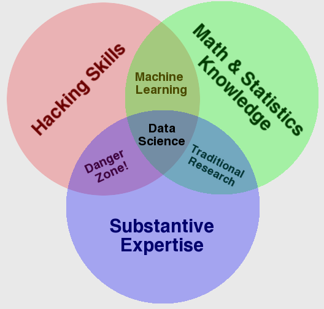

# Yleistä

Keskitymme tässä ensimmäisessä luvussa alan tärkeimpiin termeihin, niiden määritelmiin, ja yleiskatsaukseen aiheen historiaan. Ensimmäisen opiskeluviikon jälkeen sinun tulisi osata selittää 5-vuotiaalle muun muassa se, että miten koneoppiminen ja tekoäly liittyvät toisiinsa ja mitä ongelmia koneoppiminen auttaa ratkaisemaan. 

!!! tip

    Muistutan vielä, että kurssimateriaali ==ei ole tehtäväkirja==. Kunkin aiheen lopussa on tehtäviä, mutta niistä ei saa pisteitä. Oppimispäiväkirjasi tulee olla itsenäinen teos, joka koostuu viikkotason raporteista. Jos et tiedä yhtään, mitä sinun tulee tehdä, lue [Oppimispäiväkirja 101](https://sourander.github.io/oat/) -ohjeistus.

## Mikä on osa mitä?

KOKO-ontologian mukaan [koneoppiminen](http://www.yso.fi/onto/koko/p59563) käsite, jonka yläkäsite on [tekoäly](https://finto.fi/koko/fi/page/p36713). Toisin sanoen kaikki koneoppiminen on tekoälyä, mutta kaikki tekoäly ei ole koneoppimista. Myöhemmillä kursseilla opittava [syväoppiminen](http://www.yso.fi/onto/koko/p90875) on sen sijaan koneoppimisen alakäsite. [^koko] Täysin itsestäänselvää tämä ei kuitenkaan ole, eikä varsinkaan arkikielessä käytettynä.

> "Termejä koneoppiminen, hahmontunnistus ja tekoäly käytetään tarkoittamaan asmaa asiaa, ja no epäselvää miten ne eroavat toisistaan. [...] Kävin ensimmäisen kurssini koneoppimisesta 90-luvulla, ja sillloin Suomessa käytettiin termiä hahmontunnistus."
>
> – Joni Kämäräinen [^kämäräinen]

Kaikkiin näihin liittyy käsite sekä tieteenala *datatieteet (engl. data sciences)*, ja tyypillinen titteli datetieteilijälle on *data scientist*. Opettajan näkemys on, että meiltä valmistuu todennäköisemmin esimerkiksi *data engineer* tai *ML engineer* tittelille kuin varsinaiseksi datatieteilijäksi – kyseiseen tehtävään olisi hyvä hankkia vankka tilastotieteen tausta. Voit verrata käymäsi koulutusohjelman sisältöä esimerkiksi Roadmap.sh-sivuston tarjoamiin uratiekarttoihin: [AI and Data Scientist Roadmap](https://roadmap.sh/ai-data-scientist) ja [ML engineer roadmap](https://roadmap.sh/machine-learning) ja [Data Engineer Roadmap](https://roadmap.sh/data-engineer) ja [MLOps Engineer Roadmap](https://roadmap.sh/mlops).

> "Data Scientist (n.): Person who is better at statistics than any software engineer and better at software engineering than any statistician."
>
> – Josh Wills [^joshwills]

Saman KOKO-ontologian mukaan [datatiede](http://www.yso.fi/onto/koko/p77267) on tieteenalan [tietojenkäsittelytieteet](http://www.yso.fi/onto/koko/p51837) alakäsite. Alla on huumorivivahteinen Venn-kuvaaja, jossa esitellään eri aihealueiden päällekkäisyyksien luomat kombinaatiot (ks. Kuva 1). Jos pohdit, mikä sanan *danger zone* tilalla voisi olla ei-niin-humoristisessa mielessä, niin [wikidata: data science](https://www.wikidata.org/wiki/Q2374463)-artikkelin kuvaajissa kyseisessä kohdassa lukee ==data processing==.

**Kuva 1:** *Venn-diagrammi datatieteistä. (CC-BY) [^drewconway]*

Datatieteet ovat tieteenala, joka laittaa koneoppimisen käytäntöön. Se, millä tittelillä ja miten sinä osallistut tähän prosessiin, riippuu monesta tekijästä.

## Tekoäly

Tekoäly on vahvasti elokuvateollisuuden ja muun fiktion värittämä käsite. Osa fiktion tarjoamasta tiedosta on täyttä humpuukia, ja todellisuudessa tekoälyn hupun alta paljastuu pikemminkin tilastotiedettä ja matematiikkaa. Tämä ei kuitenkaan vähennä tekoälyn arvoa liiketoiminnan kannalta tärkeiden ongelmien ratkaisijana. 

### Historia

Tekoäly ei ole uusi keksintö. Ihmismielen päättelyn ymmärtämistä tai sitä vastaavan mekaanisen laitteen rakentamista on yritetty satoja ellei jopa tuhansia vuosia. Ensimmäinen neuroverkkotietokone, SNARC, rakennettiin vuonna 1950 Minskyn ja Edmondsin toimesta. Se koostui 40:stä keinotekoisesta neuronista, joiden rakennetta inspiroivat ihmisaivojen neuronit. [^snarc] Neuroverkkojen historiaan tutustutaan kuitenkin enemmän kurssilla Syväoppiminen I, joten jätetään tämä osa historiaa syvemmin käsittelemättä.

Koneoppimisen historiaa voidaan sen sijaan hieman sivuuttaa. Kirjassaan *Koneoppimisen perusteet* – joka kannattaa lukea jos käsiinsä saa – Kämäräinen mainitsee myös suomalaisia nimiä ja yhteisöjä, jotka toivat alan Suomeen. Näitä ovat seuran Hatutus (*Suomen hahmontunnistustutkimuksen seura*) perustajat Teuvo Kohonen, Erkki Oja ja Matti Pietikäinen. [^kämäräinen] Löydät tämän 1977 perustetun seuran tietoja helposti netistä, alken vaikkapa [Tieteellisten seurain valtuuskunnan](https://tsv.fi/fi/toiminta/jasenseurat/jasenseurahaku/hakutulos/tiedot?id=109) tarjoamista seuran tiedoista.

Opettajan kokemus on, että jos yrität tutustua koneoppimisen historiaan, joudut väistelemään neuroverkkoja ja syväoppimista jo 40—50-luvuilta asti. Tämän kurssin koneoppiminen, eli klassiset noin 90-luvun koneoppimismallit, ajavat sinut herkästi aiheisiin kuten *statistical signal processing* ja *statistical pattern recognition*. Meidän kurssilla käytäntö lähtee Bayesilaisesta tilastotieteestä, mistä edetään frekventistisen päättelyn keinoihin ja niihin perustuviin koneoppimismalleihin.  Myös 

!!! warning

    Neuroverkkoihin syvennytään Syväoppiminen I -kurssilla, joten teethän kaikkesi, jotta et käsittele esimerkiksi nykyisiä kielimalleja aihepiirinä oppimispäiväkirjassasi. Tämän aikan tulee vielä.

### Määritelmä

Jotta meillä voisi olla ristiriidaton määritelmä tekoälylle, meillä tulisi olla ensin ristiriidaton määritelmä (ihmisen) älykkyydelle. Tällaista ei ole, joten myös AI:n suhteen joudumme tyytymään vaihteleviin määritelmiin. Kirjassa *Artificial Intelligence: A Modern Approach* [^russell2010] esitetään, että tekoäly on ala, joka pyrkii ei vain ymmärtämään, vaan myös rakentamaan älykkäitä toimijoita. Tekoälyn määritelmiä voidaan kirjan mukaan järjestää neljään kategoriaan: ihmismäisesti ajattelemiseen, rationaalisesti ajattelemiseen, ihmismäisesti toimimiseen ja rationaalisesti toimimiseen. Näiden neljän kategorian jakautuminen perustuu kahteen akseliin: ==rationaali-ihmismäinen== (engl. rational-humanly) ja ==ajattelu-toiminta== (engl. thinking-acting). Jos tekoäly *toimii ihmismäisesti* (engl. acting humanly), sen käyttäytyminen on vaikea erottaa ihmisen käyttäytymisestä. Esimerkiksi kuulustelija ei tietäisi, käykö hän keskustelua botin vai ihmisen kanssa. Vastakohta tälle molemmilla akselilla on *rationaalisesti ajattelu* (engl. thinking rationally). Tämän määritelmän mukaan botti noudattaisi täydellistä päättelyprosessia. Kaikki olisi täysin virheetöntä logiikkaa.

!!! warning

    Voisi olla jossain määrin riskaabelia yrittää ratkaista todellisen maailman ongelmia käyttäen bottia, joka pyrkii täydellisesti aukottomaan, rationaaliseen ajatteluun, eikö?

*Rationaalinen toiminta* (engl. rational-acting) vaikuttaa olevan parhaiten soveltuva lähestymistapa käytännön tekoälylle. Rationaalinen toimija on olio, joka havaitsee ympäristönsä erilaisten antureiden avulla ja toimii sen mukaisesti, mutta pystyy sopeutumaan muutoksiin ja tavoittelee päämääriä. Tämän kurssin aikana luomme useita erilaisia rationaalisia toimijoita ja niiden komponentteja: yksi niistä on koneoppiminen, joka on tällä hetkellä hallitseva tapa rakentaa tekoälyä.

Tämän materiaalin puitteissa voit luottaa seuraavaan määritelmään: *AI eli tekoäly on mitä tahansa, mikä ulkoapäin vaikuttaa joltakin, mikä tyypillisesti vaatii ihmisen älykkyyttä*. Esimerkiksi kielioppivirheitä tai syntaksivirheitä voi poistaa tekstistä sääntöpohjaisella logiikalla käyttämättä koneoppimista laisinkaan. Myös esimerkiksi "älyliikennevaloja" voi ohjata hyvinkin sääntöpohjaisesti.

!!! question

    Onko jokin alla listatuista teoksista tuttu? Mitä tekoäly tarkoittaa kyseisessä tarinassa? Mitkä muut elokuvat, tv-sarjat tai kirjat kuuluisivat listalle?

    * 2001: A Space Odyssey (1968)
    * Hitchhiker's Guide to the Galaxy (1978/...)
    * Terminator (1984/...)
    * The Matrix (1999/...)
    * A.I. Artificial Intelligence (2001)
    * Moon (2009)
    * Her (2013)
    * Ex Machina (2014)
    * Companion (2025)

### Haarat

Tekoäly on kattokäsite ja sen alle lukeutuu eri aloja. Kirjassa "Artificial Intelligence with Python" [^joshi2017] esitellään tekoälyn eri haarat seuraavasti:

* Koneoppiminen ja hahmontunnistus (engl. machine learning and pattern recognition): datasta oppiminen ja siitä ennustaminen. Tämän kurssin AI edustaa pääasiassa tätä.
* Logiikkapohjainen AI (engl. logic-based AI): sääntöpohjaiset järjestelmät, jotka perustuvat logiikkaan. Käytetään esimerkiksi kielen parsimiseen.
* Haku (engl. search): algoritmit, jotka etsivät esimerkiksi optimaalista reittiä. Peleistä ja navigaattoreista tuttuja.
* Tiedon esittäminen (enlg. knowledge representation): yhteyksien luominen tiedon välille taksonomian tai muun hierarkisen järjestelmän avulla.
* Suunnittelu (engl. planning): algoritmit, jotka suunnittelevat toimintaa tavoitteiden saavuttamiseksi.
* Heuristiikka (engl. heuristics): reittien tai ratkaisuiden etsiminen tilanteessa, jossa optimaalista ratkaisua ei ole mahdollista tai käytännöllistä löytää, kenties nojaten nyrkkisääntöön tai akateemiseen arvaukseen, joka on osoitettavissa riittävän hyväksi.
* Geneettinen ohjelmointi (engl. genetic programming): algoritmit, jotka käyttävät evoluutioteoriaa ratkaisujen löytämiseen.

## Koneoppiminen

Koneoppimisen määritelmään kuuluu, että koneoppimismalli oppii datasta. Malli oppii siis kokemuksesta. Koneoppimismallin luominen ("mallinnus") on prosessi, jossa valittu koneoppimisalgoritmi oppii datasta. Ihminen valitsee sekä algoritmin että datan - ja näiden valinnalla on merkittävä vaikutus valmiin mallin laatuun.

### Määritelmiä

> "Machine learning (ML) is a collection of algorithms and techniques used to design systems that learn from data. These systems are then able to perform predictions or deduce patterns from the supplied data." 
> 
> – Wei-Meng Lee [^lee2019]

---

> "The machine learning portion of the picture enabled an AI to perform these tasks:
> 
> * Adapt to new circumstances that the original developer didn't envision
> * Detect patterns in all sorts of data sources
> * Create new behaviors based on the recognized patterns
> * Make decisions based on the success of failure of these behaviors."
>
> – Luca Massaron, John Paul Mueller [^mueller2016]

---

> "Difference between machine learning and AI: 
> 
> If it is written in Python, it's probably machine learning 
>
> If it is written in PowerPoint, it's probably AI" 
> 
> – Matt Velloso [^velloso2018]

---

> "[Machine learning is the] field of study concerned with giving computers the ability to learn without being explicitly programmed." 
> 
> – Arthur Smith [^tds-historical] [^geronpytorch]

---

> "A computer program is said to learn from experience, E, with respect to a task, T, and a performance measure, P, if its performance on T, as measured by P, improves with experience E." 
> 
> – Tom Mitchell [^tds-historical] [^geronpytorch]

---

> "A program or system that builds (trains) a predictive model from input data. The system uses the learned model to make useful predictions from new (never-before-seen) data drawn from the same distribution as the one used to train the model. Machine learning also refers to the field of study concerned with these programs or systems." 
> 
> – Google Developers [^googlemlglossary]

## Lähteet

[^koko]: Finto. *KOKO-ontologia*. https://finto.fi/koko/fi/
[^kämäräinen]: Kämäräinen, J. *Koneoppimisen perusteet*. Otatieto. 2023.
[^joshwills]: Wills, J (`@josh_wills`). Twitter post (now X). 2012. https://x.com/josh_wills/status/198093512149958656
[^drewconway]: Conway, D. *The Data Science Venn Diagram*. http://drewconway.com/zia/2013/3/26/the-data-science-venn-diagram
[^snarc]: Parvez, Z. *The Pioneers of AI: Marvin Minsky and the SNARC*. Medium. 2023. https://zahid-parvez.medium.com/history-of-ai-the-first-neural-network-computer-marvin-minsky-231c8bd58409
[^russell2010]: Russell, S. & Norvig, P. *Artificial Intelligence: A Modern Approach*. 3rd edition. Pearson. 2010.
[^joshi2017]: Joshi, P. Artificial Intelligence with Python. Packt Publishing. 2017.
[^lee2019]: Lee, W. *Python Machine Learning*. Wiley. 2019.
[^mueller2016]: Mueller, P. & Massaron, L. *Machine Learning for Dummies*. No Starch Press. 2016.
[^velloso2018]: Velloso, M (`@matvelloso`). Twitter post (now X). 2018. https://x.com/matvelloso/status/1065778379612282885?
[^tds-historical]: Krishna, D. *Your historical, theoretical and slightly mathematical introduction to the world of Machine…*. Towards Data Science. 2020. https://towardsdatascience.com/your-historical-theoretical-and-slightly-mathematical-introduction-to-the-world-of-machine-862b94fe8353/
[^geronpytorch]: Géron, A. *Hands-On Machine Learning with Scikit-Learn and PyTorch*. O'Reilly. 2025.
[^googlemlglossary]: Google Developers. *Machine Learning Glossary*. https://developers.google.com/machine-learning/glossary#m
