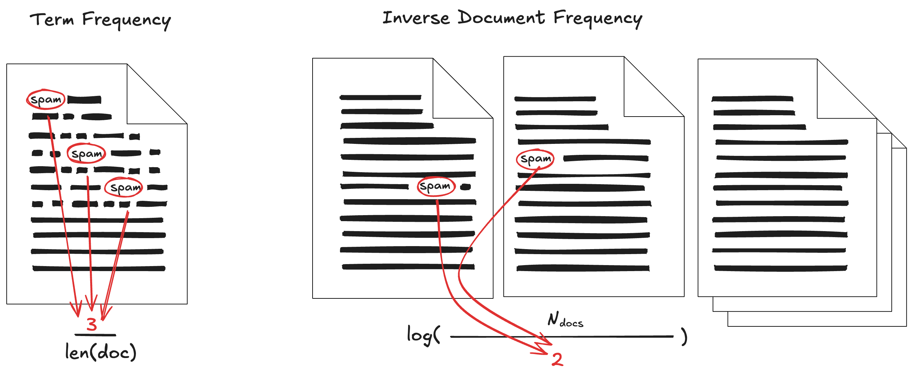

# Merkkijonojen enkoodaus

Ennen kuin siirrymme Naive Bayes -algortimin intuition ymmärtämiseen ja itse algoritmin käsittelyyn, tutustutaan datan enkoodaukseen. Wikidata määritelmän (en)kooderi (*engl. encoder*) on: *"ohjelma tai laite, joka muuntaa datan toiseen muotoon määritettyjen sääntöjen mukaan"* [^wiki-encoder]. Tässä kontekstissa enkooderi koodaa ASCII-muotoisen viestin kategoriseksi numeraaliseksi dataksi.

Kurssilla on jo aiemmassa luvussa käynyt selväksi (ks. [Muuttujat](../1_koneoppiminen/datasetti.md#muuttujat)), että koneoppimismallit vaativat numeerisista syötettä. Sanamuotoiset kategoriset muuttujat, kuten arvoavaruus `( "Cat", "Dog", "Hamster" )`, eivät ole numeerisia. Tästä syystä kategoriset muuttujat tulee enkoodata numeeriseen muotoon. Lauseet, kuten `Olipa kerran kissa`, vaativat vielä monimutkaisempaa käsittelyä.

Tässä materiaalissa tutustut menetelmiin one-hot encoding, label encoding, ordinal encoding, BoW (bag or words) ja TF-IDF. Tutustutaan niihin seuraavan datasetin avulla:

| age | level     | lang   | feedback                                | passed |
| --- | --------- | ------ | --------------------------------------- | ------ |
| 21  | matala    | Python | selkeä teoria helppo selkeä tehtävä     | 1      |
| 34  | korkea    | R      | vaikea tehtävä paljon laskentaa         | 0      |
| 28  | keskitaso | Python | selkeä harjoitus hyödyllinen esimerkki  | 1      |
| 45  | korkea    | Julia  | raskas projekti paljon koodia           | 0      |
| 23  | matala    | R      | helppo harjoitus selkeä ohje            | 1      |
| 39  | keskitaso | Python | hyödyllinen projekti hyvä visualisointi | 1      |
| 31  | korkea    | Julia  | vaikea teoria raskas tehtävä            | 0      |
| 26  | matala    | Python | selkeä esimerkki helppo koodi           | 1      |
| 42  | keskitaso | R      | paljon teoria hyödyllinen tehtävä       | 0      |
| 29  | matala    | Julia  | helppo alku selkeä harjoitus            | 1      |

## Menetelmät sanalle

Aloitetaan kategorisista muuttujista, jotka sisältävät yksittäistä sanaa edustavan merkkijonon, kuten `level`-sarakkeessa olevat "matala", "korkea" ja "keskitaso". Myöhemmin käsittelemme monimutkaisemman sarakkeen `feedback`, joka sisältää useita välilyönnillä erotettuja sanoja edustavan merkkijonon (lue: lauseen).

### Label encoding

Käsitteet *ordinal encoding* ja *label encoding* menevät herkästi sekaisin termeinä [^fe-cookbook]. Käsitellään ensimmäisenä **label encoding**, joka on täysin järjestyksetön, joten sarakkeen `level` enkoodaus näyttää tältä:

| level     | level_encoded |
| --------- | ------------- |
| matala    | 0             |
| korkea    | 1             |
| keskitaso | 2             |
| korkea    | 1             |
| matala    | 0             |
| ...       | ...           |

Huomaa, että arvot on määritelty esiintymisjärjestyksessä (engl. *the order of appearance*). Toisin sanoen ne voivat olla eri järjestyksessä kuin ihmisen käsittämä järjestys kyseisille kategorioilla [^python-da]. Tästä tuleekin nimi **LABEL** encoding. Kyseinen enkoodaus on käytössä lähinnä ennustettavalle luokalle. Jos katsot scikit-learn [LabelEncoder](https://scikit-learn.org/stable/modules/generated/sklearn.preprocessing.LabelEncoder.html) dokumentaatiota, huomaat, että: *"This transformer should be used to encode target values, i.e. $y$, and not the input $X$."*

!!! tip

    Tällä Johdatus koneoppimiseen -kurssilla keskitymme pääasiassa binäärisiin ongelmiin, joten label on usein `0` tai `1` jo valmiiksi. Ongelmissa, joita voi kuvata esimerkiksi termein *multiclass, single-label classification*, luokkia on monia. Esimerkiksi kuuluisa CIFAR-10 dataset voitaisiin Label Encoodata seuraavasti: `1=plane`, `2=car`, `3=bird`, ... `10=truck`. Tähän aiheeseen palataan Syväoppiminen I -kurssilla.

### Ordinal Encoding

Aiemmin mainittu sekaannus termien **label** ja **ordinal encoding** välillä mahdollistuu sillä, että scikit-learn:n [OrdinalEncoder](https://scikit-learn.org/stable/modules/generated/sklearn.preprocessing.OrdinalEncoder.html) voi toimia myös ilman järjestystä (engl. *order*) – ja näin se myös vakiona tekeekin, koska `categories="auto"`, jolloin toiminnallisuus on: *"determine categories automatically from the training data."*. Tällöin reaalimaailman järjestys menenetään, joten `ordinal`-sana lakkaa olemasta merkityksellinen.

Huomaa, että kummatkin näistä enkoodeneista (label ja ordinal) tekevät jostakin luokasta numerona suuremman kuin toisen. Tämä voi johtaa virheellisiin johtopäätöksiin, koska monet koneoppimismallit tulkitsevat suuruusjärjestyksen olevan merkityksellinen. Kategoriset muuttujat, kuten t-paidan koko (S, M, L, XL jne.) ovat järjestyksellisiä eli ordinaalisia. Tällöin niiden vaihtaminen numeroiksi **järjestystä noudattaen** voi olla perusteltua.

| level     | level_encoded |
| --------- | ------------- |
| matala    | 0             |
| korkea    | 2             |
| keskitaso | 1             |
| korkea    | 2             |
| ...       | .             |

!!! warning

    Kaikki kategoriset muuttujat eivät kuitenkaan ole ordinaalisia. Jos datasetissä on esimerkiksi piirre lempiväri, joka on kokonaislukuina enkoodattuna: `0: oranssi`ja `6: Sininen`, koneoppimismalli voi tulkita, että sininen on kuusi kertaa niin suuri kuin oranssi.

### One-Hot encoding

One-hot encoding on äärimmäisen yksinkertainen tapa enkoodata kategorinen muuttuja vektoriksi. Vektorista tulee yhtä pitkä kuin aineiston uniikit arvot. SQL-toteutus lienee helpoin lukea. Sen voi tehdä DuckDB:n esimerkkiä [^duckdb-feat-eng] myötäillen näin:

```sql
SELECT
    "level",
    level_keskitaso: ("level" = 'keskitaso')::UTINYINT,
    level_korkea: ("level" = 'korkea')::UTINYINT,
    level_matala: ("level" = 'matala')::UTINYINT
FROM df
```

| level     | level_keskitaso | level_korkea | level_matala |
| --------- | --------------- | ------------ | ------------ |
| matala    | 0               | 0            | 1            |
| korkea    | 0               | 1            | 0            |
| keskitaso | 1               | 0            | 0            |
| korkea    | 0               | 1            | 0            |
| ...       | ...             | ...          | ...          |

Tässä tapauksessa siis `level_keskitaso` on vektori `[0, 1, 0]`. Scikit-learn kirjastossa vastaavan operaation toteuttaa [OneHotEncoder](https://scikit-learn.org/stable/modules/generated/sklearn.preprocessing.OneHotEncoder.html). Polars tuntee tämän nimellä [DataFrame.to_dummies()](https://docs.pola.rs/api/python/stable/reference/dataframe/api/polars.DataFrame.to_dummies.html) ja Pandas nimellä [.get_dummies()](https://pandas.pydata.org/docs/reference/api/pandas.get_dummies.html). On tärkeämpää ymmärtää kuinka one-hot encoding toimii kuin osata toteuttaa se jollain tietyllä kirjastolla. Kun ymmärrät periaatteen, voit toteuttaa sen jatkossa millä tahansa kirjastolla, mikä sattuukaan istumaan sinun projektisi teknologiapinoon.

!!! tip

    Usein yksi vektorin arvoista pudotetaan pois. SQL:llä tekisit tämän siten, että kommentoit yhden yllä olevista riveistä pois. Polarsilla ja Pandasilla on tätä varten parametri `drop_first=True` (tai `drop="first`). Tähän aiheeseen palataan myöhemmin mallien kohdalla termin *multikollineaarisuus* kautta. Älä murehdi tästä vielä liika.

## Menetelmät lauseelle

Aiemmin keskityimme yksittäisen sanan sisältävään sarakkeeseen `level`, jossa koko sarakkeen merkkijonon tulkittiin oleva arvo itsessään. Sarake `feedback` on monimutkaisempi. Se sisältää arvon, kuten `selkeä teoria helppo selkeä tehtävä`.

### Bag of Words

Sarakkeessa `feedback` olevat lauseet, voidaan enkoodata käyttämällä **bag of words** -menetelmää [^bow-beginners] [^buildingaiagents]. Scikit-learnin toteutus tästä kulkee nimellä [CountVectorizer](https://scikit-learn.org/stable/modules/generated/sklearn.feature_extraction.text.CountVectorizer.html). Kannattaa tutustua myös Christian S. Peronen blogista löytyvään selitykseen [Machine Learning :: Text feature extraction (tf-idf) – Part I](https://blog.christianperone.com/2011/09/machine-learning-text-feature-extraction-tf-idf-part-i/).

Menetelmä on yksinkertaisuudessaan [^hands-on-llm]:

1. Ota lause kuten `"selkeä teoria helppo selkeä tehtävä"`
2. Tokenisoi se sanatokeneiksi `["selkeä", "teoria", "helppo", "selkeä", "tehtävä"]`
3. Lisää kukin sana sanastoon (*engl. vocabulary*): `{1: "selkeä, 2: "teoria, "3: "helppo, 4: tehtävä}`
4. Laske lauseessa esiintyvät sanat vocabulary-järjestyksessä: `[2, 1, 1, 1]`

Yllä purettiin vain yhden rivin yksi lause, joten *vocabulary* on hyvin suppea. Kun ajat tämän suuremmalle tekstimassalle, korpukselle, syntyy merkittävästi leveämpi taulu, koska **kaikkien rivien kaikki sanat** tulee ottaa huomioon. Yllä esitellyssä datasetissä on 18 uniikkia sanaa, joten vektorisointi lisää tauluun 18 saraketta. Taulukosta näytetään vain ensimmäinen ja 5 viimeistä saraketta. Miksi juuri viisi? Koska `selkeä`-sana on ainut, joka esiintyy kahdesti jossakin lauseessa, joten se on ainoa, joka saa arvon `2`. Kaikki muut sanat saavat arvon `0` tai `1`.

| alku | ... loput sarakkeet ... | selkeä | tehtävä | teoria | vaikea | visualisointi |
| ---- | ----------------------- | ------ | ------- | ------ | ------ | ------------- |
| 0    | ...                     | 2      | 1       | 1      | 0      | 0             |
| 0    | ...                     | 0      | 1       | 0      | 1      | 0             |
| 0    | ...                     | 1      | 0       | 0      | 0      | 0             |
| 0    | ...                     | 0      | 0       | 0      | 0      | 0             |
| 0    | ...                     | 1      | 0       | 0      | 0      | 0             |
| 0    | ...                     | 0      | 0       | 0      | 0      | 1             |
| 0    | ...                     | 0      | 1       | 1      | 1      | 0             |
| 0    | ...                     | 1      | 0       | 0      | 0      | 0             |
| 0    | ...                     | 0      | 1       | 1      | 0      | 0             |
| 1    | ...                     | 1      | 0       | 0      | 0      | 0             |

On äärimmäisen tärkeää huomata, että tämä on *häviöllinen* enkoodaus. Tiedämme, että ensimmäiseessä lauseessa on sana `selkeä`, mutta emme tiedä, missä kohtaa lauseessa se esiintyy [^hands-on-llm].

!!! tip

    Periaatteessa pussiin voi pistää kyseisen *samplen* eli rivin osalta myös muita asioita kuin määrän. Olisi mahdollista muodostaa binäärinen eli one-hot versio pussista. Jos sinulla on aiempaa kokemusta koneoppimisesta ja haluat haastaa itseäsi oppimispäiväkirjaa kirjoittaessa, voit tutustua aiheeseen **bag of visual words**. Jos ei, suosittelen toistaiseksi välttelemään tätä aihetta.

### TF-IDF

Tämän luvun viimeinen aihe, TF-IDF (Term Frequency Inverse Document Frequency) on hieman monimutkaisempi kuin aiemmat, mutta ei silti varsinaista rakettitiedettä. TF-IDF muuttaa tekstin numeeriseen vektorimuotoon, jossa jokainen sarake vastaa sanaa ja jokainen rivi dokumenttia. Alla oleva Kuva 1, jossa esitellään `TF` ja `IDF` erikseen, on toivon mukaan intuition tasolla selkeä.

Mikäli tutustuit Christian S. Peronen selitykseen aiemmasta enkoodausalgoritmista, on luontevaa jatkaa aihepiiriin tutustumista hänen Part II:n myötä: [Machine Learning :: Text feature extraction (tf-idf) – Part II](https://blog.christianperone.com/2011/10/machine-learning-text-feature-extraction-tf-idf-part-ii/). Peronen artikkelissa esitellään myös L1- ja L2-normalisaatiot, jotka liittyvät sekä tähän että tuleviin kurssin aiheisiin [^perone].



**Kuva 1:** *TF edustaa sanan frekvenssiä dokumentissa. IDF kuvaa sanan harvinaisuutta koko aineistossa. Kuva on mukaelma kirjan vastaavasta kuvasta [^buildingaiagents].*

Kirjassa *Building AI Agents with LLMs, RAG, and Knowledge Graphs* esitellään logaritmin syyksi:

> "Instead of using raw frequency, we can use the logarithm in base 10, because a word that occurs 100 times in a document is not 100 times more relevant to its meaning in the document. Of course, since vectors can be very sparse, we assign 0 if the frequency is 0. Second, we want to pay more attention to words that are present only in some documents"
>
> — Salvatore Raieli & Gabriele Iuculano

TF, DF ja IDF ovat kolme erillistä askelta, joista TF-IDF muodostuu. Luvussa edetään samassa järjestyksessä kuin laskenta: ensin TF, sitten DF, sen jälkeen IDF. Lopuksi `TF x IDF` lasketaan, mistä syntyy lopullinen `TF-IDF`. Tämän voisi vielä L2-normalisoida; se tehdään tehtäviin liittyvissä Notebookeissa, ei tässä materiaalissa. Normalisaatiolla varmistetaan, että dokumenttien pituus ei vaikuta liikaa TF‑IDF‑vektorin normaaliarvoihin. Pitkät dokumentit eivät näin dominoi mallia.

#### TF

TF on sanan frekvenssi dokumentissa. Toisin sanoen se kertoo, kuinka tärkeä sana on dokumentille itselleen. TF-arvo lasketaan kaavalla [^buildingaiagents]:

$$
TF(d, t) = \frac{\text{number of times term } t \text{ appears in document } d}{\text{total number of terms in document } d}
$$

Lopputulos on nähtävissä alla. Mukaan on valittu vain sarakkeet, joilla on tämän aiheen kanssa merkitystä. Sarake `tf = term_count / doc_len` on laskettu kaavan mukaisesti. Kaiken kaikkiaan TF-taulussa on 40 riviä, koska taulu sisältää dokumentti–token-parit uniikkeina riveinä. Korpuksessa tokeneita on yhteensä 41, mutta sana `selkeä` esiintyy kahdesti ensimmäisessä dokumentissa, ja näkyy siksi TF-taulussa yhtenä rivinä, jonka `term_count = 2`.

| doc_id | token   | term_count | doc_len | tf   |
| ------ | ------- | ---------- | ------- | ---- |
| 0      | helppo  | 1          | 5       | 0.2  |
| 0      | tehtävä | 1          | 5       | 0.2  |
| 0      | teoria  | 1          | 5       | 0.2  |
| 0      | selkeä  | 2          | 5       | 0.4  |
| 1      | paljon  | 1          | 4       | 0.25 |
| ...    | ...     | ...        | ...     | ...  |

#### DF

DF-arvo on sanan dokumenttifrekvenssi eli sen esiintyvyys kaikissa dokumenteissa lukumääränä. lasketaan kaavalla [^buildingaiagents]:

$$
DF(t) = \text{number of documents that contain term } t
$$

Lopputulos on nähtävissä alla. Kaiken kaikkiaan näitä rivejä on 18, koska aineistossa on 18 uniikkia sanaa.

| token  | df  |
| ------ | --- |
| ohje   | 1   |
| alku   | 1   |
| helppo | 4   |
| teoria | 3   |
| paljon | 3   |
| ...    | ... |

#### IDF

IDF-arvo on DF:n *inverse* eli käänteinen lukema. Se kertoo, kuinka harvinainen sana on koko aineistossa. Logaritmi auttaa pitämään suuret lukemat aisoissa (ks. Raieli & Iuculano lainaus yltä). Ero lainauksen ja tämän kurssin toteutuksen välillä on logaritmin kanta (`10` vastaan `e`). IDF lasketaan kaavalla [^buildingaiagents]:

$$
IDF(t) = \log\left(\frac{\text{total number of documents}}{DF(t)}\right)
$$

Jos sana esiintyy kaikissa dokumenteissa, IDF on 0, koska `log(1) == 0`.

Lopputulos alla taulukossa. Rivejä taulukossa on kaiken kaikkiaan 18, koska se on *vocabulary* koko.

| token         | N   | df  | idf      |
| ------------- | --- | --- | -------- |
| esimerkki     | 10  | 2   | 1.609438 |
| hyödyllinen   | 10  | 3   | 1.203973 |
| ohje          | 10  | 1   | 2.302585 |
| raskas        | 10  | 2   | 1.609438 |
| visualisointi | 10  | 1   | 2.302585 |
| ...           | ... | ... | ...      |

!!! note

    Meidän esimerkeissä IDF:n kaava on yksinkertainen $log(\frac{N}{n})$, jossa $N$ on dokumenttien kokonaismäärä ja $n$ on dokumenttien määrä, joissa sana esiintyy. Eri kirjastojen, kuten scikit-learn, toteutuksissa kaava sisältää yleensä *smoothingia*. Näistä kahta arvoa voi säätää:

    * `smooth_idf=True` lisää sekä jakajaan että nimittäjään `+ 1`.
    * `sublinear_tf=True` lisää $log(...) + 1$.
    * `norm='l2'` normalisoi vektorit L2-normalisaatiolla (rivikohtainen normalisointi).

    Voit tarkistaa scikit-learnin osalta näiden asetuksien vakioarvot dokumentaatiosta: [TfidfVectorizer](https://scikit-learn.org/stable/modules/generated/sklearn.feature_extraction.text.TfidfVectorizer.html):ssä.

#### Case: helppo

Lasketaan vielä sanan `helppo` osalta koko putki.

```plaintext
N = len(data)                   = 10
TF(helppo, data[0]) =       1/5 = 0.2
TF(helppo, data[4]) =       1/4 = 0.25
TF(helppo, data[7]) =       1/4 = 0.25
TF(helppo, data[9]) =       1/4 = 0.25
DF(helppo)                      = 4
IDF(helppo)         = log(10/4) = 0.916291
```

Näitä arvoja hyödyntäen voimme lopulta laskea:

```plaintext
TFIDF(helppo, data[0]) = 0.20 x 0.916291 = 0.183258
TFIDF(helppo, data[4]) = 0.25 x 0.916291 = 0.229073
TFIDF(helppo, data[7]) = 0.25 x 0.916291 = 0.229073
TFIDF(helppo, data[9]) = 0.25 x 0.916291 = 0.229073
```


!!! warning

    Meidän TF-IDF enkooderi on nyt oppinut tavoille sanastolla, johon kuuluu 18 sanaa. Jos annamme mallille uuden lauseen, jossa on sanoja, joita ei esiintynyt koulutuskorpuksessa, nämä sanat jäävät sanaston ulkopuolelle (*out of vocabulary*) ja ne ohitetaan. Jos lauseen kaikki sanat ovat uusia, tuloksena on pelkkä nollavektori.

## Tehtävät

!!! question "Tehtävä: Sanojen enkoodaus"

    Aja ja tutustu Notebookiin `200_word_encoding.py`. Notebookissa esitellään sama dataset ja operaatiot kuin yllä. Muokkaa Notebookia rohkeasti.

!!! question "Tehtävä: Lauseiden enkoodaus"

    Aja ja tutustu `201_sentence_encoding.py`-tiedostoon, jossa esitellään TF-IDF paloissa. Kun olet lukenut Notebookin läpi, varmista oma ymmärrys seuraavan tehtävän avulla:
    
    * Muokkaa dataa (feedback-saraketta) siten, että saat jollekin termille (eli tokenille) TF-IDF arvon nolla.
    * ... ja tämän jälkeen muokkaa Notebookia oman tahtosi mukaan. Se on nyt sinun Notebook.

## Lähteet

[^wiki-encoder]: Wikidata. Encoder. https://www.wikidata.org/wiki/Q42586063
[^duckdb-feat-eng]: Leuca, P. *Basic Feature Engineering with DuckDB*. https://duckdb.org/2025/08/15/ml-data-preprocessing
[^python-da]: Navlani, A., Fandango, A. & Idris, I. *Python Data Analysis - Third Edition*. Packt Publishing. 2021.
[^fe-cookbook]: Galli, S. *Python Feature Engineering Cookbook - Third Edition*. O'Reilly. 2024.
[^bow-beginners]: Gandhi, V. *Bag-of-Words Model for Beginners*. https://www.kaggle.com/code/vipulgandhi/bag-of-words-model-for-beginners
[^buildingaiagents]: Raieli, S. & Iuculano, G. *Building AI Agents with LLMs, RAG, and Knowledge Graphs*. Packt. 2025.
[^hands-on-llm]: Alammar, J. & Grootendorst, M. *Hands-On Large Language Models*. O'Reilly. 2024.
[^perone]: Perone, C. *Machine Learning :: Text feature extraction (tf-idf) – Part II*. https://blog.christianperone.com/2011/10/machine-learning-text-feature-extraction-tf-idf-part-ii/
