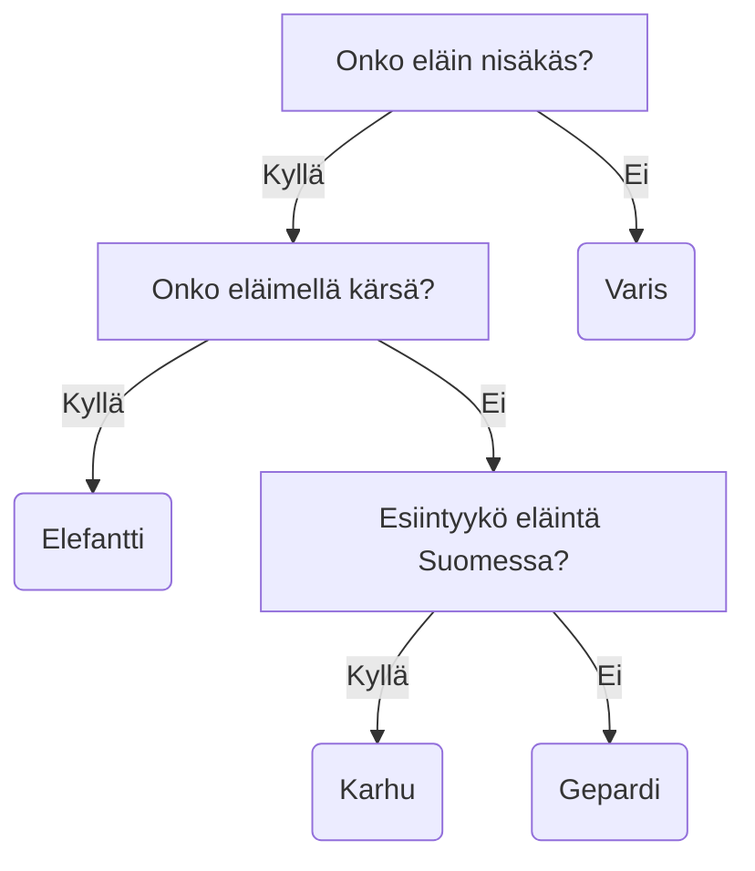

# Entropia

## Päätöspuun intuitio

Päätöspuu (engl. decision tree) on yksinkertainen, mutta tehokas koneoppimisen työkalu. Puun rakentaminen on suhteellisen edullista ja kysely on nopeaa. O-luku on `O(log N)`, koska taustalla on tietorakenne nimeltä binääripuu (engl. *binary tree*). Päätöspuu on pääasiassa luokittelualgoritmi, mutta sitä voidaan käyttää myös regressioon. Tässä materiaalissa keskitymme ensisijaisesti luokitteluun.

Kämäräinen jakaa koneoppimisen lähestymistapoja kahteen kategoriaan: insinööri- ja tietojenkäsittelymenetelmiin. Kurssin seuraavat aiheet tulevat olemaan vahvasti insinööritraditiota noudattavia, eli ongelmia pisteinä karteesisessa koordistossa. Puut, kuten Kämäräinen vahvistaa, pohjaavat tietorakenteisiin ja algoritmeihin, jotka ovat selvästi tietojenkäsittelytieteiden tontilla. [^kämäräinen]

> "Voidaan karkeasti ajatella, että insinöörimenetelmät ovat hyviä niin pitkään kuin opetusnäyttteet ovat mittauksia fyysisiltä sensoreilta (mikrofoni, kamera, etäisyys, paino). Jos näytteet ovat ihmisen tuotamaa tai muuten rakenteellista dataa (ikä, sukupuoli, osoite, pituus), niin tietojenkäsittely koneoppimismenetelmät soveltuvat paremmin."
>
> — Joni Kämäräinen [^kämäräinen]

Päätöspuu on puun muotoon järjestetty joukko sääntöjä, jotka auttavat ennustamaan tietyn datapisteen luokan [^grokking]. Jokainen solmu (tai *oksan haara*) testaa tietyn arvon. Jos olet joskus pelannut "Arvaa kuka?" tai "Mikä eläin?" pelejä, konsepti on sinulle jo valmiiksi tuttu. Lopulta puu päättyy lehtiin, jotka edustavat valmiita vastauksia eli luokkia. [^fromscratch]



**Kuvio 1:** *Mikä eläin?-pelin päätöspuu, olettaen että ainoat sallitut eläimet ovat: gepardi, karhu, elefantti ja varis.*

## Informaatioteoria

Päätöspuun rakentaminen perustuu informaatioteoriaan, joka on samalla koko IT-alan perusta. Informaatioteoriaa kehitti Claude Shannon. Hän käsitteli aiheita jo maisteritutkinnon päätöstyössään 30-luvun lopulla. Vuonna 1948, työskennellessään Bell Telephone Labsissä, hän kirjoitti artikkelin *A Mathematical Theory of Communication*, joka voidaan nähdä informaatioteorian syntynä. Informaatioteoria on matemaattinen teoria, joka käsittelee informaation siirtoa kohinaisen kanavan yli. Noin 50-sivuinen artikkeli on ladattavissa PDF-muodossa ainakin [Harvardin sivuilta](https://people.math.harvard.edu/~ctm/home/text/others/shannon/entropy/entropy.pdf). Sana *bitti* (engl. bit) tulee sanoista *binary digit* ja on informaation perusyksikkö. Shannon ei kenties keksinyt sanaa, mutta hän käytti sitä ensimmäisenä julkaistussa artikkelissaan. [^code]

<iframe width="560" height="315" src="https://www.youtube.com/embed/2s3aJfRr9gE?si=uF2c5OOWPjml2rUw" title="YouTube video player" frameborder="0" allow="accelerometer; autoplay; clipboard-write; encrypted-media; gyroscope; picture-in-picture; web-share" referrerpolicy="strict-origin-when-cross-origin" allowfullscreen></iframe>

**Video 1:** *Informaatioteoriaa käsittelevä video (Khan Academy).*


Kirja *Predicting the Unknown: The History and Future of Data Science and Education*, kirjoittajana Stylianos Kampakis, vertaa informaatioteorian hyötyjä viestinnässä, signaalinkäsittelyssä ja tietojenkäsittelyssä tavallisten lauseiden ymmärtämiseen. Kohinan konseptia hän selittää tilanteella, jossa vain osa viestistä saapuu perille. Jos kuulet erittäin kohinaisen radiotiedotteen, josta erotat vain sanat "ja", "on", "että" ja "sekä", saat hyvin vähän informaatiota. Mikäli vastaanotosta sattumanvaraisesti läpi päässeet sanat ovat "kansalaisten" ja "sisätiloissa", saat enemmän informaatiota. Mikäli lähettäjä tietää viestivänsä kohinaisessa kanavassa, viestiä voi toistaa useita kertoja, jotta viestin sisältämän informaation todennäköisyys kasvaa. [^the-unknown]

Informaation ja entropian käsitteet liittyvät myös tiedostojen pakkaamiseen, ja asettavat eräänlaisen katon sille, kuinka pieneksi dataksi informaation voi pakata häviöttömästi [^compression]. Suuri pakkaamaton tiedosto, joka sisältää 75 % ykkösiä ja 25 % nollia, pakkautuu keskimäärin noin 81 %:iin alkuperäisestä koosta (`entropy([0.75, 0.25]) ~= 0.81`). Todella vähän entropiaa sisältävän merkkijonon, kuten `"spam spam spam spam "` voi pakata yksinkertaisesti `"spam " * 4`.

> "Every compression algorithm computer scientists write tries to disprove Claude Shannon’s research, and compress the data further than its measured entropy."
>
> — Colt McAnlis & Aleks Haecky [^compression]

### Entropia

Informaatio on tiedon yllättävyyttä (engl. surprise). Jos jokin tapahtuma on äärimmäisen epätodennäköinen, mutta tapahtuu silti, se on yllättävä (eli sisältää paljon informaatiota.) Tapahtuma "Näin eilen metsässä eläimen" ei ole laisinkaan yllättävä, mutta "Näin eilen metsässä leijonan" on erittäin yllättävä. Ei siis ole lainkaan yhdentekevää, mikä kysymys ja missä järjestyksessä päätöspuussa esitetään [^fromscratch].

!!! tip

    Arvaa kuka? -pelissä on kiinteä määrä hahmoja, joten oletettavasti on löydettävissä kysymysten sarja, joka johtaa oikeaan vastaukseen. Lue Rafael Prieto Curielin [Cracking the Guess Who? board game](https://chalkdustmagazine.com/blog/cracking-guess-board-game/) pohjustukseksi päätöspuille.

Entropia on tämän esitellyn epävarmuuden mitta. Jos olet varma jonkin tapahtuman tuloksesta, entropia on nolla. Tätä tilannetta edustaisi esimerkiksi 6-sivuinen noppa, jossa kukin silmäluku on sama. 

Shannonin artikkelissa sekä yllä olevassa Khan Academyn videossa esitellään entropian matemaattinen kaava, joka on lauseena muotoa: entropia (`H`) on symbolien (esim. `X = x_1, x_2, ..., x_n`) todennäköisyyksien (`p_1, p_2, ..., p_3`) ja informaation sisällön (engl. information content, surprisal) `I(x_i) = log_2(1/p_i)` tulojen summa. Kaavassa käytetään logaritmin kantalukuna lukua 2. Matemaattista syntaksia käyttäen kaava on:

$$
H(X) = \sum_{i=1}^{n} P(x_i) \log_2 \frac{1}{P(x_i)}
$$

Jos korvataan `P(x_i)`:t eli symbolien todennäköisyydet `p_i`, niin:

$$
H(X) = \sum_{i=1}^{n} p_i \log_2(\frac{1}{p_i})
$$

Kaava on useissa lähteissä (esim. videossa yllä) pyöräytetty muotoon, jossa logaritmin eteen on laitettu miinusmerkki, ja ykkösellä jaettu luku on nostettu logaritmin eteen (koska `-log(x) == log(1/x)`). Tällöin kaava on:

$$
H(X) = -\sum_{i=1}^{n} p_i \log_2({p_i})
$$

Entropia on siis **datan epäpuhtauden tai epäjärjestyksen mitta**. Tavoitteena on ==minimoida entropia== jakamalla data tavalla, joka erottaa luokat mahdollisimman puhtaasti. Jos sinulla on 6-sivuinen noppa, jossa on kaksi pääkalloikonia ja neljä papukaijaa, eli (:skull: :skull: :parrot: :parrot: :parrot: :parrot:), entropia olisi:

$$
H(X) = -\left( \frac{2}{6} \log_2 \frac{2}{6} + \frac{4}{6} \log_2 \frac{4}{6} \right) = 0.918
$$

Alla on esimerkkitoteutus entropiafunktiosta Python-kielellä. Huomaa, että todennäköisyyksiä voi olla useampia, mutta niiden summan tulee olla 1.0. Me käsittelemme tällä kurssilla vain binääripuita, joten todennäköisyyksiä on jatkossa vain kaksi per päätöspuun solmu. Alla oleva koodi edustaa Khan Academyn videon esimerkkiä, jossa symbolien `ABCD` todennäköisyydet ovat `[0.5, 0.25, 0.125, 0.125]`.

```python
from math import log2

def entropy(X):
    H_val = -sum([p * log2(p) for p in X if p > 0])
    return H_val

probabilities = [0.5, 0.25, 0.125, 0.125]
print("H(X) = ", entropy(probabilities))
```

### Gini

Gini impurity on entropian tavoin **datan epäpuhtauden mitta**. Sitä käytetään päätöspuissa valitsemaan jako, joka erottaa luokat mahdollisimman puhtaasti. Mitä pienempi Gini impurity, sitä puhtaampi solmu.

Sen laskentakaava on [^geronpytorch]:

$$
G = 1 - \sum_{k=1}^{K} p_{k}^2
$$

missä $p_{k}$ on luokan $k$ todennäköisyys kyseisessä solmussa. Saatat törmätä myös vaihtoehtoiseen muotoon:

$$
G = \sum_{k=1}^{K} p_k(1-p_k)
$$

Jos 6-sivuisessa nopassa on kaksi pääkalloikonia ja neljä papukaijaa, todennäköisyydet ovat \(\frac{2}{6}\) ja \(\frac{4}{6}\). Tällöin Gini impurity on:

$$
G = 1 - \left(\left(\frac{2}{6}\right)^2 + \left(\frac{4}{6}\right)^2\right) \approx 0.444
$$

Alla on esimerkkitoteutus Gini impurity -funktiosta Python-kielellä:

```python
def gini(X):
    G_val = 1 - sum([p**2 for p in X])
    return G_val

probabilities = [0.5, 0.25, 0.125, 0.125]
print("Gini(X) = ", gini(probabilities))
```

Tämän kurssin esimerkeissä esiintyy kuitenkin nimenomaan Shannonin alkuperäinen entropia. Se on kenties laskennallisestiä Giniä raskaampi, mutta historiallinen arvo oikeuttakoon sen läsnäolon.

## Lähteet

[^kämäräinen]: Kämäräinen, J. *Koneoppimisen perusteet*. Otatieto. 2023.
[^grokking]: Hurbans, R. *Grokking Artificial Intelligence Algorithms*. Manning Publifications. 2020.
[^fromscratch]: Grus, J. *Data Science from Scratch 2nd Edition*. O'Reilly Media. 2019.
[^code]: Petzold, C. *Code: The Hidden Language of Computer Hardware and Software*. Microsoft Press. 2000.
[^the-unknown]: Kampakis, S. *Predicting the Unknown: The History and Future of Data Science and Artificial Intelligence*. Apress. 2023.
[^compression]: McAnlis, C. & Haecky, A. *Understanding Compression*. O'Reilly Media. 2016.
[^geronpytorch]: Géron, A. *Hands-On Machine Learning with Scikit-Learn and PyTorch*. O'Reilly. 2025.
