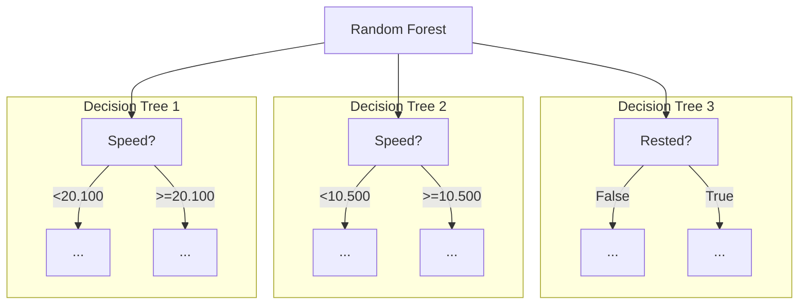
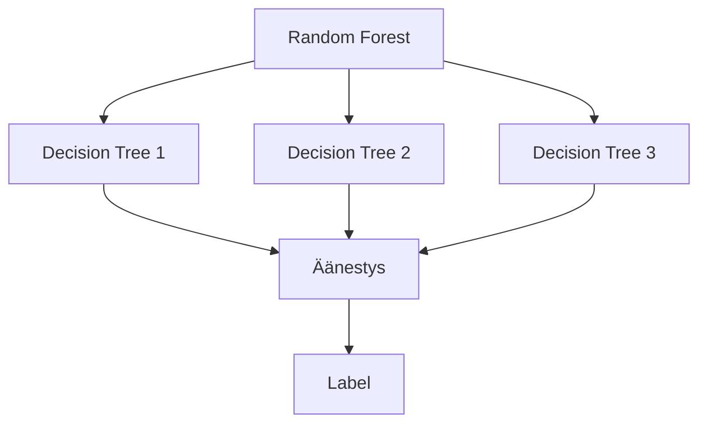
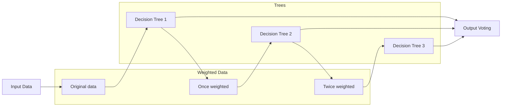

# Metsä

Päätöspuilla on taipumus ylisovittaa (engl. overfit) malli dataan. Tämä tarkoittaa sitä, että malli ei onnistu yleistämään (engl. generalize) sen taustalla olevaa ilmiötä vaan myötäilee dataa ulkoaopitun tarkasti. Päätöspuu on lisäksi ahne (engl. *greedy algorithm*); se löytää kenties hyvän, mutta ei globaalisti optimia ratkaisua. [^geronpytorch]

Ylisovittamista voi pyrkiä rajoittamaan Decision Tree:n oppimista parametreilla, kuten puun maksimisyvyydellä. Nämä parametrit toimivat "Early Exit"-sääntöinä puun koulutuksessa; jos puu yrittää kasvaa liian syväksi, rekursiivinen prosessi palauttaa lehden. Tarkkasilmäinen opiskelija onkin tunnistanut tällaisen säännön `320_puu_from_scratch.py`-Notebookissa.

> "Decision trees make very few assumptions about the training data (as opposed to linear models, which assume that the data is linear, for example). If left unconstrained, the tree structure will adapt itself to the training data, fitting it very closely—indeed, most likely overfitting it."
>
> — Aurélien Géron [^geronpytorch]

!!! tip

    Olemme käsitelleet kurssilla suorituskykymittareita, `train-dev-test`-jakoa, ristiinvalidointia ja muita osatekijöitä, jotka antavat sinulle kaikki valmiudet ymmärtää vinouman ja vääristymän välillä tehtävän kompromissing (engl. *bias-variance tradeoff*). Aiheeseen palataan vielä regressiomallien kohdalla, mutta pohdi aihetta jo vähintään intuition tasolla päätöspuiden näkökulmasta!

Toinen keino parantaa päätöspuita ja muita korkean varianssin malleja on käyttää **ensemble-menetelmiä**, jotka voi suomentaa joukkio-oppimiseksi [^kämäräinen]. Ensemble-menetelmät perustuvat usean mallin yhdistämiseen yhdeksi ennustavaksi malliksi. Mikäli ensemble koostuu vain ja ainoastaan puista, on tälle asialle osuva termi metsä. Olettaen, että `train-test`-jako on deterministinen, niin yksittäinen puu on deterministinen. Tämä tarkoittaa sitä, että jos koulutat puun uudestaan, saat saman puun. Pelkkä puiden pinoaminen metsäksi ei siis riitä: meidän pitää tuoda satunnaisuutta koulutusprosessiin antamalle kullekin puulle hieman eri data. Kunhan tämä on tehty, niin metsän puut perustuvat satunnaiseen otantaan koulutusdatasta, tästä metsästä käytetään termiä **satunnaismetsä** (engl. *random forest*). [^fromscratch]



**Kuvio 1:** *Esimerkki satunnaismetsästä, joka koostuu kolmesta päätöspuusta. Kukin päätöspussi saa oman otoksensa koulutusdatasta eli "pussillisen dataa".*

!!! info

    [Cambridge Dictionary](https://dictionary.cambridge.org/dictionary/english/ensemble) määrittelee ensemblen: "a group of things or people acting or taken together as a whole, especially a group of musicians who regularly play together."

    Elokuvissa ja tv-sarjojen kontekstissa ensemble on tarina, jonka päähenkilöinä on useita henkilöitä, jotka ovat yhteydessä toisiinsa. Esimerkkinä useimmat supersankarielokuvat, kuten Avengers ja Justice League, ovat ensemble-tarinoita. Myös Frendit kuuluvat tähän.

## Toimintaperiaate

Jos haluat pureutua ensemble-metodien toimintaan syvällisemmin, etsi käsiisi Dietterichin julkaisu "Ensemble Methods in Machine Learning" [^dietterich]. Julkaisu osoittaa, että useiden mallien yhdistäminen johtaa usein parempaan suorituskykyyn kuin yksittäinen puu.

Adrian Rosebrock tiivistää Dietterichin esittämää ajatusta Jensenin epäyhtälön kautta. Idea on, että useiden mallien ennusteiden yhdistäminen on usein turvallisempi ratkaisu kuin yhden mallin varaan jääminen. Yksittäinen malli voi onnistua erinomaisesti, mutta se voi myös erehtyä paljon. Rosebrock havainnollistaa tätä karkkipurkkiesimerkillä: jos yksi ihminen arvaa purkissa olevien karkkien määrän, arvio voi mennä pahasti pieleen. Jos taas kerätään monen ihmisen arviot ja lasketaan niistä keskiarvo, tulos osuu usein lähemmäs oikeaa vastausta. Ensemble-menetelmissä toimii sama ajatus. Vaikka yksittäinen malli voi joskus olla paras, sitä ei yleensä tiedetä etukäteen. Siksi usean mallin “yhteinen päätös” on usein luotettavampi kuin satunnaisesti valitun yksittäisen mallin ennuste. [^pisg]




## Satunnaisuus

Satunnaismetsässä koulutusdatasta otetaan satunnainen otos kullekin puulle. Tämä tarkoittaa, että jokainen puu on erilainen, ja jokainen puu oppii eri tavalla. Tällä kurssilla käsitellään kahta seuraavaa tapaa tehdä tämä "bagging"-vaihe, jossa ota havainnoista laitetaan pussiin, osa jää pussin ulkopuolelle:

* **Random Sample** ("without replacement"): Koulutusdatasta otetaan arvottu otos, jossa ei voi esiintyä samaa havaintoa kahdesti. Havainnot siis sekoitetaan ja niistä pidetään esimerkiksi 70 % per pussi.
* **Bootstrapping** ("with replacement"): Koulutusdatan otanta arvotaan yksi kerrallaan. Tämä tarkoittaa, että sama havainto voi esiintyä useammin samassa otoksessa. Tilastollisesti on 36.8 % todennäköisyys, että jokin havainto ei esiinny lainkaan otoksessa eli se on "Out of Bag" (OOB) [^ml-in-r]. Termin voi suomentaa saappaanlenkitykseksi [^kämäräinen].

!!! tip

    Käytännössä satunnaisuutta voi lisätä usealla eri tavalla, kuten vaikuttamalla siihen, kuinka päätöspuu valitsee jakokohdan (engl. split point), vaikuttamalla mallin näkemien featureiden määrään ja niin edelleen. Olet ohjelmointitaitoinen opikskelija, joten kukaan ei estä sinua esimerkiksi sekoittamasta Gini- ja Entropia-kriteereillä toimivia puita samaan metsään.
    
    Tässä materiaalissa keskitymme datasetin jakamiseen eri otoksiin.

Yllä oleva on todennäköisesti helpompi näyttää koodina kuin selittää lauseina. Kuvitellaan, että meillä on 10 rivin datasetti, joka näyttää tältä:

```python title="IPython"
data = [
    (1, "..."),
    (2, "..."),
    (3, "..."),
    (4, "..."),
    (5, "..."),
    (6, "..."),
    (7, "..."),
    (8, "..."),
    (9, "..."),
    (10, "..."),
]
```

### Python: Random Sample

Koska `random.sample(iterable, n)` palauttaa satunnaisen otoksen `n` alkioista, voimme käyttää sitä without replacement eli Random-metodin toteuttamiseen:

```python title="IPython"
import random

def sample_without_replacement(data, n):
        return random.sample(data, n)

sample_without_replacement(data, 3)
```

Random choice on käytännössä sama kuin sekoittaisi listan ja pitäisi `data[:n]`-osan. Palautuva otos, joka voi sisältää kunkin numeron vain kerran, on esimerkiksi:

```plaintext title="stdout"
[
    (4, "..."),
    (7, "..."),
    (3, "..."),
]
```

### Python: Bagging

Jos haluamme toteuttaa Bagging-metodin, voimme käyttää `random.choice(iterable)`-funktiota, joka palauttaa satunnaisen alkion datasetistä. Koska `choice` ei poista valittua alkioita, sama alkio voi esiintyä useammin samassa otoksessa:

```python title="IPython"
import random

def sample_with_replacement(data):
        return [random.choice(data) for _ in range(len(data))]

sample_with_replacement(data)
```

Huomaa, että `random.choice()` ei poista riviä datasta, joten sama rivi voi tulla vastaan `len(data)` kertaa. Palautuva otos on esimerkiksi:

```plaintext title="stdout"
[
    (4, "..."),
    (4, "..."),
    (7, "..."),
    (3, "..."),
    (2, "..."),
    (7, "..."),
    (5, "..."),
    (9, "..."),
    (2, "..."),
    (3, "..."),
]
```

Lopputuloksena:

* Seuraavat luvut esiintyvät kahdesti: 
    * `2, 3, 4, 7`
* Seuraavat luvut eivät esiinny ollenkaan: 
    * `1, 6, 8, 10`

Mikäli koulutat esimerkiksi 100 eri puuta, jokainen puu saa erilaisen otoksen datasta. Alla vielä esimerkki, kuinka tätä voisi käyttää:

```python title="IPython"
import ml.decision_tree as dt # Last lesson's implementation


data = load_imaginery_data(n=1_000_000)
trees = []
subsets = []
N_TREE = 9

# Generate N_TREE subsets
subsets = [sample_with_replacement(data) for _ in range(N_TREE)]

for subset in subsets:
    tree = dt.build_tree(subset)
    trees.append(tree)
```

## Äänestys

Yksinkertaisin tapa päättää, mikä on lopullinen ennuste, on äänestys. Jokainen puu äänestää, ja eniten ääniä saanut `label` voittaa - eli siis tilastollinen moodi eli useimmiten esiintyvä label. Yllä käytetty `N_TREE` on pariton, joten äänestyksessä ei voi tulla tasapeliä.

```python
# Imaginary test row
test_row = (1, 1, 0.12, 0, 1.23, ..., 1)

# Predict using each tree
labels = []
for tree in trees:
    label = dt.predict(tree, test_row)
    labels.append(label)

# Vote (mode)
y_hat = max(labels, key=labels.count)

# Raise AssertionError if prediction went wrong
assert y_hat == test_row[-1]
```

## Boosting

Boosting-menetelmät ovat ensemble-menetelmiä, joissa useita heikkoja oppijoita rakennetaan peräkkäin. Jokainen uusi oppija pyritään muodostamaan siten, että se keskittyy aiempien oppijoiden tekemiin virheisiin tai vaikeisiin havaintoihin [^chip2022].

Eli siis:

- Bagging-tyyppiset ensemble-menetelmät (kuten random forest) voidaan kouluttaa rinnakkain.
- Boosting-menetelmät koulutetaan peräkkäin.




**Kuvio 2:** *Boostingin periaate: jokainen uusi oppija hyödyntää aiempien oppijoiden virheitä. Lopullinen ennuste muodostetaan yhdistämällä kaikkien oppijoiden ennusteet.*

### AdaBoost

Boosting-menetelmiä on useita, mutta yksi tunnetuimmista on **AdaBoost** (*Adaptive Boosting*). AdaBoostissa kaikille havainnoille annetaan aluksi sama paino $1/N$, missä $N$ on havaintojen määrä. Ensimmäinen heikko luokitin opetetaan näillä painoilla. Tämän jälkeen väärin luokiteltujen havaintojen painoa kasvatetaan, jotta seuraava luokitin keskittyy niihin enemmän. Tätä jatketaan usean kierroksen ajan. [^ml-for-trading]

Aloitetaan yksinkertaisella esimerkkidatalla:


```python title="IPython"
import numpy as np
import math

# Käytetään 3 heikkoa oppijaa
M = 3

# Esimerkkidata: kaksi piirrettä / havainto
X = np.array([
    [1.0, 1.0],
    [1.0, 2.0],
    [2.0, 1.0],
    [2.0, 2.0],
])

# Binääriluokat alkuperäisessä muodossa 0/1
y = np.array([0, 0, 1, 1])

# Muunna luokat muotoon -1 / +1
y_signed = np.where(y == 0, -1, +1)

# Aluksi kaikilla havainnoilla on sama paino
N = len(X)
weights = np.full(N, 1 / N)
```

Painot ovat siis tällä hetkellä `array([0.25, 0.25, 0.25, 0.25])`.

### Koulutus

Nyt kun data on paikoillaan, voimme siirtyä koulutusvaiheeseen. Alla pseudokoodiksi muutettu versio kirjasta Machine Learning for Algorithmic Trading – Second Edition [^ml-for-trading]. Kaavaa on täsmennetty Schapire ja Freundin Boosting: Foundations and Algorithms -teoksen sivun 5 pseudokoodin mukaan [^boosting].

```python title="IPython"
def fit_weighted_weak_learner(X, y_signed, weights):
    # Kouluttaa heikon luokittimen havaintojen painoja käyttäen, ESIMERKIKSI:
    # h_m = DecisionTreeClassifier(max_depth=1)
    # h_m.fit(X, y_signed, sample_weight=weights)
    return h_m


def predict_with_weak_learner(h_m, X):
    # Ennusteet muodossa [-1, +1, ...]
    return predictions

learners = []
alphas = []

for m in range(M):
    # 2.1 Kouluta heikko oppija nykyisillä painoilla
    h_m = fit_weighted_weak_learner(X, y_signed, weights)
    preds = predict_with_weak_learner(h_m, X)

    # 2.2 Laske painotettu virhe
    misclassified = preds != y_signed
    err_m = weights[misclassified].sum()

    # 2.3 Oppijan paino alpha (Schapire & Freund: 0.5 * ln((1 - ε)/ε))
    alpha_m = 0.5 * math.log((1 - err_m) / err_m)

    learners.append(h_m)
    alphas.append(alpha_m)

    # 2.4 Päivitä painot eksponenttikaavalla
    weights *= np.exp(-alpha_m * y_signed * preds)

    # Normalisoi painot (Z_m)
    Z_m = weights.sum()
    weights /= Z_m
```

Keskeinen idea:

* Hyvin suoriutuneet heikot oppijat saavat suuren painon $\alpha_m$​.
* Huonosti suoriutuneet saavat pienen painon.
* Jokainen kierros kasvattaa vaikeiden havaintojen painoa (mutta muuttaa kaikkien painoja).
* Malli, jota `fit_weighted_weak_learner`-funktio käyttää, voi olla mikä tahansa heikko luokitin, kuten päätöspuu, joka on rajoitettu hyvin matalaksi (esim. `max_depth=1`). Tällöin se on *tree stump*. Tämä on scikit-learnin vakio [^scikit-ada].

!!! tip

    Voi olla arvokasta miettiä, että *miksi* juuri puita käytetään boosting ja badding algoritmien kanssa. Kukaanhan ei kiellä käyttämästä melkein mitä tahansa mallia ensemble-menetelmissä.

### Ennuste

Lopullinen AdaBoost-ennuste muodostetaan painotettuna äänestyksenä:

\[
H(x) = \operatorname{sign}\left(\sum_{m=1}^{M} \alpha_m h_m(x)\right)
\]

* $h_m(x)$ on heikon oppijan ennuste
* $\alpha_m$ on oppijan paino
* $\operatorname{sign}$ palauttaa +1 tai -1

```python
def adaboost_predict(x, learners, alphas):
    score = 0.0
    for alpha_m, h_m in zip(alphas, learners):
        h_pred = predict_with_weak_learner(h_m, x)   # -1 / +1
        score += alpha_m * h_pred

    signed_prediction = +1 if score > 0 else -1

    # Palautetaan alkuperäiseen 0/1 -muotoon
    return 1 if signed_prediction == +1 else 0

# Käytä ennustamiseen
x_new = np.array([1.5, 1.8])   # Uusi havainto
prediction = adaboost_predict(x_new, learners, alphas)
print("Ennuste:", prediction)
```

!!! tip

    Boosting ei aina toimi samalla tavalla:

    - AdaBoost säätää havaintojen painoja
    - Gradient boosting rakentaa uusia malleja virhefunktion residuaaleihin. [^ml-for-trading]

    Residuaalin idea avataan myöhemmin regressiomalleissa, joten sitä ei tässä vaiheessa tarvitse ymmärtää syvällisesti.


## Tehtävät

!!! question "Tehtävä: Metsä from Scratch"

    Avaa `330_metsa_from_scratch.py`. Tutustu koodin toimintaan. Notebook on nyt sinun Notebook, joten muokkaa sitä vapaasti. Voit esimerkiksi kokeilla etsiä vaikeamman datasetin, kuten edellisessä luvussa käsitellyn Vihapuhe-datasetin.

!!! question "Tehtävä: Automaattivaihteet metsässä"

    Avaa `331_automatic_transmission.py`. Notebook sisältää ensimmäiset solut, joissa ladataan DataFrameen dataset ja tehdään sille alustavaa data-analyyttista tarkastelua. Täydennä Notebookin loput solut. Sinun pitää ainakin:

    * Lataa data netistä. ([gh:suhasmaddali/Car-Prices-Prediction](https://github.com/suhasmaddali/Car-Prices-Prediction))
    * Tee tarvittavat esikäsittelyt, kuten kategoristen muuttujien koodaaminen ja datan jakaminen `train-dev-test`-osioihin.
    * Kouluta päätöspuu ja satunnaismetsä
    * Arvostele ja vertaa mallien suorituskykyä

    Puumallit ovat erinomaisen läpinäkyviä. Tutustu, kuinka voit visualisoida DecisionTreeClassifier:n päätöspuun ensimmäisiä haaroja. Tutki myös yksittäisten piirteiden tärkeyttä: tämä onnistuu puun sekä metsän kohdalla. (vihje: `feature_importances_`-attribuutti).

    !!! tip

        Jos haluat haastaa itseäsi, voit kokeilla myös Boosting-menetelmiä, GridSearchCV:tä, [Permutation Importance](https://scikit-learn.org/stable/modules/permutation_importance.html#permutation-importance) -menetelmää tai TreeSHAP-analyysejä. Näitä ei kuitenkaan vaadita, joten keskity ensin perusasioihin.

## Lähteet

[^geronpytorch]: Géron, A. *Hands-On Machine Learning with Scikit-Learn and PyTorch*. O'Reilly. 2025.
[^kämäräinen]: Kämäräinen, J. *Koneoppimisen perusteet*. Otatieto. 2023.
[^fromscratch]: Grus, J. *Data Science from Scratch 2nd Edition*. O'Reilly Media. 2019.
[^dietterich]: Dietterich, T. *Ensemble Methods in Machine Learning*. In Proceedings of the First International Workshop on Multiple Classifier Systems (MCS '00). Springer-Verlag, Berlin, Heidelberg, 1–15. Downloaded from: https://web.engr.oregonstate.edu/~tgd/publications/mcs-ensembles.pdf
[^pisg]: Rosebrock, A. *Random forests*. PyImageSearch Gurus course. 2015.
[^ml-in-r]: Nwanganga, F. & Chapple, M. *Practical Machine Learning in R*. 2020. O'Reilly.
[^chip2022]: Huyen, C. *Designing Machine Learning Systems*. O'Reilly. 2022.
[^ml-for-trading]: Jansen, S. *Machine Learning for Algorithmic Trading - Second Edition*. 2020.
[^boosting]: Schapire, R. E., & Freund, Y. *Boosting Foundations and Algorithms*. MIT Press. 2012. https://direct.mit.edu/books/oa-monograph/5342/BoostingFoundations-and-Algorithms
[^scikit-ada]: scikit-learn developers. *AdaBoostClassifier*. https://scikit-learn.org/stable/modules/generated/sklearn.ensemble.AdaBoostClassifier.html