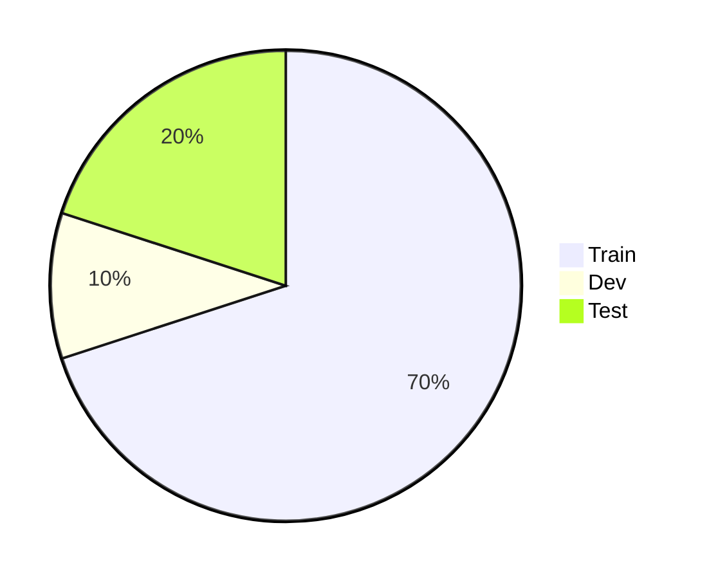
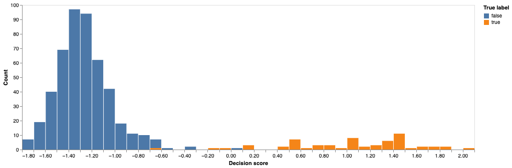
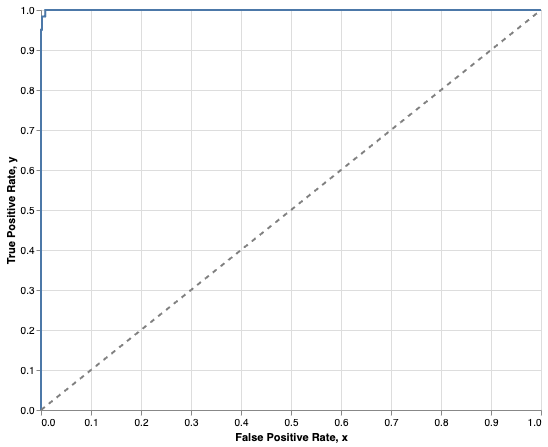
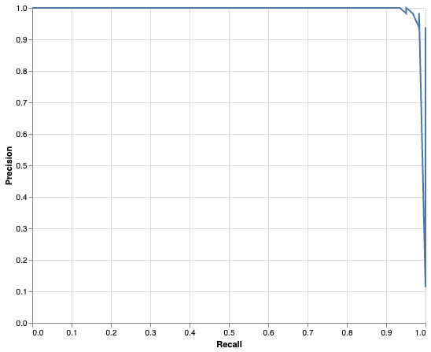

# Luokittelumallin suorituskyky

## Aiemmin nähtyä

Olet kouluttanut tällä kurssilla jo ainakin kahteen eri luokittelutehtävään malleja: pari Titanic-luokittelijaa ja muutamia vihapuheluokittelijoita. Toivon mukaan olet jo päätynyt pohtimaan aihetta, että onko `accuracy` oikea mittari mallin suorituskyvyn mittaamiseen, ja olet vähän väkisinkin törmännyt esimerkiksi `f1`-mittariin. Nämä ovat kertauksen vuoksi alla olevissa *admonition*-laatikoissa.

??? example "Titanic"

    | model              | metric                     | value              |
    | ------------------ | -------------------------- | ------------------ |
    | LogisticRegression | Accuracy                   | 0.8473282442748091 |
    | LogisticRegression | Balanced Accuracy          | 0.836358024691358  |
    | LogisticRegression | Precision                  | 0.8061224489795918 |
    | LogisticRegression | Recall                     | 0.79               |
    | LogisticRegression | F1 Score                   | 0.797979797979798  |
    | LogisticRegression | ROC AUC                    | 0.8799999999999999 |
    | LogisticRegression | PR AUC (Average Precision) | 0.8462168684455003 |

??? example "Vihapuhe"

    ```
                precision    recall  f1-score   support

            0       0.94      0.96      0.95       833
            1       0.88      0.84      0.86       286

    accuracy                            0.93      1119
    macro avg       0.91      0.90      0.90      1119
    weighted avg    0.93      0.93      0.93      1119
    ```

Tämän aiheen käsittelyn jälkeen sinun tulisi voida selittää valtaosa edellä olevista mittareista, ja ymmärtää, mikä soveltuu mihinkin tehtävään ja miksi.

## Yleistä

Koneoppimismallin suorituskyvyn arviointi on tärkeä osa mallintamisprosessia. Olet jo aiemmin nähnyt Titanic-mallin kohdalla, kuinka se voi auttaa meitä valitsemaan parhaiten tehtävään soveltuva malli. Titanicin tapauksessa kilpasilla olivat LogisticRegression, RandomForestClassifier ja SVC.

> "We need to find a metric that can not only tell us how accurate the predictions made by the model are, but also allow us to compare the performance of a number of models so that we can select the one best suited for our use case."
>
> — Benjamin Johnston & Ishita Mathur [^applied-sl]

Eri mallien vertailun lisäksi mallit auttavat meitä tunnistamaan mallin, joka generalisoituu hyvin. Generalisointi tarkoittaa sitä, että malli toimii hyvin uusilla, aiemmin näkemättömillä havainnoilla. Tähän liittyy olennaisesti koulutus- ja testidatan erottaminen, mitä käsitellään seuraavaksi.

!!! warning

    Huomaa, että tässä luvussa keskitytään ohjatun oppimisen (engl. supervised learning) ==luokittelumalleihin==. Regressiomallit, eli mallit jotka ennustavat jatkuvaa arvoa, kuten hintaa, painoa tai lämpötilaa, arvioidaan eri mittareilla. Näitä käsitellään kurssin seuraavissa osioissa.
    
    Ohjaamattoman oppimisen (engl. unsupervised learning) malleissa ei ole koulutus- ja testidataa, joten niiden suorituskykyä arviointi on huomatavasti vaikeampaa. Näitä ei käsitellä tällä kurssilla.

## Koulutus- ja testidata

### Perinteinen jako

Ennen kuin alat hifistellä ristiinvalidoinnin kanssa, on tärkeää, että ymmärrät, mitä tarkoitetaan koulutus-, kehitys- ja testidatalla. Perinteisesti data jaetaan noin 70 %, 10 %, ja 20 % jaolla kolmeen osaan:



Kun valitset eri hyperparametreja, kuten valintaa *ColumnTransformer*- ja *TfidfVectorizer*-enkoodausten välillä, sinun tulee käyttää kehitysdataa. Kehitysdata on siis data, jota käytetään mallin kehitysvaiheessa. On tärkeää, että ==kaikki sellaiset vaiheet==, jotka jollakin tavalla kuvastavat datasettiä, lasketaan koulutusdatasta. Tämä estää datan vuotamisen (engl. data leakage) [^hard-parts]. Jos siis esimerkiksi lasket mistään syystä datasetin keskihajontaa, keskiarvoa, mediaania, jonkin piirteet riippuvaa todennäköisyyttä tai muuta tilastollista mittaria, tee se **vain ja ainoastaan koulutusdatasta**.

Käytännössä datan voi jakaa näihin kolmeen datasettiin seuraavalla tavalla:

```python title="IPython"
# Separate the features and target variable
X = polars_df.select(pl.col("feature1", "feature2", "feature3"))
y = polars_df.select(pl.col("target"))

# First split: separate test set
_X_tmp, X_test, _y_tmp, y_test = train_test_split(
    X, y, test_size=0.2, random_state=42
)

# Second split: divide remaining data into train and dev sets
X_train, X_dev, y_train, y_dev = train_test_split(
    _X_tmp, _y_tmp, shuffle=False, test_size=0.125,  # 10 % / 80 % = 0.125
)
```

Jos alkuperäisessä datasetissä oli 1000 havaintoa, sinulla olisi nyt:

| Nimi        | Piirteet | Target  | Havaintojen määrä |
| ----------- | -------- | ------- | ----------------- |
| Treenidata  | X_train  | y_train | 700               |
| Kehitysdata | X_dev    | y_dev   | 100               |
| Testidata   | X_test   | y_test  | 200               |

Prosessi on siis seuraava:

1. Käytä `X_train` ja `y_train` eri mallien ja eri parametrien haarukoimiseen.
2. Vertaile kohdassa 1 koulutettujen mallien suorituskykyä `X_dev` ja `y_dev` -datalla. Valitse parhaat parametrit.
3. Käyttäen parhaita malleja, kouluta mallisi uudestaan datalla, joka sisältää `X_train + X_dev` ja `y_train + y_dev`.
4. Tee lopullinen vertailu `X_test` ja `y_test` -datalla. Tämä on se mittari, joka kertoo, kuinka hyvin mallisi generalisoi.

!!! note

    Jako 70-10-20 ei ole kiveen hakattu. Tyypillistä on, että dev ja test osuudet pienenevät kun datan määrä kasvaa. [^hands-on-tf]

### Ristiinvalidointi

Aivan kuten mäkihypyssä on V-tyyli, koneoppimisesta on CV-tyyli eli ristiinvalidointi (engl. *cross-validation*). Tässä tapauksessa data jaetaan vain kerran `[X/y]_train` ja `[X/y]_test` -osioihin. Koulutusvaiheessa `X_train` ja `y_train` jaetaan edelleen $k$ osaan, ja malli koulutetaan $k$ kertaa, käyttäen joka kerta eri osaa validaatio/kehitysdatana ja loput osat koulutusdatana. On tärkeä huomata, että ==kehitysdata on yhä olemassa==. Ristiinvalidoinnissa se ei ole eksplisiittisesti erillinen DataFrame, mutta se on olemassa kerran jokaisesta $k$:sta osasta, joka toimii validaatiodatana.

> "Cross-validation is the de facto standard in data science when you intend to estimate the expected performance of a machine learning model on any data different from the training data but drawn from the same data distribution."
>
> — Luca Massaron & Mark Ryan [^ml-for-tabular]

Scikit-learnin oma dokumentaatio esittää aiheen kuvien avulla äärimmäisen selkeästi, joten en toista turhaan sitä tässä. Lue: [Cross-validation: evaluating estimator performance](https://scikit-learn.org/stable/modules/cross_validation.html).

Tätä lähestymistapaa käyttäen koko koulutusprosessi voi siis olla:

1. Käytä `X_train` ja `y_train` eri mallien ja eri parametrien haarukoimiseen, käyttäen ristiinvalidointia.
2. Vertaile kohdassa 1 koulutettujen mallien suorituskyky CV:n palauttamilla mittareilla. Valitse paras malli.
3. Tässä kohtaa voit kouluttaa mallisi uudestaan koko `X_train` ja `y_train` -datalla.
4. Tee lopullinen vertailu `X_test` ja `y_test` -datalla. Tämä on se mittari, joka kertoo, kuinka hyvin mallisi generalisoi.

!!! note

    Ristiinvalidointi on *de facto*-standardi perinteisten koneoppimismallien kanssa. Syväoppimismallien tai muutoin valtavien datasettien kanssa se ei välttämättä ole käytännöllinen. Jos mallin kouluttaminen kestää useita päiviä, ristiinvalidointi on tehotonta. [^hands-on-tf] Tulet siis käyttämään Syväoppiminen I -kursillla hyvinkin perinteistä kolmijakoa.


## Mittariston valinta

Koska luokittelumallit ennustavat luokkaa, ei jatkuvaa arvoa, mallin tarkkuutta voidaan arvioida laskemalla oikeita ja vääriä ennusteita kokonaisluvuin. Sinun tulee osata lukea ja ymmärtää alla esiteltyjen mittareiden tuloksia. Aloitetaan lataamalla meille sopiva `y_test` ja ennustamalla sitä vastaava `y_pred`.


### Data esimerkkejä varten

??? tip "Mistä data on?"

    Alla oleva esimerkki perustuu Scikit-learnin dokumentaatioon. Data noudetaan `sklearn.datasets.load_digits()` -funktiolla. Esimerkissä koulutetaan SVC-luokittelija tunnistamaan, onko kuvassa luku 1, 2, 3, ... 10. Alla on luokitteluraportti, joka on lainattu [Recognizing hand-written digits](https://scikit-learn.org/stable/auto_examples/classification/plot_digits_classification.html)-esimerkistä Scikit-learnin dokumentaatiosta.

    ```plaintext
    Classification report for classifier SVC(gamma=0.001):
                precision    recall  f1-score   support

            0       1.00      0.99      0.99        88
            1       0.99      0.97      0.98        91
            2       0.99      0.99      0.99        86
            3       0.98      0.87      0.92        91
            4       0.99      0.96      0.97        92
            5       0.95      0.97      0.96        91
            6       0.99      0.99      0.99        91
            7       0.96      0.99      0.97        89
            8       0.94      1.00      0.97        88
            9       0.93      0.98      0.95        92

    accuracy                             0.97       899
    macro avg        0.97      0.97      0.97       899
    weighted avg     0.97      0.97      0.97       899
    ```

    Luokitteluraportti palauttaa tässä tapauksessa moniluokkaisen luokitteluongelman tulokset. Jokaiselle luokalle on laskettu `precision`, `recall` ja `f1-score`, jotka esitellään alla. Luokkia eli uniikkeja `y`-arvoja on 10 kappaletta. Huomaa, että monissa tällä kurssilla käytetyissä esimerkeissä on vain kaksi luokkaa. Tehdään tästä datasetistä tämän vuoksi binääriongelma.

Jotta meillä olisi $y$ ja $\hat{y}$, eli oikeat ja ennustetut arvot, joita syöttää meidän mittareille, luodaan yksinkertainen koneoppimismalli.Ennustetaan sitä, että ==onko numero luku 3 vai jokin muu==.

```python title="IPython"
from sklearn import datasets, metrics, svm
from sklearn.model_selection import train_test_split

digits = datasets.load_digits()

# Convert into binary problem. (1)
y = digits.target == 3

# Fit and predict
X_train, X_test, y_train, y_test = train_test_split(
    digits.data, 
    y, 
    test_size=0.3, 
    random_state=160 # Seed (2)
)
clf = svm.SVC(gamma=0.001)
clf.fit(X_train, y_train)
y_pred = clf.predict(X_test)

print(metrics.classification_report(
    y_test, 
    y_pred, 
    target_names=['Luku N', 'Luku 3'] # (3)
))
```

1. Alkuperäinen y sisältää luvut `range(0, 10)`. Luomme uuden `y`:n eli targetin, jossa on arvot `True` ja `False` (lukuina 1 ja 0). Jos y on True, luku on 3. Muutoin se on jokin muu luku (0-2 tai 4-9).
2. Seed on käsin valittu sellaiseksi, että saamme vähintään yhden False Positiven ja False Negativen.
3. Nimitämme lukua 3 `Luku 3` ja kaikkia muita `Luku N`.

```plaintext title="stdout"
              precision    recall  f1-score   support

      Luku N       0.99      1.00      1.00       479
      Luku 3       0.98      0.95      0.97        61

    accuracy                           0.99       540
   macro avg       0.99      0.97      0.98       540
weighted avg       0.99      0.99      0.99       540
```

### TP, TN, FP ja FN

Nyt meillä on oikeat ja ennustetut arvot, joita voimme käyttää mittareiden havainnollistamiseen. Oikeat arvot ovat `y_test` ja ennustetut arvot ovat `y_pred`. Tarvitsemme precision, recall ja f1-score arvojen laskemiseksi eräänlaisia totuustestien lukemia, joita ovat True Positive (TP), True Negative (TN), False Positive (FP) ja False Negative (FN). Nämä arvot ovat tärkeitä, kun arvioidaan luokittelumallin suorituskykyä. Tässä on lyhyt selitys näille termeille.

* **True Positive (TP)**: Luku 3 ennustettiin 3:ksi.
* **True Negative (TN)**: Luku N ennustettiin N:ksi.
* **False Positive (FP)**: Luku N ennustettiin 3:ksi.
* **False Negative (FN)**: Luku 3 ennustettiin N:ksi.

Tilastotieteessä vääristä vastauksista käytetään myös termejä I ja II tyypin virheet (engl. *Type 1 and Type 2 errors*). I tyypin virhe on *false positive* ja II tyypin virhe on *false negative*. Tällä kurssilla tuskin tarvitset noita termejä, mutta termien tunteminen helpottaa kirjallisuuden lukemista. [^data-literacy]

Luodaan nämä arvot palauttava funktio selvyyden, oppimisen ja kurssin hengen vuoksi *"from scratch"*.

```python title="IPython"
def tn_fp_fn_tp(y_test, y_pred):
    # Init
    TN, FP, FN, TP = 0, 0, 0, 0

    # Count
    for pair in zip(y_test, y_pred):
        match pair:
            case (1, 1):
                TP += 1
            case (0, 0):
                TN += 1
            case (0, 1):
                FP += 1
            case (1, 0):
                FN += 1

    # Return in same nested order as scikit does
    return ((TN, FP), (FN, TP))

(TN, FP), (FN, TP) = tn_fp_fn_tp(y_test, y_pred)
print(f"TP: {TP}, FP: {FP}, TN: {TN}, FN: {FN}")
```

```plaintext title="stdout"
TP: 58, FP: 1, TN: 478, FN: 3
```

??? tip "Entä scikit-learn?"

    Scikit-learnillä saa samat lukemat helposti.

    ```python title="IPython"
    from sklearn.metrics import confusion_matrix
    ours = tn_fp_fn_tp(y_test, y_pred)
    theirs = theirs = metrics.confusion_matrix(y_true=y_test, y_pred=y_pred)
    ours == theirs
    ```

    ```plaintext title="stdout"
    array([[ True,  True],
        [ True,  True]])
    ```


!!! note

    Kuvittele malli, joka ennustaa laboratoriomittausten valossa, onko sinulla jokin sairaus. Huomaa, että `False Negative` on tilanne, jossa malli ennustaa, että sinulla ei ole sairautta, vaikka todellisuudessa sinulla on. Mikäli saat tämän ennusteen, sinua ei ohjata jatkotutkimuksiin, joten sairaus jää hoitamatta. Mikäli saat `False Positive` ennusteen, sinut ohjataan jatkotutkimuksiin, mutta todellisuudessa sinulla ei ole sairautta. Jatkotutkimukset ovat kalliita ja turhia, mutta eikö ole humaanimpaa olla turhan varovainen kuin jättää sairaus hoitamatta?
    
    Tämä mielikuva osoittaa, että kaikki väärät vastaukset eivät ole samanarvoisia. Usein `False Negative` on pahempi kuin `False Positive`.


### Hämmennysmatriisi

Yllä olevassa tulosteessa asetetut luvut laitetaan usein matriisiin, jossa pystyakseli edustaa ennustettua luokkaa ja vaaka-akseli todellista luokkaa. Tämä matriisi on hämmennysmatriisi. Huomaa, että kenttien järjestys voi vaihdella ajoittain. Järjestys riippuu siitä, miten akselit on määritelty. Meidän tapauksessa rivi on todellinen luokka, sarake on ennustettu luokka.

|       | Ennustettu True | Ennustettu False |
| ----- | --------------- | ---------------- |
| True  | TP              | FN               |
| False | FP              | TN               |

Kun syötämme oikeat target-nimet ja arvot, taulukko näyttää tältä:

|        | Ennustettu luku 3 | Ennustettu luku N |
| ------ | ----------------- | ----------------- |
| Luku 3 | 58                | 3                 |
| Luku N | 1                 | 478               |

!!! tip "Hämmennyksen vaara"

    Huomaa, että kenttien järjestys voi vaihdella ajoittain. Järjestys riippuu siitä, miten akselit on määritelty. Meidän tapauksessa rivi on todellinen luokka, sarake on ennustettu luokka. Kun tulostat hämmennysmatriiseja, kannattaa palvella lukijaa siten, että kirjaa selkeästi ylös, mitä mikäkin sarake tarkoittaa.

### Accuracy

Nyt kun meillä on tiedossa hämmennysmatriisin arvot, voimme helposti laskea tarkkuuden (engl. accuracy). Tarkkuus on prosenttiosuus oikeista ennusteista. Se lasketaan seuraavalla kaavalla [^data-literacy]:

$$
\begin{align*}
    \text{Accuracy} &= \frac{TP + TN}{TP + TN + FP + FN} \\
                    &= \frac{536}{540} \\
                    &= 0.9926
\end{align*}
$$

Voimme tarkistaa, että laskutoimituksemme täsmää Scikit-learningin `accuracy_score` -funktion palauttamaan arvoon. Huomaa, että `TP + TN + FP + FN` on yhtä suuri kuin `len(y_test)` eli koko testidatan havaintojen määrä. Jakaja on siis *kaikki data*.

```python
acc = (TP + TN) / (TP + TN + FP + FN)
assert metrics.accuracy_score(y_test, y_pred) == acc
```

!!! tip

    Tarkkuus on siis lyhyesti: kuinka monta prosenttia ennusteista oli oikein. Sen voisi siis laskea myös näin:

    ```python
    correct = int((y_pred == y_test).sum())
    n = len(y_test)
    accuracy = correct / n 
    ```

### Recall

Löytyvyysarvo (engl. recall, sensitivity) on yhtä helppo laskea. [^data-literacy]

$$
\begin{align*}
    \text{Recall} &= \frac{TP}{TP + FN} \\
                  &= \frac{58}{61} \\
                  &\approx 0.9508
\end{align*}
$$

Voimme tarkistaa, että laskutoimituksemme täsmää Scikit-learningin `recall_score` -funktion palauttamaan arvoon.

```python
recall = TP / (TP + FN)
assert metrics.recall_score(y_test, y_pred) == recall
```

!!! tip

    Löytyvyysarvo kertoo, kuinka monta prosenttia me ennustimme oikein, jos huomioidaan vain True caset ("ylempi rivi").


### Specificity

Tarvitsemme seuraavaa metriikkaa varten yhden uuden mittarin nimeltään spesifisyys (engl. *specificity*), joka tunnetaan myös nimellä *true negative rate*. Se lasketaan seuraavalla kaavalla [^statistics-dunk]:

$$
\begin{align*}
    \text{Specificity} &= \frac{TN}{TN + FP} \\
                       &= \frac{478}{536} \\
                       &\approx 0.9979
\end{align*}
$$

Jos vertaat tätä kaavaa löytyvyysarvon kaavaan, huomaat, että tämä on ikään kuin "negatiivinen löytyvyysarvo". Kaava on siis sama, mutta `P`:t ja `N`:t ovat vaihdettu keskenään. Voimme tarkistaa oman kaavamme siis flippaamalla todet valheiksi, valheet todeksi. Tämä onnistuu NumPyssä helposti `~`-operaattorilla.

```python
specificity = TN / (TN + FP)
assert metrics.recall_score(~y_test, ~y_pred) == specificity
```

### Balanced Accuracy

Nyt kun meillä on löytyvyysarvo ja spesifisyys, voimme laskea tasapainotetun tarkkuuden (engl. balanced accuracy), joka on tarkkuutta parempi mittari silloin, kun luokkien määrä on epätasainen. Se lasketaan seuraavalla kaavalla [^data-literacy]:

$$
\begin{align*}
    \text{Balanced Accuracy} &= \frac{\text{Recall} + \text{Specificity}}{2} \\
                             &\approx 0.9743
\end{align*}
$$

```python
balanced_acc = (recall+specificity) / 2
assert metrics.balanced_accuracy_score(y_test, y_pred) == balanced_acc
```

### Precision

Myös positiivinen ennustearvo (engl. precision) on helppo laskea. [^data-literacy]

$$
\begin{align*}
    \text{Precision} &= \frac{TP}{TP + FP} \\
                    &= \frac{58}{59} \\
                    &\approx 0.98
\end{align*}
$$

Voimme tarkistaa, että laskutoimituksemme täsmää Scikit-learningin `precision_score` -funktion palauttamaan arvoon.

```python
precision = TP / (TP + FP)
assert metrics.precision_score(y_test, y_pred) == precision
```

!!! tip

    Precision kertoo, kuinka monta prosenttia me ennustimme oikein, jos huomioidaan vain ennustetut Truet ("vasen sarake").


### F1 score

Yhtenä hyvän mallin mittarina voidaan sanoa sellaista, jolla on korkea tarkkuus ==ja== löytyvyysarvo. Sellainen arvo on nimeltään F1 score. F1 on harmoninen keskiarvo tarkkuudesta ja löytyvyysarvosta. Se lasketaan seuraavalla kaavalla [^geronpytorch]:

$$
\begin{align*}
    \text{F1} &= 2 \times \frac{\text{Precision} \times \text{Recall}}{\text{Precision} + \text{Recall}} \\
              &\approx 0.97
\end{align*}
$$

Voimme tarkistaa, että laskutoimituksemme täsmää Scikit-learningin `f1_score` -funktion palauttamaan arvoon.

```python
f1 = 2 * (precision * recall) / (precision + recall)
assert metrics.f1_score(y_test, y_pred) == f1
```

### ROC AUC

Tämä on hieman muita metriikoita kinkkisempi. ROC AUC (Receiver Operator Characteristics/Area Under Curve) vaatii, että mallilta pitää saada ulos `probability`, `confidence` tai `score`-arvoja, eikä vain luokkien ennusteita. Voit tutustua tähän [roc_curve](https://scikit-learn.org/stable/modules/generated/sklearn.metrics.roc_curve.html)-dokumentaatiossa. Onneksemme SVC tarjoaa meille sopivan arvon `clf.decision_function()`-funktiolla. Palaava arvo kuvastaa, kuinka varma malli on ennustuksestaan. 

```python
# SVC-mallin decision function arvot
y_score = clf.decision_function(X_test)
```

!!! tip "Vertailun vuoksi"

    Esimerkiksi Logistic Regression -mallin vastaava arvo on `model.predict_proba(X_test)`, mikä on oikea todennäköisyys kummallekin luokalle, eli välillä `0.00` ja `1.00`.


#### Kynnysarvo

Kun luokittelualgoritmi päättää, onko havainto luokkaa $0$ vai $1$, se käyttää jotakin kynnysarvoa (engl. *threshold*). Todennäköisyysarvo, confidence tai score, joka on suurempi kuin kynnysarvo, luokitellaan luokaksi $1$. Muutoin se luokitellaan luokaksi $0$.



**Kuva 1:** Histogrammi SVC-mallin `decision_function`-arvoista. Voit kuvitella jakavasi kuvaajan pystysuoralla viivalla, joka edustaa kynnysarvoa. Huomaat, että mihin tahansa asetatkin viivan, saat aina jonkin määrän oikeita ja vääriä ennusteita.

#### ROC

Nyt kun meillä on `y_score`, voimme piirtää ROC-käyrän. ROC-käyrä kuvaa mallin kykyä erotella luokkia toisistaan. Kuvaajan Y-akselille tulee `True Positive Rate` eli `recall`. X-akselille tulee esitystavasta riippuen joko `Specificity` tai `1 - Specificity`, joka tunnetaan myös nimellä `False Positive Rate`. Erona on se, onko 1.0 kuvaajan vasemmalla vai oikealla puolella. Yleisemmin käytetty esitystapa on, että 1.0 on oikealla puolella, jolloin X-akseli kuvaa `False Positive Rate`-arvoa. [^practical-statistics]

Alla on koodi, josta on siistitty pois turhia yksityiskohtia, jotta voidaan keskittyä olennaiseen. Kuvassa 2 näkyvä ROC-käyrä, joka on näin lähellä yläkulmaa, kertoo, että malli on erittäin hyvä erottelemaan luokkia. Huomaa, että tätä varten `threshold`-arvoa on siis liu'utettu ikään kuin Kuvan 1 histogrammin yli, ja jokaista kynnysarvoa vastaa tietty `FPR` ja `TPR` -arvo. Näin saadaan pisteitä, jotka muodostavat ROC-käyrän.

```python
# Laske FPR, TPR ja kynnysarvot
fpr, tpr, thresholds = metrics.roc_curve(y_test, y_score)

# Luodaan DataFrame plottausta varten
roc_df = pl.DataFrame({
    "False Positive Rate": fpr,
    "True Positive Rate": tpr,
    "Threshold": thresholds
})

# Plottaus
roc_line = alt.Chart(roc_df).mark_line().encode(
    x=alt.X("False Positive Rate:Q", scale=alt.Scale(domain=[0, 1])),
    y=alt.Y("True Positive Rate:Q", scale=alt.Scale(domain=[0, 1])),
)
```



**Kuva 2:** ROC-käyrä SVC-mallille.


??? note "Entäpä funktio roc_curve?"

    Jos kiinnostaa, kuinka voisit laskea `fpr` ja `tpr` -arvot itse, alla on pseudokoodi, jolla pääsisit ainakin alkuun. Koodi on muokattu kirjan *Fundamentals and Methods of Machine and Deep Learning* pseudokoodista [^fund-ml-dl], mutta käännetty ns. ihmislausesita Pythoniksi.

    ```python
    def roc_curve_from_scores(y_true, y_score):


    # Sort unique thresholds in descending order
    thresholds = np.sort(np.unique(y_score))[::-1]
    fpr = []
    tpr = []

    for threshold in thresholds:
        y_pred = (y_score >= threshold).astype(int)

        tp = np.sum((y_true == 1) & (y_pred == 1))
        tn = np.sum((y_true == 0) & (y_pred == 0))
        fp = np.sum((y_true == 0) & (y_pred == 1))
        fn = np.sum((y_true == 1) & (y_pred == 0))

        tpr = tp / (tp + fn) if (tp + fn) > 0 else 0.0
        fpr = fp / (fp + tn) if (fp + tn) > 0 else 0.0

        tpr_list.append(tpr)
        fpr_list.append(fpr)

    return fpr_list, tpr_list, thresholds
    ```

#### AUC

ROC on graafinen esitystapa mallin suorituskyvystä. AUC on sen numeraalinen mittari. AUC tarkoittaa "Area Under the Curve", eli kuinka suuri osa ROC-käyrän ja X-akselin väliin jäävästä alueesta on täytetty – eli siis käyrän alle jäävän alueen pinta-ala, joka on minimissään 0, maksimissaan 1.

AUC lasketaan ROC-käyrästä integroimalla ROC-käyrän ja X-akselin väliin jäävä alue. Se hoituu näin [^practical-statistics]:

```python
roc_auc = np.sum(tpr[1:] * np.diff(fpr))
```

Vaihtoehto on luonnollisesti käyttää valmista scikit-learnin funktiota, joka tekee saman:

```python
roc_auc = metrics.auc(fpr, tpr)
```

Tässä tapauksessa palautuva arvo on `0.99978`.

### PR AUC (Average Precision)

Kun ROC AUC on ymmärrettynä, niin PR AUC tuntunee hyvin tutulta. Meillä tulee olemaan taas käyrä, PRC, ja käyrän alle jäävä pinta-ala, AUC. Pienenä nyanssierona on se, että AUC:n sijasta käytetään usein Average Precision -arvoa, joka on laskettu hieman eri tavalla. Palautuva arvo on jotakuinkin sama.

#### PR-käyrä

Aloitetaan piirtämällä PR kuvaajana eli PRC (Precision Recall Curve). X-akselille tulee precision ja y-akselille recall. Nämä lasketaan, aivan kuten edellisessäkin tapauksessa, käyttäen threshholdia.

```python
precisions, recalls, pr_thresholds = metrics.precision_recall_curve(y_test, y_score)

# Plottauskoodi on sama kuin ROC-käyrässä, joten jätetään pois.
# Löydät sen tehtävien Notebookista.
```



**Kuva 3:** PR-käyrä SVC-mallille.

??? note "Entäpä funktio precision_recall_curve?"

    Jos kiinnostaa, kuinka voisit laskea `precision`- ja `recall`-arvot itse, alla on pseudokoodi, jolla pääsisit hyvin alkuun. Idea on sama kuin ROC-käyrässä: käydään läpi eri kynnysarvot ja lasketaan jokaisella niistä uudet tunnusluvut. Pseudokoodi perustuu samaan lähteeseen kuin aiempi ROC:n pseudokoodi [^fund-ml-dl].

    ```python
    def precision_recall_curve_from_scores(y_true, y_score):

        # Järjestä yksikäsitteiset kynnysarvot suurimmasta pienimpään
        thresholds = np.sort(np.unique(y_score))[::-1]

        precision_list = []
        recall_list = []

        for threshold in thresholds:
            # Muodosta luokkaennusteet tällä kynnysarvolla
            y_pred = (y_score >= threshold).astype(int)

            # Laske sekaannusmatriisin osat
            tp = np.sum((y_true == 1) & (y_pred == 1))
            fp = np.sum((y_true == 0) & (y_pred == 1))
            fn = np.sum((y_true == 1) & (y_pred == 0))

            # Laske precision ja recall
            precision = tp / (tp + fp) if (tp + fp) > 0 else 0.0
            recall = tp / (tp + fn) if (tp + fn) > 0 else 0.0

            precision_list.append(precision)
            recall_list.append(recall)

        return precision_list, recall_list, thresholds
    ```

#### AUC

PR AUC, joka tunnetaan myös nimellä Average Precision, on PR-käyrän alle jäävän alueen pinta-ala. Se lasketaan integroimalla PR-käyrän ja X-akselin väliin jäävä alue. Tämän laskentatavan voimme päätellä yllä olevasta itse:

```python
# Varsinainen PR AUC
pr_auc = metrics.auc(recalls, precisions)

# Tai Average Precision, joka on lähes sama.
ap = metrics.average_precision_score(y_test, y_score)
```

Tässä tapauksessa palautuvat arvot ovat `0.9984367672947778` ja `0.9984492037569168`. Jos jostain syystä haluaisit laskea saman NumPyllä, niin PR AUC:n saa kutsulla `-p.trapezoid(precisions, recalls)`.

!!! tip

    PR AUC ja Average Precision -arvo ovat hyvin lähellä toisiaan, mutta eivät täysin samoja. Average Precision lasketaan hieman eri tavalla. Torchmetrics-kirjaston [AveragePrecision](https://lightning.ai/docs/torchmetrics/stable/classification/average_precision.html)-dokumentaatiossa esitellään kaava selkeästi. Huomaa lause: *"This value is equivalent to the area under the precision-recall curve (AUPRC)."* [^torchmetrics-ap]. Jos aihe kiinnostaa, scikit-learn:n dokumentaatio avaa aihetta hyvin otsikon [3.4.4.9. Precision, recall and F-measures](https://scikit-learn.org/stable/modules/model_evaluation.html#precision-recall-f-measure-metrics) alla.

## Tehtävät

!!! question "Tehtävä: Luokittelumallin suorituskyky"

    Avaa `300_mnist_metrics.py` Notebook. Se sisältää solut, joilla on laskettu tämän materiaalin luvut.

    Aivan Notebookin lopussa on lisähaaste: vaihda datasetti toiseksi. Tee tämä, ja tutustu, kuinka eri lukemat ja kuvaajat muuttuvat, kun säädät `make_classification`-funktion argumentin `class_sep`-arvoa ylös ja alas.

## Lähteet

[^applied-sl]: Johnston, B. & Mathur, I. *Applied Supervised Learning with Python*. Packt Publishing. 2019.
[^hard-parts]: Vaughan, D. *Data Science: The Hard Parts*. O'Reilly Media. 2023.
[^ml-for-tabular]: Massaron, L. & Ryan, M. *Machine Learning for Tabular Data*. Manning Publications. 2025.
[^hands-on-tf]: Zafar, I. et. al. *Hands-On Convolutional Neural Networks with TensorFlow*. Packt Publishing. 2018.
[^statistics-dunk]: Sutton, G. *Statistics Slam Dunk*. Manning Publications. 2024.
[^data-literacy]: Campesato, O. *Data Literacy with Python*. Mercury Learning and Information. 2023.
[^geronpytorch]: Géron, A. *Hands-On Machine Learning with Scikit-Learn and PyTorch*. O'Reilly. 2025.
[^fund-ml-dl]: Singh, P. *Fundamental and Methods of Machine and Deep Learning*. Wiley-Scrivener. 2022.