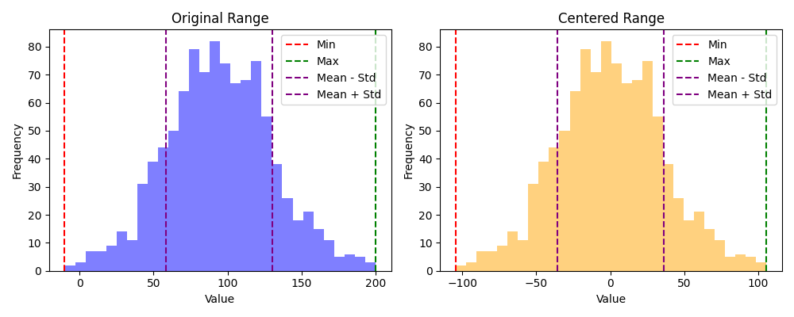
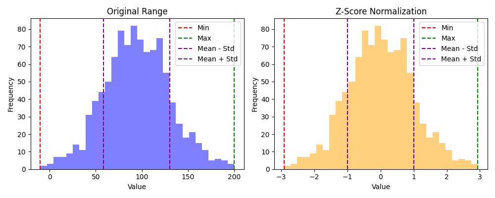

# Skaalaus

Osa koneoppimisalgoritmeista ovat herkkiä skaalaukselle. Tämä tarkoittaa, että algoritmin suorituskyky voi rampautua, mikäli eri piirteiden välillä on suuria eroja. Esimerkiksi huoneiden lukumäärä on yleensä pieni luku, kun taas asunnon hinta dollareita on valtava lukema.

Jos mallin virhe perustuu etäisyyteen, skaalaus on tärkeää. Tässä luvussa käsitelty k-NN-algoritmi käyttää nimenomaan etäisyyttä mittarinaan – tämän voi päätellä jo algoritmin nimestä ==k-lähimmän naapurin== luokittelija (engl. *k-Nearest Neighbors*) [^kämäräinen]. Jos yksi piirre on skaalaltaan luonnollisesti suurempi kuin toinen, se vaikuttaa enemmän etäisyyteen. [^fromscratch] Huomaa, että skaalauksen tarkka muoto vaihtelee. Kenties piirre puristetaan välille `[0,1]`, tai kenties se skaalataan siten, että keskihajonta mahtuu alueelle `[-1,1]`. Näihin tutustutaan alla tarkemmin, mutta tarkistathan aina että valitsemasi datan esikäsittelijä on se, mitä mallisi tarvitsee.

!!! tip

    Tämän kurssin puitteissa riittää seuraava karkea listaus, jossa :white_check_mark: tarkoittaa, että skaalaus on suositeltavaa ja :no_entry: tarkoittaa, että skaalaus ei ole tarpeellista.
    
    * Puut :no_entry:
    * Naive Bayes :no_entry:
    * Muut :white_check_mark:


## Skaalauksen apuvälineet

Dataa voi kuvata tilastotieteen avulla. Kuvailevia lukuja ovat esimerkiksi keskiarvo, mediaani, moodi, varianssi, keskihajonta ja kvartiilit. Datan skaalauksessa tarvitaan tyypillisesti keskiarvoa, varianssia ja keskihajontaa. Nämä lienevät jo matematiikasta tuttuja, mutta käydään ne läpi kertauksen vuoksi. Kukin näistä esitellään ensin matemaattisessa muodossa ja sen jälkeen Python-koodina. Näitä tarvitaan myöhemmin skaalausta tehdessä.

### Keskiarvo (mean)

Keskiarvo on kaikkien otannan (engl. sample) lukujen summa jaettuna lukumäärällä. Huomaa, että koko populaation keskiarvoa merkataan $\mu$:lla (lausutaan *myy*); $\overline{x}$ on nimenomaan otannan keskiarvo [^essential-math-for-ds]. Jatkossa, kun näet `x̄`-symbolin tässä dokumentissa, se tarkoittaa keskiarvoa.

$$
{\overline{x}} = \frac{\sum x_{i}}{N}
$$

```python title="IPython"
# This is a Vector from 131_vector_from_scratch.py
x = Vector(-1, 0, 1, 2, 3, 4, 5)

def mean(x: Vector):
    return sum(x) / len(x)
```

### Varianssi

Varianssi kertoo, kuinka paljon data poikkea keskiarvosta. Luku on nostettu neliöön, jotta negatiiviset poikkeamat eivät kumoaisi positiivisia, ja jotta suuret poikkeamat painottuisivat enemmän. [^essential-math-for-ds]

$$
\sigma^2 = \frac{\sum \left( {x_{i} - {\overline{x}} } \right) ^{2}}{N}
$$

```python title="IPython"
def variance(x: Vector, ddof=0):
    return sum((x - mean(x))**2) / (len(x) - dof)
```

!!! question "Miksi - 1?"

    Saatat törmätä esimerkkeihin, joissa jakajas on $N - 1$. Yllä olevassa koodissa tämä olisi `variance(x, ddof=1)`. Tämä yhden vapausaste (engl. delta degrees of freedom) on käytössä otannan (engl. sample) varianssia laskettaessa. Mikäli N edustaa koko populaatiota, sitä ei käytetä. Huomaa, että koska jakaja on pienempi, varianssi on suurempi kuin jos jakajana olisi `N`. Koko populaation varianssin oletetaan siis olevan suurempi kuin otannan varianssin.

    Koneoppimisen kontekstissa otannat ovat niin suuria, ettei sillä ole käytännössä väliä, onko jakaja miljoona vai miljoona ja yksi. [^krohn-video] 

### Keskihajonta

Keskihajonta on varianssin neliöjuuri. Se palauttaa neliöön nostetun varianssin takaisin alkuperäiseen mittayksikköön. [^essential-math-for-ds]

$$
\sigma = \sqrt{\sigma^{2}}
$$

```python title="IPython"
def std(x: Vector):
    return variance(x) ** 0.5
```


## Piirteiden skaalaus

Piirteiden skaalaus on menetelmä, jolla yhtenäistetään eri muuttujien tai piirteiden alue. Tietojenkäsittelyssä sitä kutsutaan myös datan normalisoinniksi ja se suoritetaan yleensä datan esikäsittelyvaiheessa. Se ottaa datataulukon ja palauttaa uuden taulukon samalla muodolla, mutta skaalattuna valitun menetelmän mukaiselle alueelle. Alla on esiteltynä muutama yleinen skaalaukseen liittyvä menetelmä.

### Keskitys (centering)

Keskitys ei varsinaisesti skaalaa mitään, mutta se on tärkeä osa alla esiteltyjä skaalauksia. Keskityksessä lukujen keskiarvo vähennetään jokaisesta arvosta. Toisin sanoen keskiarvo siirretään nollaan. [^bmc] Mikäli muuttuja noudattaa normaalijakaumaa, puolet arvoista on positiivisia ja puolet negatiivisia. 

$$
{\widetilde{x}} = x - {\overline{x}}
$$

```python title="IPython"
def center(x):
    return x - mean(x)
```



**Kuvio 1:** *Vasemmassa histogrammissa näkyy alkuperäinen data, joka noudattaa suunnilleen normaalijakaumaa. Oikeassa histogrammissa näkyy keskitetty data, jossa keskiarvo on 0.*

### Z-score

BMC:n artikkelin taulukossa tätä kutsutaan autoskaalaukseksi (engl. autoscaling) [^bmc]. Tämä on yleisin skaalausmenetelmä. Keskitettu data jaetaan keskihajonnalla, mistä lopputuloksena listan lukujen keskiarvo on 0 ja keskihajonta 1. Z-pisteytyksestä käytetään usein termiä standardisointi (engl. standardization).

$$
{z} = \frac{\widetilde{x}}{s}
$$

```python title="IPython"
def z_score(x: Vector):
    return center(x) / std(x)
```



**Kuvio 2:** *Vasemmassa histogrammissa on sama data kuin Kuviossa 1. Oikeassa histogrammissa näkyy Z-pisteytetty data, jossa keskiarvo on 0 ja keskihajonta on 1.*

!!! tip

    Tulet törmäämään tähän usein eri koneoppimisesimerkeissä. Mikäli näet jossakin esimerkissä käytössä [StandardScaler](https://scikit-learn.org/stable/modules/generated/sklearn.preprocessing.StandardScaler.html)-esikäsittelijän, se on juurikin tämä.

### Min-max skaalaus

Min-max skaalauksessa data skaalataan välille `[0,1]`. Tämä on meidän kurssin kontekstissa eli perinteisessä koneoppimisessa hieman Z-scorea eli standardiskaalausta harvinaisempi, mutta se on hyödyllinen esimerkiksi sigmoid-aktivoitujen neuroverkkojen kanssa. Sen kaava on [^impact-of-fs]:

$$
x_{norm} = \frac{ x - min(x) }{ max(x) - min(x) }
$$

```python title="IPython"
def min_max(x: Vector):
    return (x - min(x)) / (max(x) - min(x))
```

!!! tip

    Huomaa tämän variantti, jossa skaalaksi voidaan asettaa haluttu alue, esimerkiksi $[a, b]$. Alla funktio kirjoitettu siten, että `minmax()` viittaa yllä näkyvään funktioon:

    $$
    f(x, a, b) = a + (b - a) \cdot minmax(x)
    $$

    ```python title="IPython"
    def minmax_scale(x, a=0, b=1):
        return a + (b - a) * min_max(x)
    ```

## Lähteet

[^kämäräinen]: Kämäräinen, J. *Koneoppimisen perusteet*. Otatieto. 2023.
[^fromscratch]: Grus, J. *Data Science from Scratch 2nd Edition*. O'Reilly Media. 2019.
[^essential-math-for-ds]: Nield, T. *Essential Math for Data Science*. O'Reilly. 2022.
[^krohn-video]: Krohn, J. *Probability and Statistics for Machine Learning (video)*. O'Reilly. 2021.
[^bmc]: van den Berg, R.A., Hoefsloot, H.C., Westerhuis, J.A. et al. *Centering, scaling, and transformations: improving the biological information content of metabolomics data*. BMC Genomics 7, 142 (2006). https://doi.org/10.1186/1471-2164-7-142
[^impact-of-fs]: Piheir, J. et. al. *The Impact of Feature Scaling In Machine Learning: Effects on Regression and Classification Tasks*. 2025. https://arxiv.org/abs/2506.08274v2