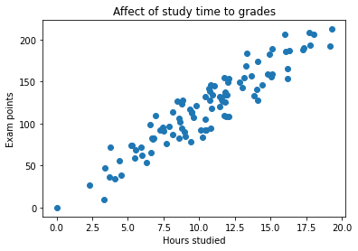
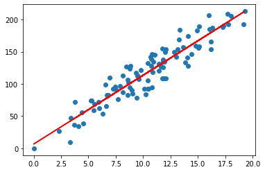
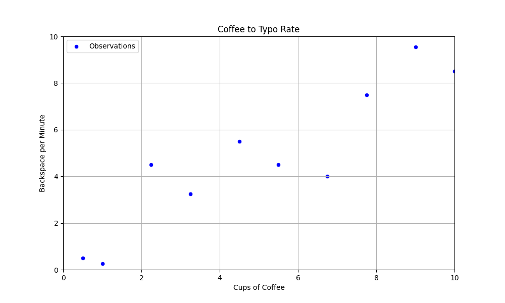
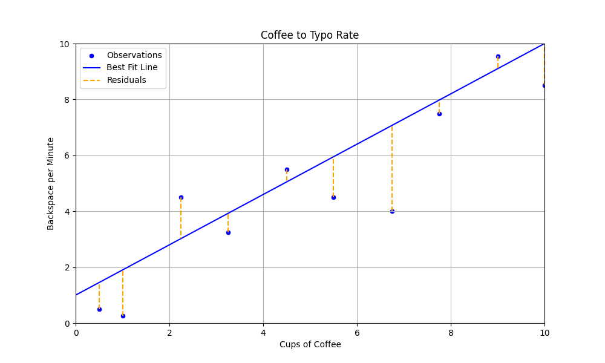
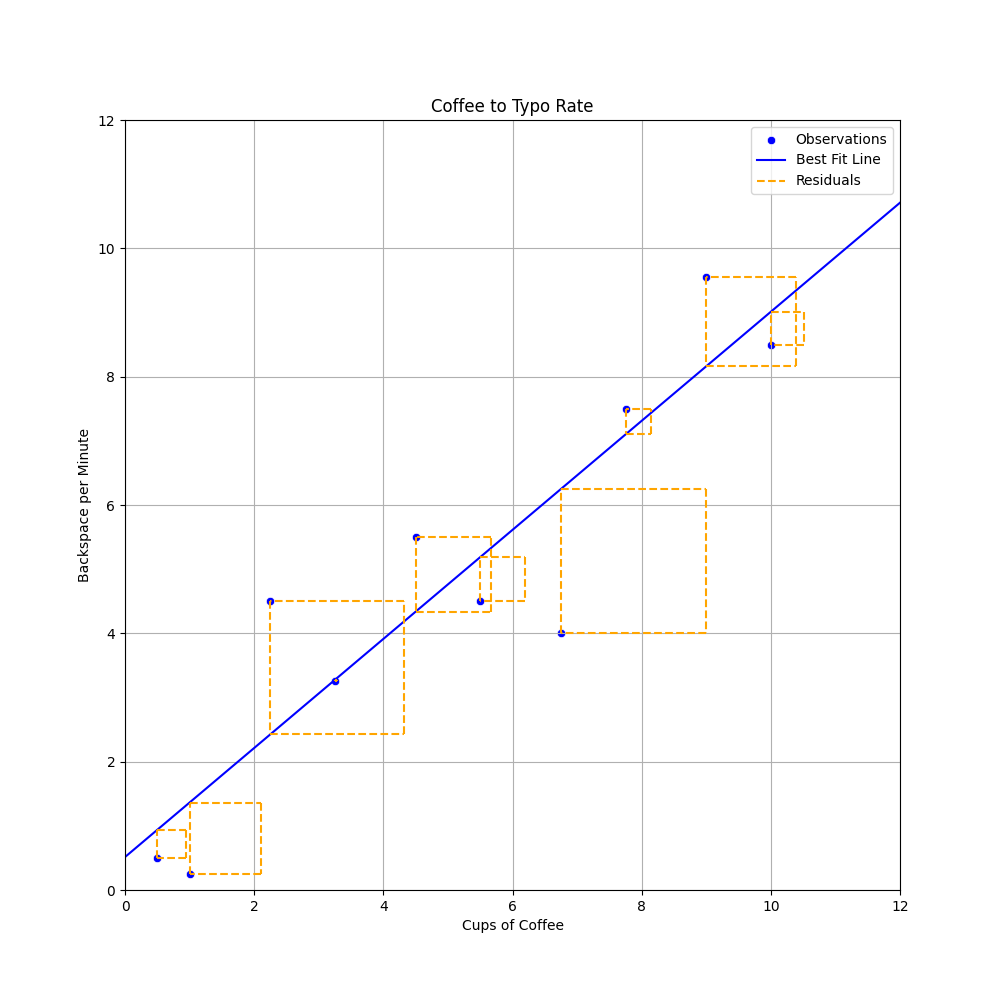
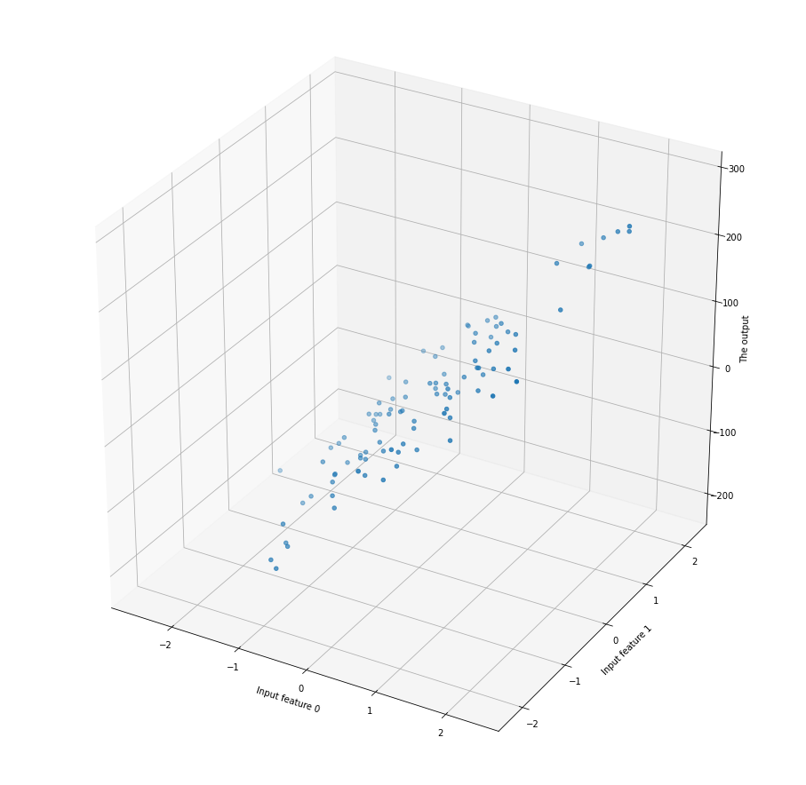

# Normaaliyhtälö

Kaikki tähänastiset kurssilla käsitellyt mallit ovat olleet luokittelumalleja (tai ryvästysmalleja eli klusterointimalleja). Tämän viikon teema on lineaarinen regessio, joka ennustaa jatkuvaa arvoa. Aiemmin olemme siis pyrkineet ennustamaan, että `Onko havainto 1 vai 0` tai `Onko havainto 1, 2, 3, 4 vai 5`. Tällä kertaa ennustamme jatkuvia lukuja, joten vastaus voi olla esimerkiksi `5.5` tai `3.14159`. 

!!! tip

    Monista luokitteluun soveltumista algoritmeista, kuten kNN ja Naive Bayes, löytyy myös regressio-ongelmiin soveltuvia toteutuksia.

!!! note

    Myöhemmin tutustumme toiseen lineaariseen malliin, nimeltään logistinen regressio, joka on – toisin kuin nimi antaa ymmärtää – luokittelualgoritmi . Kumpaakin näitä yhdistää lineaarisuus. Lineaarisuus tarkoittaa, että malli pyrkii löytämään ==suoran== (tai tason), joka ==minimoi virheen==.


## Intuitio



**Kuvio 1:** *Opiskelun ja tenttipisteiden välisen suhteen havainnot.*

Kuvion 1 kuvitteellissa datasetissa on vain yksi syöte tai piirre, joka kuvastaa opiskeluun käytettyjä tunteja. Tämä on x-akseli. Arvo, jota pyrimme jatkossa ennustamaan, on vastaus (*engl. response*) tai tuloste (*engl. output*), joka löytyy kuvaajan y-akselilta.



**Kuvio 2:** *Opiskelun ja tenttipisteiden havaintoihin sovitettu suora.*

Se, kuinka löydetään parametrit, joilla malli saadaan sovitettua dataan, on lineaarisen regression ydin. Käsitellään tätä seuraavaksi kahviesimerkin kautta.

## Kahviesimerkki

Kuvitellaan, että haluat selvittää, kuinka paljon :coffee:-kulutuksesi vaikuttaa ++backspace++ -näppäimen eli askelpalauttimen käyttöön. Asennat kahvikuppiisi sensorin, joka mittaa, kuinka monta kuppia kahvia juot päivässä. Lisäksi asennat keyloggerin, joka mittaa, kuinka monta kertaa painat backspace-näppäintä minuutissa ollessasi koodaamassa.



**Kuvio 3:** *Kahvinjuonti ja backspace-näppäimen käytön havainnot pistekuvaajana. Havaintoja on vain 10. Kuvaajan otsikossa on tehty rohkea typoteesi, että typojen määrä ja askelpalauttimen klikkailut ovat kausaalisesti yhteydessä toisiinsa.*

### Suora

Yllä totesimme, että lineaarinen algoritmi pyrkii löytämään ==suoran==, joka minimoi virheen. Suora on peruskoulun matematiikasta tuttu käsite [^kämäräinen] , ja sen yhtälö on [^fromscratch]:

$$
y = f(x) = mx + b
$$

Yhtälön osatekijät ovat seuraavat:

* $y$ on selitettävä muuttuja (engl. dependent variable)
* $x$ on selittävä muuttuja (engl. predictor)
* $f(x)$ on lineaarinen malli, jonka ==parametreja== ovat...
* $m$ on kulmakerroin (engl. slope)
* $b$ on vakiotermi (engl. intercept, y-intercept)

Mallin parametrit $m$ ja $b$ ovat arvot, jotka yritämme datan avulla selvittää. Saman funktion voi luonnollisesti toteuttaa myös Pythonilla.

```python title="IPython"
def predict(x):
    m = None # We need to find this
    b = None # as well as this
    return m * x + b
```

Vakiotermi $b$ on $y$-akselin leikkauspiste, ja kulmakerroin $m$ kertoo, kuinka paljon $y$ kasvaa, kun $x$ kasvaa yhdellä. Pikaisella silmäyksellä vaikuttaa, ihan noin silmämääräisesti, että suora voisi leikata y-akselin noin $y = 1$ kohdalla ja kulkea noin $m = 1$ kulmakertoimella: eli kun x kasvaa yhdellä, y kasvaa yhdellä. Ei kuitenkaan *ihan* näin jyrkästi, joten arvataan seuraavat arvot: $y = 0.9x + 1$. Syötetään nämä arvot funktioon ja piirretään se kuvioon.



**Kuvio 4:** *Kahvinjuonti ja backspace-näppäimen käytön havainnot sekä perstuntumalta valittu suora. Oikean Y:n ja viivan Y:n eroavaisuus on esitetty oranssina katkoviivana.*

Kuvion 3 perusteella näyttää siltä, että valitsemamme suora on ihan kohtalaisen lähellä, mutta tulevana asiantuntijana olisi hyvä kysyä, että *kuinka* lähellä se on. Tätä varten meidän pitää määritellä virhe, mikä tehdään seuraavaksi.

### Virhe

Kuten kuvasta voi silmämääräisesti päätellä, suoraa ei voi ikinä sovittaa siten, että se läpäisisi **kaikki** pisteet. Kunkin pisteen virhettä edustaa ==jäännös== (engl. residuaal) eli Kuvio 3:n oranssit katkoviivat. 

$$
residual = y_i - \hat{y}_i
$$

Yksittäinen jäännös on siis y:n todellinen arvo miinus y:n ennustettu arvo ($\hat{y}$ eli "y hat"). Intuitio kertoo, toivon mukaan, että näiden jäännösten summan minimointi on hyvä tapa löytää paras suora. Tätä prosessia kutsutaan **optimoinniksi**. Tarkastellaan yllä valitun viivan residuaaleja.

```
x[0]: -0.95
x[1]: -1.65
x[2]: +1.48
x[3]: -0.68
x[4]: +0.45
x[5]: -1.45
x[6]: -3.08
x[7]: -0.48
x[8]: +0.45
x[9]: -1.50
```

Virhettä voi mitata monella tavalla. Tässä kappaleessa käytämme yksinkertaisinta eli **SSE** (Sum of Squared Error) eli neliövirhe. Tällöin meidän optimoinnin tavoitteena on **pienimmän neliösumman** löytäminen (engl. least squares).

$$
SSE = \sum_{i=1}^{n} (y_i - \hat{y}_i)^2
$$

Pythonina sama on luonnollisesti:

```python title="IPython"
def sse(residuals):
    return sum([residual**2 for residual in residuals])
```

Jos yllä näkyvät residuaalit syötetään yllä olevaan funktioon, saadaan seuraava tulos:

```
x[0]: -0.95 (squared: 0.90)
x[1]: -1.65 (squared: 2.72)
x[n]: ...
x[8]: +0.45 (squared: 0.20)
x[9]: -1.50 (squared: 2.25)
= SSE: 20.70
```



**Kuvio 5:** *Residuaalit neliöityinä ovat, noh, neliöitä. Huomaa, että kaavion kuvasuhdetta on muutettu verrattuna aiempiin kaavioihin, jotta neliöt näyttäisivät oikeasti neliöltä.*

Neliöity virhe penalisoi suurempia virheitä enemmän kuin pieniä virheitä. Tämä on yksi syy sille, miksi neliösummaa käytetään yleisesti lineaarisen regressiomallin optimoinnissa: vaihtoehto olisi itseisarvo (`abs(x)`). Toinen syy liittyy derivoitavuuteen, mutta tähän palataan logistisen regression ja SGD-algoritmin yhteydessä.

Sellaista yksittäistä suoraa, joka kulkisi kaikkien kahvinjuontia kuvaavien datapisteiden kautta, ei voi piirtää. Toisin sanoen yhtälöparia tai -ryhmä ei ole ratkaisu. Voisit toki piirtää viivan, joka yhdistää pisteet, mutta tämä johtaa *ylisovittamisen*, mitä käsitellään seuraavissa luvuissa lisää. Vaihtoehtoisesti voisit piirtää käyrän, mutta tämäkin on aihe, jota käsitellään myöhemmin lisää. Tarkastellaan ensin suoran viivan sovittamista siten, että neliösumma tulee minimoiduksi.


## Neliösumman minimointi

### Suljettu muoto

OLS (Ordinary Least Squares) on yleinen menetelmä, jolla estimoidaan lineaarisen regression kertoimet minimoimalla residuaalien neliösumma. Jos muuttujia on vain yksi, kuten kahviesimerkissä, neliösumman minimointi voidaan toteuttaa suljetulla muodon ratkaisulla (*engl. closed form solution*) [^kämäräinen]. Kaava antaa ratkaisun ilman iterointia eli on analyyttinen – vastakohdan ollessa numeerinen ratkaisu. Kyseinen kaava on nimeltään pienimmän neliösumman menetelmä (engl. *least squares method, ordinary least squares, OLS*), ja se on seuraava [^essential-math-for-ds]:

$$
m = \frac{n \sum x_i y_i - \sum x_i \sum y_i}{n \sum x_i^2 - (\sum x_i)^2}
$$

$$
b = \frac{\sum y_i - m \sum x_i}{n}
$$

!!! tip

    Edellä esitetty OLS:n suljetun muodon kaava on monimutkainen. Onni on abstraktio! Sama ratkaisu voidaan esittää huomattavasti tiiviimmässä ja käsitteellisemmässä muodossa, jos otetaan käyttöön kaksi keskeistä tilastollista käsitettä: **Pearsonin korrelaatiokerroin** ja **keskihajonta**. Näistä keskihajonta on sinulle jo tuttu (ks. [Luokittelumallin suorituskyky](../3_puut/suorituskyky.md)). Pearsonin korrelaatiokerroin, jota merkataan kirjaimella $r$, esitellään [Regressiomallin suorituskyky](regressiomallinsuorituskyky.md)-materiaalissa eli heti seuraavana tällä kurssilla.

    Tällöin kulmakertoimen kaava on seuraava:

    $$
    m = r \cdot \frac{\sigma_y}{\sigma_x}.
    $$

    Vakiotermi saadaan tällöin keskiarvojen ja kulmakertoimen avulla:

    $$
    b = \bar y - m \bar x.
    $$

    Tämä on täsmälleen sama OLS-ratkaisu kuin edellä, mutta esitettynä abstraktien käsitteiden kautta. Myöhemmin esiteltävä Pearsonin korrelaatiokerroin ja kovarianssi siis selittävät suoraan, mistä regression kulmakerroin syntyy ja miksi se käyttäytyy tietyllä tavalla.

!!! note

    On kohtalaisen harvinaista, että koneoppimisongelmassa piirteitä on vain yksi, joten jätetään tämän suljetun muodon käsittely maininnan tasolle.

### Matriisiratkaisu

Monen muuttujan tapauksessa OLS voidaan kirjoittaa matriisimuodossa. Tätä kutsutaan usein normaaliyhtälöksi. Tällöin $X$ sisältää kaikki selittävät muuttujat, $x_1$, $x_2$, ..., $x_n$, ja $y$ sisältää selitettävän muuttujan. $X$ on siis...

$$
X =
\begin{bmatrix}
1 & x_{11} & x_{12} & \cdots & x_{1p} \\
1 & x_{21} & x_{22} & \cdots & x_{2p} \\
1 & x_{31} & x_{32} & \cdots & x_{3p} \\
\vdots & \vdots & \vdots & \ddots & \vdots \\
1 & x_{N1} & x_{N2} & \cdots & x_{Np}
\end{bmatrix}
$$

missä \(N\) on havaintojen lukumäärä ja \(p\) selittävien muuttujien lukumäärä. Tästä syntyvä kaava on seuraava, jossa $w$ on kertoimien vektori [^essential-math-for-ds]:

$$
w = (X^T X)^{-1} X^T y
$$

Syntyvä painovektori $w$ sisältää kaikki mallin kertoimet, mukaan lukien vakiotermin. Sen sisältö on muotoa:

$$
w =
\begin{bmatrix}
b \\
w_1 \\
w_2 \\
\vdots \\
w_p
\end{bmatrix}
$$


Pythonissa saman voi toteuttaa Numpyn avulla seuraavasti:

```python title="IPython"
import numpy as np
from numpy.linalg import inv

# Add the bias term and convert to numpy arrays
X = np.array([(1, *x[:-1]) for x in data])
Y = np.array(y)

# Calculate the coefficients
coefficients = inv(X.T @ X) @ X.T @ Y
b = coefficients[0]  # intercept
w = coefficients[1:] # slopes, weights
```

### QR

Tämä käsitellään kurssilla hyvin lyhyesti lähinnä maininnan tasolla. Matriisin voi hajottaa Q ja R matriiseiksi [^essential-math-for-ds] prosessilla hieman vastaavalla tavalla kuin PCA-koordinaattimuunnoksessa. Näiden matriisitulo on alkuperäinen X:

$$
X = QR
$$

Painojen arvot löytäisi Q ja R matriiseja hyödyntäen näin:

$$
w = R^{-1}  Q^T  y
$$

Jos haluat kokeilla tätä Pythonissa, niin seuraavalla koodilla pääset alkuun:

```python
from numpy.linalg import qr

X = np.array([(1, *x[:-1]) for x in data])
Q, R = qr(X)
```

Näiden algoritmien kasaaminen pienemmistä paloista käsin voi olla oppimisen kannalta hyödyllistä, mutta kun ratkaiset oikeaa koneoppimisen ongelmaa, on luontevaa käyttää valmista kirjaston toteutusta. Scikit-learn tarjoaa [LinearRegression](https://scikit-learn.org/stable/modules/generated/sklearn.linear_model.LinearRegression.html)-mallin. Dokumentaatiossa lukee, että:

> "From the implementation point of view, this is just plain Ordinary Least Squares ([scipy.linalg.lstsq](https://docs.scipy.org/doc/scipy/reference/generated/scipy.linalg.lstsq.html)) or Non Negative Least Squares ([scipy.optimize.nnls](https://docs.scipy.org/doc/scipy/reference/generated/scipy.optimize.nnls.html)) wrapped as a predictor object."
>
> — [^scikir-lr]

!!! tip

    Jos haluat kokeilla yllä esiteltyjä ratkaisuja (OLS, matriisi, QR) käytännössä, voit käyttää alla olevaa dataa selvittämään, mitkä arvot $m$ ja $b$ kahviesimerkissä saavat, kun käytät Numpy tai Scikit (tai Scipy linagl) lähestymistapaa. Laske myös virheiden neliösumma näitä arvoja käyttäen. 
    
    Datasetti on seuraavanlainen:

    ```python title="IPython"
    data = [
        (0.5, 0.5),
        (1.0, 0.25),
        (2.25, 4.5),
        (3.25, 3.25),
        (4.5, 5.5),
        (5.5, 4.5),
        (6.75, 4.0),
        (7.75, 7.50),
        (9.0, 9.55),
        (10.0, 8.5)
    ]
    ```


## Normaaliyhtälön rajoitukset

Normaaliyhtälö on tehokas tapa laskea lineaarisen regressiomallin kertoimet, mutta sillä on rajoituksensa. Normaaliyhtälö toimii epävakaasti, jos $X^T X$ ei ole kääntyvä (*engl. invertible, non-singular*) [^linear-algebra]. Jos muuttujat ovat voimakkaasti lineaarisesti riippuvia toisistaan, matriisi voi olla singulaarinen tai lähes singulaarinen. Tätä ongelmaa kutsutaan multikollineaarisuudeksi. Multikollinearisuus tarkoittaa, että kaksi tai useampi selittävä muuttujaa korreloivat keskenään, eli esimerkiksi `x[0] == x[1] * 1.5 + 0.02`. 

Multikollinearisuutta voidaan tutkia esimerkiksi:

* korrelaatiomatriisilla
* VIF-mittarilla

VIF (*Variance Inflation Factor*) mittaa, kuinka paljon kunkin piirteen varianssi kasvaa, kun muut piirteet otetaan malliin mukaan. Tähän löytyy valmis toteutus `statsmodels`-kirjastosta: ks. [variance_inflation_factor](https://www.statsmodels.org/dev/generated/statsmodels.stats.outliers_influence.variance_inflation_factor.html) ja avuksi vaikkapa [DataCamp tutoriaali](https://www.datacamp.com/tutorial/variance-inflation-factor).

Toinen rajoitus liittyy laskentaan: jos selittäviä muuttujia on paljon, normaaliyhtälön ratkaisu voi muuttua raskaaksi ja numeerisesti hankalaksi. Tämän vuoksi käytännössä käytetään usein suoraan least squares -ratkaisijoita, QR-hajotelmaa tai iteratiivisia optimointimenetelmiä.

Jos pohdit, mitä selittävien piirteiden lisääminen käytännössä tekee, niin se laittaa mallin sovittamaan n-ulotteiseen dataan n-ulotteisen suoran/tason. 2-piirteinen data näyttää esimerkiksi alla olevalta. Viiva ei ole enää sopiva ratkaisu, joten dataan tulisi sovittaa taso.



**Kuvio 6:** *3-ulotteinen pistekuvaaja.*

Piirteiden määrän vaikutusta laskenta-aikaan voi testata seuraavalla koodinpätkällä:

```python title="IPython"
import datetime
import numpy as np
from sklearn import datasets

def run_normal_equation_n_feats(n_features, n_samples=10_000):
    # Generate
    X, y = datasets.make_regression(n_features=n_features, n_samples=n_samples, noise=15)

    # Start the timer
    start = datetime.datetime.now()
    
    # Do the math
    bias = np.ones(((n_samples,1)))
    X = np.c_[bias, X]
    theta = np.linalg.inv(X.T @ X) @ X.T @ y

    # Return the time delta between stop and start
    return (datetime.datetime.now() - start).total_seconds()

# Test with different number of features
feature_counts = [100, 1_000, 10_000]

# Store the times
times = []

for n in feature_counts:
    start = datetime.datetime.now()
    times.append(run_normal_equation_n_feats(n))
```

!!! tip

    Jos haluat, voit kokeilla, kuinka paljon nopeampi QR-solver on tässä. Valmis toteutus löytyy scikit-learnin `LinearRegression`-mallista.

## Tehtävät

!!! question "Tehtävä: Vähin neliösumma Marimossa"

    Avaa `600_least_squares_problem.py` Notebook. Notebook sallii sinun piirtää datasetin `drawdata`-widgetin avulla, jonka jälkeen voit:

    * Sovittaa `m` ja `b` arvoilla viivan dataan ja laskea SSE:n.
    * ...ja seuraavaksi antaa algoritmien tehdä saman

    Tehtävän lopussa on tärkeänä osuutena slider kuvauksella *Polynomial degree*. Tämä aihepiiri on tarkoituksella jätetty käsittelemättä: tässä materiaalissa, kurssikirjassa ja scikit-learnin dokumentaatiossa on kuitenkin kaikki tiedonjyvät, joiden avulla sinun tulisi pystyä ymmärtää, mitä kyseinen slider tekee. Kokeile sitä ja mieti, mitä tapahtuu, kun polynomiaste kasvaa. Tämä on tärkeää pohjustusta seuraavaan aiheeseen eli suorituskykymittareihin ja alisovittamiseen/ylisovittamiseen.

    !!! tip

        Vinkki: Piirrä xy-kuvaajaan scatter, joka ei ole aivan viivasuora, vaan vaikkapa U-kirjaimen tai ~-merkin muotoinen. Kokeile sitten, mitä tapahtuu, kun polynomiaste kasvaa.

## Lähteet

[^kämäräinen]: Kämäräinen, J. *Koneoppimisen perusteet*. Otatieto. 2023.
[^fromscratch]: Grus, J. *Data Science from Scratch 2nd Edition*. O'Reilly Media. 2019.
[^essential-math-for-ds]: Nield, T. *Essential Math for Data Science*. O'Reilly. 2022.
[^scikit-lr]: scikit-learn developers. *LinearRegression*. https://scikit-learn.org/stable/modules/generated/sklearn.linear_model.LinearRegression.html
[^linear-algebra]: Friedberg, S., Insel, A. & Spence, L. *Linear Algebra, 5th Edition*. Pearson. 2018.