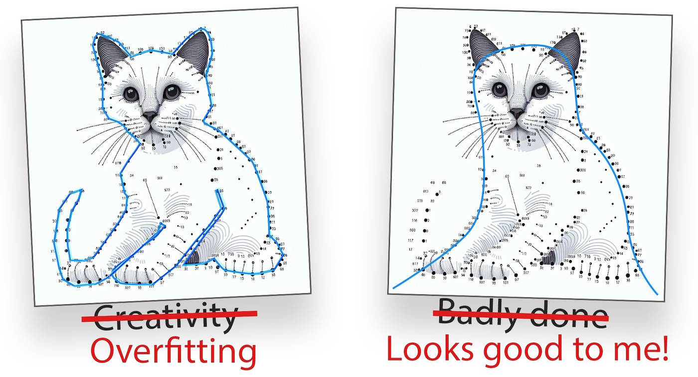
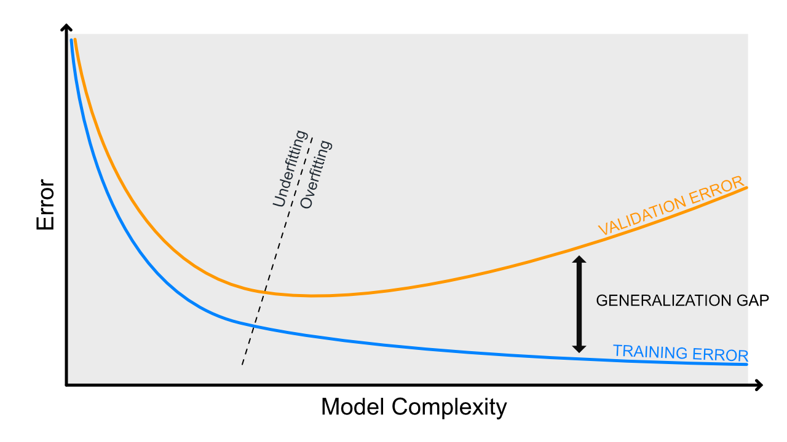
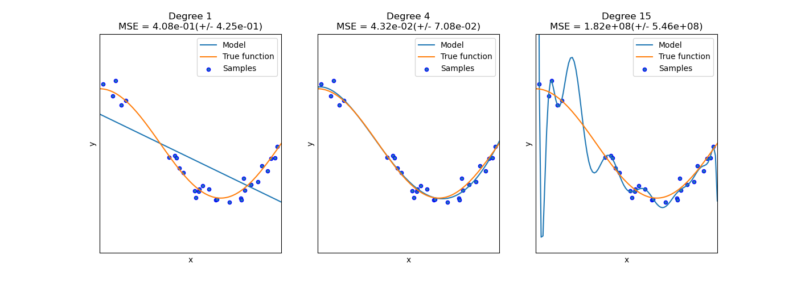
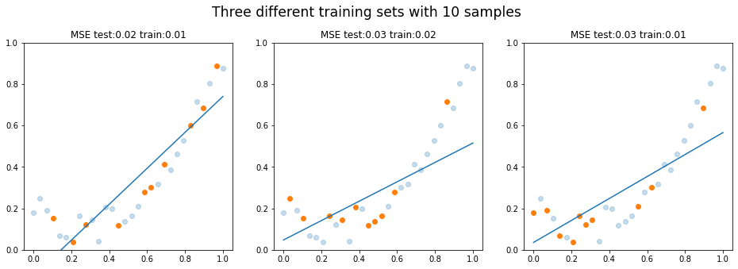

# Regressiomallin suorituskyky

Luokittelussa ennuste on oikea tai väärä luokka. Regressiossa ennuste voi olla “melkein oikein” tai “todella paljon pielessä”, joten tarvitsemme mittareita, jotka huomioivat kuinka suuri virhe ennusteessa on. Olemme jo edellisessä materiaalissa käyttäneet mittarina SSE:tä eli neliövirheiden summaa. Mittarissa on selkeänä heikkoutena se, että summa skaalautuu näytteiden määrän mukaan. Tämä on helposti ratkaistu MSE:llä, joka esitellään alla.

Metriikoiden esittelyn jälkeen käsittelemme yli- ja alisovittamista tarkemmin kuin kurssilla on aiemmin käsitelty. Tämä pohjustaa meitä kohti seuraavia aiheita.

## Metriikat

### MSE ja RMSE

MSE (Mean Squared Error) on virhefunktio, joka laskee virheiden neliöiden keskiarvon. Se on yksi yleisimmistä virhefunktioista (*engl. loss function*) regressiomalleissa, ja se lasketaan seuraavalla kaavalla [^fromscratch]:

$$
MSE = \frac{1}{n} \sum_{i=1}^{n} (y_i - f(x_i))^2
$$

Huomaa, että virhe on nostettu neliöön. Jos ennustat esimerkiksi asunnon hintaa ja MSE on 40,000 euroa, se tarkoittaa, että nimenomaan **neliösumma** virheestä on 40,000 euroa. Neliö voidaan palauttaa alkuperäiseen skaalaan ottamalla neliöjuuri virheestä: `sqrt(40_000)` palauttaa arvon `200`, koska `200 * 200 = 40_000`. Alkuperäiseen skaalaan palautettu virhe on 200 euroa, mikä on mitätön ero, olettaen että asunnot maksavat kymmeniä tai satoja tuhansia euroja.

Sekä MSE:n että RMSE:n voi laskea myös Scikit-Learn kirjaston funktioilla:

```python title="IPython"
from sklearn.metrics import mean_squared_error
from sklearn.metrics import root_mean_squared_error

X_train, X_test, y_train, y_test = ... # Load data

# Train and predict
model = SomeRegressionModel()
model.fit(X_train, y_train)
y_pred = model.predict(X_test)

# Calculate the Mean Squared Error (MSE)
mse = mean_squared_error(y_test, y_pred)
rmse = np.sqrt(mse)

# These should be equal
assert rmse == root_mean_squared_error(y_test, y_pred)
```

### MAE

MSE on mallin suorituskyvyn metriikkana hyvä, ja tulet käyttämään sitä esimerkiksi Syväoppiminen I -kurssilla regressiomallien kouluttamisessa. Mallia evaluoidessa on mahdollista esittää käyttäjällä useita eri lukuja rinnakkain. Eräs hyvin intuitiivinen luku on MAE (*Mean Absolute Error*). Se on virheiden itseisarvojen summa, eli:

$$
\text{MAE} = \frac{1}{n} \sum{|y_i - f(x_i)|}
$$

Huomaa, että lukua ei ole missään välissä neliöity, joten se kertoo hyvin rehellisesti keskiarvon siitä, kuinka paljon ennusteet ovat pielessä.

### r

!!! warning

    Pearsonin korrelaatiokerroin ei ole regressiomallin varsinainen suorituskykymittari, mutta se auttaa ymmärtämään, millaista lineaarista rakennetta datassa on. Se toimii hyvänä välivaiheena ennen R²-lukua. Kulkekaamme siis sivupolun kautta.

Pearsonin korrelaatiokerroin (*engl. Pearson correlation coefficient*) on tilastollinen mittari, jota merkitään kirjaimella $r$. Sen arvo on aina välillä $[-1, 1]$, ja se mittaa kahden numeerisen muuttujan välistä **lineaarista** yhteyttä. [^essential-math-for-ds]

* $r = 1$: muuttujien välillä on täydellinen positiivinen lineaarinen yhteys
* $r = -1$: muuttujien välillä on täydellinen negatiivinen lineaarinen yhteys
* $r = 0$: muuttujien välillä ei ole lineaarista yhteyttä

On tärkeää huomata, että $r = 0$ ei tarkoita, ettei muuttujien välillä olisi mitään yhteyttä. Yhteys voi olla olemassa, mutta se voi olla **epälineaarinen**, jolloin Pearsonin korrelaatiokerroin ei havaitse sitä.

Se lasketaan seuraavalla kaavalla [^essential-math-for-ds]:

$$
r = \frac{n\sum xy - (\sum x)(\sum y)}{\sqrt{n\sum x^2 - (\sum x)^2}\sqrt{n\sum y^2 - (\sum y)^2}}
$$

Jaettava on covariance, jakajana ovat x ja y keskihajontojen tulo [^essential-math-for-ds]:

$$
r = \frac{\text{cov}(x, y)}{\sigma_x \sigma_y}
$$

Yksinkertaisessa lineaarisessa regressiossa voidaan osoittaa, että mallin selitysaste $R^2$ on sama kuin muuttujien välisen Pearsonin korrelaatiokertoimen neliö [^scikit-learn-ml-simplified]. Tämä pätee siis tilanteessa, jossa mallissa on **yksi selittävä muuttuja**:

$$
R^2 = r^2
$$

!!! tip

    On hyvä olla realisti. Yksi tunnusluku ei juuri koskaan kerro kaikkea datasta. Tätä havainnollistaa hyvin Datasaurus dozen -aineisto, jonka löydät Autodeskin [Same Stats, Different Graphs](https://www.autodesk.com/research/publications/same-stats-different-graphs) -artikkelista. Aineistossa on 13 eri datasettiä, ==mukaan lukien yksi dinosaurus==, jotka kaikki jakavat samat tilastolliset tunnusluvut, kuten keskiarvon, mediaanin, varianssin ja korrelaatiokertoimen. Visualisoituna ne näyttävät täysin erilaisilta. Vastaava kokoelma löytyy nimellä [Anscombe's quartet](https://en.wikipedia.org/wiki/Anscombe%27s_quartet).

### R²

$R^2$-luku liittyy läheisesti korrelaatioon, mutta sen tulkinta on eri. Pearsonin $r$ kuvaa kahden muuttujan välistä lineaarista yhteyttä, kun taas $R^2$-luku kuvaa selitysastetta (engl. coefficient of determination). Se kertoo, kuinka paljon paremmin malli toimii verrattuna keskiarvoennusteeseen. Se voidaan laskea seuraavalla kaavalla:

$$
R^2 = 1 - \frac{\text{RSS}}{\text{TSS}}
$$

Jossa: 

* RSS (Residual Sum of Squares) on virheiden neliösumma
* TSS (Total Sum of Squares) on kokonaisneliösumma. 

Huomaa, että RSS on siis sama kuin SSE. Matemaattisina yhtälöinä nämä ovat:

$$
RSS = \sum_{i=1}^{n} (y_i - f(x_i))^2
$$

$$
TSS = \sum_{i=1}^{n} (y_i - mean(y))^2
$$

Pythonina sen voi kirjoittaa alla olevalla tavalla, ja todistaa oikeasi vertaamalla sitä Scikit Learnin `r2_score` -funktion palauttamaan arvoon.

```python
import numpy as np
from sklearn.metrics import r2_score

def rss(y_true, y_pred):
    return np.sum((y_true - y_pred) ** 2)

def tss(y_true):
    return np.sum((y_true - np.mean(y_true)) ** 2)

def r_squared(y_true, y_pred):
    return 1 - rss(y_true, y_pred) / tss(y_true)

y_true = np.array([3, -0.5, 2, 7])
y_pred = np.array([2.5, 0.0, 2, 8])

assert np.isclose(r_squared(y_true, y_pred), r2_score(y_true, y_pred))
```


## Ali- ja ylisovittaminen

Alisovittaminen (*engl. underfitting*) ja ylisovittaminen (*engl. overfitting*) ovat ongelmatekijä konemalleissa, ja jokainen malli etsii tasapainoa näiden kahden välillä. Kertauksena mainittakoon, että aiemmin kurssilla käsitelty päätöspuu on algoritmina *low bias, high variance* -tyyppinen [^kämäräinen], ja tätä korjattiin ensemble-menetelmillä. Lineaarinen regressio sen sijaan on *highly biased model*-tyyppiä [^essential-math-for-ds].

Miksemme siis yhdistä pisteitä kuin lapsi piirroskirjan äärellä: tällöin virhe olisi 0 %. Tämä onnistuu esimerkiksi korottamalla polynomiasteen merkittävän korkeaksi. Tästä on alla vitsikuva (ks. Kuva 1).



**Kuva 1:** *Yhdistä pisteet -piirroskirjassa ihmisen tehtävä on yhdistää pisteet numeroidusti ja oikein. Koneoppimismallin tehtävä olisi pikemminkin etsiä ympäripyöreä kissan muoto annetuilla havainnoilla. Jos kissa vaihtaa asentoa, virhe pysyy kohtalaisen pienenä.*

Vika pisteiden yhdistämisessä on se, että syntynyt malli on herkkä poikkeamille (*engl. outlier*), jotka ovat kaukana muista pisteitä, ja näin ollen mallilla on korkea *varianssi* [^essential-math-for-ds]. Termiin varianssi tutustutaan alempana tarkemmin.

Mallin ali- ja ylisovittamista mitataan koulutuskäyrän avulla. Tällöin x-akselille asetetaan jokin hyperparametri, joka kuvastaa mallin monimutkaisuutta, kuten päätöspuun maksimisyvyys tai `PolynomialFeatures`-polynomisaste. Kun käytössä on numeerinen optimointimenetelmä, kuten myöhemmin kurssilla esiteltävä `SGD`, x-akseli voi olla myös `n_iterations`.



**Kuva 2:** *Koulutuskäyrässä on esitetty mallin monimutkaisuuden vaikutus virheeseen. Huomaa, että tämä kehitystyö tulee tehdä nimenomaan ==validaatiodataa== vasten. Lopullinen totuus selviää testidatan avulla, joka on pidetty koulutusprosessista visusti erillään aivan viimeiseen vaiheeseen asti.*

Kuvaajasta on luettavissa mallin sovittuneisuus seuraavasti:

* **Alisovitus**: sekä koulutus- että validointivirhe ovat suuria
* **Ylisovitus**: koulutusvirhe on pieni, mutta validointivirhe suuri

Yksimuuttujaisen datan avulla ali- ja ylisovittaminen on helppoa nähdä paljain silminkin (ks. Kuva 3), mutta toivon mukaan on ymmärrettävää, että jos piirteitä on satoja tai tuhansia, ylisovittamista tulee tunnustella mittareiden avulla.



**Kuva 3:** *Scikit-learnin dokumentaatiosta poimittu kuva, joka havainnollistaa alisovittamista ja ylisovittamista. Katso kuvan luonut koodi selityksineen: [Underfitting vs. Overfitting](https://scikit-learn.org/stable/auto_examples/model_selection/plot_underfitting_overfitting.html#sphx-glr-auto-examples-model-selection-plot-underfitting-overfitting-py)*

### Vinouma

!!! warning

    Sekaannuksen vaara! Huomaa, että käsittelemme tässä *tilastollista mallivinoumaa*. Datan vinouma tai kognitiiviset vinoumat ovat myös vinoumia, mutta **emme käsittele niitä tässä**. Mitä siis käsittelemme ja emme käsittele:

    * ⛔ Datan vinouma, joka syntyy esimerkiksi siten, että opetusdata on kerätty tietyistä olosuhteista, jotka eivät edusta koko populaatiota.
    * ⛔ Kognitiiviset vinoumat, kuten vahvistusvinouma, joka saa ihmiset näkemään vain sellaista dataa, joka vahvistaa heidän ennakkokäsityksiään.
    * ✅ Tilastollinen mallivinouma, joka syntyy siitä, että malli tekee tiettyjä oletuksia datasta, kuten että dataa voidaan kuvata suoralla viivalla.

Aihe on monimutkainen, ja sitä käsitellessä tulee herkästi virheitä. Eräässä suomenkielisessä oppikirjassa esimerkiksi väitetään, että:

> "Alhainen bias tarkoittaa, että opetusaineiston virhe on pieni."

Väite ei tunnu todelta, kun sitä vertaa siihen, kuinka Cornellin yliopiston Kilian Weinbergen esittelee materiaaleissaan vinouman ja hajonnan [tikkataulujen avulla](https://www.cs.cornell.edu/courses/cs4780/2018fa/lectures/lecturenote12.html), mikä on tämän materiaalin tekijälle myös Andrew Ng:n Machine Learning -kurssilta tuttu tapa havainnollistaa näitä käsitteitä. Lausemuodossa bias on tässä materiaalissa:

> "Bias: What is the inherent error that you obtain from your classifier even with infinite training data? This is due to your classifier being "biased" to a particular kind of solution (e.g. linear classifier). In other words, bias is inherent to your model." [^cornell]
>
> — Kilian Weinberger

Korkea vinouma (engl. bias) on mallin virhe, joka johtuu vääristä oletuksista. Korkean vinouman malli tapauksessa malli priorisoi metodia, kuten suoran viivan sovittamista, vaikka data vaatisi suoraa viivaa monimutkaisemman mallin [^essential-math-for-ds]. Vinouman tapauksessa malli **alisovittaa** dataa, eli malli ei kykene selittämään ilmiön monimutkaisuutta. Malli on siis liian yksinkertainen datan monimutkaisuuteen nähden. Kaikissa maailman malleissa on jokin määrä vinoumaa, hajontaa ja kohinaa. Mallin virheen voi ajatella koostuvan näistä tekijöistä [^plot-bias-variance]:

$$
\text{Virhe} = \text{Vinouma}^2 + \text{Hajonta} + \text{Kohina}
$$

Biasia ja varianssia voidaan arvioida esimerkiksi bootstrap-pohjaisesti vertaamalla useilla bootstrap-otoksilla opetettujen mallien ennusteita erilliseen testidataan. Jos mallin virhe pysyy otannasta huolimatta suurena, malli on vahvasti vinoutunut (engl. biased). Bias voidaan erottaa *decomposition*-menetelmillä, kuten `bias_variance_decomp`-funktiolla, joka on esitelty mlxtend-kirjastossa [^mlxtend].

Täten koulutusdatan lisääminen ei poista ongelmaa; malli on liian yksinkertainen selittämään ongelmaa, joten mitenpä se voisi? Vinoumaa voidaan korjata lisäämällä mallin monimutkaisuutta.

Alla olevassa Kuva 4:ssä on tilanne, jossa malli on biased. Ei ole sellaista suoraa viivaa, joka selittäisi parabolisen käyrän. Huomaa, että vinouma on siis *oletus*, että ilmiö on suora.



**Kuva 4:** *Malli on yhä liian yksinkertainen eli alisovittaa dataa. Eri otannat (bootstrapit) tuottavat kaikki suuren virheen.*


### Hajonta

Hajonnan tapauksessa malli **ylisovittaa** dataa eli se pitää mitättömiäkin yksityiskohtia merkittävinä - jopa pelkkää kohinaa. Hajonta on mallin virhe, joka johtuu siitä, että malli on liian monimutkainen datan monimutkaisuuteen tai määrään nähden. Cornellin yliopiston materiaalissa esitetään, että kun vinouma laskee, varianssi kasvaa, ja päinvastoin. [^cornell] Vinouma ja hajonta eivät ole toistensa käänteisiä, vaan ne voivat olla samanaikaisesti korkeat tai matalat.

> "Captures how much your classifier changes if you train on a different training set. How "over-specialized" is your classifier to a particular training set (overfitting)?" [^cornell]
>
> — Kilian Weinberger

Hajonnan tunnistaa usein siitä, että koulutusdatan virhe on pieni, mutta testidatan virhe on suuri - ja mallin monimutkaisuuden lisääntyessä tämä ero kasvaa. Mallin parametrit heilahtavat reilusti, jos koulutat mallin useamman kerran saman datan eri subsetilla, koska malli on liian herkkä.

!!! tip

    Bias ja variance eivät ole lukuja, joita saisi yhtä helposti esille kuin vaikkapa tarkkuus tai f1-score. Jos haluat penkoa, voit yrittää käyttää mlxtend-kirjaston [bias_variance_decomp: Bias-variance decomposition for classification and regression losses](https://rasbt.github.io/mlxtend/user_guide/evaluate/bias_variance_decomp/)-artikkelissa esiteltyä funktiota.


### Trade-off

Huomaa, että ylisovittamisen ja alisovittamisen välillä on tasapaino, eli niiden välillä on *bias-variance trade-off*. Ellei ennustettu malli noudata **täydellisesti** ilman kohinaa jotakin matemaattista kaavaa, malli on aina väkisinkin ali- tai ylisovittava. Tavoitteena on löytää optimaalinen malli, joka ennustaa hyvin sekä opetus- että testidataa. Jos malli ennustaa hyvin opetusdataa, mutta huonosti testidataa, se on ylisovittava. Jos malli ennustaa huonosti sekä opetus- että testidataa, se on alisovittava. Alla on taulukko, joka kuvaa, miten jompaa kumpaa ääripäätä voidaan korjata.

|                           | Ylisovitus             | Alisovitus               |
| ------------------------- | ---------------------- | ------------------------ |
| **Mallin monimutkaisuus** | Laske                  | Nosta                    |
| **...tai regularisaatio** | Nosta                  | Laske                    |
| **# Muuttujaa**           | Poista muuttujia       | Tehtaile lisää muuttujia |
| **# Havaintoa**           | Kerää lisää havaintoja | ---                      |

Myös ensemble-menetelmät ovat hyviä tapoja vähentää ylisovittamista.

!!! warning

    Ali- ja ylisovittaminen pätee aiheena regressio- kuin luokittelumalleihin. Tällä kurssilla se käsitellään regressiomallien yhteydessä muun muassa siksi, että niiden kohdalla se on helpompi havainnollistaa.


## Lähteet

[^fromscratch]: Grus, J. *Data Science from Scratch 2nd Edition*. O'Reilly Media. 2019.
[^essential-math-for-ds]: Nield, T. *Essential Math for Data Science*. O'Reilly. 2022.
[^kämäräinen]: Kämäräinen, J. *Koneoppimisen perusteet*. Otatieto. 2023.
[^plot-bias-variance]: scikit-learn developers. *Single estimator versus bagging: bias-variance decomposition*. https://scikit-learn.org/stable/auto_examples/ensemble/plot_bias_variance.html
[^cornell]: Weinberger, K. *Lecture 12: Bias-Variance Tradeoff*. https://www.cs.cornell.edu/courses/cs4780/2018fa/lectures/lecturenote12.html
[^mlxtend]: Raschka, S. *bias_variance_decomp: Bias-variance decomposition for classification and regression losses*. https://rasbt.github.io/mlxtend/user_guide/evaluate/bias_variance_decomp/
[^scikit-learn-ml-simplified]: Garreta, R., Moncecchi, G. Hauck, T. & Hackeling, G. *scikit-learn : Machine Learning Simplified*. Packt. 2017.