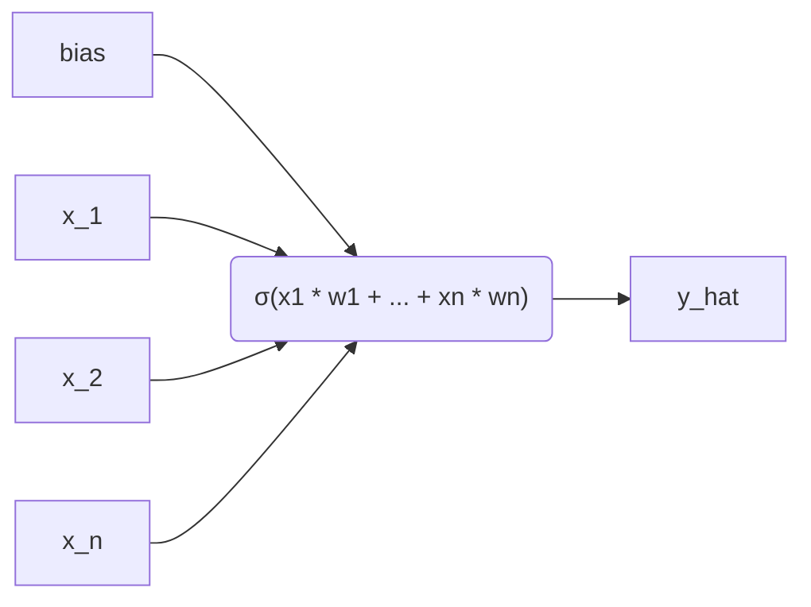
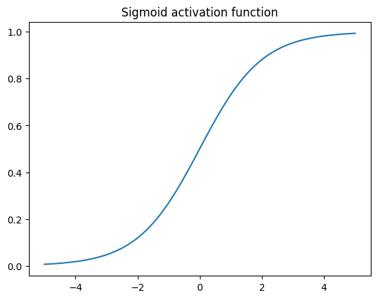
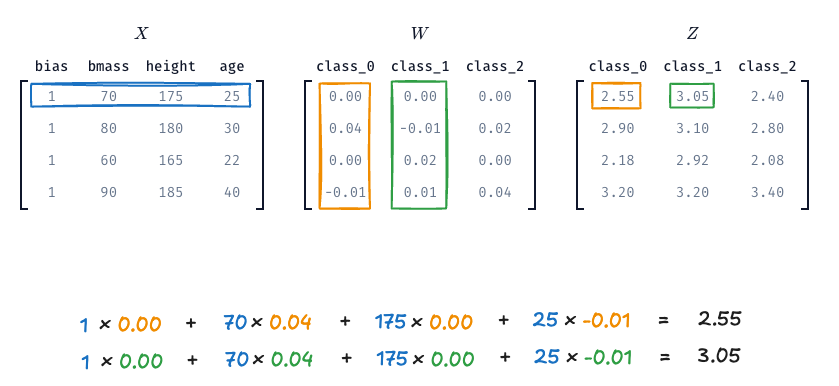
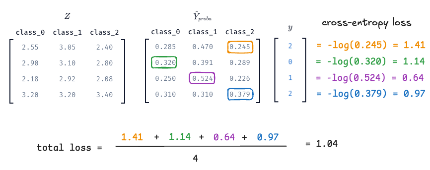
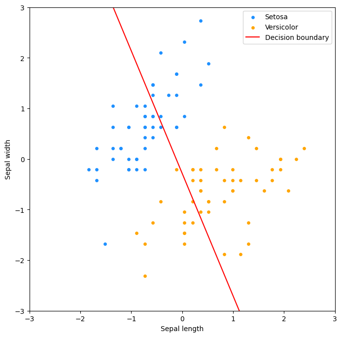
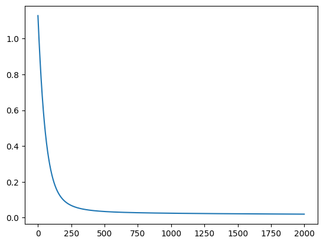
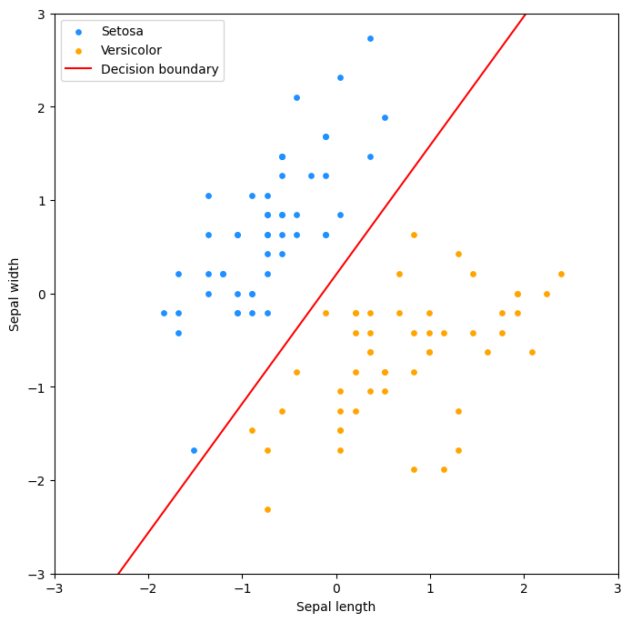

# Logistinen regressio

Logistinen regressio on aiemmista luvuista tuttu lineaarinen malli, mutta toisin kuten nimestä voisi päätellä, se on tarkoitettu luokittelu- eikä regressio-ongelmien ratkaisuun. Käsittelemme tällä kurssilla logistista regressiota vain pintapuolisesti, mutta on tärkeää huomata, että se on käytännössä neuroniverkon yksinkertaisin muoto. Logistinen regressio on siis yhden neuronin neuroverkko. Tulet siis kohtaamaan tämän algoritmin (tai vähintään sen monimutkaisempia muunnelmia) syväoppimista käsittelevillä kursseilla.



!!! warning "Termistötarkennus"

    Logistinen regressio on luokittelualgoritmi **koneoppimisen kontekstissa**. Sitä ei pidä sekoittaa logistiseen regressioon **tilastotieteen kontekstissa**, joka on tilastollinen malli, joka on suunniteltu mallintamaan todennäköisyyksiä, mutta ei välttämättä luokittelua. Jos haluat kattavahkon katsauksen tähän termisekaannukseen, voit lukea Adrian Olszewski:n kirjoituksen [Is logistic regression a regression? It has been a regression since its birth — and is used this way every day.](https://medium.com/@r.clin.res/is-logistic-regression-a-regression-46dcce4945dd)

!!! tip "Ei pitäisi, mutta muistutan silti!"

    Opiskelijan pitäisi jo tietää, että kurssin aiheita käsitellään kurssikirjassa. En tarkoituksella käytä lähteenä laisinkaan kurssikirjaa *Hands-On Machine Learning with Scikit-Learn and PyTorch*, jotta opiskelijalle jäisi löytämisen ilo. Tämä(kin) aihe kuitenkin löytyy kirjasta, luvusta 4, aliotsikon **Logistic Regression** alta.

## Sigmoid-aktivointifunktio



**Kuva 1.** Sigmoid-funktion kuvaaja välillä -5...5. Huomaa, että positiiviset syötteet tuottavat arvoja väliltä 0.5–1 ja negatiiviset syötteet arvoja väliltä 0–0.5. Sigmoidin tulos ei kuitenkaan koskaan saavuta tarkalleen arvoa 0 tai 1.

??? tip "Koodi diagrammin takana"

    ```python title="IPython"
    x = np.linspace(-5, 5, 100)
    plt.plot(x, sigmoid(x))
    plt.title("Sigmoid activation function")
    ```


Malli luo `y_hat`-ennusteen samalla tavalla kuin aiemmin, eli `X @ w`. Erona on, että tämä ennuste syötetään logistiseen funktioon, joka palauttaa arvon väliltä 0-1. Tämä arvo voidaan tulkita todennäköisyydeksi, että havainto kuuluu positiiviseen luokkaan. Näitä logistisia funktioita kutsutaan aktivaatiofunktioiksi, ja niitä käytetään myös syväoppimisessa, joskin käyttötarkoitus on hieman erilainen.

Aiemmin tutustuimme log-, Box-Cox- ja muihin muunnoksiin. Näitä käytetään muuttamaan datan jakaumaa mallinnukselle helpommaksi. Logistisessa regressiossa muunnoksen rooli on hieman erilainen: emme ensisijaisesti muunna syötedataa, vaan mallin tuottamaa lineaarista arvoa. Lineaarinen malli voi antaa minkä tahansa reaaliluvun, mutta luokitteluongelmassa haluamme usein tulkita tuloksen todennäköisyytenä. Sigmoid-funktio toimii tässä “puristimena”, joka muuntaa minkä tahansa luvun välille 0–1.

Lopulta logistinen regressio ennustaa luokan todennäköisyyttä. Sen sijaan, että ennuste olisi esimerkiksi 12.534, ennuste on jokin liukuluku välillä `0` ja `1`. Varsinainen luokitus voidaan tehdä asettamalla kynnysarvo (*engl. threshold*), joka on tyypillisesti vakioarvoltaan `0.5`. Jos ennuste on suurempi kuin `0.5`, havainto luokitellaan positiiviseksi, muuten negatiiviseksi. Tätä kynnysarvoa voidaan säätää, mikä vaikuttaa mallin herkkyyteen ja tarkkuuteen – eli se siirtää tuloksia hämmennysmatriisin `recall`-laatikosta `precision`-laatikkoon tai päinvastoin. Tässä(kin) asiassa on trade-off, joten optimaalinen kynnysarvo riippuu kontekstista.

## Logistisen regression idea kolmessa vaiheessa

### Vaihe 1: Lasketaan z

Lasketaan lineaarinen yhdistelmä piirteistä, $z$, joka on sama kuin lineaarisessa regressiossa:

$$
z = Xw
$$

!!! tip

    Muistutuksena, että `X` on piirteiden (ja bias-termin) matriisi. Kaavan voi kirjoittaa myös summamuodossa. Yhden $n$:n havainnon osalta kaava on:

    $$
    z_n = x_{n1} w_1 + x_{n2} w_2 + ... + x_{nd} w_d + b
    $$

### Vaihe 2: Suoritetaan sigmoid-muunnos

Muutetaan tulos välille 0-1 käyttämällä sigmoid-aktivointifunktiota:

$$
\hat{y} = \sigma(z) = \frac{1}{1 + e^{-z}}
$$

Lyhyessä muodossa törmäät tähän usein siten, että koko sigmoidi-aktivointia edustaa pieni sigma-symboli, eli: $\hat{y} = \sigma(z)$.

### Vaihe 3: Päätetään luokka kynnysarvon perusteella

Binäärinen luokittelu vaatii jonkin kynnysarvon, koska lopputuloksen tulee olla 0 tai 1.

$$
\hat{y} \geq 0.5 \Rightarrow \text{luokka 1}
$$

## Logistinen regerssio koodina

Tähän asti esitellyn voi esittää koodina seuraavasti:

```python title="IPython"
def predict_proba(X, w):
    return X @ w

def sigmoid(z):
    return 1 / (1 + np.exp(-z))

y_hat = sigmoid(predict_proba(X, w))
y_hat_binary = (y_hat >= 0.5).astype(int)
```

Mikäli valitsemillasi painoilla, `w = [jotain, jotain, ...]`, syntyy ennuste, jonka aktivoimaton arvo on esimerkiksi 14, niin `sigmoid(14)` palauttaa arvon `0.9999991`. Sigmoid-aktivoinnin jälkeen tämä todennäköisyys on 99 % tässä tapauksessa.

## Oppiminen

Yllä on esitelty pelkkä `forward pass` eli ennuste eli scikit-learn:stä tuttu `predict` tai `predict_proba`-funktio. Virheen laskemiseen (ja painojen päivittämiseen) tarvitsemme nimenomaan tuota `predict_proba`-arvoa eli todennäköisyyttä.

!!! tip "Miksei MSE?"

    Lineaarisen regression yhteydessä käytimme virheen mittaamiseen neliövirhettä. Luokittelussa se olisi outo valinta. Mallin tulos tulkitaan ennusteen todennäköisyytenä. Tarvitsemme siis sellaisen tappiofunktion, joka rankaisee erityisesti ==itsevarmasti väärässä olevaa== mallia.

    ```
    Oikea luokka y = 1

    ŷ = 0.99 → pieni tappio
    ŷ = 0.80 → melko pieni tappio
    ŷ = 0.50 → epävarma ennuste
    ŷ = 0.10 → suuri tappio
    ŷ = 0.01 → erittäin suuri tappio
    ```

Tappiofunktioita on useita, ja näihin tutustut lisää Syväoppiminen I kurssilla, mutta binääristen luokitteluongelmien yhteydessä käytetään tyypillisesti ristientropiaa (*engl. cross-entropy, log loss, negative log-likelihood*). 

!!! tip "Entropy? Likelihood? Bayes?"

    Ristientropia rankaisee mallia erityisen voimakkaasti silloin, kun se on itsevarmasti väärässä: se on siis Claude Shannonin termistöä käyttäen **enemmän yllättynyt** siitä, että havainto kuuluu luokkaan 1, kun mallin ennuste on 0.01, kuin siitä, että havainto kuuluu luokkaan 1, kun mallin ennuste on 0.99.

Ristientropian kaava on monimutkaisen näköinen, mutta se on itse asiassa hyvin looginen. Se koostuu kahdesta osasta: ensimmäinen osa rankaisee mallia, joka on itsevarmasti väärässä, kun oikea luokka on 1, ja toinen osa rankaisee mallia, joka on itsevarmasti väärässä, kun oikea luokka on 0. Huomaa, että aina vain `y - 1` tai `y` on nolla, joten vain toinen osista on aktiivinen kerrallaan. Kaava on:

$$
\text{loss} = -\frac{1}{m} \sum_{i=1}^{m} y_i \log(\hat{y}_i) + (1 - y_i) \log(1 - \hat{y}_i)
$$

```python title="IPython"
def cross_entropy_loss(y_hat, y, eps=1e-15):
    # Avoid division by zero
    y_clip = np.clip(y_hat, eps, 1 - eps)
    
    # Number of samples
    m = len(y)
    
    # Cross-entropy loss
    loss = -(1/m) * np.sum(
         y * np.log(y_clip)             # If y is 1
         + (1 - y) * np.log(1 - y_clip) # If y is 0
    ) 

    return loss
```

Kyseisen kaavahirviön gradientin kaava on:

$$
\frac{\partial \text{loss}}{\partial w} = \frac{1}{m} X^T (\hat{y} - y)
$$

```python title="IPython"
def gradient_of_cross_entropy(X, y, w):
    y_hat = predict_proba(X, w)
    m = len(y)
    
    return (1/m) * np.dot(X.T, (y_hat - y))
```

## Moniluokkainen luokittelija

Monen luokan ennustimen voi toteutttaa monella tavalla. Yksi tapa on OvR (One-vs-Rest), jossa rakennetaan erillinen binäärinen luokitin jokaiselle luokalle. Toinen, meidän käyttämämme tapa, on käyttää **softmax**-funktiota, joka on sigmoid-funktion moniluokkainen yleistys. Tämä tunnetaan kirjallisuudessa useilla eri nimillä. Wikipediassa mainitaan nimet polytomous LR, multiclass LR, softmax regression, multinomial logit, maximum entroy classifier ja conditional maximum entropy model [^wiki-multinomial-lr].

!!! warning "Termisekaannus"

    Käsitteitä *multiclass* ja *multilabel* käytetään usein aika hövelisti sekaisin. Turvallisempaa olisi käyttää pitkiä kuvauksia:

    * multiclass, single-label classification
    * multilabel, multi-class classification

    Me käsittelemme tässä materiaalissa näistä ensimmäistä. Tämän voi avata lauseeksi: **on olemassa monta luokkaa, mutta kukin havainto kuuluu vain yhteen luokkaan**.

Lopulta eroavaisuudet binäärisen ja moniluokkaisen logistisen regression välillä ovat melko pieniä. Käytännössä vaihtuvat seuraavat asiat:

* Ennusteen laskukaava: `z = Xw` → `Z = XW`
* Aktivointifunktio: sigmoid → softmax
* Tappiofunktio: binary cross-entropy → categorical cross-entropy
* Lopullinen luokka on rivikohtainen maksimi softmax-matriisista

Käsitellään nämä muutokset yksi kerrallaan.

### Ennuste

Ennusteessa vaihtuu $w$-vektori $W$-matriisiksi. $W$-matriisi on $n \times d$-matriisi, jossa $n$ on piirteiden määrä ja $d$ on luokkien määrä. Ennusteen laskukaava on siis:

$$
Z = XW
$$

Kuva voi olla tämän selittämisessä avukis, joten Kuvassa 2 näkyy matriisit $X$, $W$ ja niiden matriisitulo $Z$. Kuva on kurssitehtävästä, joten pääset penkomään tätä dataa itse.



**Kuva 2:** *Matriisit $X$, $W$ ja niiden matriisitulo $Z$. Kukin $Z$:n rivi vastaa yhtä havaintoa, ja jokainen sarake vastaa yhtä luokkaa. Arvoo on ns. raaka logitti, joka ei tässä vaiheessa tarkoita vielä oikein mitään.*

### Aktivointifunktio

Softmax muuntaa mallin tuottamat lineaariset arvot todennäköisyyksiksi, joiden summa on aina 1. Softmax-funktion kaava on:

$$
\hat{y}_j = \frac{e^{z_j}}{\sum_{k=1}^{d} e^{z_k}}
$$


Jos tämän toteuttaa koodina Kuvan 2 ensimmäiselle havainnolla, saadaan:

```python title="IPython"
import numpy as np

def softmax(z):
    exp_vals = np.exp(z)
    return exp_vals / np.sum(exp_vals)

logits = np.array([[2.55, 3.05, 2.40]])
probs = softmax(logits)
print(probs)
print(np.sum(probs))
```

```plaintext title="stdout"
[[0.28494662 0.46979755 0.24525583]]
1.0
```

### Tappiofunktio

Binäärisen ristientropian sijasta meillä on käytössä sen kategorinen vastine (engl. categorical cross-entropy). Kaava on [^modern-cv-with-pytorch]:

$$
\mathcal{L} = -\frac{1}{N} \sum_{i=0}^{N-1} \log(p[i,\,y_i])
$$

!!! warning

    Tulet löytämään kaavasta eri muotoja ja variaatioita. Tässä kaavassa hyödynnetään sitä, että `y`-muuttujan kukin elementti on sarakkeen indeksi. Koska vain yksi arvo on kerrallaan 1, vain tällä arvolla on merkitystä [^modern-cv-with-pytorch].

Kaavasta voi olla hieman vaikea nähdä, mitä siinä käytännössä tehdänä, joten alla on Kuva 3 apuna.



**Kuva 3:** *Vasemmalla meillä on aiemmin laskettu Z, jonka oikealla puolella on $\hat{Y}$, joka on softmax-aktivoitu Z eli todennäköisyyksien matriisi. Näiden oikealla puolella on $y$, joka sisältää oikeat luokat kokolukuina. Tämä ei siis ole one-hot-koodattu $Y$-matriisi vaan sisältää luokan indeksin kokonaislukuna. Lopulta cross-entropy -tappio lasketaan yksinkertaisesti pitämällä kyseisen indeksin osoittaman todennäköisyyden `-log()`-arvot, jotka keskiarvoistetaan. Näin saadaan kokonaisvirhe.*

Jos myös tämä toteutetaan koodina, ==mutta vain ensimmäiselle näytteelle==, saadaan:


```python title="IPython"
def categorical_cross_entropy(p, y):        
    return -np.mean(np.log(p[np.arange(len(y)),y]))

# The true label for the first observation is class 2
y = np.array([2])

# Values from softmax (above), but 
probs = probs.reshape(1, -1)

loss = categorical_cross_entropy(p, y)
print(loss)
```

```plaintext title="stdout"
np.float64(1.4054534165990737)
```

Kaavan gradientti, jolla voimme laskea painojen päivitysaskeleen, pysyy yllättävän samankaltaisena kuin binäärisessä logistisessa regressiossa. Kaava on alla:

Eli LaTeX-muodossa:

$$
\frac{\partial \text{loss}}{\partial W} = \frac{1}{m} X^T (\hat{Y} - Y)
$$

!!! tip

    Huomaa, että tässä kaavassa on käytössä $Y$-matriisi, joka on one-hot-koodattu versio `y`-vektorista.

## Case: Kurjenmiekat

Scikit-learn kirjaston datasetteihin kuuluu iris-datasetti. Suomeksi iris on kurjenmiekka. Datasetistä löytyy kolmen eri kurjenmiekkalajin (iris setosa, iris versicolor, iris virginica) mittauksia. Kukin havainto koostuu neljästä piirteen arvosta: sepal length, sepal width, petal length ja petal width. Me käytämme vain kahta lajiketta: iris setosa (kaunokurjenmiekka) sekä iris versicolor (kirjokurjenmiekka). Käytämme myös vain kahta ensimmäistä piirrettä: sepal length ja sepal width eli verholehden pituutta ja leveyttä.


??? tip "Koodi datan takana"

    ```python title="IPython"
    import numpy as np

    from sklearn import datasets
    from sklearn.preprocessing import StandardScaler

    # Load the dataset
    iris = datasets.load_iris()

    # Keep only 100 first examples and only two features.
    X = iris.data[:100, :2]
    y = iris.target[:100]

    # Perform the z-score standardization
    ss = StandardScaler()
    X_no_bias = ss.fit_transform(X)

    # Set values
    w = np.array([5.67, 2.34, 0.67])

    # Add bias to X
    X = np.c_[X_no_bias, np.ones(X_no_bias.shape[0])]
    ```

Arvomme myös alkuarvot painoille. Tässä tapauksessa käytämme arvoja `[5.67, 2.34, 0.67]`. Arvot ovat tarkoituksenmukaisesti valittu siten, että ennuste on hyvin kaukana oikeasta. Lähtötilanne on siis epäonnisen huono kolikko.



**Kuva 4.** Kurjenmiekkadatan hajontakaavio. Kuvassa on kaksi lajiketta: iris setosa (sininen) ja versicolor (oranssi). Kuvassa on myös valitsemiemme painojen, vektorin `w`:n, tuottama rajaviiva, joka määrittää kumpaan luokkaan kasvi kuuluu, olettaen että `0.5` on kynnys (engl. threshold).

Voimme käyttää tuttuun tapaan gradientteja painojen säätämiseen epookki epookilta. Alla on koodi, joka hyödyntää yllä luomiamme funktioita:

```python title="IPython"
def predict_proba(X, w):
    return sigmoid(predict(X, w))

def gradient_descent(X, y, w, learning_rate=0.1, epochs=2000):
        
        # Store the cost
        costs = []
        
        # Loop over the number of epochs
        for i in range(epochs):
            
            # Calculate the prediction
            y_hat = predict_proba(X, w)
            
            # Calculate the cost using loop
            cost = cross_entropy_cost(y_hat, y)

            gradient_w = gradient_of_cross_entropy(X, y, w)
            
            # Update the weights
            w -= learning_rate * gradient_w
            
            # Store the cost
            costs.append(cost)
            
        return w, costs

w, costs = gradient_descent(X, y, w)
```

Osoittautuu, että painoilla `[ 5.67, -4.10,  0.84]` syntyy ennnuste, joka minimoi tappiofunktion - tai ainakin valitsemillamme asetuksilla eli 2000 epookilla ja oppimisnopeudella 0.1. Monimutkaisemman datan kohdalla käyttäisimme verifiointiin erillistä testidataa, ja tutkisimme mallin suorituskykyä mittareita kuten ROC-käyrää ja hämmennysmatriisia käyttäen. Koska data on poikkeuksellisen simppeliä, ja oikea vastaus on nähtävissä jokseenkin paljain silmin, voimme tyytyä tarkastelemaan mallin tuottamaa rajaviivaa sekä koulutusvirheen kehitystä epookkien yli.




**Kuva 5.** Koulutusvirheen kehitys epookkien yli. Koulutusvirhe laskee jyrkästi ensimmäisten epookkien aikana, mutta tasoittuu lopulta. Mikäli virhe ei laskisi, valitsemamme oppimisnopeus olisi liian suuri. Jos se laskisi mitättömän hitaasti, oppimisnopeus olisi liian pieni.




**Kuva 6.** Hajontakaaviossa raja on kääntynyt oikeaan suuntaan 2000 epookin päätteeksi.

## Tehtävät

!!! question "Tehtävä: Binäärinen logistinen regressio"

    Avaa Marimo Notebook `700_binary_logreg.py` ja aja se. Tutustu Notebookin koodiin ja lopuksi tee viimeisessä solussa oleva tehtävä, jossa sinun tulee

    1. Laskea gradientit käyttäen oppimisnopeutta 0.0001
    2. Laskea painojen päivitysaskel
    3. Näyttää rinnakkain vanhat ja uudet painot `mo.ui.matrix`-funktiolla
    4. Laskea uusi tappio ja tulostaa tappio (ennen ja jälkeen)

!!! question "Tehtävä: Moniluokkainen logistinen regressio"

    Avaa Marimo Notebook `701_multinomial_logreg.py`. Tehtävä on sama kuin yllä, mutta nyt on olemassa luokat 0, 1 ja 2, joten kyseessä on moniluokkainen logistinen regressio. Tehtävässä sinun tulee:

    1. Laskea gradientit käyttäen oppimisnopeutta 0.001
    2. Laskea painojen päivitysaskel
    3. Näyttää rinnakkain vanhat ja uudet painot `mo.ui.matrix`-funktiolla
    4. Laskea uusi tappio ja tulostaa tappio (ennen ja jälkeen)

!!! question "Tehtävä: Kurjenmiekat ja logistinen regressio"

    Avaa Marimo Notebook `712_iris_interactive.py`. Tutustu koodiin ja aja se. On äärimmäisen suositeltavaa vaihtaa App View päälle (Tallennus-näppäimen alla oleva `Toggle View`-näppäin), jotta kuvaajat mahtuvat yhtä aikaa ruutuun widgettien kanssa.

    1. Vääntele w1, w2, bias ja threshold -widgettejä.
    2. Tarkkaile, miten rajaviiva ja sigmoid-käyrä muuttuvat.

    Tämä tehtävän idea on pyrkiä auttamaan sinua löytämään intuitio (binäärisen) logistisen regression toiminnasta.

## Lähteet

[^wiki-multinomial-lr]: Wikipedia Community. *Multinomial logistic regression*. Wikipedia. https://en.wikipedia.org/wiki/Multinomial_logistic_regression
[^modern-cv-with-pytorch]: Ayyadevara, V. & Reddy, Y. *Modern Computer Vision with PyTorch - Second Edition*. Packt Publishing. 2024.
