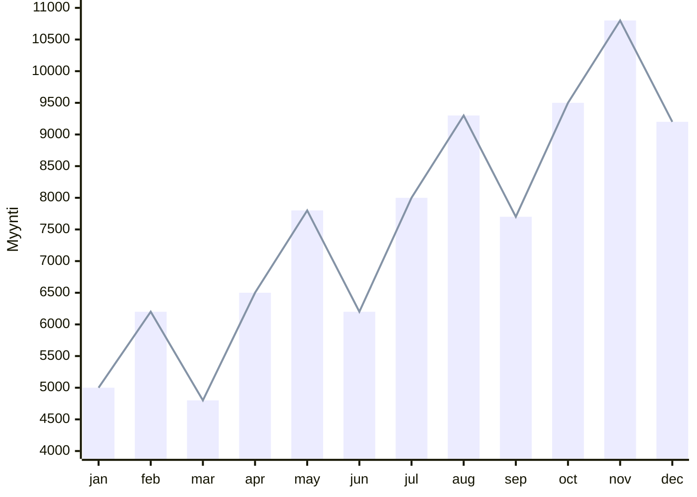

# Aikasarjat

## Määritelmä

Aloitetaan määrittelemällä, mitä aikasarjat ovat. Yksinkertainen, yhden muuttujan aikasarja on helppo kuvata kuvaajalla, kuten alla:



Tässä tapauksessa dataa on yhdeltä vuodelta ja se on kerätty kuukausittain – eli *granulariteetti* on kuukausittainen. Jokainen datapiste kuvaa tietyn ajanhetken (tässä tapauksessa kuukauden aloituspäivän) ja siihen liittyvän arvon (tässä tapauksessa myynti). Myyntidata on intuitiivinen esimerkki, mutta valtava osuus maailman aikasarjadatasta kertyy erilaisilta IoT-laitteilta. Aikasarja voi kuvastaa vaikkapa palvelinkeskuksen kiintolevyjen hajoamista: sarakkeista löytyy SMART-metriikoita ja binäärinen tieto siitä, onko levy hajonnut kyseisenä päivänä.

??? info "Taulukkomuoto"

    Taulukkomuodossa sama data näyttäisi tältä:

    | `month_start` | `sales` |
    | ------------- | ------- |
    | 2026-01-01    | 5000    |
    | 2026-02-01    | 6200    |
    | 2026-03-01    | 4800    |
    | 2026-04-01    | 6500    |
    | ...           | ...     |
    | 2026-11-01    | 10800   |
    | 2026-12-01    | 9200    |


### Komponentit

Kun puhutaan *ennustamisesta*, pyrimme mallintamaan aikasarjan tulevia arvoja. Kuvaajan tapauksessa tämä tarkoittaa, että meitä kiinnostaisi ensi vuoden tammikuu (helmikuu, maaliskuu, ...). Ennustamisen lisäksi on hyvä huomioida, että on olemassa myös aikasarjojen analysointia (engl. time series analysis), joka keskittyy ymmärtämään aikasarjan rakennetta, kuten kausivaihteluita, trendejä ja satunnaisuutta. Aikasarja-analyysiin kuuluu neljä pääkomponenttia [^ml-forecasting-py]:

* :one: **Trendi** eli pitkän ajan liike. Yllä olevassa kuvaajassa on noususuuntainen trendi.
* Lyhyen ajan vaihtelut:
    * :two: **Kausivaihtelut** eli säännölliset vaihtelut, jotka toistuvat tietyn ajan välein. Yllä olevassa kuvassa on 4 kuukauden "hain evä".
    * :three: **Sykliset vaihtelut** ovat nousuja ja laskuja, joiden ei ole kiinteää jaksoa (esim. suhdannevaihtelu).
* :four: **Satunnaisuus** eli täysin ennustamattomat pienet tai suuret vaihtelut. Tämä on kohinaa.

Nämä ovat tekstinä abstrakteja käsitteitä, joten kannattaa etsiä kuva avuksi. Voit löytyää kuvia esimerkiksi `statsmodel`-kirjaston esimerkistä [Seasonal-Trend decomposition using LOESS (STL)](https://www.statsmodels.org/stable/examples/notebooks/generated/stl_decomposition.html)

### Ennustamisen termistö

Datan suhteen muita tärkeitä termejä ovat [^ml-forecasting-py]:

* **(aika)granulariteetti**: Kuinka usein dataa kerätään (esim. päivittäin, kuukausittain, vuosittain).
* **aikahorisontti**: Kuinka pitkälle tulevaisuuteen haluamme ennustaa.
* **exogeeniset muuttujat**: Muut muuttujat (*engl. feature*), jotka vaikuttavat ennustettavaan arvoon, mutta eivät ole osa aikasarjaa. Esimerkiksi `is_holiday` tai `outdoor_temperature` tai `sensor_type`.
* **yksi- tai monimuuttuja**: Onko aikasarja yhden vai useamman muuttujan sarja (*engl. monovariate, multivariate*).
* **ennustehorisontin rakenne**: Ennustetaanko vain seuraava aika-askel (*engl. single-step*) vai useampi askel (*engl. multi-step*). Multi-step -ennusteita voidaan tehdä kolmella eri tavalla (plus yhdellä hybridillä, joka on pudotettu pois listalta):
    * **rekursiivinen ennuste** (*recursive multi-step*): Käytetään yhtä mallia, joka ennustaa seuraavan askeleen. Tulos syötetään takaisin malliin seuraavan askeleen ennustamiseksi.
    * **suora ennuste** (*direct multi-step*): Luodaan erillinen malli jokaiselle ennustettavalle aika-askeleelle (esim. yksi malli tunnille $t+1$ ja toinen tunnille $t+2$).
    * **moniulotteinen tuloste** (*multiple output*): Yksi malli ennustaa koko sekvenssin kerralla vektorina.

Kannattaa tutustua näihin [skforecast.org: Intro to Forecasting](https://skforecast.org/0.20.1/introduction-forecasting/introduction-forecasting)-sivulla, jossa ne on esitelty visuaalisesti.

## Datan käsittely (Perinteinen)

!!! warning

    Tässä materiaalissa ei käsitellä puuttuvien arvojen imputointia syvällisesti. Ota kuitenkin huomioon, että aikasarjasta puuttuvat arvot täytyy käsitellä ennen mallinnusta esimerkiksi interpoloimalla, forward fill -menetelmällä tai poistamalla käyttökelvottomat rivit.

### LAG

Tässä kohtaa on hyvä erottaa kaksi perinnettä toisistaan. **Taulukkomuotoiset koneoppimismallit** – kuten lineaarinen regressio, random forest, XGBoost ja LightGBM – tarvitsevat yleensä eksplisiittisesti rakennetut viivepiirteet (*lag features*). Sen sijaan **klassiset aikasarjamallit**, kuten ARIMA tai Exponential Smoothing, mallintavat ajallista rakennetta suoremmin eivätkä välttämättä vaadi sitä, että rakennat lag-sarakkeet itse [^modern-ts-forecasting] [^ts-cookbook].

Jos käytössä on siis tavallinen regressiomalli tai boosting-malli, 1-ulotteinen aikasarja täytyy käytännössä kääntää moniulotteiseksi *sliding window* -menetelmällä. Tämän voi tehdä Pandasilla, SQL:llä, Excelillä tai valitsemallaan aikasarjakirjastolla (esim. `sktime` tai `MLForecast`). Koska SQL on yleismaailmallisesti ymmärrettävä kieli, näytetään esimerkki SQL:llä:

```sql
CREATE TABLE sales_features AS
SELECT
    month_start,                                       -- kuukauden aloituspvm
    LAG(sales, 2) OVER (ORDER BY month_start) AS lag_2, -- toissakuukauden myynti
    LAG(sales, 1) OVER (ORDER BY month_start) AS lag_1, -- viime kuukauden myynti
    sales                                              -- tämän kuukauden myynti
FROM sales;
```

| `month_start` | `lag_2 (x_0)` | `lag_1 (x_1)` | `sales (y)` |
| :-----------: | :-----------: | :-----------: | :---------: |
|  2026-01-01   | :down_arrow:  | :down_arrow:  |    5000     |
|  2026-02-01   | :down_arrow:  |     5000      |    6200     |
|  2026-03-01   |     5000      |     6200      |    4800     |
|  2026-04-01   |     6200      |     4800      |    6500     |
|      ...      |     4800      |     6500      |     ...     |
|      ...      |     6500      |      ...      |     ...     |

Lopputulos syntyy siten, että jokaiselle kuukaudelle luodaan uusi sarake (*engl. column*), jossa on kyseisen kuukauden myynti ja sitä edeltävien kuukausien myynnit. Näin saadaan luotua uusia ominaisuuksia (features), jotka kuvaavat aikasarjan rakennetta. Perinteinen tilastollinen malli käsittelee näitä samalla tavalla kuin muitakin ominaisuuksia. Jos kuvittelet tilalle lukemaan `n_rooms`, `distance_to_city_center` ja `area`, niin on helppo hyväksyä, että tilastollinen malli voi löytää painot, jotka kuvaavat, kuinka paljon kukin näistä ominaisuuksista vaikuttaa ennustettavaan arvoon. Mallille syötettäisiin siis:

```python
model.fit(
    X=df[["lag_2", "lag_1"]], 
    y=df["sales"]
)
```

??? tip "Mitä muuta voi lisätä?"

    ```sql
    CREATE TABLE sales_features AS
    SELECT
        month_start,
        sales,
        -- ....
        -- ...
        -- (endogeeninen) liukuva keskiarvo, joka kuvaa viimeisten 7 päivän myyntiä
        AVG(sales) OVER (
            ORDER BY month_start
            ROWS BETWEEN 6 PRECEDING AND CURRENT ROW
        ) AS rolling_7d_avg,
        -- kalenteripiirre: alkoiko kuukausi maanantaina?
        CASE 
            WHEN EXTRACT(ISODOW FROM month_start) = 1
            THEN 1 ELSE 0
        END AS month_started_on_monday
    FROM sales
    ```

    Taulusta pitäisi lopuksi poistaa tai imputoida rivit, joissa on `NULL`-arvoja, koska `LAG()` tuottaa niitä ensimmäisille riveille.

### Kalenteri- ja ulkoiset piirteet

Pelkkä viivehistoria ei riitä kaikissa ongelmissa. Monissa liiketoiminta- ja IoT-ongelmissa ennuste tarkentuu merkittävästi, kun mukaan lisätään:

* **kalenteripiirteitä**, kuten viikonpäivä, kuukausi, tunti, lomapäivä tai kampanjapäivä
* **exogeenisiä muuttujia**, kuten lämpötila, hinta, säätila tai sensorin tyyppi
* **tilastollisia aggregaatteja**, kuten liukuvia keskiarvoja, minimejä, maksimeja ja volatiliteettia

Tärkeä käytännön sääntö on tämä: piirteessä saa käyttää vain sellaista tietoa, joka olisi ollut aidosti saatavilla ennustushetkellä. Jos rakennat esimerkiksi 7 päivän liukuvan keskiarvon, sitä ei saa laskea tulevien päivien arvoista. Muuten syntyy *data leakage*.

### Train-test-jako

Tavallisessa koneoppimisessa aineisto voidaan usein sekoittaa ja jakaa satunnaisesti opetus- ja testijoukkoihin. Aikasarjojen kanssa näin ei voida tehdä, sillä ajan suuntaa on ehdottomasti kunnioitettava: tarkoituksena on ennustaa tulevaisuutta menneisyyden datan perusteella, eikä päinvastoin [^ts-cookbook]. Siksi testijoukoksi on aina varattava aikasarjan kronologisesti tuorein osa [^ts-cookbook]. Sama periaate pätee myös mallin validointiin. Aikasarjojen ristiinvalidoinnissa (cross-validation) ei voida käyttää perinteistä k-fold-menetelmää datan satunnaistuksella. Sen sijaan hyödynnetään aikasidonnaisia menetelmiä, kuten laajenevaa ikkunaa (expanding window) tai liukuvaa ikkunaa (sliding window), jotta mallin arviointi tapahtuu aina aidosti tulevaa ennustamalla [^modern-ts-forecasting].

Käytännössä yksinkertainen jako voi näyttää tältä:

* vanhin 70–80 % datasta koulutukseen
* seuraava siivu validointiin
* tuorein siivu testiin

Jos dataa on vähän, erillisen validointijoukon sijasta voidaan käyttää useita peräkkäisiä validointi-ikkunoita.

### Stationaarisuus

Stationaarisuus on perusoletus klassisille autoregressiivisille malleille, kuten ARIMA:lle. Stationaarinen aikasarja tarkoittaa sitä, että sen tilastolliset perusominaisuudet (mean, std) pysyvät ajan suhteen vakaina. Riippuvuus menneisyyden arvoihin määräytyy ensisijaisesti viiveen, ei absoluuttisen ajanhetken, perusteella [^modern-ts-forecasting].

Ongelmana on, että suuri osa todellisen maailman datasta sisältää trendiä, kausivaihtelua tai rakennemuutoksia, jolloin sarja ei ole luonnostaan stationaarinen [^ts-cookbook]. Tällöin datasta tehdään väkisin stationaarista metodeilla, kuten:

* **differointi** (*differencing*) trendin poistamiseen (eli $y_t' = y_t - y_{t-1}$)
* **kausidifferointi** kausirakenteen poistamiseen (eli $y_t'' = y_t - y_{t-m}$, missä $m$ on kausijakson pituus)
* **logaritmimuunnos** tai muuta skaalaavaa muunnosta varianssin vakiointiin

Kaikki perinteiset mallit eivät kuitenkaan vaadi stationaarisuutta. Esimerkiksi puupohjaiset regressiomallit voivat toimia epästationaarisella datalla. [^ml-forecasting-py]

### Autokorrelaatio ja piirteiden valinta

Autokorrelaatio kertoo, kuinka vahvasti sarja korreloi oman menneisyytensä kanssa. Tämä on sinulle kielimalleista jo tuttua: edelliset sanat korreloivat siihen, mikä tulee seuraavaksi. Jos tämän päivän myynti muistuttaa eilisen myyntiä, yhden päivän viiveellä on positiivinen autokorrelaatio. Aikasarja-analyysissä tätä tarkastellaan usein kahdella työkalulla [^ml-forecasting-py] [^ts-cookbook]:

* **ACF** (*autocorrelation function*): näyttää, kuinka vahva korrelaatio kullakin viiveellä on
* **PACF** (*partial autocorrelation function*): näyttää viiveen "oman" vaikutuksen, kun välistä tulevien lyhyempien viiveiden vaikutus on vakioitu

Idea on seuraava:

* jos ACF:ssä näkyy piikkejä viiveillä 7, 14 ja 21, datassa voi olla viikkokausivaihtelua
* jos PACF:ssä näkyy selvä piikki viiveellä 1 tai 2, nämä lagit voivat olla hyödyllisiä autoregressiivisessä mallissa
* jos ACF hiipuu hitaasti, sarjassa voi olla trendiä eikä se ehkä ole stationaarinen

Näihin kannattaa tutustua kuvien kautta. Myös tähän löytyy `statsmodels`-kirjaston esimerkeistä valmis kuvaaja, esimerkiksi: [Autoregressive Moving Average (ARMA): Sunspots data](https://www.statsmodels.org/stable/examples/notebooks/generated/tsa_arma_0.html)

Taulukkomuotoisten mallien kanssa ACF ja PACF auttavat ennen kaikkea valitsemaan, mitkä viiveet kannattaa ottaa mukaan piirteinä. Jos sarjassa on vahva 24 tunnin tai 7 päivän rytmi, nämä viiveet kannattaa usein mallintaa eksplisiittisesti.

### Lokaalit mallit

**Lokaali malli** tarkoittaa sitä, että jokaiselle aikasarjalle koulutetaan oma malli. Jos ennustat 500 tuotteen kysyntää, lokaalissa lähestymistavassa rakennetaan 500 erillistä mallia [^modern-ts-forecasting]. Tämä on klassisen aikasarja-analyysin oletustapa.

Lokaalien mallien etuja ovat:

* helppo tulkittavuus yhdelle sarjalle kerrallaan
* hyvä toiminta silloin, kun sarjoja on vähän mutta kutakin sarjaa on mitattu pitkään
* yksinkertainen ajatusmalli: yhden sensorin historiaa käytetään saman sensorin tulevaisuuden ennustamiseen

Haittoja puolestaan ovat:

* mallit eivät jaa oppimaansa keskenään
* ylläpidettävien mallien määrä kasvaa nopeasti
* lyhyiden tai kohinaisten sarjojen ennustaminen on vaikeaa, koska yhdellä sarjalla on vähän opetusdataa

Lokaali malli on usein erinomainen valinta silloin, kun ennustettava ilmiö on yksi selkeä sarja – esimerkiksi sähkönkulutus yhdessä rakennuksessa tai yhden tuotteen kysyntä yhdessä myymälässä.

### Sama videona

Alla olevasta upotetusta videosta löydät samat asiat kuin yltä (ja vähän enemmänkin) selkeän visuaalisessa muodossa.

<iframe width="560" height="315" src="https://www.youtube.com/embed/9QtL7m3YS9I?si=-t5pqekYzaRJjMXf" title="YouTube video player" frameborder="0" allow="accelerometer; autoplay; clipboard-write; encrypted-media; gyroscope; picture-in-picture; web-share" referrerpolicy="strict-origin-when-cross-origin" allowfullscreen></iframe>

**Video:** *Kishan Manani esittelee PyData London 2022 -konferenssissa aihetta "Feature Engineering for Time Series Forecasting".*

## Mallin koulutus (Perinteinen)

Perinteisten mallien vahvuus on siinä, että ne ovat usein nopeita, tulkittavia ja kilpailukykyisiä yllättävän vahvoina baselineina. Käytännössä on tavallista kokeilla useita eri malliperheitä rinnakkain ja valita niistä paras validaation perusteella [^modern-ts-forecasting]. Huomaa, että kaikkea mallinnusta ei tarvitse tehdä ilman apuja. Esimerkiksi Nixtlan `StatsForecast` ja `MLForecast` voivat olla avuksi. Pienten datasettien kanssa, erityisesti asiaa opiskellessa, myös `skforecast` on hyvä ja helppokäyttöinen työkalu.

> "Time series forecasting has been around since the early 1920s, and through the years, many brilliant people have come up with different models, some statistical and some heuristic-based. I refer to them collectively as classical statistical models or econometrics models, although they are not strictly statistical/econometric."
>
> — Joseph & Tackes [^modern-ts-forecasting]

### Aloita baselinesta

Ennen kuin koulutat yhtään monimutkaista mallia, rakenna vähintään yksi yksinkertainen baseline. Aikasarjoissa hyvä baseline ei ole satunnainen arvaus vaan jokin ilmiön rakennetta hyödyntävä nyrkkisääntö. Tyypillisiä baselineja ovat:

* **naive**: huominen arvo = tämän päivän arvo (eli $y_{t+1} = y_t$)
* **seasonal naive**: ensi maanantai = viime maanantai (eli $y_{t+7} = y_t$)
* **moving average**: ennuste = viimeisten havaintojen keskiarvo

Huomaa, että nämä ==eivät siis varsinaisesti ennusta mitään==. Jos valitsemasi *forecast horizon* on 7 päivää, ja ajat ennusteen sunnuntaina, niin naive baseline toimii siten, että:

* maanantain arvo on sunnuntain arvo
* tiistain arvo on sunnuntain arvo
* keskiviikon arvo on sunnuntain arvo
* ...
* joka päivä jatkossa on sama kuin sunnuntai


**Kuva 1:** *Nano Banana 2:n näkemys Naive Baseline -hahmosta, joka ennustaa kalenteria aina samalla kumileimasimella.*

!!! warning

    Jos monimutkainen malli ei voita näitä, ongelma on joko mallissa, datassa tai arviointitavassa. Mikäli törmäät online-kirjoitukseen, jossa rakennetaan monimutkainen malli ennustamaan esimerkiksi osakehintaa vertaamatta sitä edes naive-baselineen, voit olla melko varma siitä, että kyseessä on clickbait-artikkeli.

### ARIMA ja SARIMA

ARIMA rakentuu kolmesta osasta: autoregressiivinen osa (AR), differointi (I) ja liukuva keskiarvo virheille (MA). Mallin hyperparametrit kirjoitetaan yleensä muotoon $(p, d, q)$, ja kausillinen versio laajennetaan usein muotoon $(P, D, Q, m)$ [^ts-cookbook]. ARIMA-tyyppiset mallit sopivat erityisesti silloin, kun sarjoja on vähän, mieluiten yksi, ja ongelma on melko "siisti", taipuen helposti stationaariseksi.

Kyseessä on erittäin klassinen lokaali malli. Se on usein hyvä ensimmäinen vakava vertailukohta yhdelle selkeälle aikasarjalle.

### Exponential Smoothing ja ETS

Exponential Smoothing -malliperhe painottaa tuoreita havaintoja vanhoja enemmän. ETS-mallit (*Error, Trend, Seasonality*) ovat erityisen käyttökelpoisia silloin, kun sarjassa näkyy selkeä taso-, trendi- ja kausirakenne [^modern-ts-forecasting]. Käytännössä tämä on vaihtoehto ARIMA:lle, ja on myös *state space model*, joten se on helppo napata vertailuun mukaan.

### Lineaarinen regressio viivepiirteillä

Kun aikasarja muutetaan taulukkomuotoon lag-piirteiden avulla, tavallinen lineaarinen regressio muuttuu täysin käyttökelpoiseksi ennustajaksi. Tällöin malli oppii painot esimerkiksi piirteille `lag_1`, `lag_24`, `lag_168`, `is_weekend` ja `temperature`. [^modern-ts-forecasting] Jos piirteitä on paljon, käytetään usein regularisoituja versioita, kuten Ridge- tai Lasso-regressiota.

!!! tip "Regressio ja forecast horizon"

    Huomaa, että lineaarinen regressio on luonteeltaan single-step-malli. Jos haluat ennustaa useamman askeleen päähän, sinun täytyy joko:

    * käyttää rekursiivista lähestymistapaa, jossa ennuste syötetään takaisin malliin seuraavan askeleen ennustamiseksi
    * tai rakentaa erillinen malli jokaiselle ennustettavalle askeleelle

### LightGBM ja muut boosting-mallit

Kun lagit, kalenteripiirteet ja exogeeniset muuttujat on rakennettu taulukoksi, puupohjaiset boosting-mallit ovat usein erittäin vahvoja ennustajia. Ne pystyvät mallintamaan epälineaarisuuksia ja piirteiden välisiä interaktioita ilman, että analyytikon tarvitsee määritellä niitä käsin.

LightGBM, XGBoost tai Catboost ovat käytännössä hyvä valinta silloin, kun ilmiössä on epälineaarisuutta.

Aiheeseen voit tutustua esimerkiksi sk-forecastin examples-osion artikkelia lukemalla: [Forecasting time series with gradient boosting: Skforecast, XGBoost, LightGBM, Scikit-learn and CatBoost](https://cienciadedatos.net/documentos/py39-forecasting-time-series-with-skforecast-xgboost-lightgbm-catboost.html).

### Validointi ja mallin valinta

Perinteisten mallien koulutusprosessissa ei riitä, että ajetaan yksi malli yhdellä parametrilla. Tämä on toivon mukaan Johdatus koneoppimiseen -kurssilta tuttua. Mallit ovat kevyitä kouluttaa, ja frameworkit tarjoavat helpon tavan kokeilla useita malleja. Tyypillinen työnkulku on:

1. rakenna naiivi baseline
2. valitse useita malleja ja malliperheitä
3. kouluta kaikki mallit koulutusdatalla
4. arvioi kaikki mallit validointidatalla ja vertaa niitä baselineen
5. valitse paras malli ja arvioi se testidatalla
6. jos tulos jää heikoksi, palaa piirrevalintaan, validaatioasetelmaan ja malliperheiden vertailuun

Tyypillisiä arviointimittareita ovat MAE, RMSE, MAPE ja sMAPE. Miten valita näiden väliltä, ja mitä backtesting edes ylipäätänsä on? Kannattaa katsoa seuraava video:

<iframe width="560" height="315" src="https://www.youtube.com/embed/dSTXd8Hx728?si=OSn2ul0KDPBpK4rN" title="YouTube video player" frameborder="0" allow="accelerometer; autoplay; clipboard-write; encrypted-media; gyroscope; picture-in-picture; web-share" referrerpolicy="strict-origin-when-cross-origin" allowfullscreen></iframe>

**Video:** *Kishan Manani esittelee PyData London 2024 -konferenssissa aihetta "Backtesting and error metrics for modern time series forecasting".*

!!! tip "State ja backtesting"

    State space -mallit, kuten ARIMA, käsittelevät aikaa hyvin eri tavalla kuin lag-piirteisiin perustuvat tilattomat (stateless) regressiomallit. Ne ylläpitävät sisäistä tilaa, joka riippuu havaintojen järjestyksestä. Tämä tarkoittaa, että ARIMA-malli voi tuottaa ennusteita vain viimeisestä havainnosta eteenpäin.

    > "Unlike machine learning models, statistical models like ARIMA maintain an internal state that depends on the sequence of observations. They can only generate predictions starting from the last observed time step — they cannot "jump" to an arbitrary point in the future without knowing all previous values. During backtesting, when the validation window moves forward, the model must be refitted to incorporate the new observations and update its internal state."
    >
    > — Rodrigo, Ortiz and Akay [^skforecast-statistical]

!!! tip

    Saatat törmätä myös termeihin *in-sample* ja *out-of-sample*. In-sample-ennuste tarkoittaa mallin kykyä selittää dataa, jonka se on nähnyt koulutuksen aikana. Forecasting-tehtävässä kiinnostavampi suure on lähes aina *out-of-sample*-suorituskyky eli ennuste täysin tulevaan aikaan [^modern-ts-forecasting].

## Tehtävät

!!! question "Tehtävä: StatsForecast ja Polars"

    Avaa ja aja notebook `notebooks/nb/800/800_statsforecast_polars.py`. Notebook on kurssille sovitettu versio Nixtlan StatsForecast-dokumentaation tutoriaalista [End to End Walkthrough with Polars](https://nixtlaverse.nixtla.io/statsforecast/docs/getting-started/getting_started_complete_polars.html).

    Tee notebookissa seuraavat asiat:

    1. **Tiedon rajaus:** Notebook rajaa alussa datan kymmeneen aikasarjaan (`uids = ...[:10]`) ja viimeiseen viikkoon (`tail(7 * 24)`). Kokeile suurentaa näitä arvoja (esim. 50 aikasarjaan ja 2 viikkoon). Miten tämä vaikuttaa ajoaikoihin ja parhaiden mallien jakautumaan?
    2. **Kausivaihtelun pituus:** Mallit `SeasonalNaive` ja `DynamicOptimizedTheta` (DOT) saavat parametrin `season_length=24`. Koska kyseessä on tuntitason data, 24 edustaa vuorokautta. Kokeile muuttaa arvoksi esimerkiksi viikkovaihtelu (168) asettamalla `season_length=168`. Vaikuttaako tämä "best model" -tuloksiin?
    3. **Virhefunktio:** Notebook käyttää oletuksena Mean Squared Error (`mse`) -funktiota paremmuuden arviointiin (`from utilsforecast.losses import mse`). Vaihda tämä esimerkiksi Mean Absolute Erroriin (`mae`). Tuo se samasta kirjastosta ja muuta `evaluate_cv`-kutsua. Muuttuuko mallien paremmuusjärjestys?
    4. **Oma analyysi:** Valitse kaksi yksittäistä aikasarjaa notebookin loppupuolen kuvaajista. Kirjoita lyhyt tulkinta siitä, miksi juuri kyseiselle sarjalle valittu paras malli vaikuttaa onnistuneelta (onko datassa selkeä taso, toistuva sykli vai voimakasta kohinaa?).

    Vastaa lopuksi lyhyesti seuraaviin kysymyksiin:

    * Miksi tulosten vertailussa ristivalidointi (Cross-Validation) liukuvilla ikkunoilla (sliding window) on luotettavampaa kuin yksi ainoa datajako (esim. testiksi jätettävä viimeinen päivä)?
    * Minkälaiselle aikasarjalle Kuvaiden perusteella `SeasonalNaive` osoittautui erityisen vahvaksi baselineksi ja raskaampien mallien voittajaksi?

    **Lisähaaste:** Ota käyttöön jokin "Auto"-malli StatsForecast-kirjastosta (kuten `AutoARIMA` tai `AutoETS`). Tuo se samoin kuin muut mallit ja lisää se `models`-listaan. Tarkista, paransiko auto-malli ennustusten laatua valituilla aikasarjoilla ja huomaatko muutoksen solujen suoritusajoissa.

!!! question "Tehtävä: MLForecast tutuksi"

    Avaa ja aja notebook `notebooks/nb/800/801_mlforecast_polars_quickstart.py`. Tämä lyhyt notebook esittelee `MLForecast`-kirjaston perusteet, jolla aikasarja voidaan muuttaa taulukkomuotoon ja ennustaa perinteisellä koneoppimismallilla (tässä tapauksessa lineaarisella regressiolla).

    Tee notebookissa seuraavat kokeilut:

    1. **Mallin vaihto:** Vaihda `LinearRegression` johonkin toiseen regressiomalliin (esim. `RandomForestRegressor`).
    2. **Viiveiden (lags) lisäys:** Kokeile muuttaa `lags`-parametria. Nyt malli käyttää vain 12 kuukauden viivettä `lags=[12]`. Kokeile lisätä viiveitä. Kuinka evaluioisit, mitkä viiveet voivat olla hyödyllisiä?

    Pohdi lyhyesti: Miksi taulukkomuotoisissa koneoppimismalleissa piirteiksi täytyy itse määritellä erikseen viiveet (lags), kun taas edellisen tehtävän perinteiset mallit osasivat hyödyntää historian sellaisenaan?


## Lähteet

[^ml-forecasting-py]: Lazzeri, F. *Machine Learning for Time Series Forecasting with Python*. 2020. Wiley.
[^modern-ts-forecasting]: Joseph, M. & Tackes, J. *Modern Time Series Forecasting with Python - Second Edition*. Packt. 2024.
[^ts-cookbook]: Atwan, T. *Time Series Analysis with Python Cookbook - Second Edition*. Packt. 2026.
[^skforecast-statistical]: Rodrigo, J. Ortiz, J. & Akay, R. *Forecasting with statistical models*. 2026. https://cienciadedatos.net/documentos/py77-forecasting-statistical-models.html
