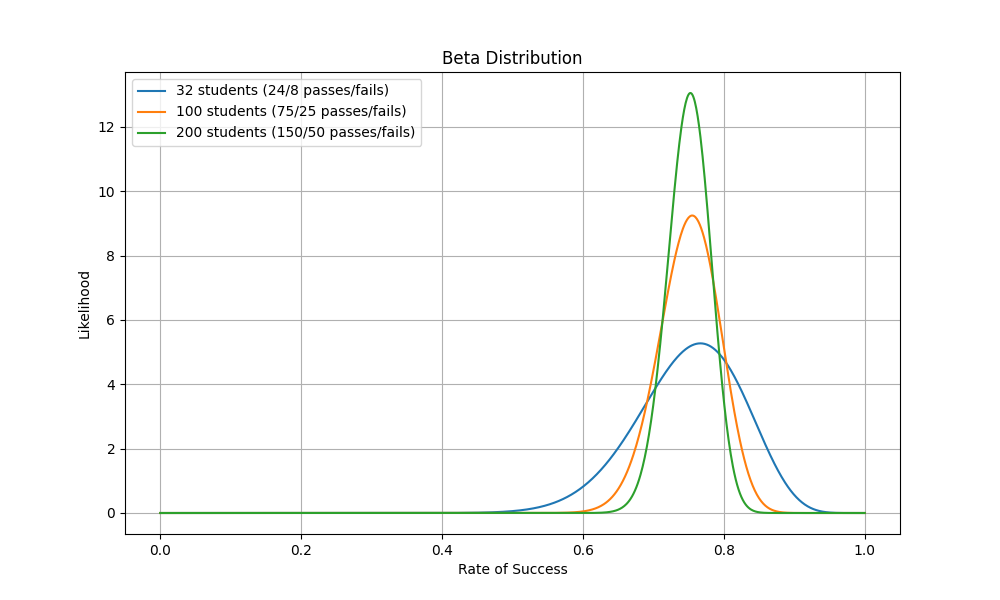

Tämä ei ole matematiikan kurssi eikä tätä materiaalia ole kirjoittanut matematiikan opettaja. Siitä huolimatta kurssilla täytyy hieman käsitellä todennäköisyysmatematiikkaa, tilastotiedettä ja lineaarialgebraa. Tässä osiossa käsitellään Bayesin teoreemaa intuition tasolla. Tämä pohjustaa seuraavia vaiheita, joissa käytämme Bayesin teoreemaa koneoppimisessa. Hyvin yksinkertainen Bayesilainen esimerkki olisi "kurssin läpäisemisen todennäköisyys". Tämä merkittäisiin näin:

$$
\begin{align*}
    B &= \text{ pass the pizza course} \\
    P(B) &= 0.75
\end{align*}
$$

Huomaa, että `B` on kaavassa **tapahtuma**. `P(B)` on tapahtuman todennäköisyys. Tässä lapsellisessa esimerkissä oletetaan, että aiemman datan nojalla :pizza:-kurssin läpäisemisen todennäköisyys on 75 % &mdash; pois lukien kaikki muut tekijät. 

## Riippuvaisuus

### Riippumattomat tapahtumat

Mikäli käytävällä tulee kaksi satunnaista opiskelijaa vastaan, voimme pohtia, että: *"Kuinka todennäköistä on, että kummatkin ovat läpäisseet kurssin?"*. Olettaen että tapahtumat ovat riippumattomia, voimme laskea tämän seuraavasti:

$$
P(B_1, B_2) = P(B_1) \times P(B_2) = 0.75 \times 0.75 = 0.5625
$$

Tämän voi helposti todistaa käymällä läpi kaikki kombinaatiot. Termi tälle on tulojoukko tai karteesinen tulo (engl. Cartesian product).

```python
from itertools import product

B1 = [1, 1, 1, 0]  # 3/4 = 0.75
B2 = [1, 1, 1, 0]

n = len(list(product(B1, B2)))
count = 0

for b1, b2 in product(B1, B2):
    print(f"{b1=}, {b2=} -> {b1 and b2}", end="")
    if b1 and b2:
        count += 1
        print(f"  <== {count}/{n}")
    else:
        print()
```

??? tip "Klikkaa tuloste esiin"

    Koodissa tulostetaa yksi rivi per oppilas (B1,B2) kombinaatio. Tuloste on:

    ```
    b1=1, b2=1 -> 1  <== 1/16
    b1=1, b2=1 -> 1  <== 2/16
    b1=1, b2=1 -> 1  <== 3/16
    b1=1, b2=0 -> 0
    b1=1, b2=1 -> 1  <== 4/16
    b1=1, b2=1 -> 1  <== 5/16
    b1=1, b2=1 -> 1  <== 6/16
    b1=1, b2=0 -> 0
    b1=1, b2=1 -> 1  <== 7/16
    b1=1, b2=1 -> 1  <== 8/16
    b1=1, b2=1 -> 1  <== 9/16
    b1=1, b2=0 -> 0
    b1=0, b2=1 -> 0
    b1=0, b2=1 -> 0
    b1=0, b2=1 -> 0
    b1=0, b2=0 -> 0
    ```

Kaikista vaihtoehdoista 9/16 on sellaisia, joissa molemmat opiskelijat ovat läpäisseet kurssin. Tämä on sama kuin laskettu todennäköisyys eli 0.5625.

!!! question "Tehtävä"

    Katso, mitä tulostuu, mikäli vaihdat yllä olevasta koodista `and`-operaatiot `or`-operaatioiksi. Kysymys tällöin on, että: *kuinka todennäköistä on, että vähintään toinen opiskelija on läpäissyt kurssin?*. 
    
    Todennäköisyys **ei suinkaan ole** 3/4 + 3/4 eli 6/4. Prosentteina tämä olisi 150 %, minkä pitäisi olla jo intuition perusteella selkeästi väärä vastaus. Yksi tapa laskea todennäköisyys on summata `both` + `only_left` + `only_right`, jossa both on yltä tuttu `3/4 * 3/4`, ja kaksi muuta ovat kumpainenkin `3/4 * 1/4`. Toinen tapa on käyttää seuraavaa kaavaa:

    $$
    P(B_1 \text{ OR } B_2) = P(B_1) + P(B_2) - P(B_1, B_2)
    $$
    
    Yllä olevat for-loopin lisäksi voit laskea saman murtoluvuilla joko käsin tai Pythonilla. Tästä esimerkki alla:

    ```python
    from fractions import Fraction

    b1 = Fraction(3, 4)
    b2 = ...
    both = ...
    either = b1 + b2 - both
    ```


### Riippuvaiset tapahtumat

Aiemmin esitellyt tapahtumat ovat keskenään riippumattomia. Kullakin satunnaisesti vastaan tulevalla opiskelijalla on sama 75 % mahdollisuus kuulua heihin, jotka ovat läpäisseet kurssin. Kun arvioit vastaantulevan opiskelijan kurssin läpäisyn mahdollisuutta, sinun arviointiisi voivat vaikuttaa kuitenkin useat seikat, kuten että toisella opiskelijalla on kainalossaan **The Pizza Bible** -kirja. Pizzantekemiseen liittyvien kirjojen lukeminen oletettavasti vaikuttaa kurssin läpäisemisen todennäköisyyteen.

$$
\begin{align*}
    A &= \text{ has read the pizza bible } \\
    B &= \text{ pass the pizza course } \\
    P(B|A) &= \text{ 0.96 }
\end{align*}
$$

Lausemuodossa tämä on: *"Kurssin läpäisemisen todennäköisyys, annettuna että olet lukenut The Pizza Biblen, on 99 %."* Kaavassa `B` on yhä sama :pizza:-kurssin läpäisy. `A` on tapahtuman ehto. `P(B|A)` on tapahtuman todennäköisyys, annettuna ehto. Huomaa, että tällöin tapahtumat eivät ole keskenään riippumattomia vaan nimenomaan riippuvaisia toisistaan.

!!! tip

    Kuinka paljon kirjan lukeminen siis nostaa kurssin läpäisyn todennäköisyyttä? Tämä voidaan laskea seuraavasti:

    $$
    \frac{P(B|A)}{P(B)} = \frac{0.96}{0.75} = 1.28
    $$

    Tämä tarkoittaa, että The Pizza Bible kirjan lukeminen nostaa todennäköisyyttä läpäistä kurssi 28 %:lla.

??? warning "Ethän sekoita riippumattomia ja riippuvaisia tapahtumia?"

    Oletetaan, että kirjan lukemisen todennäköisyys on 50 %. Puolet oppilaista ovat lukeneet kirjan.

    $$
    P(A) = 0.5
    $$

    Huomaa, että **et voi laskea** näiden lukujen avulla vastausta kysymykseen: *"Kuinka todennäköistä on, että satunnainen opiskelija on läpäissyt kurssin JA lukenut kirjan"* yksinkertaisella kertolaskulla eli:

    $$
    P(B, A) = P(B) \times P(A) = 0.75 \times 0.5 = 0.375
    $$

    Käytetyn kaavan pitäisi ottaa huomioon, että **tapahtumat vaikuttavat toisiinsa**. Yllä oleva kaava toimii riippumattomien tapahtumien kanssa, mutta toisistaan riippuvien tapahtumien kanssa käytetään seuraavaa kaavaa:

    $$
    P(B, A) = P(B|A) \times P(A) = 0.96 \times 0.5 = 0.48
    $$

    Entäpä kysymys *"Kuinka todennäköistä on, että satunnainen opiskelija on läpäissyt kurssin TAI lukenut kirjan"*? Tämä voidaan laskea seuraavasti, olettaen että ujutat `P(A,B)`-tilalle yllä näkyvän kaavan, jonka tulos on 0.48:

    $$
    P(B \text{ OR } A) = P(B) + P(A) - P(B,A) = 0.77
    $$

## Todennäköisyyden selvittäminen

Täysin tasapainoinen kolikko tai noppa on tyypillinen todennäköisyysmatematiikassa käytetty esimerkki. Arkielämän ilmiöissä jonkin tapahtuman todennäköisyys pitää selvittää havaintojen perusteella. Esimerkiksi, jos haluat selvittää, kuinka todennäköistä on, että opiskelija läpäisee kurssin, voit käyttää aiempia kurssisuorituksia. Yllä todennäköisyydeksi on väitetty 75 %:n todennäköisyyttä. Kuinka tähän lukuun ollaan päädytty? Kuvitellaan, että tämä on selvitetty kyselytutkimuksella. Kyselyssä on kysytty **32 opiskelijalta**, ovatko he läpäisseet kurssin.

* 24 opiskelijaa vastasi kyllä
* 8 opiskelijaa vastasi ei

Todennäköisyys voidaan laskea seuraavasti:

$$
P(B) = \frac{n_{passed}}{n_{total}} = \frac{24}{32} = 0.75
$$

!!! warning

    Huomaathan, että 32 oppilaan otannalla ei voida varmuudella sanoa, että todennäköisyys oikeasti on 75 %. Näin pienellä otannalla virhemarginaali on suuri (jotakuinkin ± 15 %, 95% luottamustasolla). Näin pienellä otannalla on vain noin 50 % mahdollisuus, että todellinen todennäköisyys on välillä 70 % - 80 %.

    Mitä suurempi otanta, sitä todennäköisempää on, että todennäköisyyslukema vastaa ilmiön todellista todennäköisyyttä. Alla on esitetty kolmen eri otannan todennäköisyysjakaumat. Huomaa, että mitä suurempi otanta, sitä kapeampi jakauma on.

    

    **Kuvio 1.** Kolmen eri otannan todennäköisyysjakaumat. 32 opiskelijan otannalla jakauma on leveämpi kuin 100 ja 200 opiskelijan otannoilla.

    Tilanne on sama kuin jos heität kolikko tai kuusitahoista noppaa. Yksittäisellä heitolla et voi sanoa, että kolikon tai nopan todennäköisyys on 50 % tai 1/6. Mutta kun heität kolikkoa tai noppaa tarpeeksi monta kertaa, todennäköisyyslukema lähestyy todellista todennäköisyyttä. Todellinen todennäköisyys ei välttämättä ole tosielämän kolikolla tai nopalla tasan 50 % tai tasan 1/6.

    Yllä näkyvän Kuvio 1:n voit generoida seuraavalla koodilla:

    ```python
    import numpy as np
    import matplotlib.pyplot as plt
    from scipy.stats import beta

    sample_size = [32, 100, 200]

    plt.figure(figsize=(10, 6))

    for n in sample_size:
        # Compute passes and fails
        passes = int(0.75 * n)
        fails = n - passes

        # Plot the Beta distribution
        x = np.linspace(0, 1, 1000)
        y = beta.pdf(x, passes, fails)
        plt.plot(x, y, label=f'{n} students ({passes}/{fails} passes/fails)')

    plt.grid(True)
    plt.show()
    ```


## Käänteinen todennäköisyys

Tähän asti me tiedämme todennäköisyydet:

* `P(A) = 0.5`
    * The Pizza Bible kirjan lukemisen todennäköisyys
* `P(B) = 0.75` 
    * :pizza:-kurssin läpäisemisen todennäköisyys
* `P(B|A) = 0.96`
    * :pizza:-kurssin läpäisemisen todennäköisyys, annettuna että olet lukenut The Pizza Bible kirjan.


Mutta mitä jos haluamme selvittää, että: *"Kuinka todennäköistä on, että opiskelija on lukenut kirjan, annettuna että hän on läpäissyt kurssin?"*. Tämä voidaan laskea alla näkyvällä kaavalla, joka &mdash; kuinka ollakaan &mdash; **on Bayesin teoreema**:

$$
P(A|B) = \frac{P(B|A) \times P(A)}{P(B)} = \frac{0.96 \times 0.5}{0.75} = 0.64
$$

