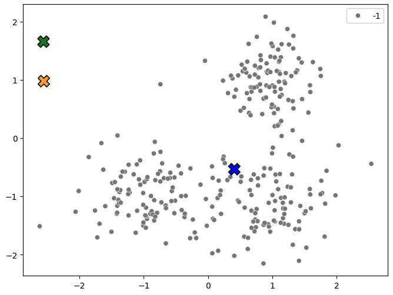
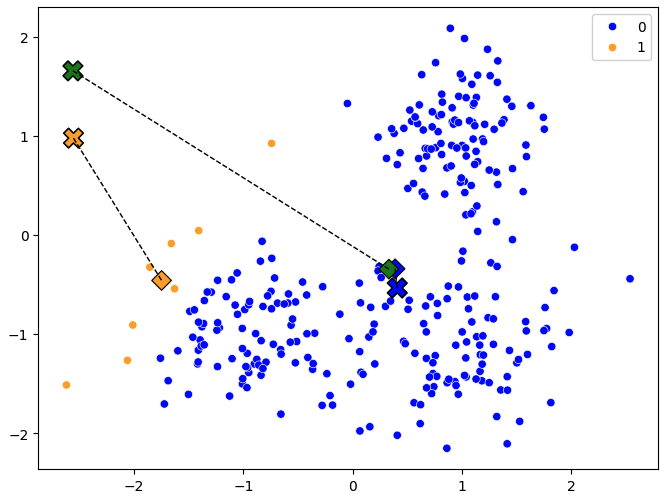
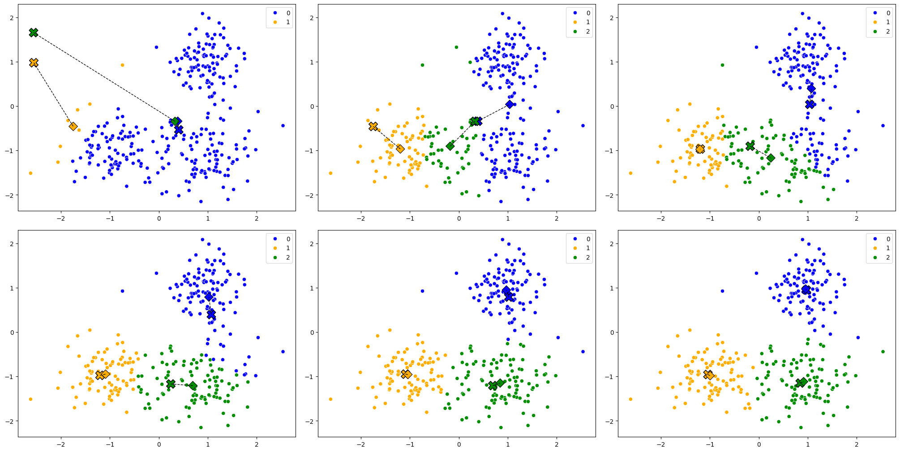
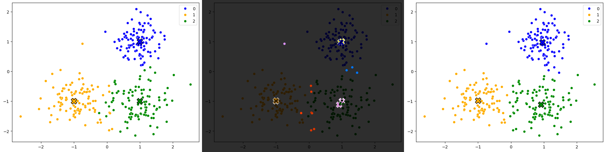

# k-Means

Aiemmin esiteltyä kNN:ää ja nyt käsiteltävää k-Means algoritmia yhdistää kirjain `k`, mutta niiden merkitys on eri. k-Meansin kohdalla `k` tarkoittaa `n_clusters` eli klustereiden määrää, kun taas kNN:ssä `k` tarkoittaa naapureiden määrää. Toinen merkittävä ero algoritmien välillä on, että k-Means ei ole luokittelualgoritmi, vaan ==klusterointialgoritmi eli siis ohjaamaton koneoppimisalgoritmi==. Kukin havainto kuuluu siihen klusteriin, jonka keskipiste on lähimpänä havaintoa.

## k-Means algoritmi

k-Means on lähes yhtä simppeli algoritmi kuin k-NN. Aivan kuten k-NN, myös k-Meansiä voi käyttää n-ulotteisessa avaruudessa, mutta visualisoinnin vuoksi käytämme tässä esimerkissä vain 2-ulotteista avaruutta. Koulutuksen vaiheet voidaan tiivistää seuraavasti:

1. Valitse `k` klusteria, joihin `m` samplea klusteroidaan.
2. Arvo satunnaisesti (x,y) koordinaatit `k` klusterikeskuksille.
3. Nimitä kukin piste kuuluvaksi lähimpään klusteriin.
4. Laske keskiarvo (x,y) jokaiselle `m` havainnolle. Siirrä klusterikeskukset näihin.

Vaiheet 3-4 toistetaan kunnes klusterikeskukset kunnes klusterikeskukset eivät enää muutu (tai jokin muu lopetusehto täyttyy).

## Vaiheet kuvina

Alla esimerkki, joka on rautakoodattu toimimaan tasan 2-ulotteisessa avaruudessa.

Data on täysin kuvitteellista, mutta mikäli se helpottaa, niin voit kuvitella x:n ja y:n arvojen taustalle jonkin ilmiön. Esimerkiksi:

* x-akseli: :glasses: silmälasien vahvuus (± 2.5)
* y-akseli: :pineapple: ananas-pizzatäytteen tykkäysaste (± 2.5 σ)

!!! info

    Tällöin datasetin oikean ylälaidan rypäs, jonka keskipiste on noin $(1, 1)$, koostuu kaukonäköisistä :pineapple:-pizzan ystävistä. Datasetin perusteella vaikuttaisi, että ananaksesta tykkääminen pizzan täytteenä on kaukonäköistä puuhaa. Kenties datasta puuttuu jokin merkittävä piirre, kuten se, että onko kyseessä purkki- vai tuoreananas?

### Vaihe 1: Valitse k

Valitaan klustereiden määrä `k` eli `n_clusters`. Tässä esimerkissä valitaan `k=3`. Data on generoitu siten, että me satumme tietämään klustereiden määrän etukäteen. Tässä yksinkertaisessa esimerkissä se olisi myös nähtävissä paljaalla silmällä katsomalla pistekuvaajaa.

### Vaihe 2: Arvo satunnaiset klusterikeskukset

Huomaa, että alla olevan kuvaajan (Kuvio 1) pisteet kuuluvat `-1` klusteriin, mikä piirretään tässä tapauksessa harmaana pisteenä. Sen sijaan kullakin klusterilla on on id, joka on kokonaisluku `range(k)` eli tässä tapauksessa `0, 1, 2`. Klusterien lokaatio on täysin satunnainen.



**Kuvio 1:** *Klusterikeskukset satunnaisesti valittuna. Sallimme tässä esimerkissä arvonnan käyttää mitä tahansa arvoja välillä `-3 ... 3` eli jopa pisteavaruuden ulkopuolelta.*

### Vaihe 3: Laske etäisyydet

Klusteriin kuuluvan pisteen määrittämiseksi lasketaan etäisyys jokaisen klusterin keskipisteen ja pisteen välillä. Piste kuuluu siihen klusteriin, jonka keskipiste on lähimpänä pistettä. Tämä tehdään alla olevalla koodilla:

```python title="IPython"
@dataclass
class Point:
    x: float
    y: float
    cluster: int = -1

@dataclass
class Centroid:
    x: float
    y: float
    cluster: int

def assign_points_to_centroids(points: list[Point], centroids: list[Centroid]):

    for point in points:
        # Euclidean distances to the three centroids
        distances = [
            ((point.x - centroid.x)**2 + (point.y - centroid.y)**2)**0.5 
            for centroid in centroids
        ]
        
        # Fetch the centroid with the smallest distance
        indx = distances.index(min(distances))
        closest = centroids[indx]
        
        # Assign the point to the closest centroid
        point.cluster = closest.cluster

    return points
```

!!! tip

    Koska datalla ei ole varsinaisesti "labelia", käytämme jatkossa sanaa "cluster" viittaamaan klusteriin, johon piste kuuluu, ja välttelemme sanan "label" käyttöä.

### Vaihe 4: Laske uudet klusterikeskukset

Kun jokainen piste on määritetty kuuluvaksi lähimpään klusteriin, lasketaan jokaisen klusterin pisteiden keskiarvo. Tämä keskiarvo on uusi klusterikeskus. Tämä tehdään alla olevalla koodilla:

```python title="IPython"
def compute_new_centroid_locations(points: list[Point], centroids: list[Centroid]):

    for centroid in centroids:
        # Subset of points matching the i'th cluster
        cluster_points = [point for point in points if point.cluster == centroid.cluster]

        # Mean of columns (x and y)
        n = len(cluster_points)
        
        # If this cluster was too far away from any points, move it to the middle of ALL points
        # This is to avoid divizion by zero
        if n == 0:
            centroid.x = sum([point.x for point in points]) / len(points)
            centroid.y = sum([point.y for point in points]) / len(points)
            continue

        new_x = sum([point.x for point in cluster_points]) / n
        new_y = sum([point.y for point in cluster_points]) / n

        # Stopping condition
        if new_x == centroid.x and new_y == centroid.y:
            print(f"We have met the stopping condition.")
            return None

        centroid.x = new_x
        centroid.y = new_y

    return centroids
```

Alla olevassa kuvassa (Kuvio 2) näkyy klusterikeskukset ja niiden lokaatiot ensimmäisen iteraation jälkeen. Klusterikeskukset ovat siirtyneet lähemmäs klusteriin kuuluvia pisteitä. Huomaa, että vihreä klusteri (cluster 2) arvottiin epäonniseen paikkaan, ja sitä lähimpänä ei ollut yksikään piste. Tämän vuoksi klusterikeskus siirtyi ==keskelle kaikkia pisteitä== (ks. yllä olevasta koodista `n == 0`-kohta). 

!!! tip

    Vaihtoehtoinen tapa ratkaista ongelma olisi arpoa klusterikeskukset lähemmäs kuuluvia pisteavaruuden keskustaa. Yksi monista tavoista on se, että ottaa `random.sample(points, k)`-funktiolla k-kappaletta satunnaisia pisteitä ja asettaa ne klusterikeskuksiksi.



**Kuvio 2:** *Klusterikeskukset siirtyneet lähemmäs klusteriin kuuluvia pisteitä. Ruksi edustaa vanhaa lokaatiota, pystyneliö uutta lokaatiota.*

### Vaihe N: Toista kunnes klusterikeskukset eivät enää muutu

Huomaa `compute_new_centroid_locations`-funktion palauttama `None`, joka kertoo, että klusterikeskukset eivät enää muuttuneet. Tämä on meidän lopetusehto. Voimme siis kouluttaa algoritmin loppuun muutoin loppumattomassa silmukassa. Järkevä koodaaja laittaisi myös `max_iter`-parametrin, joka estäisi silmukan jatkumisen loputtomiin. Se puuttuu tästä esimerkistä.

```python title="IPython"
while True:
    # Take a deep copy for plotting purposes
    prev_centroids = deepcopy(centroids)

    # Compute 
    points = assign_points_to_centroids(points, centroids)

    centroids = compute_new_centroid_locations(points, centroids)

    if centroids is None:
        break

    plot_data(points, prev_centroids, centroids)
```

??? info "Klikkaa plot_data koodi esiin"

    ```python title="IPython"
    
    def plot_data(
        points:list[Point], 
        centroids:list[Centroid], 
        future_centroids:list[Centroid]=None):
        
        # Set up canvas
        plt.figure(figsize=(8, 6))
        
        color_mapping = {0: 'blue', 1: 'orange', 2: 'green', -1: 'grey'}
        
        # Display the points
        sns.scatterplot(
            x=[point.x for point in points],
            y=[point.y for point in points],
            hue=[point.cluster for point in points],
            palette=color_mapping,
        )
        
        # Display the centroids
        sns.scatterplot(
            x=[centroid.x for centroid in centroids],
            y=[centroid.y for centroid in centroids],
            hue=[centroid.cluster for centroid in centroids],
            palette=color_mapping,
            s=200,
            marker="X",
            edgecolor="black",
            legend=False
        )

        if future_centroids is not None:
            # Display the soon-to-be-centroid locations
            sns.scatterplot(
                x=[centroid.x for centroid in future_centroids],
                y=[centroid.y for centroid in future_centroids],
                hue=[centroid.cluster for centroid in future_centroids],
                palette=color_mapping,
                marker="D", 
                s=100, 
                edgecolors="k",
                legend=False
            )

            # Plot dotted lines between current and future centroids
            for i, centroid in enumerate(centroids):
                plt.plot([centroid.x, future_centroids[i].x], 
                        [centroid.y, future_centroids[i].y], 
                        "k--", lw=1)
        
        plt.show()
    ```

Alla olevassa kuvassa näkyvät kaikki iteraatiot (mukaan lukien aiempi), jotka näillä lähtöarvoilla käynnistetty silmukka tuotti.



**Kuvio 3:** *Kaikki iteraatiot, jotka k-Means algoritmi tuotti. Jokainen klusterikeskus on merkitty ristillä ja neliöllä. Kannattaa avata kuva uudessa välilehdessä suurempana.*

### Evaluointi

Huomaa, että todellisen klusteroinnin tapauksessa emme voi evaluoida mallin suoritusta vertaamalla sitä oikeaan ratkaisuun, koska kyseessä on **ohjaamaton oppiminen**. Jos meillä olisi havaintojen luokat jo tiedossa, meillä ei olisi syytä käyttää koko algoritmia. Tässä esimerkissä me kuitenkin tiedämme, mikä on havaintojen alla piilevä logiikka, joten voimme verrata ennustettuja pisteiden klustereita oikeisiin klustereihin.

Koodina sen voi tehdä käytännössä näin:

```python title="IPython"
# Compare the labels to the predictions
correct = 0
for a, b in zip(predicted_points, actual_points):
    if a.cluster == b.cluster:
        correct += 1

print(f"Accuracy: {correct / len(points) * 100:.2f}%")
```

Kuvana se näyttäisi tältä:



**Kuvio 4:** *Vertailu alkuperäisten klustereiden ja ennustettujen klustereiden välillä. Vasemmalla on alkuperäinen datasetti, oikealla ennustettu, ja keskellä on näiden RGB difference.*

!!! warning

    Muista kuitenkin, että "accuracyn" laskeminen klusteroinnin tapauksessa on hieman kyseenalaista monestakin syystä. 
    
    * Ilmiselvä syy on jo yllä mainittu, eli jos käytämme klusterointialgoritmia, niin meillä ei ole oikeaa vastausta. 
    * Toinen syy on, että vaikka meillä onkin dummy-dataa, niin klustereiden järjestys on täysin sattumanvarainen ja riippuu siitä, minne klusterikeskukset arvotaan. Olisi siis täysin mahdollista, että k-NN olisi arponut vasemman alalaidan klusterinkeskukseksi vihreän klusterin.
    * Me olisimme voineet päättää segmentoida meidän pisteet kolmen klusterin sijasta kahteen, neljään tai johonkin muuhun `k=n`-määrään. Nämä eivät olisi sen enempää oikeita tai vääriä vastauksia; me saisimme vain segmenttejä, joissa on enemmän tai vähemmän varianssia.

!!! question "Tehtävä"

    Tutustu myös muihin klusterointialgoritmeihin, kuten `DBSCAN`, vähintään pintaraapaisuna. Hyvä paikka aloittaa on [Scikit-Learn: Clustering](https://scikit-learn.org/stable/modules/clustering.html).