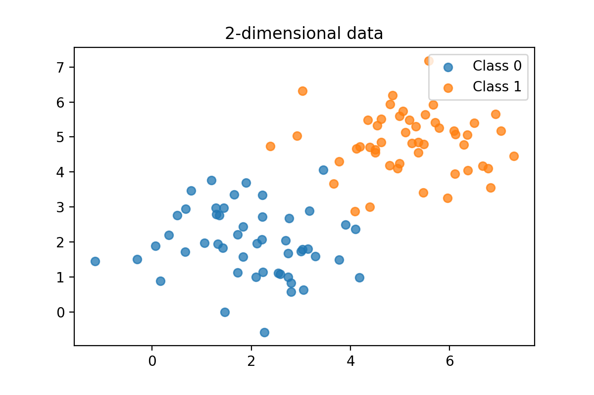
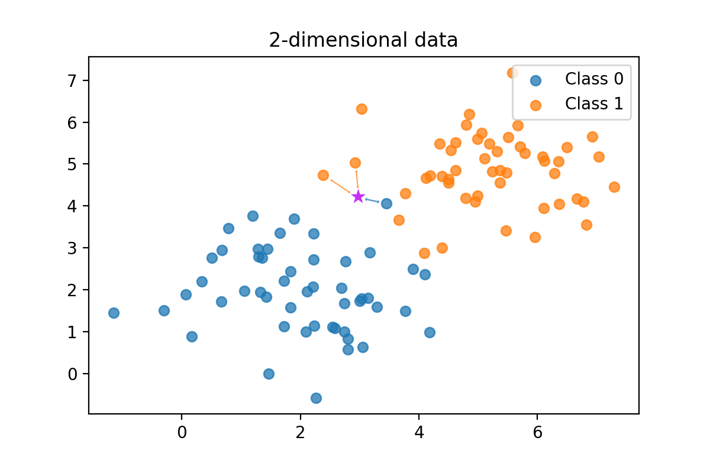
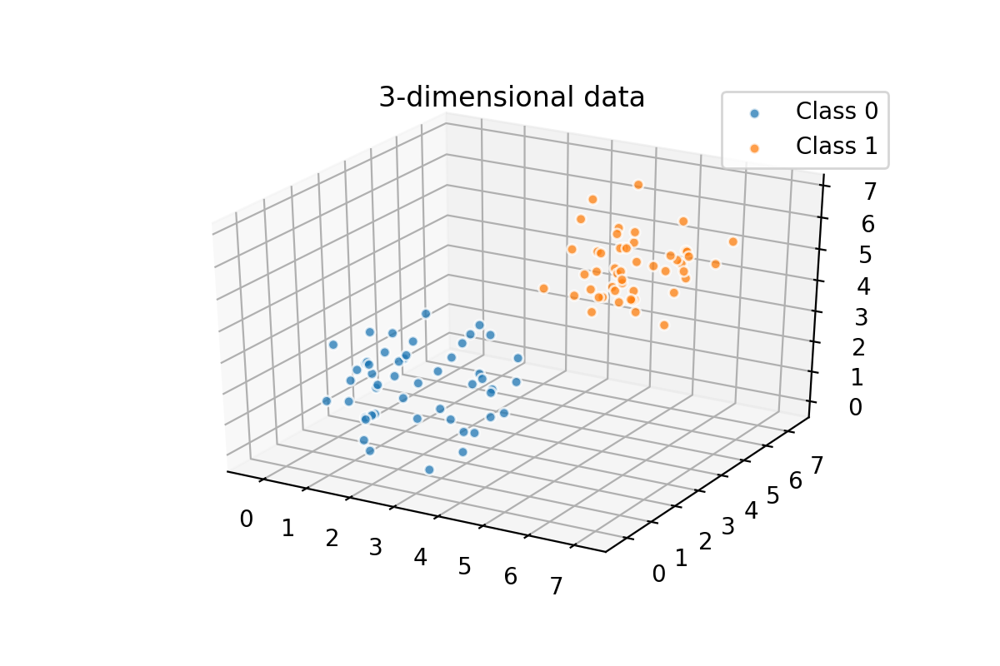
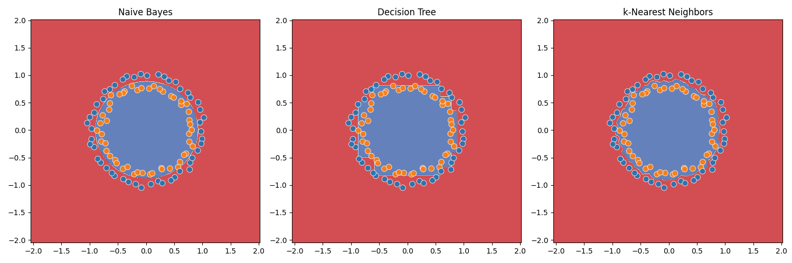

# kNN

Jos aiemmat algoritmit, Naive Bayes sekä päätöspuut ja niistä koostuvat metsät, ovat tuntuneet yksinkertaisilta, niin k-Nearest Neighbors (kNN) on vielä yksinkertaisempi. Naive Bayesin sisältyy tilastollista vaikeutta, päätöspuiden monimutkaisuus tulee informaatiotieteen käsitteistä sekä rekursiivisesta rakenteesta (eli Python-funktioista, jotka kutsuvat itse itseään). kNN on niin yksinkertainen, että sen voi selittää käytännössä kahdella kuvalla. Tässä on ensimmäinen:

## k-NN algoritmi

### 2-ulotteinen avaruus



**Kuvio 1:** *Kaksiulotteinen pistekaavio, jossa on kaksi luokkaa, sininen ja oranssi. Kuvassa on N pistettä, joista noin puolet ovat sinisiä ja noin puolet punaisia. Kuvassa on myös kaksi uutta pistettä, yksi sininen ja yksi oranssi.*

Yllä olevassa kuvassa (Kuvio 1) on kaksi suuretta, toinen x-akselilla ja toinen y-akselilla. Pisteen väri on sen label.

Algoritmi ei varsinaisesti parametrisoi mitään, vaan se tallentaa kaikki datan pisteet muistiin. Kun uusi piste tulee, se etsii `k` lähintä pistettä ja katsoo, mitä luokkaa ne ovat. Tämä prosessi on demonstroitu seuraavassa kuvassa.



**Kuvio 2:** *Uuden, aikaisemmin näkemättömän havainnon luokittelu tehdään laskemalla etäisyys aivan kaikkiin datapisteisiin. Luokaksi annetaan lähimmän kolmen koulutusdatassa olleen label (olettaen että k=3).*

Uusi piste saa saman luokan kuin sen lähimmillä pisteillä on. Algoritmin toimintaperiaate on siis äärimmäisen simppeli: *"Katso, keiden vieressä seisot, ja tiedät, kuka olet!"*. Luokittelu perustuu siis täysin euklidiseen etäisyyteen. Tässä (ks. Kuvio 2) tapauksessa `k` on 3, joten uusi sininen piste saa oranssin luokan, koska sen kaksi kolmesta lähimmästä pisteest ovat oransseja.

### N-ulottoinen avaruus

Huomaa, että kNN toimii myös N-ulotteisessa avaruudessa.



**Kuvio 3:** *Kolmiulotteinen pistekaavio ei eroa 2-ulotteisesta muuten kuin siinä, että siinä on kolmas ulottuvuus. Etäisyys on nyt (dist_x + dist_y, dist_z). Neljäs ulottuvuus olisi huomattavan vaikea visualisoida.*

!!! question "Tehtävä"

    Tutki, mihin viittaa termi "curse of dimensionality". Mitä etäisyydelle tapahtuu n-ulotteisessa avaruudessa, kun n kasvaa?


### Pythonilla

Huomaa, että mallin kouluttaminen on vain datan tallentamista. Mallin käyttäminen ennustamiseen on vain etäisyyksien laskemista ja sorttaamista. Tämä tekee kNN:stä erittäin nopean algoritmin pienellä datalla, mutta erittäin hitaan suurella datalla (ainakin ilman optimointeja). Kaava etäisyyden laskemiseen on seuraava:

$$
d(p,q) = \sqrt{(p_1 - q_1)^2 + (p_2 - q_2)^2 + \ldots + (p_n - q_n)^2}
$$

Eli pisteiden $(4,3)$ ja $(6,3)$ etäisyys on:

$$
d((4,3), (6,3)) = \sqrt{(4-6)^2 + (3-3)^2} = \sqrt{(-2)^2 + 0^2} = \sqrt{4} = 2
$$

Oletetaan, että meillä on seuraavanlainen datasetti, joka koostuu n-dimensionaalisista pisteistä (`Point([1, 2, 3, ..., n_val], label="sininen")`). Tämä nykyinen toteutus koostuu tasan 2-ulotteisista pisteistä. Katso datasetin muodostus koodista alta:

```python
from dataclasses import dataclass

@dataclass
class Point:
    features: list[float]
    label: str|None

@dataclass
class Neighbor:
    distance: float
    label: str

data = [
    Point([1, 2], 'sininen'),
    Point([2, 3], 'sininen'),
    Point([3, 4], 'sininen'),
    Point([4, 5], 'oranssi'),
    Point([5, 6], 'oranssi'),
    Point([6, 7], 'oranssi'),
]
```

Antaen tämän datan, voimme ennustaa ennen näkemättömän pisteen `(x=4.5, y=5.5)` luokan seuraavasti:

```python
from collections import defaultdict

def euclidean_distance(a:Point, b:Point):
    if len(a.features) != len(b.features):
        raise ValueError('Points must have the same number of dimensions')
    return sum((x - y)**2 for x, y in zip(a.features, b.features))**0.5

def majority_vote(neighbors:list[Neighbor]):
    votes = defaultdict(int)
    for neighbor in neighbors:
        votes[neighbor.label] += 1
    return max(votes, key=votes.get)

def predict(data:list[Point], new_point:Point, k:int, verbose=True):
    distances = []
    for point in data:
        closest = Neighbor(euclidean_distance(point, new_point), point.label)
        distances.append(closest)
    distances.sort(key=lambda x: x.distance)
    closest_k = distances[:k]
    
    if verbose:
        print(f"The {k} closest neighbors are:")
        for neighbor in closest_k:
            print(f"Distance: {neighbor.distance:.2f}, Label: {neighbor.label}")
    
    # Count the votes and return most common
    return majority_vote(closest_k)


new_point = Point([4.5, 5.5], None)
print(predict(data, new_point, k=3))
```

## Vertailu muihin algoritmeihin

Tämä on ensimmäinen algoritmi, jonka kanssa olemme tarkastelleen pistekuvaajaa (scatter plot). Nyt on hyvä aika pysähtyä ja miettiä, kuinka muut kurssilla mainitut luokittelualgoritmin jakaisivat samaa avaruutta eri luokkiin.

### Decision Tree

Jos kouluttaisit yllä näkyneellä (Kuvio 1) datalla Decision Tree, mieti, kuinka avaruutta jaettaisiin kunkin kysymyksen kohdalla. Kenties kysymykset olisivat?

* Onko x > 3.8?
    * Tämä jakaisi graafin vasen-oikeaan siten, että vasemmalla puolella olisi vain 3 oranssia, oikealla vain 4 sinistä.

Jos x oli tätä suurempi, kysymys olisi kenties:

* Onko y > 4.3?
    * Tämä jakaisi graafin ylös-alas siten, että ylhäällä olisi vain 3 oranssia, alhaalla pelkkiä sinisiä.

Decision Tree jakaisi siis avaruutta kahteen osaan, ja niitä taas kahteen osaan, kunnes lopulta laatikkoon kuuluu vain yhdenvärisiä pisteitä. Diagonaalinen jako on siis ongelmallinen, joten Decision Tree ei ole paras valinta tähän ongelmaan ilman että datalle suoritetaan jokin muunnos, kuten dimensionaalisuuden vähentäminen (PCA).

### Naive Bayes

Naive Bayes sen sijaan arvioi kunkin pisteen kohdalla, kuinka todennäköistä on, että uusi havainto kuuluu luokkaan kunkin sen piirteen perusteella. Esimerkiksi havainnon x-piirteen arvo 6 on merkittävästi todennäköisempi oranssi kuin sininen, koska oransseja on enemmän korkeilla x-arvoilla.

### Kaikki visualisoituna

Algoritmien ero tulee selväksi, kun piirrämme kuvaajaan kunkin algoritmin luokittelurajat. Kuviossa 3 on esitetty Naive Bayes, Decision Tree ja kNN:n luokittelurajat käyttäen dataa, joka on luotu Scikit Learn:n `make_circles`-funktiolla.



**Kuvio 4:** *Naive Bayes, Decision Tree ja kNN:n luokittelurajat. Naive Bayes on ympyrän muotoinen, Decision Tree on jaettu kuin Yhdysvallat osavaltioihin, ja kNN on epäsäännöllinen. Kannattaa klikata kuva auki uuteen välilehteen, jotta se näkyy suurempana.*