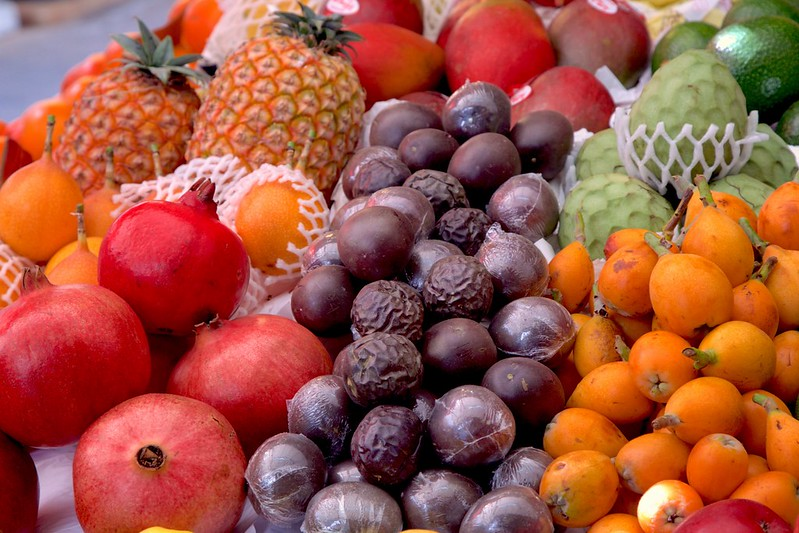
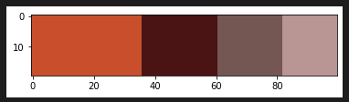
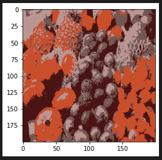

# 📝 Tehtävät

## Tehtävä: Automaattivaiheet (Pt. 2)

Käytä samaa datasettiä kuin viime viikolla. Kouluta k-NN-luokittelumalli, joka ennustaa, onko kyseessä automaattiauto. 

Huomaa, että k-NN on etäisyyksiin perustuva algoritmi. Muistahan siis normalisoida tai standardoida data ennen koulutusta! 

### Vinkit

#### k-arvo

Kokeile eri k-arvoja ja dokumentoi, mikä k-arvo tuottaa parhaan tuloksen. Tässä auttaa ns. *elbow method*, jossa piirretään k-arvojen ja mallin tarkkuuden välinen käyrä.

#### Hyödynnä vanhaa tietoa

Muistathan vertailla mallin suorituskykyä aiemmalla viikolla kouluttamaasi Decision Tree tai Random Forest -malliin.

## Tehtävä: Värikartta

Tehtävä on luoda skripti, joka luo Tikkurilan värikartan kartaisen $k$ värin kartan. Idea on, että jos haluaisit maalata huoneen annetun kuvan väreillä, malli klusteroi värit, joita sinun tulisi käyttää. Tämän viikon aikana sinun tulee tutustua RGB- ja HSV-värimalleihin, jos ne eivät ole sinulle entuudestaan tuttuja. Koneoppimisessa on kovin tyypillistä, että sinun tulee tutustua uusiin käsitteisiin, ja ymmärtää, miten ne vaikuttavat mallin toimintaan. Jos käsite on aivan vieras, voit aloittaa vaikkapa värislidereitä säätämällä esimerkiksi [colorizer.org](https://colorizer.org/) -sivustolla. 

Skriptin luomaa värikarttaa voisi myöhemmin käyttää esimerkiksi:

* Huoneen väriteeman määrittelyyn (vrt. Tikkurilan värikartat)
* Web-sivuston graafisessa ohjeistuksessa
* Elokuvan värimäärittelyn ohjenuorana

### Esimerkki



**Kuva 1:** *Terry Kearneyn kuva, otsikolla 5 A Day, on tekijänoikeusvapaa kuva ja se on ladattavissa Flickr-palvelusta: [Terry Kearney: 5 A Day](https://www.flickr.com/photos/oneterry/33886767408)*.

Jos käyttäjä valitsee yllä näkyvän kuvan (Kuva 1) ja `k=4` arvon, syntyy alla näkyvä liuska (Kuva 2).



**Kuva 2:** *Yllä näkyvän Kuvio 1:n värit jaettuna neljään klusteriin RGB:tä käyttäen. Tästä naiivista esimerkistä puuttuu vihreä kokonaan. Kenties sen kuuluisi mahtua kyytiin?*

!!! tip

    Sivutuotteena mallin luokkia voi käyttää siihen, että luot *posterisoidun* version valokuvasta. Tämä efekti, **posterize**, löytyy tyypillisistä kuvankäsittelytyökaluista kuten Photoshop tai GIMP. Voit tutustua GIMP:n dokumentaatiosta [Color Tools: 5.9 Posterize](https://docs.gimp.org/2.6/en/gimp-tool-posterize.html).

    

    **Kuva 3:** *Posterisoitu kuva kasattuna takaisin (200,200) muotoon. Jos käytät RGB-arvoja, lopputulos ei välttämättä edusta sitä, kuinka ihminen jakaisi värit. Missä on kuvasta esimerkiksi oikean ylälaidan vihreät hedelmät? Ehkä Hue-arvoa pitäisi painottaa?*

### Vinkit

#### OpenCV

Voit käyttää kuvankäsittelyyn valitsemaasi valmista kirjastoa kuten `PIL` tai `opencv`. Lisää kirjasto tutulla `uv add opencv-python` komennolla. Alla lyhyt esimerkki OpenCV:n käytöstä:

```python
import cv2
import matplotlib as plt

img = cv2.imread("to/path/fruit.jpg")

# OpenCV uses RGB channel ordering. Pyplot assumes RGB.
img = cv2.cvtColor(img, cv2.COLOR_BGR2RGB)

# Resize image to make calculations faster.
img = cv2.resize(img, (200, 200))

# In dataset, each pixel is an observation
h, w, _ = img.shape
X = img.reshape((h * w, 3))

# Display the image.
plt.imshow(img)
```

#### RGB vs. HSV

RGB on yleinen tapa esittää värit, mutta se ei välttämättä ole paras valinta, kun haluat luokitella värejä. 

Kenties haluat harkita esimerkiksi HSV:tä (Hue, Saturation, Value)? Huomaa, että pelkkä Hue-arvon käyttö ei välttämättä johda haluttuun lopputulokseen. Esimerkiksi punainen ja vaaleanpunainen ovat pelkkää Hue-lukemaa tuijottaen sama väri (eli vaaleanpunainen on punaisen sävy, engl. tint). Voi kuitenkin olla järkevää painottaa Hue-arvoa enemmän kuin Saturation- ja Value-arvoja. Kuinka tekisit tämän?

Muutos tapahtuu seuraavanlaisella snippetillä:

```python
hsv_img = cv2.cvtColor(img, cv2.COLOR_RGB2HSV)
```

Huomaa, että kuva pysyy samana: vain esitystapa muuttuu.

#### HSV syklisenä

Hue on luonteeltaan syklinen ja sen lukema edustaa asteita. Tämä tarkoittaa, että asteet 0 ja 360 ovat sama väri. Nämä skaalan ääripäät ovat sama punaisen sävy. Koska k-Means perustuu etäisyyksiin, tämä aiheuttaa ongelmia *läheisyysmittauksessa*.  Kannattaa lukea lisää esimerkiksi Medium-artikkelista [Axel Kud: Why We Need Encoding Cyclical Features](https://medium.com/@axelazara6/why-we-need-encoding-cyclical-features-79ecc3531232).

!!! tip "Vertaus kelloon"

    Tilanne on sama kuin jos vuorokaudenajan kuvaisi tunteina: 0 tuntia ja 24 tuntia ovat sama aika, eli keskiyö. Tästä huolimatta **ihmisen kokemana aikana** ajat `[23, 1]` ovat lähempänä toisiaan kuin vaikkapa `[8,16]`. Jos ajan ymmärtää lineaarisena arvona, tilanne on toinen: klo 23 ja 01 ovat 22 tunnin päässä toisistaan.

Yksi ratkaisu tähän on tehdä Hue-arvosta kaksi erillistä piirrettä: `sin_hue` ja `cos_hue`. Tämä syklinen enkoodaus onnistuu seuraavanlaisesti Pythonissa:

```python
H_max = 180 # may vary

df['sin_hue'] = np.sin(df['hue'] * (2 * np.pi / H_max))
df['cos_hue'] = np.cos(df['hue'] * (2 * np.pi / H_max))
```

Arvo `H_max` on tyypillisesti 360, mutta arvo voi riippua käytetystä kirjastosta. Esimerkiksi OpenCV käyttää Hue-arvoa, joka on välillä 0-179 (jotta se mahtuu 8-bittiseen arvoon).

#### RGB vs. LAB

Voit tutustua myös LAB- eli `CIE L*a*b*`-värimalliin, joka on suunniteltu siten, että se vastaa jossain määrin ihmisen värinäköä. Dimensiot `a` ja `b` kuvastavat skaaloja `punainen-vihreä` ja `sininen-keltainen`. Tämä tarkoittaa, että LAB-mallissa värit ovat jo valmiiksi kahdessa eri ulottuvuudessa, joten etäisyysmittaus toimii suoraan. `L` arvo on kirkkaus. Voit muuntaa RGB:n LAB:iin OpenCV:n avulla seuraavasti:

```python
lab_img = cv2.cvtColor(img, cv2.COLOR_RGB2Lab)
```

#### Kokeile eri kuvilla

Lisähaasteena on kokeilla skriptiä hieman vähemmän värikkäille kuville. Vihjeenä voit yrittää luoda filtterin, joka päästää vain tietyt ehdot täyttävät pikselit k-Means algoritmille asti. Kenties HSV:n arvot Saturation ja Value auttavat?

Ideaalitilanne on, että jos syötät mustataustaisen kuvan, jossa on 5 selkeästi eri väristä palleroa, **musta ei tule valituksi** vaan väripallerot. Kenties tässä voisi auttaa jokin maskifiltteri, joka ignooraa todella tummat tai vaaleat pikselit, tai alle 50 % saturaation arvot?