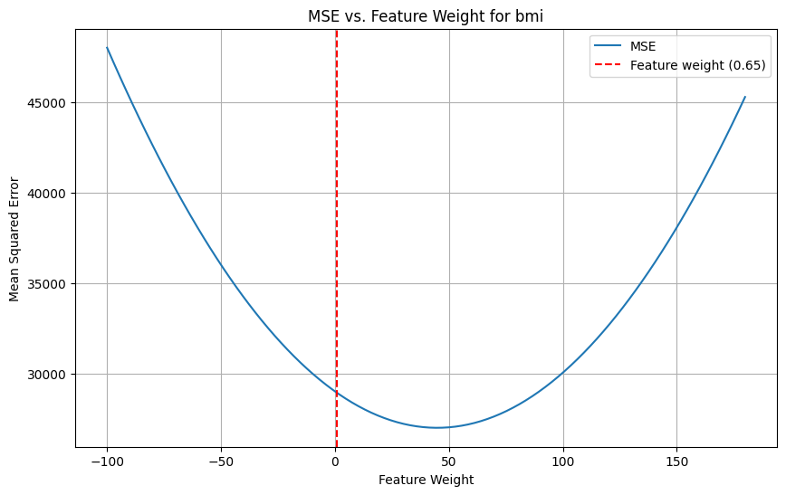
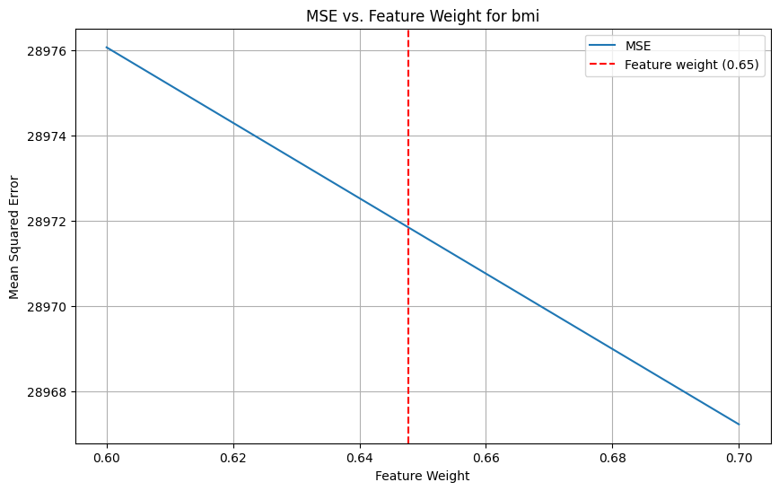
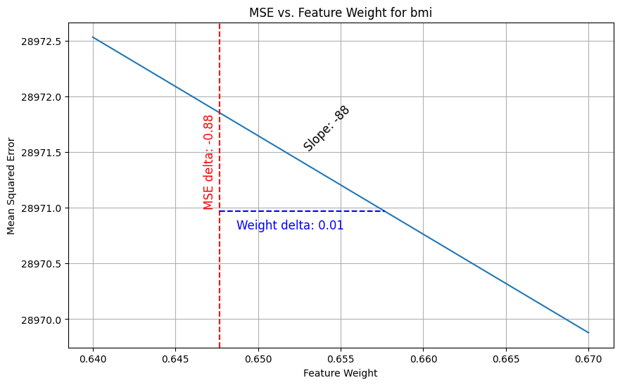
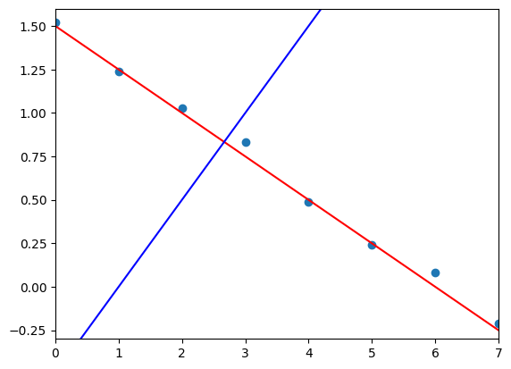
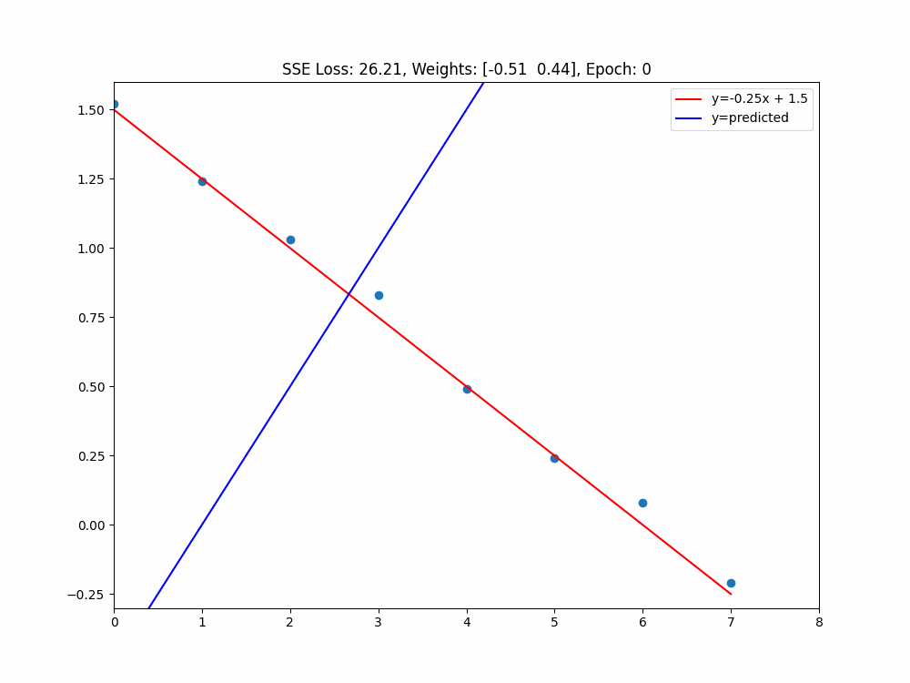
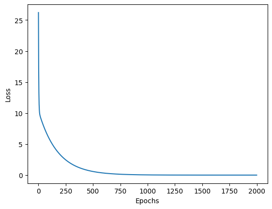
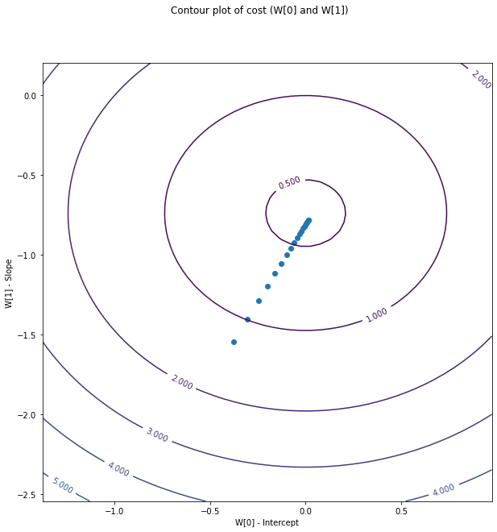

Edellisessä luvussa käsittelimme Hill Climbing algoritmia. Algoritmin koulutus koostui n-määrästä iteraatioita, joissa kussakin arvottiin sattumanvaraiset muutokset painoille ja laskettiin niiden perusteella mallin virhe. Eikö oliskin varsin kätevää, jos satunnaisuuden sijasta voisimme laskea, mihin suuntaan painoja tulisi muuttaa. Tämän meille mahdollistaa Gradient Descent algoritmi!

## Vertailu Hill Climbingiin

Gradient Descent -algoritmin koulutuksen vaiheet myötäilevät Hill Climbing -algoritmin vaiheita, mutta painojen muutokset lasketaan tavalla, joka esitellään tässä dokumentissa. Verrataan näitä vaiheita Hill Climbing -algoritmin vastaaviin taulukkomuodossa.

Muistutuksena aiemmat vaiheet olivat:

1. Alusta kertoimet satunnaisesti
2. Laske virhe
3. Lisää kertoimiin satunnaisluku (välillä ±1.0)
4. Laske virhe
5. Jos virhe pienenee, hyväksy muutos
6. Toista 3-5 kunnes pysäytyskriteeri täyttyy

| Vaihe | Hill Climbing                                 | Gradient Descent                           |
| ----- | --------------------------------------------- | ------------------------------------------ |
| 1     | Alusta kertoimet satunnaisesti                | Alusta kertoimet satunnaisesti             |
| 2     | Ennusta ja laske MSE/SSE                      | Ennusta ja laske MSE/SSE                   |
| 3     | Lisää kertoimiin satunnaisluku (välillä ±1.0) | Laske gradientti                           |
| 4     | Laske virhe                                   | Kerro gradientti oppimisnopeudella         |
| 5     | Hyväksy tai hylkää uudet kertoimet            | Päivitä kertoimet                          |
| 6     | Toista 3-5 kunnes pysäytyskriteeri täyttyy    | Toista 2-5 kunnes pysäytyskriteeri täyttyy |

Huomaa, että vaiheet ovat pääosin samat, mutta seuraavan termit saattavat olla sinulle vieraita: ==osittaisderivaatta, gradientti ja oppimisnopeus==. Näistä kaksi ensimmäistä ovat lainatut integraalilaskennasta. Tämä ei ole matematiikan kurssi, joten emme derivoi yhtäkään funktiota käsin emmekä täten tarvitse derivointisääntöjä. Keskitymme ilmiön ymmärtämiseen intuition tasolla.

## Kulmakertoimen selvittäminen

### Diabetes ja deltametodi

Tutustumme algoritmin toimintaan Scikit-learn kirjaston [Diabetes datasetin](https://scikit-learn.org/stable/datasets/toy_dataset.html#diabetes-dataset) avulla, joka sisältää 10 piirrettä (age, sex, bmi, ...). Aloitamme arpomalla kertoimet satunnaisesti (Vaihe 1). Kertoimiksi tai painoiksi valikoituvat alla näkyvässä taulukossa olevat arvot. Mallin ennuste tehtäisiin näiden painojen avulla (`y = w1*x1 + w2*x2 + ... + w10*x10`). Vektori `w` on tuttuun tapaan yhtä pitkä kuin havaintomatriisin kukin rivi eli featureiden määrä (+ bias).

| age  | sex   | bmi  | bp   | s1    | ... |
| ---- | ----- | ---- | ---- | ----- | --- |
| 0.50 | -0.14 | 0.65 | 1.52 | -0.23 | ... |

Tutustutaan kulmakerotimeen yhden piirteen avulla. Tämä piirre on `weights[2]` eli bmi eli painoindeksi (engl. body mass index). Pidämme toistaiseksi muut piirteet vakiona. Näin voimme laskea, kuinka mallin virhe (MSE) muuttuu, kun vaihdetaan arvoa valitulla välillä, joka on tässä esimerkissä etukäteen päätetty väli `-100` ja `180`. Tämä vaihteluväli on valittu siten, että graafista tulisi tässä tapauksessa mukavan symmetrinen.

```python title="IPython"
def mse_by_weight_range(feature_index, X, y, weights, values):
    mse_values = []
    weights_copy = weights.copy()

    for value in values:
        weights_copy[feature_index] = value
        y_hat = X.dot(weights_copy)
        mse = mean_squared_error(y, y_hat)
        mse_values.append(mse)

    return mse_values

feature_index = 2                      # bmi
values = np.linspace(-100, 180, 100)   # x-axis values
mse_values = mse_by_weight_range(
    feature_index, X, y, weights, values
)
```

Jos palautuneista `mse_values`-arvoista piirretään kuvaaja, saadaan paraabeli, joka kuvaa virheen muutosta `bmi`-arvon painokertoimen muuttuessa.



**Kuvio 1:** *Mallin virheen muutos painoindeksin painokertoimen muuttuessa. Nykyinen arvottu painokerroin, `0.65`, on merkattu kuvaajaan punaisena katkoviivana.*

!!! warning

    Huomaa, että vaikka kuvaajan perusteella vaikuttaa, että `weights[2] == 45` minimoi virheen, niin olisi epäoptimaalista loikata suoraan kuopan pohjalle. Yhtä muuttujaa arvioidessa muut pidetään vakiona - mutta käytännössä ne vaikuttavat kokonaisuuteen. ==Suunta== on kuitenkin todennäköisesti oikea. Tätä varten oppiminen tapahtuu pienin askelin. Tämä oppimisen nopeus on `learning_rate` ja se esitellään myöhemmin.



**Kuvio 2:** *Kuvio 1:n lähikuvaaja, jossa näkyy paremmin virheen muutos. Huomaa, että x-akseli kattaa nyt vain arvot `0.6-0.7`*



**Kuvio 3:** *Kuvio 2:n lähikuvaaja, jossa esitellään pieni delta (`+ 0.01`), ja sen vaikutus virheeseen. Virhefunktion kulmakertoimen voisi laskea myös näin. Pieni delta on valittu sattumanvaraisesti.*

Huomaa, että vaikka Kuviossa 3 käyrä näyttää ihmissilmälle suoralta, se on yhä kaareva. Mitä pienemmän deltan avulla laskemme muutoksen, sitä tarkemman arvon saamme kulmakertoimesta. Alla olevassa taulukossa näkyy kulmakertoimen laskeminen eri deltoilla. Ensimmäinen sarake on siis askeleen koko, joka otetaan Kuvion 3 x-akselilla. Valitut askeleet ovat kymmenesosia toisistaan (`10 ** -2`, `10 ** -3`, `10 ** -4`, `10 ** -5`).

| Weight delta | MSE delta | Slope         |
| ------------ | --------- | ------------- |
| 0.01000      | -0.88411  | -88.410579813 |
| 0.00100      | -0.08842  | -88.419579813 |
| 0.00010      | -0.00884  | -88.420479769 |
| 0.00001      | -0.00088  | -88.420569591 |

!!! info

    Derivointi on seuraavan otsikon aihe, mutta otetaan aikahyppy tulevaisuuteen toistaiseksi vieraan `magic()`-funktion toiminnallisuuden avulla. Toistaiseksi riittää, että hyväksyt, että `slope = magic()`-rivi palauttaa kulmakertoimen kunkin havainnon näkökulmasta. Kyseessä on osittaisderivaatta `bmi`-muuttujan suhteen.

    ```python title="IPython"
    def magic(X, y, weights):
        y_hat = X.dot(weights)
        slope = 2 * X.T.dot(y_hat - y) / len(X)
        return slope

    slope = magic(X, y, weights)[feature_index]
    print(f"Slope is: {slope:.9f}")
    ```

    ```plaintext title="stdout"
    Slope is: -88.420579813
    ```

### Feikkidata ja derivointi

Diabetes-datasetissä on merkittävä määrä muuttujia (10 kpl). Vaihdetaan yhden muuttujan ja kahdeksan havainnon `X.shape == (8, 1)` esimerkkiin matematiikan helpottamiseksi. Kun `X:ään` lisätään bias, sen muodoksi tulee `(8, 2)`. Alla koodi, jolla data on generoitu, ja X_bias-matriisi taulukkona.

```python title="IPython"
import numpy as np

# Generate reproducible noise
np.random.seed(42)
noise_delta = 0.05
noise = np.random.normal(0, noise_delta, 8).round(2)

# Data
X = np.array(list(range(8))).reshape(8, -1)

# Target 
y = -0.25*X + 1.5
y = y.flatten() + noise

# Add bias
X = np.c_[np.ones(X.shape[0]), X]

# Manually set wrong weights 
w = np.array([-0.5, 0.5])

# Predict y_hat
y_hat = np.dot(X, w)
```

1. Huomaa, että `y` on generoitu suoraan kaavalla `y = -0.25x + 1.5`.
2. Painot ovat valittu sattumanvaraisesti. Oikeat painot olisivat `[1.5, -0.25]`, koska `y = -0.25x + 1.5`.

| Havainnon # | Bias (x_0) | Feat (x_1) | y     | y_hat |
| ----------- | ---------- | ---------- | ----- | ----- |
| Ensimmäinen | 1.0        | 0.0        | 1.52  | -0.50 |
| Toinen      | 1.0        | 1.0        | 1.24  | 0.00  |
| Kolmas      | 1.0        | 2.0        | 1.03  | 0.50  |
| Neljäs      | 1.0        | 3.0        | 0.83  | 1.00  |
| Viides      | 1.0        | 4.0        | 0.49  | 1.50  |
| Kuudes      | 1.0        | 5.0        | 0.24  | 2.00  |
| Seitsemäs   | 1.0        | 6.0        | 0.08  | 2.50  |
| Kahdeksas   | 1.0        | 7.0        | -0.21 | 3.00  |

!!! note

    Huomaa, että emme skaalaa piirteitä, koska tämä on yksinkertainen esimerkki. Ethän toimi näin oikeassa elämässä!

Ennuste on luonnollisesti väärä, koska painot ovat hyvin kaukana siitä, mitä niiden pitäisi olla. Piirre itsessään tulisi kertoa `-0.25`:lla, mutta se kerrotaan `0.5`:lla. Bias tulisi kertoa `1.5`:lla, mutta se kerrotaan `-0.5`:lla. Tämä on hyvä esimerkki siitä, miten painot vaikuttavat ennusteeseen.



**Kuvio 4:** *Kuvaaja, jossa on feikkidatan datapisteet sinisinä ympyröinä, matemaattinen ideaali punaisena viivana, ja ennuste sinisenä viivana. Ennuste on merkitty sinisellä viivalla ja oikeat arvot punaisilla pisteillä.*

#### Verifioidaan deltametodilla

Voimme laskea kulmakertoimen yllä opitulla tavalla, eli tehdään pieni muutos painokertoimeen ja lasketaan virheen muutos. Tämä laskenta on alla piilotetussa solussa.

??? note "Koodi: Kulmakertoimen laskenta"

    ```python title="IPython"
    def mse(y, y_hat):
        return np.mean((y - y_hat)**2)

    def compute_slope_using_delta(X, y, w, delta=0.0000001):
        slopes = {}
        for i in range(len(w)):
            w_delta = w.copy()
            w_delta[i] += delta
            y_hat = predict(X, w_delta)
            slope = (mse(y, y_hat) - mse(y, predict(X, w))) / delta
            slopes[i] = round(slope, 2)
        return slopes

    compute_slope_using_delta(X_bias, y, w)
    ```

    ```plaintext title="stdout"
    {0: 1.2, 1: 12.01}
    ```

Tulokseksi syntyy luvut: **1.20** ja **12.01**. Ensimmäinen luku on biasin kulmakerroin ja toinen on piirteen kulmakerroin. Tarvitsemme näitä jatkossa varmentaaksemme derivoinnin oikeellisuuden.

#### SSE/MSE:n osittaisderivaatat

Sen sijaan, että derivoisimme virhefunktion käsin, käytämme sympy-kirjastoa. Käytämme virhefunktiona derivoidessa neliövirheiden summaa (SSE, Sum of Squared Errors). Tästä voi myöhemmin muuttaa MSE:n jakamalla sen havaintojen määrällä. Kyseisen kirjaston `.diff()`-metodi derivoi funktion annetun muuttujan suhteen. Tässä tapauksessa meillä on kaksi muuttujaa, painokertoimet `w0` ja `w1`.

```python title="IPython"
import sympy as sp

def solve_partial_derivative_formula():

    y, w0, w1, x0, x1 = sp.symbols('y, w0, w1, x0, x1')

    # Sum of squared errors
    cost = (y - (w0 * x0 + w1 * x1))**2 # (1)

    print(cost.diff(w0).simplify())
    print(cost.diff(w1).simplify())

solve_partial_derivative_formula()
```

1. Virhefunktio on neliösumma. Jos haluaisimme tämän keskiarvon eli MSE:n, lisäisimme jakolaskun `m`:llä, jossa `m` on havaintojen määrä. Me teemme tämän myöhemmässä vaiheessa.

```plaintext title="stdout"
2*x0*(w0*x0 + w1*x1 - y)
2*x1*(w0*x0 + w1*x1 - y)
```

!!! tip

    Joissakin materiaaleissa SSE/MSE puolitetaan, jotta derivaatasta putoaa `2 *` pois. Jos näet kirjallisuudessa kaavan kyseisessä muodossa, tässä on syy.


Nyt kun tiedämme derivaatan kaavan, voimme luoda funktion, joka suorittaa kyseisen laskennan.

```python title="IPython"
def partial_derivative_full_sse(w, x, y, feature_index, observation_index):
    # With respect to w0 or w1
    # as in: 2*x0*(w0*x0 + w1*x1 - y)
    #    or: 2*x1*(w0*x0 + w1*x1 - y)

    # Long form
    # derivative = 2 * x[feature_index] * (w[0] * x[0] + w[1] * x[1] - y[observation_index])

    # Short form
    return 2 * x[feature_index] * (np.dot(w, x) - y[observation_index])

for obs_i, x in enumerate(X):
    part_0 = partial_derivative_full_sse(w, x, y, 0, obs_i)
    part_1 = partial_derivative_full_sse(w, x, y, 1, obs_i)

    print(f"Observation {i} {x[0]=} {x[1]=} => {part_0=:.2f}, {part_1=:.2f}")
```

Raa'an tulosteen sijasta esitän saman datan taulukkomuodossa, jotta sitä on helpompi tulkita. Taulukossa on riveinä yksittäisten havaintojen derivaatat sekä näistä koostettu (engl. aggregrated) tulos. Kun tämä tulos jaetaan havaintojen määrällä, saadaan keskiarvo (engl. mean) ja tämä on osittaisderivaatta.

| X              | Derivative w_0 | Derivative w_1 |
| -------------- | -------------- | -------------- |
| [1, 0]         | -4.04          | -0.00          |
| [1, 1]         | -2.48          | -2.48          |
| [1, 2]         | -1.06          | -2.12          |
| [1, 3]         | 0.34           | 1.02           |
| [1, 4]         | 2.02           | 8.08           |
| [1, 5]         | 3.52           | 17.60          |
| [1, 6]         | 4.84           | 29.04          |
| [1, 7]         | 6.42           | 44.94          |
| ::::           | ::::           | ::::           |
| TOTAL          | 9.55           | 96.08          |
| MEAN (total/8) | 1.19           | 12.01          |


!!! tip

    Huomaa, että derivaatta tarkoittaa yksinkertaisesti kulmakerrointa. Yhden yksikön muutos painokertoimeen `w_0` aiheuttaa SSE-virheen muutoksen `9.55`, jos kaikki muu pidetään vakiona. Sama muutos `w_1`:een aiheuttaa virheen muutoksen `96.08`. MSE:n kohdalla nämä jaettaisiin yksinkertaisesti havaintojen määrällä.

Näistä osittaisderivaatoista pääsemmekin kiinni termiin `gradientti`. Gradientti on vektori, joka koostuu osittaisderivaatoista. Eli siis jos otat yllä olevasta taulukosta luvut `[9.55, 96.08]` ja muodostat niistä vektorin, se on gradientti SSE:n suhteen. Jos otat taulukosta luvut `[1.19, 12.01]`, se on gradientti MSE:n suhteen. Gradientti on siis virhefunktion kulmakerroin kunkin painokertoimen suhteen.

!!! note

    Huomaa, että nämä arvot ovat pyöristysvirheitä lukuunottamatta samat kuin yllä deltametodilla lasketut arvot.

### MSE:n vektorimuotoinen gradientti

Silmukoiden sijaan voimme hyödyntää matriisilaskentaa ja laskea gradientin joko muutamassa vaiheessa tai jopa yhdellä rivillä. Alla on kumpikin muoto esiteltynä.

```python title="IPython"
# Note that the derivate is computed as:
#
#    multiply each feature...
#     ┌───────┴──────┐
# 2 * x[feature_index] * (np.dot(w, x) - y[observation_index])
#                        └─────────────────┬─────────────────┘
#                               ...with the residuals
y_hat = X @ w
residuals = y_hat - y
sum_of_partials = 2 * X.T @ residuals

# We need to divide by the number of observations to get the mean
gradient = sum_of_partials / len(y)
print("The gradient: ", gradient)

#### OR #######
# ONE-LINER ! #
###############
gradient = 2 * X.T @ (X @ w - y) / len(y)
print("The gradient with one-liner: ", gradient)
```

```plaintext title="stdout"
The gradient:  [ 1.195 12.01 ]
The gradient with one-liner:  [ 1.195 12.01 ]
```

Nyt kun olemme laskeneet gradientin, voimme hyödyntää sitä. Meidän pitää kuitenkin vielä käsitellä aiheen viimeinen osa: oppimisnopeus.

## Oppimisnopeus

### Kakku metsän pohjalla

Kuvittele valtava, pimeä metsä. On yleisesti tiedossa, että metsän syvimmässä kohdassa on kakku :cake:. Ja sinä tietenkin haluat sen! Tehtävä olisi helppo, jos sinulla olisi kartta ja kompassi. Näitä sinulla ei ole, joten joudut luottamaan aisteihisi.

Käytät navigointiin taskulamppua :flashlight:. Taskulampun paristot ovat vähissä, joten haluat käyttää sitä mahdollisimman harvoin. Siispä valitset strategian: pysähdyt paikoillesi, laitat valon päälle, ja arvioit, missä suunnassa on alamäki. Sammutat valon, kävelet ==jonkin matkaa== alamäen suuntaan, ja toistat prosessin.


**Kuvio 5:** *Kuva henkilöstä navigoimassa pimeässä metsässä taskulampun avulla. DALL-E 3:n näkemys.*

Kun laitat valot päälle ja arvioit alamäen suunnan, saat tietää `gradientin`. Kenties rinne viettää (lat, lon) -suunnassa `1.195` ja `12.01` -asteen kulmassa. Kun alat lähestyä alamäen syvintä kohtaa, mäki oletettavasti loiventuu. Mutta kuinka kaukana olet syvimmästä kohdasta? 100 metriä? 600 kilometriä? Tätä et voi tietää, joten sinun pitää yksinkertaisesti arvata, kuinka pitkän matkan kävelet taskulampun käytön jälkeen. ==Tämä arvaus on oppimisnopeus== (engl. learning rate).

!!! question

    Jos oppimisnopeus on kävelymatka, niin mikä tässä kuvitteellisessa esimerkissä olisi hyvä vertauskuva virheelle? Kenties kaukana näkyvien puunlatvojen korkeus suhteessa sinuun? Tai ehkäpä metsän pohjalla olevan kakun hajun voimakkuus?

Lopulta koulutus on yksinkertaista: laske gradientti, kerro se oppimisnopeudella, ja päivitä painot. Toista kunnes pysäytyskriteeri täyttyy. 

```python title="IPython"
# This is what we should choose.
learning_rate = 0.01

for _ in range(n_epochs):    
        gradient = compute_gradient(X, y, w, m)

        # Compute the step : a vector containing step sizes per each weight
        step = learning_rate * gradient

        # Change the weights based on the step size
        w -= step

        # Here you would implement a stopping criterion
```

Alla 2000 epookin yli koulutettu gradient descent animaationa. Data on yllä käytettyä feikkidataa. Jos valitset liian suuren oppimisnopeuden, voit ylittää kakun ja joutua takaisin metsän reunaan. Jos valitset liian pienen oppimisnopeuden, taskulampustasi loppuu paristot ennen kuin löydät kakun.



**Kuvio 6:** *Animaatio Gradient Descent -algoritmin toiminnasta. Valittu learning rate on `0.01`. Virhe on esitetty SSE:nä, jotta se ei lähestyisi yhtä nopeasti nollaa kuin MSE.*



**Kuvio 7:** *Kuvaaja, jossa on esitetty virheen muutos koulutuksen aikana 2000 epookin yli. Virhe on esitetty SSE:nä.*



**Kuvio 8:** *Kuvaaja, jossa on esitetty virhefunktion contour plot, minkä viivat muistuttaa mukavasti kartan korkeuskäyriä. Kuva on eri esimerkistä, joten akseleiden arvot ovat väärät.*

## Lisää opiskeltavaa

Tämä materiaali on vain pintaraapaisu Gradient Descent -algoritmiin. Tutustu myös seuraaviin aiheisiin:

* **Dynaamisen oppimisnopeuden käyttö.** Oppimisnopeutta voidaan muuttaa koulutuksen aikana. Voit käyttää esimerkiksi aluksi suurempaa oppimisnopeutta ja pienentää sitä koulutuksen edetessä.
* **L1 tai L2 regularisaatio.** Regularisaatio on tekniikka, joka auttaa estämään ylifittauksen. L1 ja L2 ovat kaksi yleisintä regularisaatiotyyppiä. Esimerkiksi L2 regularisaatio on yksinkertaisimmillaan sitä, että virhefunktioon lisätään `cost = cost + reg_rate * np.sum(w**2)`, jossa `reg_rate` on regularisaatiokertoimen arvo. Lisäät siis virheeseen painojen neliöiden summan eli rankaiset mallia siitä, jos painot yrittävät poiketa liikaa nollasta (eli ovat suuria tai pieniä).
* **Stochastic Gradient Descent.** Tässä esimerkissä käytettiin koko datasettiä gradientin laskemiseen. Tämä ei ole realistista, jos dataa on aivan valtavia määriä. Stokastinen Gradient Descent käyttää yhtä havaintoa kerrallaan.
* **Mini-Batch Gradient Descent.** Tämä on kompromissi kahden edellisen välillä. Et käytä kaikki tai vain yhtä havaintoa, vaan esimerkiksi 64 satunnaisesti valittua havaintoa kerrallaan.