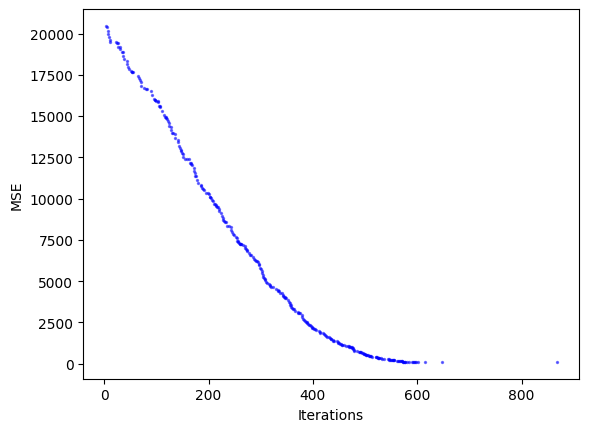
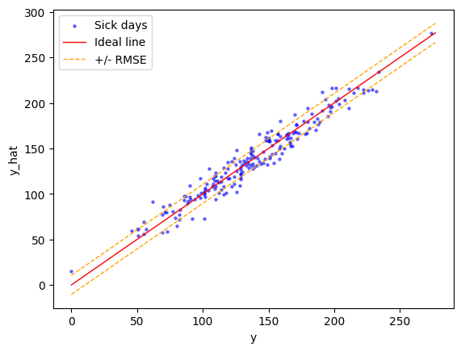

# Hill Climbing

Edellisessä luvussa käytimme normaaliyhtälöä, joka sovittaa suoran dataan yhden kaavan ratkaisuna. Tässä luvussa käsitellään optimointia toisella tavalla: Hill Climbing -algoritmilla, joka pyrkii etsimään ratkaisua iteratiivisesti eli toistamalla itseään silmukassa. Hill Climbing on tuskin tuotantokäyttöön soveltuva algoritmi, mutta se on hyvä esimerkki siitä, miten optimointi voidaan toteuttaa, ja toimii pohjustuksena Gradient Descent -algoritmille, joka on yleisempi ja tehokkaampi optimointimenetelmä. Sitä käsitellään seuraavassa luvussa.


## Hill Climbing

Optimointiin voi käyttää yllä olevan kaavan sijasta eri koneoppimisen keinoja, joista yksi on Hill Climbing. Hill Climbing on yksinkertainen algoritmi, joka pyrkii löytämään paikallisen maksimin tai minimin. Se toimii seuraavasti:

1. Alusta kertoimet satunnaisesti
2. Laske virhe
3. Lisää kertoimiin satunnaisluku (välillä ±1.0)
4. Laske virhe
5. Jos virhe pienenee, hyväksy muutos
6. Toista 3-5 kunnes pysäytyskriteeri täyttyy

Luonnollinen pysäytyskriteeri on brute force -menetelmän vuoksi `max_iter` eli iteraatioiden maksimimäärä.

Tämän yksinkertaisen metodin sijasta voisimme käyttää Gradient Descent -algoritmia, joka on tehokkaampi ja yleisempi menetelmä optimointiin. Gradient Descent on algoritmi, joka pyrkii löytämään virhefunktion minimin iteratiivisesti derivoimalla funktion ja liikkumalla vastakkaiseen suuntaan gradientin suhteen pieni askel kerrallaan. Tähän tutustutaan hyvin pintapuolisesti seuraavassa luvussa, jossa käsitellään n-uloitteista lineaarista regressiota (engl. multivariate linear regression).

!!! note

    Huomaa, että yllä olevalla algoritmilla on mitättömät mahdollisuudet onnistua, jos piirteitä ei ole normalisoitu. Tämä johtuu siitä, että suuret arvot voivat dominoivat virhefunktiota ja estää algoritmin löytämästä optimaalista ratkaisua. Lisäksi valittu satunnaisluku on todennäköisesti liian pieni, mikäli piirteet edustavat suuria arvoja (kuvittele MSE, jos kenttä sisältää lukuja, kuten `233_535.124`)

## Ongelman esittely

Kerrataan vielä tärkeät termit:

* **Virhefunktio**. Virhefunktio tai tappiofunktio mittaa mallin ennusteen virheellisyyttä. Meille on jo aiemmin tullut tutuksi MSE eli keskimääräinen neliövirhe.
* **Optimointi**. Optimointi on prosessi, jossa pyritään minimoimaan yllä mainittua virhefunktiota. Tässä luvussa käytämme Hill Climbing -algoritmia.
* **Parametrit**. Parametrit ovat mallin kertoimia, jotka määrittävät mallin käyttäytymisen. Esimerkiksi lineaarisessa regressiossa kertoimet `a` ja `b` määrittävät suoran kulmakertoimen ja vakiotermin. Nämä painot määrittävät mallin ennusteen. Yllä oleva `.fit(X, y)` laskee nämä kertoimet.

### Parametrit (W)

Keskitytään hetkeksi parametreihin eli painokertoimiin. Aiemmassa luvussa käsittelimme yksinkertaista lineaarista regressiota, jossa malli oli muotoa $y = b + wx$ (engl. univariate regression). Tässä luvussa datamme on monimuuttujaista (engl. multivariate). Tarkemmin ottaen meillä on kaksi selittävää muuttujaa: ==käärmeen pituus senttimetreinä== ja ==sään lämpötila== puremahetkellä. Satunnaiset kolme riviä dataa näyttävät tältä:

| Käärmeen mitta | Sää (°C) | Sairasloma |
| -------------- | -------- | ---------- |
| 78.38          | 32.55    | 116        |
| 300.00         | 35.00    | 196        |
| 208.11         | 0.00     | 5          |
| ...            | ...      | ...        |

!!! info

    Tavoitteena on siis oppia generalisoimaan, että jos :snake: puree sinua, sään ollessa 25.2 °C ja käärmeen ollessa 1.5 metriä pitkä, kuinkako monta sairaslomapäivää on odotettavissa.

Kahden muuttujan kohdalla suora vaihtuu tasoksi ja sen kaava on:

$$
\hat{y} = b + w_1x_1 + w_2x_2
$$

Koska muuttujia on kaksi, myös kulmakertoimia (tai muuttujien painokertoimia) on kaksi. Kirjain `b` edustaa vakiotermiä, joka on sama kuin aiemmin. Koska haluamme, että myös `b` on optimoitava parametri, lisätään se matriisiin `X` staattisena ==numerona yksi==. Kun tätä ykköstä kertoo millä tahansa painolla, tulos on aina sama kuin paino (koska `w = w * 1`). Jatkossa matriisi `X`, kun siihen lisätään vakiotermille oma sarakkeensa, on muotoa:

| x[0] | x[1]   | x[2]  |
| ---- | ------ | ----- |
| 1    | 78.38  | 32.55 |
| 1    | 300.00 | 35.00 |
| 1    | 208.11 | 0.00  |
| ...  | ...    | ...   |

Jatkossa kutakin kaikkia näitä kolmea, `x[0], x[1], x[2]`, kohden on olemassa oma kulmakerroin `w[0], w[1], w[2]`. Matriisi `X` no siis kokoa `(m, n)`, jossa `m` on piirteiden määrä ja `n` on havaintojen määrä. Vektori `w` on kokoa `(m, 1)`.

!!! tip

    Jatkossa siis `b` on `x[0]`

### Silmukassa

Tämän voi siis suorittaa silmukassa, jossa käydään kukin sample läpi, ja kerrotaan sen samplen kukin piirre sitä vastaavalla painolla (eli `x[0] * w[0] ... x[n] * w[n]`). Tämän jälkeen kaikki tulokset summataan yhteen ja saadaan ennuste. Koodina se näyttää tältä:

```python title="IPython"
from random import random

X = [
    (1, 78.38, 32.55),
    (1, 300.00, 35.00),
    (1, 208.11, 0.00),
    (1, 100.00, 7.22)
]
y = ... # Doesn't matter when predicting

m_features = len(X[0])           # 3
n_samples = len(X)               # 4
w = [random() for i in range(m)] # Randomize all three

y_hat = []
for row in X:
    y_feat = sum([row[i] * w[i] for i in range(m)])
    y_hat.append(y_feat
```

### Matriisitulona

Koska yllä esitelty operaatio on sama kuin matriisin `X` ja vektorin `w` välinen tulo, voimme korvata silmukoiden käytön vektorisoidulla operaatiolla. Tässä voit käyttää joko omaa `Vector`- ja `Matrix`-luokan toteutusta tai käyttää NumPy-kirjastoa. Jälkimmäinen on nopea ja tehokas tapa, aiempi on hyvä tapa nähdä konepellin alle. :nerd:

$$
y = Xw
$$

Käytännössä siis:

$$
Xw =\begin{bmatrix}
   1 & x_{1_1} & x_{1_2} & \cdots & x_{1_m}\\
   1 & x_{2_1} & x_{2_2} & \cdots & x_{2_m}\\
   1 & x_{3_1} & x_{3_2} & \cdots & x_{3_m}\\
   \vdots & \vdots & \vdots & \vdots & \vdots \\
   1 & x_{n_1} & x_{n_2} & \cdots & x_{n_m}\\
   \end{bmatrix}
   \dot{}
    \begin{bmatrix}
    w_0\\
    w_1\\
    w_2\\
    \vdots\\
    w_m
    \end{bmatrix}
    =
    \begin{bmatrix}
    y_1\\
    y_2\\
    y_3\\
    \vdots\\
    y_n
    \end{bmatrix}
$$

Jos yllä olevan kaavan oikealta puolelta avaa `y[1]`-ennusteen tulon kaavaksi, se on:

$$
y_1 = 1 \cdot w_0 + x_{1_1}w_1 + x_{1_2}w_2 + \cdots + x_{1_m} \cdot w_m
$$

!!! note

    Toisin kuin Pythonissa, käytämme havaintojen yhteydessä `1`-indeksiä, eli ensimmäinen havainto, `x[n]`, on `x[1]` eikä `x[0]`.


```python title="IPython"
import numpy as np

# Convert to numpy arrays
X = np.array(X)
w = np.array(w)

# Prediction is the dot product
y_hat = X @ w

# Note that
len(X) == len(y_hat) == n_samples
```

## Käärmedatan esittely

Jatkamme saman käärmeenpuremia käsittelevän kuvittelevan datan kanssa, joka yllä on esiteltynä. Havaintoja on yhteensä 200 kappaletta. Ennen kuin arvomme satunnaiset painot, tarkastellaan hieman dataa. Ensimmäiset viisi havaintoa näyttävät tältä:

```plaintext
    x[0],     x[1],        y
  220.44,    21.14,   180.00
  204.45,    15.19,   125.00
  101.48,     6.07,    55.00
  195.48,    13.35,   129.00
  184.56,    15.47,   154.00
  169.73,    10.91,    87.00
  ...        ...       ...
```

Muistutuksena `x[0]` on :snake: mitta (cm) ja `x[1]` on sää (°C). Y on sairaslomapäivien määrä. Tavoitteena on siis ennustaa sairaslomapäivien määrä käärmeen pureman jälkeen, riippuen käärmeen pituudesta ja säästä. Tarkastellaan hieman oletuksia, mitä datasta voidaan päätellä. Alla on korrelaatio-matriisi, joka kertoo, kuinka paljon muuttujat korreloivat keskenään.


**Kuvio 1:** *Seabornin heatmap-funktiolla plotattu `df.corr()` -funktion palauttama korrelaatiomatriisi paljastaa numeraalisena arvona, kuinka samat parit korreloivat keskenään.*

Korrelaatiomatsiisista on pääteltävissä, että:

* `Temperature` <=> `y` korrelaatio on 0.58
    * Sään lämpötila ja sairaslomapäivien määrä korreloivat keskenään
    * Jos sinua purraan helteellä, saat todennäköisesti enemmän sairaslomapäiviä
* `Snake Length` <=> `y` korrelaatio on 0.62
    * Käärmeen pituus ja sairaslomapäivien määrä korreloivat keskenään
    * Jos pitkä käärme puree, saat todenäköisesti enemmän sairaslomapäiviä
* `Temperature` <=> `Snake Length` korrelaatio on -0.25
    * Lämpötila ja käärmeen pituus korreloivat miedon negatiivisesti keskenään
    * Jos lämpötila kasvaa, purevan käärmeen pituus laskee.


**Kuvio 2:** *Scatter 3D -kuvaaja, joka on luotu Plotly Express -kirjastolla. Kuvaajasta on ihmissilmin pääteltävissä, mihin kohtaan taso kuuluisi piirtää.*

## Hill CLimb preparaatio

Käytetään Hill Climbing -algoritmia ensimmäisen iteraation suorittamiseen. Kuten yllä mainittiin, algoritmi aloittaa arpomalla painot satunnaisesti.

```python
w = np.array([random() for i in range(m)])
print(w)
```

| intercept (w0) | length (w1) | temp (w2) |
| -------------- | ----------- | --------- |
| 0.78           | 0.01        | 0.60      |

### Datan skaalaus

Käärmeen mitta on suuruusluokkaa 50-300, sää on 0-30. Huomaa, että virhefunktio perustuu etäisyyden neliöön, joten suuret arvot dominoivat virhefunktiota. Tämän vuoksi on tärkeää normalisoida data ennen kuin käytämme sitä: muutoin painotamme käärmeen mittaa enemmän kuin lämpötilaa.

```python title="IPython"
class StandardScaler:
    
    def standardize(self, X):
        self.mean = X.mean(axis=0)
        self.std = X.std(axis=0)
        return (X - self.mean) / self.std
    
    def revert(self, X):
        return X * self.std + self.mean

## Normalize the dataset
scaler = StandardScaler()
X_std = scaler.standardize(X)
```

Z-score -skaalaus on esitelty jo aiemmin, joten tässä materiaalissa emme perehdy sen toimintaa. Luomme luokan (ks. koodi yllä), joka sekä normalisoi että palauttaa normalisoidun datan alkuperäiseen muotoon. Skaalattu data näyttää tältä:

```plaintext
    x[0],     x[1],        y
    1.13,     0.93,   180.00
    0.74,    -0.16,   125.00
   -1.82,    -1.82,    55.00
    0.52,    -0.49,   129.00
    0.24,    -0.11,   154.00
   -0.12,    -0.94,    87.00
    2.00,     0.46,   165.00
```

### Ennusteen laskeminen

Ensimmäinen ennuste voidaan laskea siis seuraavasti:

$$
\begin{align*}
\hat{y}_1 &= (0.78 \cdot 1) + (0.01 \cdot 1.13) + (0.60 \cdot 0.93) \\ 
&= 0.79 + 0.02 + 0.56 \\
&= 1.36
\end{align*}
$$

Oikea arvo on 180.00, joten virhe on 178.64.

Voimme laskea myös seuraavien rivien ennusteet. Tämä hoituu seuraavalla koodilla:

```python title="IPython"
def predict(X, w, add_bias=True):
    if add_bias:
        bias_column = np.ones(X.shape[0]).reshape(-1, 1)
        X = np.concatenate((bias_column, X), axis=1)
    return np.dot(X, w)


w = np.array([0.78824801, 0.01379396, 0.60234906])
y_hat = predict(X_std, w, add_bias=True)

print_data(X_std, y, y_hat)
```

```plaintext title="stdout"
    x[0],     x[1],        y,    y_hat
    1.13,     0.93,   180.00,     1.36
    0.74,    -0.16,   125.00,     0.70
   -1.82,    -1.82,    55.00,    -0.33
    0.52,    -0.49,   129.00,     0.50
    0.24,    -0.11,   154.00,     0.73
   -0.12,    -0.94,    87.00,     0.22
    2.00,     0.46,   165.00,     1.09
...
```

### Virheen laskeminen

Käytämme aiemmin tuttua MSE:tä virhefunktiona. Se lasketaan seuraavasti:

```python title="IPython"
def mse(residuals):
    return sum([residual**2 for residual in residuals]) / len(residuals)

residuals = y - y_hat
print(f"MSE: {mse(residuals):.2f}")
```

```plaintext title="stdout"
MSE: 20517.29
```

## Hill Climb Silmukka

Nyt voimme suorittaa Hill Climbing -algoritmin. Olemme suorittaneet ensimmäiset vaiheet, joten jatkossa työstämme useita tuhansia kertoja vaiheet 3-5. TODO-listamme on siis:

- [x] Alusta painot satunnaisesti
- [x] Laske virhe
- [ ] Lisää painoihin satunnaisluku (välillä ±1.0)
- [ ] Laske virhe
- [ ] Jos virhe pienenee, hyväksy muutos
- [ ] Toista 3-5 kunnes pysäytyskriteeri täyttyy

```python title="IPython"
from dataclasses import dataclass

@dataclass
class Iteration:
    i: int
    MSE: float

@dataclass
class HillClimbResult:
    w: np.array
    y_hat: np.array
    iterations: list[Iteration]

def hill_climb(X, y, max_iter=10_000) -> HillClimbResult:
    beneficial_iterations = []
    best_weights = np.array([0.78824801, 0.01379396, 0.60234906])
    best_predictions = predict(X, best_weights)
    best_loss = mse(y - best_predictions)

    for i in range(max_iter):
        candidate_weights = (
            best_weights 
            + np.random.uniform(-1.0, 1.0, best_weights.shape)
        )
        candidate_predictions = predict(X, candidate_weights)
        candidate_loss = mse(y - candidate_predictions)

        if candidate_loss < best_loss:
            best_weights = candidate_weights
            best_predictions = candidate_predictions
            best_loss = candidate_loss
            beneficial_iterations.append(Iteration(i, candidate_loss))
            print(f"Loss improved at Epoch #{i}: MSE: {candidate_loss:.2f}")

    return HillClimbResult(best_weights, best_predictions, beneficial_iterations)

result = hill_climb(X_std, y)
```

```plaintext title="stdout"
Loss improved at Epoch #0: MSE: 20495.92
Loss improved at Epoch #1: MSE: 20444.31
Loss improved at Epoch #2: MSE: 20340.82
Loss improved at Epoch #4: MSE: 20304.92
...
Loss improved at Epoch #624: MSE: 109.70
Loss improved at Epoch #641: MSE: 109.69
Loss improved at Epoch #651: MSE: 109.56
Loss improved at Epoch #804: MSE: 109.54
```

!!! warning

    Huomaa, että tuloste muuttuu joka kerta kun ajat solun uudelleen. Tämä johtuu siitä, että painojen perustuu satunnaisuuteen. On siis teoriassa mahdollista, että löydät jo ensimmäisellä iteraatiolla optimaalisen ratkaisun - tai että osut jatkuvasti huonoihin painoihin, vaikka iteraatioita olisi kymmeniä tuhansia. Todennäköisyys kumpaankin näistä skenaarioista on kuitenkin pieni.

Nyt voimme tarkastella ennustettuja ja oikeita arvoja:

```python title="IPython"
print_data(X_std, y, result.y_hat) # (1)
```

1. Tätä funktiota ei ole esitelty tässä materiaalissa. Voit kokeilla luoda sen itse!

```plaintext title="stdout"
    x[0],     x[1],        y,    y_hat
    1.13,     0.93,   180.00,   180.19
    0.74,    -0.16,   125.00,   132.88
   -1.82,    -1.82,    55.00,    56.75
    0.52,    -0.49,   129.00,   118.10
    0.24,    -0.11,   154.00,   134.14
   -0.12,    -0.94,    87.00,    97.76
    2.00,     0.46,   165.00,   161.76
```

### Epookit graafina

Lopuksi voimme tarkastella virheen kehitystä iteraatiota iteraariolta, koska olemme tallentaneet hyödylliset iteraatiot `result.iterations`-muuttujaan.

```python title="IPython"
import matplotlib.pyplot as plt

for iteration in result.iterations:
    plt.scatter(iteration.i, iteration.MSE, color='blue', alpha=0.5, s=2)

plt.xlabel('Iterations')
plt.ylabel('MSE')
plt.show()
```



**Kuvio 3:** *Virheen kehitys iteraatioittain. Algoritmi laskee virheen iteraatioiden määrän funktiona.*

Tuloksen sisältämät painot, `result.w`, on lopulta esimerkiksi `array([137.42809371,   2.29821156,  42.30948618])`. Voimme käyttää tätä ennustamaan `y_hat`-arvot käyttäen `predict`-funktiota. Tämä on laskettuna jo valmiiksi `result.y_hat`-muuttujassa. Lopulta voimme tarkistaa sekä MSE:n että RMSE:n seuraavalla koodilla:

```python title="IPython"
mse_value = mse(y - result.y_hat)
print(f"MSE: {mse_value:.2f}")
print(f"RMSE: {np.sqrt(mse_value):.2f}")
```

```plaintext title="stdout"
MSE: 109.53
RMSE: 10.47
```

Huomaa, että MSE edustaa "neliöpäiviä", kun taas RMSE eli Root Mean Squared Error edustaa "päiviä". Tämä tarkoittaa, että ennusteemme on keskimäärin 10.47 päivää oikeasta arvosta.

### Ennuste graafina

Lopuksi voimme visualisoida ennusteen ja oikeat arvot. Tämä onnistuu Matplotlib-kirjastolla `plt.scatter(y, result.y_hat)`-koodia käyttäen.



**Kuvio 4:** *Ennusteen ja oikeiden arvojen vertailu. Punainen viiva kuvaa täydellistä ennustetta. Oranssi viiva on RMSE:n mukainen virhe (+-10.47 päivää).* 