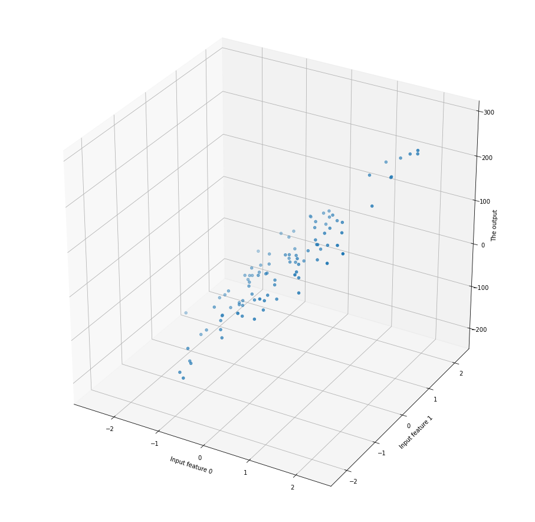

HUOM! Virhe on jo käsitelty dokumentissa [korrelaatio](../../data/korrelaatio.md). Käy kertaamassa RSME ja muut virheen mittaamisen menetelmät kyseisestä materiaalista. Alla olevissa esimerkeissä tarvitset tätä pohjatietona.

