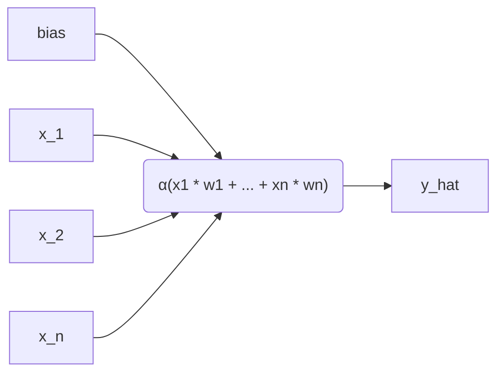
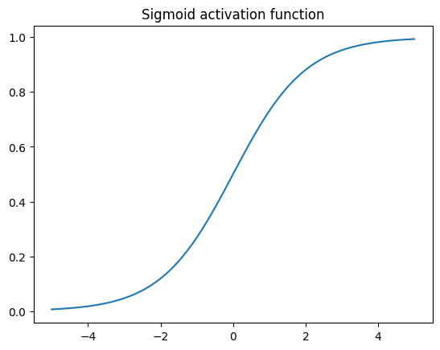
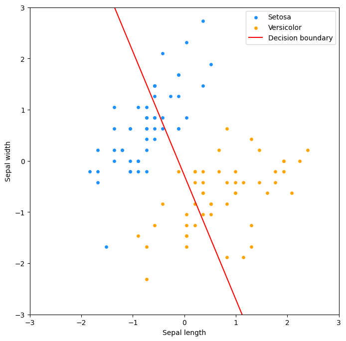
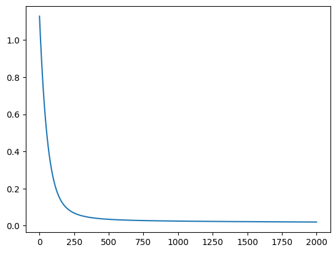
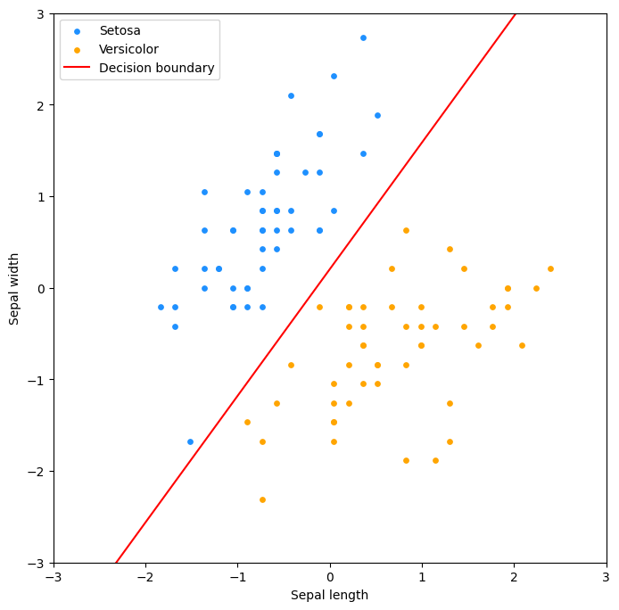

Logistinen regressio on aiemmista luvuista tuttu lineaarinen malli, mutta toisin kuten nimestä voisi päätellä, se on tarkoitettu luokittelu- eikä regressio-ongelmien ratkaisuun. Käsittelemme tällä kurssilla logistista regressiota vain pintapuolisesti, mutta on tärkeää huomata, että se on käytännössä neuroniverkon yksinkertaisin muoto. Logistinen regressio on siis yhden neuronin neuroverkko. Tulet siis kohtaamaan tämän algoritmin (tai vähintään sen monimutkaisempia muunnelmia) syväoppimista käsittelevillä kursseilla.



## Sigmoid-aktivointifunktio

Malli nuo `y_hat`-ennusteen samalla tavalla kuin aiemmin, eli `X @ w`. Erona on, että tämä ennuste syötetään logistiseen funktioon, joka palauttaa arvon väliltä 0-1. Tämä arvo voidaan tulkita todennäköisyydeksi, että havainto kuuluu positiiviseen luokkaan. Näitä logistisia funktioita kutsutaan aktivaatiofunktioiksi, ja niitä käytetään myös syväoppimisessa. Näitä ovat esimerkiksi sigmoid, relu ja tanh. Logistisessa regressiossa käytetään tyypillisissä esimerkeissä sigmoidia, joten käytämme sitä tässäkin. Neuroverkkojen yhteydessä yleisempiä ovat muut.

Tämä tehdään, koska logistinen regressio ennustaa luokan todennäköisyyttä. Olisi erikoista, jos ennuste olisi esimerkiksi 12.534, kun vaihtoehdot ovat 0 ja 1.

Jos `z` on mallin ennuste, niin logistinen funktio on seuraava:

$$
y = \sigma(z) = \frac{1}{1 + e^{-z}}
$$

Koodina sama on:

```python title="IPython"
def predict(X, w):
    return X @ w

def sigmoid(z):
    return 1 / (1 + np.exp(-z))

y_hat = sigmoid(predict(X, w))
```

Mikäli valitsemillasi painoilla, `w = [jotain, jotain, ...]`, syntyy ennuste, jonka aktivoimaton arvo on esimerkiksi 14, niin `sigmoid(14)` palauttaa arvon `0.9999991`. On loogista, että jos oikeat vastaukset ovat skaalassa `[0, 1]`, ja lineaarinen aktivoimaton ennuste olisi 14-kertainen tähän nähden, niin kyseisellä havainnolla on suuri todennäköisyys kuulua positiiviseen luokkaan. Sigmoid-aktivoinnin jälkeen tämä todennäköisyys on 99 % tässä tapauksessa.



**Kuvio 1.** Sigmoid-funktion kuvaaja välillä -5...5. Huomaa, että positiiviset luvut saavat yhä positiivisen arvon, mutta luku ei voi koskaan olla 1 tai suurempi. Vastaavasti negatiiviset luvut pysyvät negatiivisina, mutta eivät voi olla -1 tai pienempiä.

??? tip "Koodi diagrammin takana"

    ```python title="IPython"
    x = np.linspace(-5, 5, 100)
    plt.plot(x, sigmoid(x))
    plt.title("Sigmoid activation function")
    ```

Ennusteen ja aktivoinnin jälkeen, voimme laskea virheen ja päivittää painot gradientin avulla. Tämä onnistuu samalla tavalla kuin lineaarisessa regressiossa, mutta virheen laskeminen on hieman erilaista. Tappiofunktion vaihtoehtoja on useita, mutta binääristen luokitteluongelmien yhteydessä käytetään tyypillisesti ristientropiaa (engl. cross-entropy, log loss). Se on MSE:tä monimutkaisempi, joten emme derivoi sitä käsin tai SymPyllä. Käytämme kirjallisuudesta löytyviä kaavoja.

$$
\text{loss} = -\frac{1}{m} \sum_{i=1}^{m} y_i \log(\hat{y}_i) + (1 - y_i) \log(1 - \hat{y}_i)
$$

```python title="IPython"
def cross_entropy_cost(y_hat, y, eps=1e-15):
    # Avoid division by zero
    y_clip = np.clip(y_hat, eps, 1 - eps)
    
    # Number of samples
    m = len(y)
    
    # Calculate the negative log likelihood
    loss = -(1/m) * np.sum(
         y * np.log(y_clip)             # If y is 1
         + (1 - y) * np.log(1 - y_clip) # If y is 0
    ) 

    return loss
```

Kyseisen kaavahirviön gradientin kaava on:

$$
\frac{\partial \text{loss}}{\partial w} = \frac{1}{m} X^T (\hat{y} - y)
$$

```python title="IPython"
def gradient_of_cross_entropy(X, y, w):
    y_hat = predict_proba(X, w)
    m = len(y)
    
    return (1/m) * np.dot(X.T, (y_hat - y))
```

## Case: Kurjenmiekat

Scikit-learn kirjaston datasetteihin kuuluu iris-datasetti. Suomeksi iris on kurjenmiekka. Datasetistä löytyy kolmen eri kurjenmiekkalajin (iris setosa, iris versicolor, iris virginica) mittauksia. Kukin havainto koostuu neljästä piirteen arvosta: sepal length, sepal width, petal length ja petal width. Me käytämme vain kahta lajiketta: iris setosa (kaunokurjenmiekka) sekä iris versicolor (kirjokurjenmiekka). Käytämme myös vain kahta ensimmäistä piirrettä: sepal length ja sepal width eli verholehden pituutta ja leveyttä.


??? tip "Koodi datan takana"
```python title="IPython"
import numpy as np

from sklearn import datasets
from sklearn.preprocessing import StandardScaler

# Load the dataset
iris = datasets.load_iris()

# Keep only 100 first examples and only two features.
X = iris.data[:100, :2]
y = iris.target[:100]

# Perform the z-score standardization
ss = StandardScaler()
X_no_bias = ss.fit_transform(X)

# Set values
w = np.array([5.67, 2.34, 0.67])

# Add bias to X
X = np.c_[X_no_bias, np.ones(X_no_bias.shape[0])]
```

Arvomme myös alkuarvot painoille. Tässä tapauksessa käytämme arvoja `[5.67, 2.34, 0.67]`. Arvon on tarkoituksenmukaisesti valittu siten, että se on hyvin kaukana oikeasta arvosta. Lähtötilanne ei ole kolikonheiton parempi.



**Kuvio 2.** Kurjenmiekkadatan hajontakaavio. Kuvassa on kaksi lajiketta: iris setosa (sininen) ja versicolor (oranssi). Kuvassa on myös valitsemiemme painojen, vektorin `w`:n, tuottama rajaviiva, joka määrittää kumpaan luokkaan kasvi kuuluu, olettaen että `0.5` on kynnys (engl. threshold).

Voimme käyttää tuttuun tapaan gradientteja painojen säätämiseen epookki epookilta. Alla on koodi, joka hyödyntää yllä luomiamme funktioita:

```python title="IPython"
def predict_proba(X, w):
    return sigmoid(predict(X, w))

def gradient_descent(X, y, w, learning_rate=0.1, epochs=2000):
        
        # Store the cost
        costs = []
        
        # Loop over the number of epochs
        for i in range(epochs):
            
            # Calculate the prediction
            y_hat = predict_proba(X, w)
            
            # Calculate the cost using loop
            cost = cross_entropy_cost(y_hat, y)

            gradient_w = gradient_of_cross_entropy(X, y, w)
            
            # Update the weights
            w -= learning_rate * gradient_w
            
            # Store the cost
            costs.append(cost)
            
        return w, costs

w, costs = gradient_descent(X, y, w)
```

Osoittautuu, että painoilla `[ 5.67, -4.10,  0.84]` syntyy ennnuste, joka minimoi tappiofunktion - tai ainakin valitsemillamme asetuksilla eli 2000 epookilla ja oppimisnopeudella 0.1. Monimutkaisemman datan kohdalla käyttäisimme verifiointiin erillistä testidataa, ja tutkisimme mallin suorituskykyä mittareita kuten ROC-käyrää ja hämmennysmatriisia käyttäen. Koska data on poikkeuksellisen simppeliä, ja oikea vastaus on nähtävissä jokseenkin paljain silmin, voimme tyytyä tarkastelemaan mallin tuottamaa rajaviivaa sekä koulutusvirheen kehitystä epookkien yli.




**Kuvio 3.** Koulutusvirheen kehitys epookkien yli. Koulutusvirhe laskee jyrkästi ensimmäisten epookkien aikana, mutta tasoittuu lopulta. Mikäli virhe ei laskisi, valitsemamme oppimisnopeus olisi liian suuri. Jos se laskisi mitättömän hitaasti, oppimisnopeus olisi liian pieni.




**Kuvio 4.** Hajontakaaviossa raja on kääntynyt oikeaan suuntaan 2000 epookin päätteeksi.