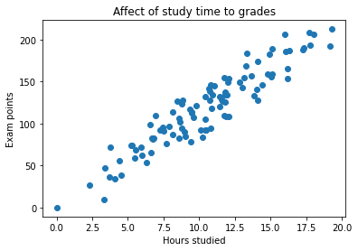
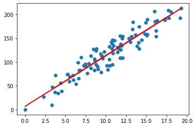
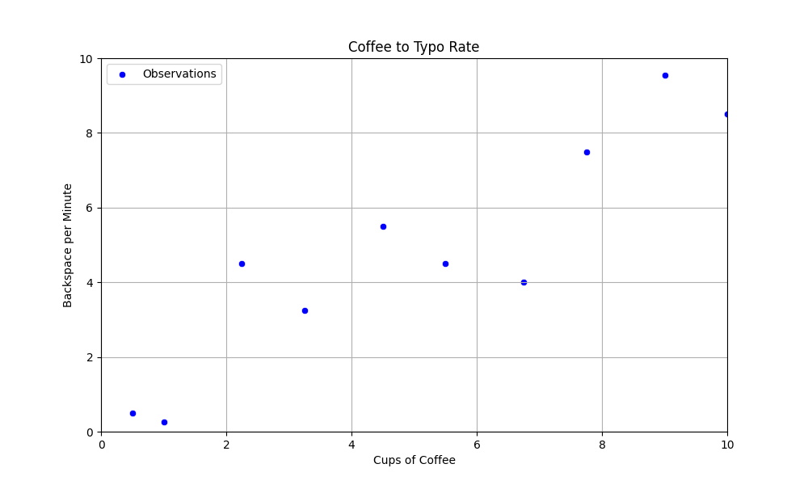
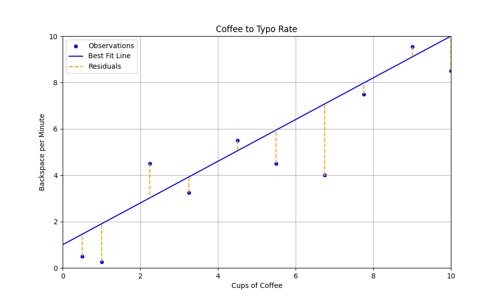
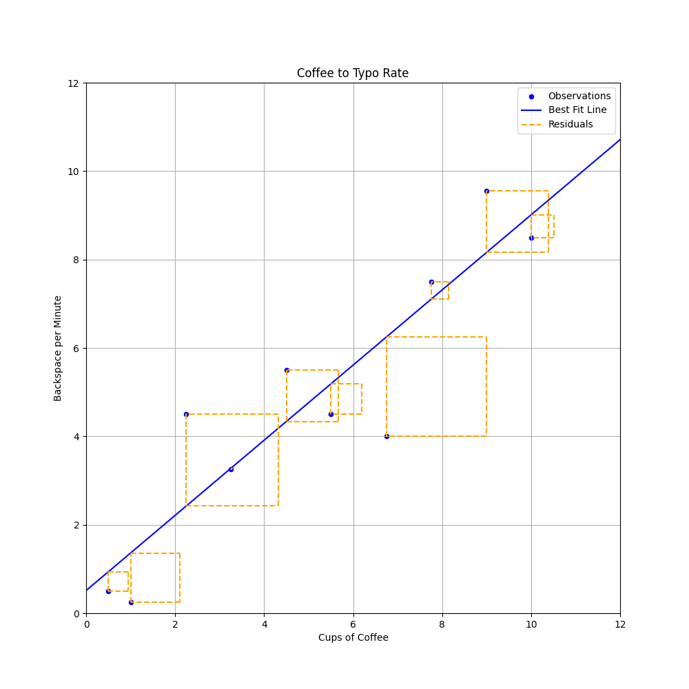
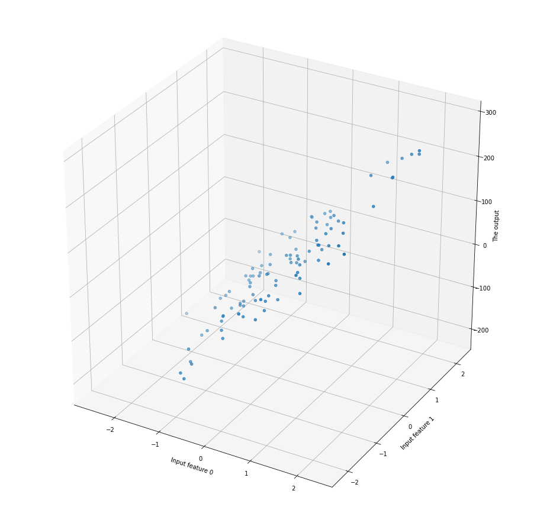

# Normaaliyhtälö

Edellisissä luvuissa olemme käyttäneet tilastotieteestä tuttuja menetelmiä, kuten Naive Bayes, luokitteluongeomien ratkomiseen. Aiemmin olemme siis pyrkineet ennustamaan, että `Onko havainto 1 vai 0` tai `Onko havainto 1, 2, 3, 4 vai 5`. Tällä kertaa ennustamme jatkuvia lukuja, joten vastaus voi olla esimerkiksi `5.5` tai `3.14159`. 

!!! tip

    Monista luokitteluun soveltumista algoritmeista, kuten kNN ja Naive Bayes, löytyy myös regressio-ongelmiin soveltuvia toteutuksia.

!!! note

    Myöhemmin tutustumme toiseen lineaariseen malliin, nimeltään logistinen regressio, joka on luokittelualgoritmi - toisin kuin nimi antaa ymmärtää. Kumpaakin näitä yhdistää lineaarisuus. Lineaarisuus tarkoittaa, että malli pyrkii löytämään suoran ==suoran== (tai tason), joka ==minimoi virheen==.


## Intuitio



**Kuvio 1:** *Opiskelun ja tenttipisteiden välisen suhteen havainnot.*

Kuvion 1 kuvitteellissa datasetissa on vain yksi ennustava muuttuja (engl. predictor) tai selittävä muuttuja (engl. independent variable), joka kuvastaa opiskeluun käytettyjä tunteja. Tämä on x-akseli. Arvo, jota pyrimme jatkossa ennustamaan, on riippuva muuttuja (engl. dependent variable) tai vastaus (engl. response). Tämä on y-akselin arvo.



**Kuvio 2:** *Opiskelun ja tenttipisteiden havaintoihin sovitettu suora.*

!!! question "Kysymys"

    Huomaa, että malli genelarisoi, eli se pyrkii ennustamaan myös sellaisia arvoja, joita se ei ole nähnyt. Mallin edustama säännönmukaisuus on kuitenkin suora; oikea data sisältää kohinaa, joka selittynee jonkin toisen muuttujan avulla. Mikä tai mitkä olisivat sopivia selittäviä muuttujia opiskelun tapauksessa?

## Kahviesimerkki

Kuvitellaan, että haluat selvittää, kuinka paljon :coffee:-kulutuksesi vaikuttaa ++backspace++ -näppäimen eli askelpalauttimen käyttöön. Asennat kahvikuppiisi sensorin, joka mittaa, kuinka monta kuppia kahvia juot päivässä. Lisäksi asennat keyloggerin, joka mittaa, kuinka monta kertaa painat backspace-näppäintä minuutissa ollessasi koodaamassa.



**Kuvio 3:** *Kahvinjuonti ja backspace-näppäimen käytön havainnot pistekuvaajana. Havaintoja on vain 10.*

### Suora

Yllä totesimme, että lineaarinen algoritmi pyrkii löytämään ==suoran==, joka minimoi virheen. Suora on matematiikasta tuttu käsite, ja sen yhtälö on:

$$
y = mx + b
$$

Yhtälön muuttujat ovat seuraavat:

* $y$ on selitettävä muuttuja (engl. dependent variable)
* $x$ on selittävä muuttuja (engl. predictor)
* $m$ on kulmakerroin (engl. slope)
* $b$ on vakiotermi (engl. intercept, y-intercept)

Saman funktion voi luonnollisesti toteuttaa myös Pythonilla. Huomaa, että me emme vielä toistaiseksi tiedä, mitkä ovat $m$ ja $b$, tai miten ne lasketaan. Tähän tutustumme seuraavaksi.

```python
def predict(x):
    m = None # We need to find this
    b = None # as well as this
    return m * x + b
```

Matematiikasta saattaa olla tuttua, että suoran vakiotermi $b$ on suoraan $y$-akselin leikkauspiste, ja kulmakerroin $m$ kertoo, kuinka paljon $y$ kasvaa, kun $x$ kasvaa yhdellä. Pikaisella silmäyksellä vaikuttaa, ihan noin silmämääräisesti, että suora voisi leikata y-akselin noin $y = 1$ kohdalla ja kulkea noin $m = 1$ kulmakertoimella: eli kun x kasvaa yhdellä, y kasvaa yhdellä. Ei kuitenkaan *ihan* näin jyrkästi, joten arvataan seuraavat arvot: $y = 0.9x + 1$. Syötetään nämä arvot funktioon ja piirretään se kuvioon.



**Kuvio 4:** *Kahvinjuonti ja backspace-näppäimen käytön havainnot sekä perstuntumalta valittu suora. Oikean Y:n ja viivan Y:n eroavaisuus on esitetty oranssina katkoviivana.*

Kuvion 3 perusteella näyttää siltä, että valitsemamme suora on ihan kohtalaisen lähellä, mutta tulevana asiantuntijana olisi hyvä kysyä, että *kuinka* lähellä se on. Tätä varten meidän pitää määritellä virhe, mikä tehdään seuraavaksi.

### Virhe

Kuten kuvasta voi silmämääräisesti päätellä, suoraa ei voi ikinä sovittaa siten, että se läpäisisi **kaikki** pisteet. Kunkin pisteen virhettä edustaa ==jäännös== (engl. residuaal) eli Kuvio 3:n oranssit katkoviivat. 

$$
residual = y_i - \hat{y}_i
$$

Yksittäinen jäännös on siis y:n todellinen arvo miinus y:n ennustettu arvo ($\hat{y}$ eli "y hat"). Intuitio kertoo, toivon mukaan, että näiden jäännösten summan minimointi on hyvä tapa löytää paras suora. Tätä prosessia kutsutaan **optimoinniksi**. Tarkastellaan yllä valitun viivan residuaaleja.

```
x[0]: -0.95
x[1]: -1.65
x[2]: +1.48
x[3]: -0.68
x[4]: +0.45
x[5]: -1.45
x[6]: -3.08
x[7]: -0.48
x[8]: +0.45
x[9]: -1.50
```

Virhettä voi mitata monella tavalla. Tässä kappaleessa käytämme yleisintä eli **MSE** (Mean Squared Error) eli keskimääräinen neliövirhe. Tällöin meidän optimoinnin tavoitteena on **pienimmän neliösumman** löytäminen (engl. least squares).

$$
MSE = \frac{1}{n} \sum_{i=1}^{n} (y_i - \hat{y}_i)^2
$$

Pythonina sama on luonnollisesti:

```python
def mse(residuals):
    return sum([residual**2 for residual in residuals]) / len(residuals)
```

Jos yllä näkyvät residuaalit syötetään yllä olevaan funktioon, saadaan seuraava tulos:

```
x[0]: -0.95 (squared: 0.90)
x[1]: -1.65 (squared: 2.72)
x[n]: ...
x[8]: +0.45 (squared: 0.20)
x[9]: -1.50 (squared: 2.25)
= MSE: 2.07
```



**Kuvio 5:** *Residuaalit neliöityinä ovat, noh, neliöitä. Huomaa, että kaavion kuvasuhdetta on muutettu verrattuna aiempiin kaavioihin, jotta neliöt näyttäisivät oikeasti neliöltä.*

Neliöity virhe penalisoi suurempia virheitä enemmän kuin pieniä virheitä. Tämä on yksi syy sille, miksi neliösummaa käytetään yleisesti lineaarisen regressiomallin optimoinnissa. Toinen syy liittyy derivoitavuuteen, mutta tähän voit tutua esimerkiksi Andrew Ng:n [Machine Learning Specialization -kurssikokonaisuudessa (Coursera)](https://www.coursera.org/specializations/machine-learning-introduction).

!!! warning

    Huomaa, että regressiomallin evaluatio ei ole yhtä suoraviivaista kuin luokittelumallin evaluointi. Luokittelumallin evaluointiin riittää, että vertaillaan ennustettuja arvoja todellisiin arvoihin: nämä ovat joko oikeassa tai väärässä. Regressiomalli ei ole binäärisesti joko oikeassa tai väärässä, vaan se ennustaa jatkuvia arvoja. Tämän vuoksi regressiomallin evaluointiin tarvitaan muita mittareita.


## Neliösumman minimointi

### Normaaliyhtälö

Ilkkan Mellin kirjoittaa [Tilastollisten menetelmien oppikirjassa (2006)](https://math.aalto.fi/opetus/sovtoda/oppikirja/Regranal.pdf), että: *"Neliösumman minimointi voidaan tehdä derivoimalla neliösumma regressiokertoimien suhteen ja merkitsemällä derivaatat nolliksi."* Tästä syntyvä kaava on seuraava:

$$
\hat{\beta} = (X^T X)^{-1} X^T y
$$

Pythonissa saman voi toteuttaa Numpyn avulla seuraavasti:

```python
import numpy as np
from numpy.linalg import inv

# Add the bias term and convert to numpy arrays
X = np.array([(*x[:-1], 1) for x in data])
Y = np.array(y)

# Calculate the coefficients
coefficients = inv(X.T @ X) @ X.T @ Y
```

Ja saman voi tietenkin toteuttaa myös Scikit-Learnin avulla:

```python
from sklearn.linear_model import LinearRegression

model = LinearRegression(fit_intercept=False)
model.fit(X, Y)
coefficients = model.coef_
```

!!! question "Tehtävä"

    Selvitä, mitkä arvot $m$ ja $b$ kahviesimerkissä saavat, kun käytät Numpy tai Scikit (tai Scipy linagl) lähestymistapaa. Laske myös virheiden MSE näitä arvoja käyttäen. 
    
    Datasetti on seuraavanlainen:

    ```python
    data = [
        (0.5, 0.5),
        (1.0, 0.25),
        (2.25, 4.5),
        (3.25, 3.25),
        (4.5, 5.5),
        (5.5, 4.5),
        (6.75, 4.0),
        (7.75, 7.50),
        (9.0, 9.55),
        (10.0, 8.5)
    ]
    ```

## Normaaliyhtälön rajoitukset

Normaaliyhtälö on tehokas tapa laskea lineaarisen regressiomallin kertoimet, mutta sillä on rajoituksensa. Normaaliyhtälö toimii epävakaasti, jos $X^T X$ ei ole kääntyvä. Tämä tilanne syntyy, jos datasetti kärsii multikollinearisuusongelmasta (engl. multicollinearity). Multikollinearisuus tarkoittaa, että kaksi tai useampi selittävä muuttujaa korreloivat keskenään, eli esimerkiksi `x[0] == x[1] * 1.5 + 0.02`. Iteratiivisten mallien regulaarisaatio (engl. regularization) auttaa tähän ongelmaan.

Toinen rajoitus liittyy tietokoneen laskentakapasiteettiin. Yllä esitellyssä kaavassa `X`:n tulee mahtua kerralla muistiin. Muut, iteratiiviset algoritmit, kykenevät jakamaan datasetin pienempiin osiin (engl. mini-batches) ja voivat täten laskea kertoimet näiden osien perusteella. Näihin iteratiivisiin tapoihin tutustutaan seuraavaksi, aloittaen todella yksinkertaisesta Hill Climbing -algoritmista ja edeten kohti Gradient Descent -algoritmia. Vaikka `X` mahtuisikin muistiin, laskennasta tulee hidasta, mikäli `n_feats` (eli selittävien muuttujien määrä) kasvaa suureksi.

Jos pohdit, mitä selittävien piirteiden lisääminen käytännössä tekee, niin se laittaa mallin sovittamaan n-ulotteiseen dataan n-ulotteisen suoran/tason. 3-ulottiseen malliin sovitettu taso näyttää esimerkiksi tältä:



**Kuvio 6:** *3-ulotteinen pistekuvaaja.*

Piirteiden määrän vaikutusta laskenta-aikaan voi testata seuraavalla koodinpätkällä:

```python
import datetime
import numpy as np
from sklearn import datasets

def run_normal_equation_n_feats(n_features, n_samples=10_000):
    # Generate
    X, y = datasets.make_regression(n_features=n_features, n_samples=n_samples, noise=15)

    # Start the timer
    start = datetime.datetime.now()
    
    # Do the math
    bias = np.ones(((n_samples,1)))
    X = np.c_[bias, X]
    theta = np.linalg.inv(X.T @ X) @ X.T @ y

    # Return the time delta between stop and start
    return (datetime.datetime.now() - start).total_seconds()

# Test with different number of features
feature_counts = [100, 1_000, 10_000]

# Store the times
times = []

for n in feature_counts:
    start = datetime.datetime.now()
    times.append(run_normal_equation_n_feats(n))
```

!!! tip

    Yllä näkyvän normaaliyhtälön vaihtoehtona on QR-dekompositio, joka on tehokkaampi suurille dataseteille. Mikäli haluat tutustua tähän, voit lukea esimerkiksi **Essential Math for Data Science** -kirjasta lisää (Thomas Nield, 2022, O'Reilly Media).

