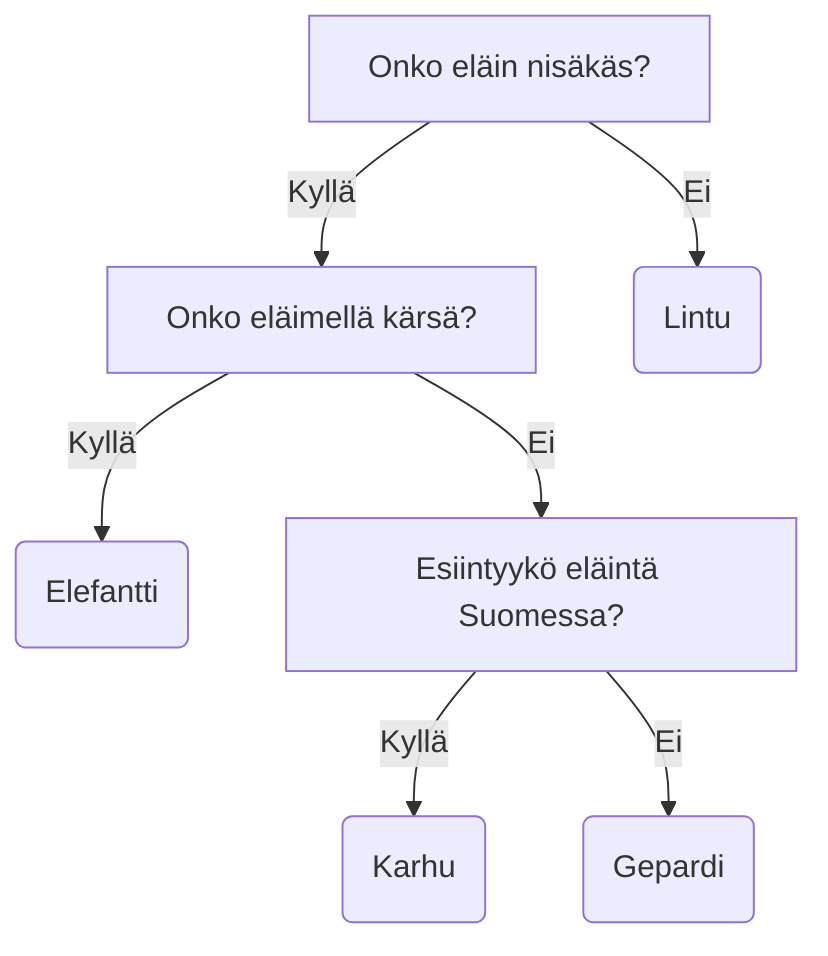

Päätöspuu (engl. decision tree) on yksinkertainen, mutta tehokas koneoppimisen työkalu. Puun rakentaminen on suhteellisen edullista (CPU/GPU-aikana) ja kysely on nopeaa. O-luku on `O(log N)`, koska taustalla on tietorakenne nimeltä binääripuu (engl. binary tree). Päätöspuu on pääasiassa luokittelualgoritmi, mutta sitä voidaan käyttää myös regressioon. Tässä materiaalissa keskitymme ensisijaisesti luokitteluun.

Päätöspuu on puun muotoon järjestetty joukko sääntöjä, jotka auttavat ennustamaan tietyn datapisteen luokan. Jokainen solmu (tai *oksan haara*) testaa tietyn arvon. Jos olet joskus pelannut "Arvaa kuka?" tai "Mikä eläin?" pelejä, konsepti on sinulle jo valmiiksi tuttu. Lopulta puu päättyy lehtiin, jotka edustavat valmiita vastauksia eli luokkia.



**Kuvio 1:** *Mikä eläin?-pelin päätöspuu, olettaen että ainoat sallitut eläimet ovat: gepardi, varis, elefantti, karhu ja leijona.*

Informaatio on tiedon yllättävyyttä (engl. surprise). Jos jokin tapahtuma on äärimmäisen epätodennäköinen, mutta tapahtuu silti, se on yllättävä (eli sisältää paljon informaatiota.) Tapahtuma "Näin eilen metsässä eläimen" ei ole laisinkaan yllättävä, mutta "Näin eilen metsässä leijonan" on erittäin yllättävä.

!!! question "Tehtävä"

    Arvaa kuka? -pelissä on kiinteä määrä hahmoja, joten oletettavasti on löydettävissä kysymysten sarja, joka johtaa oikeaan vastaukseen. Lue Rafael Prieto Curielin [Cracking the Guess Who? board game](https://chalkdustmagazine.com/blog/cracking-guess-board-game/) pohjustukseksi päätöspuille.

## Informaatioteoria

Päätöspuun rakentaminen perustuu informaatioteoriaan, joka on samalla koko IT-alan perusta. Informaatioteoriaa kehitti Claude Shannon vuonna 1948, ollessaan vasta 21-vuotias. Informaatioteoria on matemaattinen teoria, joka käsittelee informaation siirtoa ja varastointia. Noin 50-sivuinen teoria on ladattavissa PDF-muodossa ainakin [Harvardin sivuilta](https://people.math.harvard.edu/~ctm/home/text/others/shannon/entropy/entropy.pdf). Sana *bitti* (engl. bit) tulee sanoista *binary digit* ja on informaation perusyksikkö. Shannon ei kenties keksinyt sanaa, mutta hän käytti sitä ensimmäisenä julkaistussa artikkelissaan.

<iframe width="560" height="315" src="https://www.youtube.com/embed/2s3aJfRr9gE?si=uF2c5OOWPjml2rUw" title="YouTube video player" frameborder="0" allow="accelerometer; autoplay; clipboard-write; encrypted-media; gyroscope; picture-in-picture; web-share" referrerpolicy="strict-origin-when-cross-origin" allowfullscreen></iframe>

**Video 1:** *Informaatioteoriaa käsittelevä video (Khan Academy).*

### Entropia

Entropia on epävarmuuden mitta. Jos olet varma jonkin tapahtuman tuloksesta, entropia on nolla. Tätä tilannetta edustaisi esimerkiksi 6-sivuinen noppa, jossa kukin silmäluku on sama. 

Kirja *Predicting the Unknown: The History and Future of Data Science and Education*, kirjoittajana Stylianos Kampakis, vertaa informaatioteorian hyötyjä viestinnässä, signaalinkäsittelyssä ja tietojenkäsittelyssä tavallisten lauseiden ymmärtämiseen. Kohinan konseptia hän selittää tilanteella, jossa vain osa viestistä saapuu perille. Jos kuulet erittäin kohinaisen radiotiedotteen, josta erotat vain sanat "ja", "on", "että" ja "sekä", saat hyvin vähän informaatiota. Mikäli vastaanotosta sattumanvaraisesti läpi päässeet sanat ovat "kansalaisten" ja "sisätiloissa", saat enemmän informaatiota. Mikäli lähettäjä tietää viestivänsä kohinaisessa kanavassa, viestiä voi toistaa useita kertoja, jotta viestin sisältämän informaation todennäköisyys kasvaa.

Informaation ja entropian käsitteet liittyvät myös tiedostojen pakkaamiseen. Suuri pakkaamaton tiedosto, joka sisältää 75 % ykkösiä ja 25 % nollia, pakkautuu keskimäärin noin 81 %:iin alkuperäisestä koosta (`entropy([0.75, 0.25]) ~= 0.81`). Todella vähän entropiaa sisältävän merkkijonon, kuten `"spam spam spam spam "` voi pakata yksinkertaisesti `"spam " * 4`.

Shannonin artikkelissa sekä yllä olevassa videossa esitellään entropian matemaattinen kaava, joka on lauseena muotoa: entropia (`H`) on symbolien (esim. `X = x_1, x_2, ..., x_n`) todennäköisyyksien (`p_1, p_2, ..., p_3`) ja informaation sisällön (engl. information content, surprisal) `I(x_i) = log_2(1/p_i)` tulojen summa. Kaavassa käytetään logaritmin kantalukuna lukua 2. Matemaattista syntaksia käyttäen kaava on:

$$
H(X) = \sum_{i=1}^{n} P(x_i) \log_2 \frac{1}{P(x_i)}
$$

Jos korvataan `P(x_i)`:t eli symbolien todennäköisyydet `p_i`, niin:

$$
H(X) = \sum_{i=1}^{n} p_i \log_2(\frac{1}{p_i})
$$

Kaava on useissa lähteissä pyöräytetty muotoon, jossa logaritmin eteen on laitettu miinusmerkki, ja ykkösellä jaettu luku on nostettu logaritmin eteen (`-log(x) == log(1/x)`). Tällöin kaava on:

$$
H(X) = -\sum_{i=1}^{n} p_i \log_2({p_i})
$$

Entropia on siis **datan epäpuhtauden tai epäjärjestyksen mitta**. Tavoitteena on ==minimoida entropia== jakamalla data tavalla, joka erottaa luokat mahdollisimman puhtaasti. Jos sinulla on 6-sivuinen noppa, jossa on kaksi pääkalloikonia ja neljä papukaijaa, eli (:skull: :skull: :parrot: :parrot: :parrot: :parrot:), entropia olisi:

$$
H(X) = -\left( \frac{2}{6} \log_2 \frac{2}{6} + \frac{4}{6} \log_2 \frac{4}{6} \right) = 0.918
$$

Alla on esimerkkitoteutus entropiafunktiosta Python-kielellä. Huomaa, että todennäköisyyksiä voi olla useampia, mutta niiden summan tulee olla 1.0. Me käsittelemme tällä kurssilla vain binääripuita, joten todennäköisyyksiä on jatkossa vain kaksi per päätöspuun solmu. Alla oleva koodi edustaa Khan Academyn videon esimerkkiä, jossa symbolien `ABCD` todennäköisyydet ovat `[0.5, 0.25, 0.125, 0.125]`.

```python
from math import log2

def entropy(X):
    H_val = -sum([p * log2(p) for p in X if p > 0])
    return H_val

probabilities = [0.5, 0.25, 0.125, 0.125]
print("H(X) = ", entropy(probabilities))
```

!!! question "Tehtävä"

    Kokeile yllä olevaa koodia esimerkiksi todennäköisyyksillä:

    * `[0.5, 0.5]`
    * `[0.0, 1.0]`
    * `[0.75, 0.25]` # <= Eli siis 75 % ykkösiä sisältävä tiedosto
    * `[2/6, 4/6]` # <= Eli siis pääkalloja 2/6 ja papukaijoja 4/6

