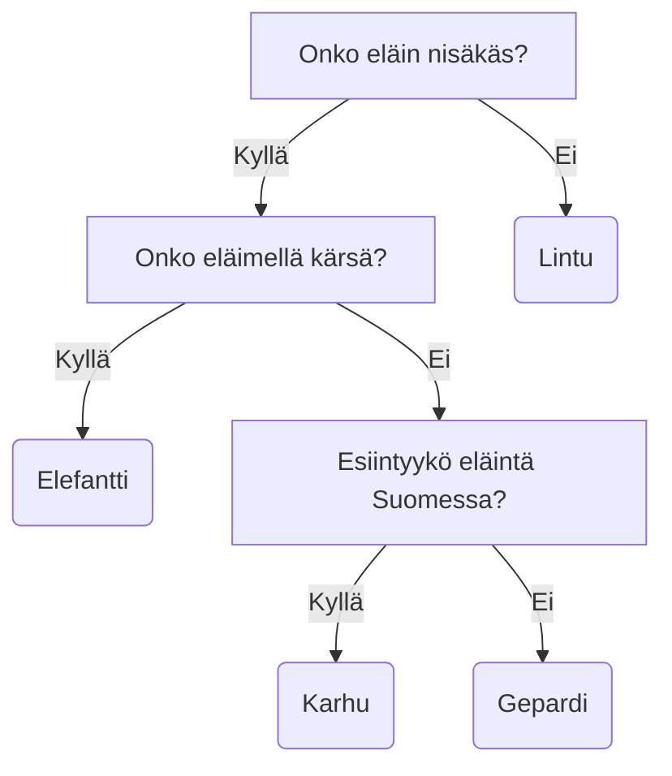

Päätöspuu (engl. decision tree) on yksinkertainen, mutta tehokas koneoppimisen työkalu. Puun rakentaminen on suhteellisen edullista (CPU/GPU-aiakna) ja kysely on nopeaa. O-luku on `O(log N)`, koska taustalla on tietorakenne nimeltä binääripuu (engl. binary tree). Päätöspuu on pääasiassa luokittelualgoritmi, mutta sitä voidaan käyttää myös regressioon, ja tässä materiaalissa keskitymme ensisijaisesti luokitteluun.

Päätöspuu on puun muotoon järjestetty joukko sääntöjä, jotka auttavat ennustamaan tietyn datapisteen luokan. Jokainen solmu (tai *oksan haara*) testaa tietyn arvon. Jos olet joskus pelannut "Arvaa kuka?" tai "Mikä eläin?" pelejä, konsepti on sinulle jo valmiiksi tuttu.



**Kuvio 1:** *Mikä eläin?-pelin päätöspuu, olettaen että ainoat sallitut eläimet ovat: gepardi, varis, elefantti, karhu ja leijona.*

!!! question "Tehtävä"

    Arvaa kuka? -pelissä on kiinteä määrä hahmoja, joten oletettavasti on löydettävissä kysymysten sarja, joka johtaa oikeaan vastaukseen. Lue Rafael Prieto Curielin [Cracking the Guess Who? board game](https://chalkdustmagazine.com/blog/cracking-guess-board-game/) pohjustukseksi päätöspuille.

## Informaatioteoria

Päätöspuun rakentaminen perustuu informaatioteoriaan, joka on samalla koko IT-alan perusta. Informaatioteoriaa kehitti Claude Shannon vuonna 1948, ja se on matemaattinen teoria, joka käsittelee informaation siirtoa ja varastointia. Noin 50-sivuinen teoria on ladattavissa PDF-muodossa ainakin [Harvardin sivuilta](https://people.math.harvard.edu/~ctm/home/text/others/shannon/entropy/entropy.pdf)

<iframe width="560" height="315" src="https://www.youtube.com/embed/2s3aJfRr9gE?si=uF2c5OOWPjml2rUw" title="YouTube video player" frameborder="0" allow="accelerometer; autoplay; clipboard-write; encrypted-media; gyroscope; picture-in-picture; web-share" referrerpolicy="strict-origin-when-cross-origin" allowfullscreen></iframe>

**Video 1:** *Informaatioteoriaa käsittelevä video (Khan Academy).*

Shannonin artikkelissa sekä yllä olevassa videossa kummassakin päädytään kaavaan, joka on lauseena muotoa: entropia (`H`) on symbolien (esim. `X = x_1, x_2, ..., x_n`) todennäköisyyksien (`p_1, p_2, ..., p_3`) ja informaation sisällön (engl. information content, surprisal) `I(x_i) = log_2(1/p_i)` summa. Käytössämme on binääripuu, joten logaritmin kantaluku on 2. Matemaattista syntaksia käyttäen kaava on:

$$
H(X) = \sum_{i=1}^{n} P(x_i) \log_2 \frac{1}{P(x_i)}
$$

Kaavasta `P(x_i)`:t eli symbolien todennäköisyydet voidaan korvata lyhyemmällä merkinnällä `p_i`, jolloin kaava on:

$$
H(X) = \sum_{i=1}^{n} p_i \log_2(\frac{1}{p_i})
$$

Kaava on useissa lähteissä pyöräytetty muotoon, jossa logaritmin eteen on laitettu miinusmerkki, ja ykkösellä jaettu luku on nostettu logaritmin eteen (`-log(x) == log(1/x)`). Tällöin kaava on:

$$
H(X) = -\sum_{i=1}^{n} p_i \log_2({p_i})
$$

Entropia on maksimoitu, kun kaikki symbolit ovat yhtä todennäköisiä. Tällöin informaatio on suurimmillaan, koska jokainen symboli on yhtä yllättävä. Minimissään entropia on, kun yhden symbolin todennäköisyys on `1.0` ja muiden `0`. Tällöin informaatio on nolla, koska symboli on täysin ennustettavissa.

```python
from math import log2

def H(X):
    H_val = -sum([p * log2(p) for p in X if p > 0])
    return H_val

# Todennäköisyydet (0.0 - 1.0)
probabilities = [0.5, 0.25, 0.125, 0.125]
print("H(X) = ", entropy(probabilities))
```

