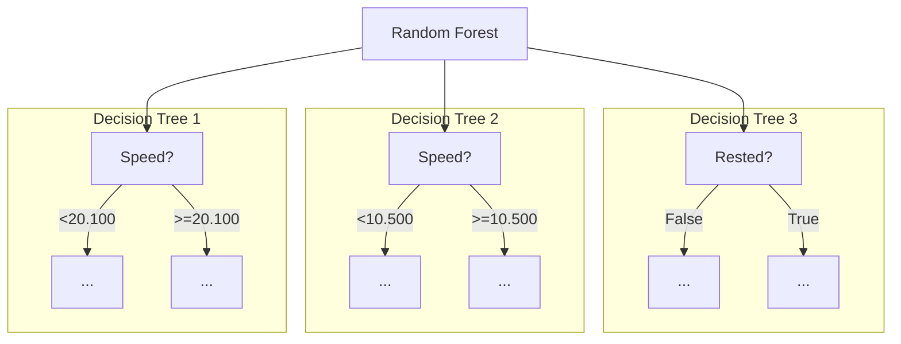
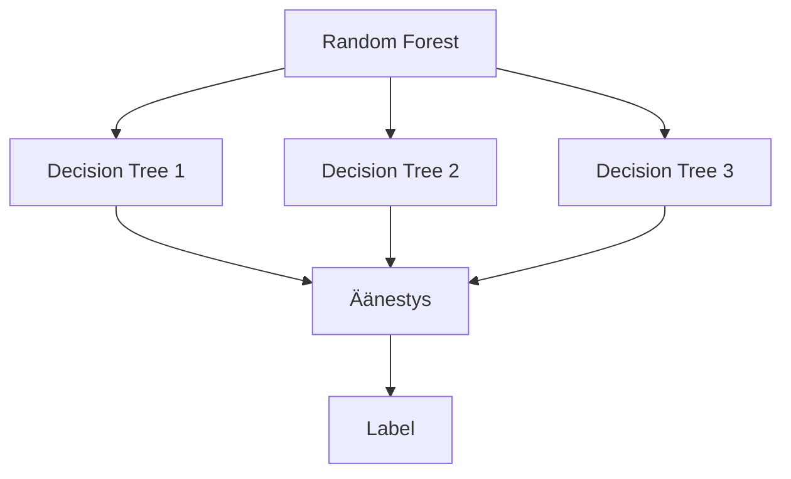
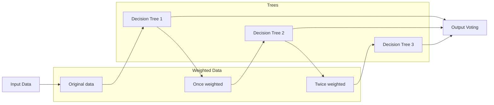

Päätöspuilla on taipumus ylisovittaa (engl. overfit) malli dataan. Tämä tarkoittaa sitä, että malli ei onnistu yleistämään (engl. generalize) sen taustalla olevaa ilmiötä vaan myötäilee dataa ulkoaopitun tarkasti. Ylisovittamista voi pyrkiä rajoittamaan Decision Tree:n oppimista parametreilla, kuten puun maksimisyvyydellä. Nämä parametrit toimivat "Early Exit"-sääntöinä puun koulutuksessa; jos puu yrittää kasvaa liian syväksi, rekursiivinen prosessi palauttaa lehden.

Toinen, hyvin yleinen tapa, parantaa päätöspuita ja muita korkean varianssin malleja on käyttää **ensemble-menetelmiä**. Ensemble-menetelmät perustuvat usean mallin yhdistämiseen yhdeksi ennustavaksi malliksi. Mikä ensemble koostuu vain ja ainoastaan puista, on tälle asialle osuva termi metsä. Koska metsän puut perustuvat satunnaiseen otantaan koulutusdatasta, tästä metsästä käytetään termiä **Satunnaismetsä** (engl. Random Forest).



**Kuvio 1:** *Esimerkki satunnaismetsästä, joka koostuu kolmesta päätöspuusta. Kukin päätöspussi saa oman otoksensa koulutusdatasta eli "pussillisen dataa".*

!!! info

    [Cambridge Dictionary](https://dictionary.cambridge.org/dictionary/english/ensemble) määrittelee ensemblen: "a group of things or people acting or taken together as a whole, especially a group of musicians who regularly play together."

    Elokuvissa ja tv-sarjojen kontekstissa ensemble on tarina, jonka päähenkilöinä on useita henkilöitä, jotka ovat yhteydessä toisiinsa. Esimerkkinä useimmat supersankarielokuvat, kuten Avengers ja Justice League, ovat ensemble-tarinoita. Myös Frendit kuuluvat tähän.

## Toimintaperiaate

Jos haluat pureutua syvälle ensemble-metodien toimintaan, etsi ja lue Dietterichin julkaisu "Ensemble Methods in Machine Learning" (2000). Voit tutustua myös Jensenin epäyhtälöön (Jensen's inequality), joka selittää, miksi keskiarvo useista sampleista on parempi kuin yksittäinen sample, mikäli funktio on alaspäin kupera eli konveksi (engl. convex).

Dietterichin julkaisu osoittaa, että useiden mallien yhdistäminen (esimerkiksi `n * päätöspuut => metsä`) johtaa parempaan suorituskykyyn kuin yksittäinen puu. Lopulta valinta tehdään demokratian keinoin: jokainen puu äänestää, ja eniten ääniä saanut `label` voittaa.



## Satunnaisuus

Satunnaismetsässä koulutusdatasta otetaan satunnainen otos kullekin puulle. Tämä tarkoittaa, että jokainen puu on erilainen, ja jokainen puu oppii eri tavalla. Tällä kurssilla käsitellään kahta seuraavaa tapaa tehdä tämä "bagging"-vaihe, jossa ota havainnoista laitetaan pussiin, osa jää pussin ulkopuolelle:

* **Random Sample** ("without replacement"): Koulutusdatasta otetaan arvottu otos, jossa ei voi esiintyä samaa havaintoa kahdesti. Havainnot siis sekoitetaan ja niistä pidetään esimerkiksi 70 % per pussi.
* **Bootstrapping** ("with replacement"): Koulutusdatan otanta arvotaan yksi kerrallaan. Tämä tarkoittaa, että sama havainto voi esiintyä useammin samassa otoksessa. Tilastollisesti on 37 % todennäköisyys, että jokin havainto ei esiinny lainkaan otoksessa eli se on "Out of Bag" (OOB).

!!! tip

    Käytännössä satunnaisuutta voi lisätä usealla eri tavalla, kuten vaikuttamalla siihen, kuinka päätöspuu valitsee jakokohdan (engl. split point), vaikuttamalla mallin näkemien featureiden määrään ja niin edelleen. Tässä materiaalissa keskitymme datasetin jakamiseen eri otoksiin.

Yllä oleva on todennäköisesti helpompi näyttää koodina kuin selittää lauseina. Kuvitellaan, että meillä on 10 rivin datasetti, joka näyttää tältä:

```python title="IPython"
data = [
    (1, "..."),
    (2, "..."),
    (3, "..."),
    (4, "..."),
    (5, "..."),
    (6, "..."),
    (7, "..."),
    (8, "..."),
    (9, "..."),
    (10, "..."),
]
```

### Python: Random Sample

Koska `random.sample(iterable, n)` palauttaa satunnaisen otoksen `n` alkioista, voimme käyttää sitä without replacement eli Random-metodin toteuttamiseen:

```python title="IPython"
import random

def sample_without_replacement(data, n):
        return random.sample(data, n)

sample_without_replacement(data, 3)
```

Random choice on käytännössä sama kuin sekoittaisi listan ja pitäisi `data[:n]`-osan. Palautuva otos, joka voi sisältää kunkin numeron vain kerran, on esimerkiksi:

```plaintext title="stdout"
[
    (4, "..."),
    (7, "..."),
    (3, "..."),
]
```

### Python: Bagging

Jos haluamme toteuttaa Bagging-metodin, voimme käyttää `random.choice(iterable)`-funktiota, joka palauttaa satunnaisen alkion datasetistä. Koska `choice` ei poista valittua alkioita, sama alkio voi esiintyä useammin samassa otoksessa:

```python title="IPython"
import random

def sample_with_replacement(data):
        return [random.choice(data) for _ in range(len(data))]

sample_with_replacement(data)
```

Huomaa, että `random.choice()` ei poista riviä datasta, joten sama rivi voi tulla vastaan `len(data)` kertaa. Palautuva otos on esimerkiksi:

```plaintext title="stdout"
[
    (4, "..."),
    (4, "..."),
    (7, "..."),
    (3, "..."),
    (2, "..."),
    (7, "..."),
    (5, "..."),
    (9, "..."),
    (2, "..."),
    (3, "..."),
]
```

Lopputuloksena:

* Seuraavat luvut esiintyvät kahdesti: 
    * `2, 3, 4, 7`
* Seuraavat luvut eivät esiinny ollenkaan: 
    * `1, 6, 8, 10`

Mikäli koulutat esimerkiksi 100 eri puuta, jokainen puu saa erilaisen otoksen datasta. Alla vielä esimerkki, kuinka tätä voisi käyttää:

```python title="IPython"
import ml.decision_tree as dt # Last lesson's implementation


data = load_imaginery_data(n=1_000_000)
trees = []
subsets = []
N_TREE = 9

# Generate N_TREE subsets
subsets = [sample_with_replacement(data) for _ in range(N_TREE)]

for subset in subsets:
    tree = dt.build_tree(subset)
    trees.append(tree)
```

## Äänestys

Yksinkertaisin tapa päättää, mikä on lopullinen ennuste, on äänestys. Jokainen puu äänestää, ja eniten ääniä saanut `label` voittaa - eli siis tilastollinen moodi eli useimmiten esiintyvä label. Yllä käytetty `N_TREE` on pariton, joten äänestyksessä ei voi tulla tasapeliä.

```python
# Imaginary test row
test_row = (1, 1, 0.12, 0, 1.23, ..., 1)

# Predict using each tree
labels = []
for tree in trees:
    label = dt.predict(tree, test_row)
    labels.append(label)

# Vote (mode)
y_hat = max(labels, key=labels.count)

# Raise AssertionError if prediction went wrong
assert y_hat == test_row[-1]
```

## Boosting

Boosting-metodit ovat ensemble-metodeja, jotka pyrkivät parantamaan mallia perustuen aiempien mallien virheisiin. Tämä tarkoittaa sitä, että jokainen puu oppii edellisen puun virheistä ja pyrkii korjaamaan ne.

Eli siis:

* Forest-tyylinen ensemblen mallit voidaan kouluttaa rinnakkain
* Boosting-tyylinen ensemblen mallit koulutetaan peräkkäin



**Kuvio 2:** *Boosting-menetelmä, jossa jokainen puu oppii edellisen puun virheistä. Kaikki puut osallistuvat ennustamiseen, mutta ovat painotettuja.*

Boosting-metodeja on useita, mutta yksi tunnetuimmista on **AdaBoost** (adaptive boosting). AdaBoost perustuu siihen, että koulutetaan `Malli X`. Tuon `Malli X`:n virheellisesti ennustamat havainnot painotetaan seuraavassa mallissa `Malli X+1`. Käytännössä meidän tulisi siis lisätä dataan paino, joka olisi pohjimmiltaan esimerkiksi `1/N`, jossa `N` on havaintojen määrä.

```python title="IPython"
X = [
    (1, 1, 12.34),
    (1, 1, 11.11),
    ...
]

base_weight = 1 / len(X)

X_with_weights = [
    (1, 1, 12.34, base_weight),
    (1, 1, 11.11, base_weight),
    ...
]
```

Ensimmäinen malli `Malli X` koulutetaan normaalisti, ja sen virheellisesti ennustamat havainnot painotetaan seuraavassa mallissa `Malli X+1`. Tämä prosessi jatkuu, kunnes saavutetaan `M` mallia. Seuraavan mallin data voisi siis olla jotain seuraavaa, olettaen että `x_2` on virheellisemmin ennustettu kuin `x_1`:

```python title="IPython"
X_for_next_model = [
    (1, 1, 12.34, 0.011),
    (1, 1, 11.11, 0.025),
    ...
]
```

Muita tunnettuja boosting-metodeja ovat esimerkiksi **Gradient Boosting** ja **XGBoost**.
