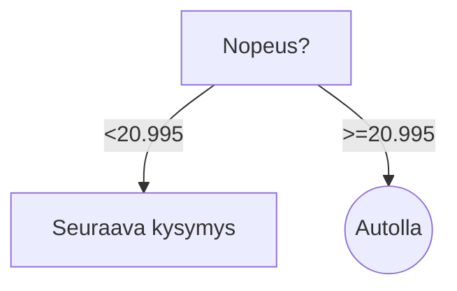
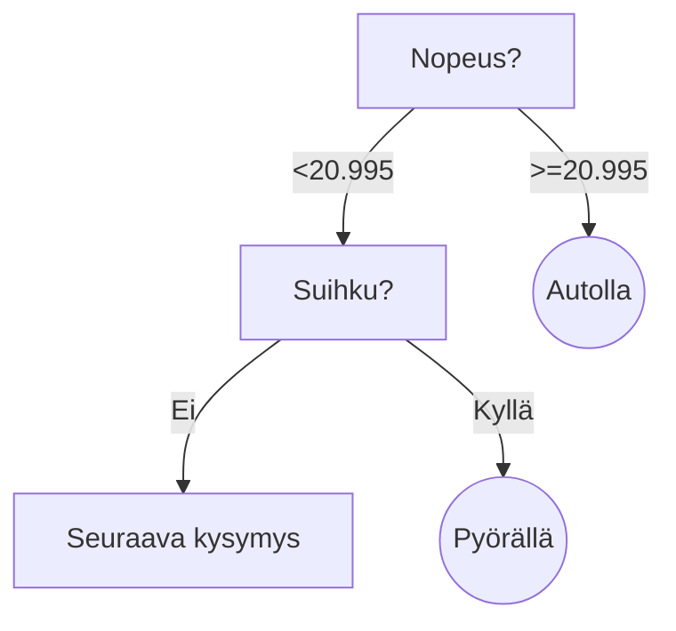
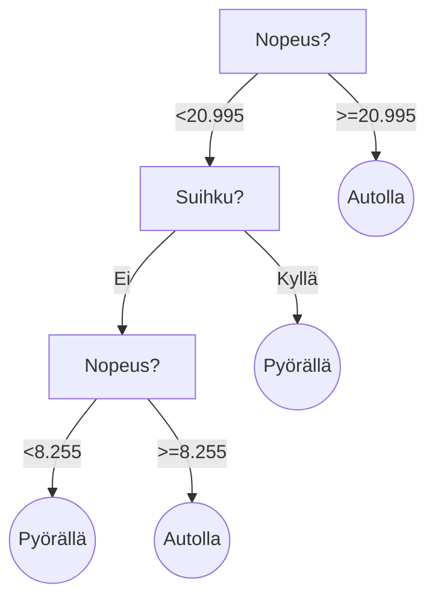
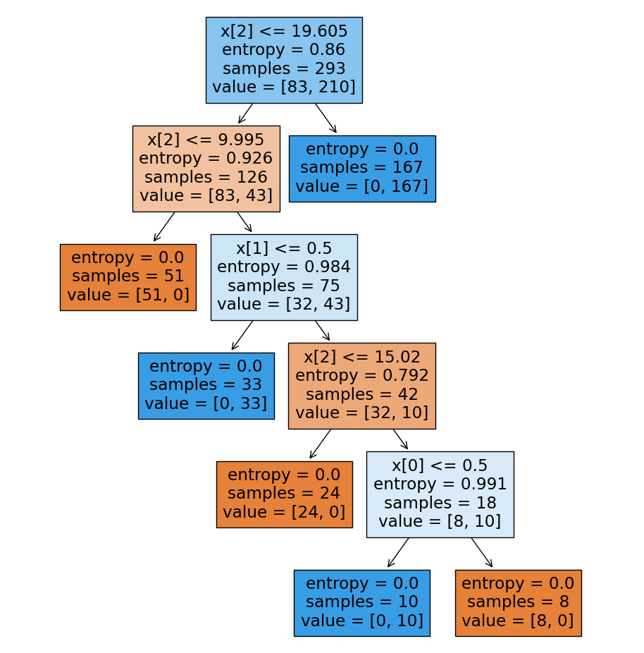

Aiemmassa osiossa esitelty entropia on päätöspuun rakentamisen keskeinen käsite. Entropia on datan epäpuhtauden tai epäjärjestyksen mitta. Tavoitteena on ==minimoida entropia== jakamalla data tavalla, joka erottaa luokat mahdollisimman puhtaasti. Tässä osiossa tutustutaan siihen, kuinka kunkin oksan informaation kasvu lasketaan: eli siis, kuinka valitaan paras ominaisuus, jolla data jaetaan.

Arvaa kuka?-pelin logiikassa tämä olisi parhaan kysymyksen valinta. Kuvitellaan, että olemme luomassa koneoppimismallia, joka pyrkii ennustamaan, että *"Onko kysyjän valitsema hahmo naisoletettu"*. Yksinkertaisuuden vuoksi pelissä on leikisti vain 5 eri featurea (`parta|silmälasit|hattu|pitkät hiukset|kauluspaita`). Alla on kuvitteellinen esimerkki ensimmäisen kysymyksen valinnasta:

- [x] Onko hänellä parta? (Score: 0.44)
- [ ] Onko hänellä silmälasit? (Score: 0.33)
- [ ] Onko hänellä hattu? (Score: 0.22)
- [ ] Onko hänellä pitkät hiukset? (Score: 0.11)
- [ ] Onko hänellä kauluspaita? (Score: 0.00)

Kukin kysymys jakaisi datasetin kahteen osaan: heihin joilla tämä piirre on, ja heihin, joilta se puuttuu. Meidän kuvitteellisen Arvaa kuka?-pelin datasetissä ei ole laisinkaan parrakkaita naisia, mutta on useampi parraton jotakin muuta sukupuolta edustava henkilö. Jako tapahtuisi seuraavalla tavalla:

```python title="IPython"
# Input Data
#
#        the rest with beards                     women without beards
#        ┌────────┴─────────┐            ┌──────────────────┴──────────────────┐                     
label = [0, 0, 0, 0, 0, 0, 0, 0, 0, 0, 0, 1, 1, 1, 1, 1, 1, 1, 1, 1, 1, 1, 1, 1]
beard = [1, 1, 1, 1, 1, 1, 1, 0, 0, 0, 0, 0, 0, 0, 0, 0, 0, 0, 0, 0, 0, 0, 0, 0]
#                            └─────┬────┘
#                       the rest without beards

# Split the data into two partitions by beardedness
beardless = [label for label, beard in zip(label, beard) if not beard]
bearded   = [label for label, beard in zip(label, beard) if beard]

#        the rest without beards
#             ┌────┴───┐
# beardless: [0, 0, 0, 0, 1, 1, 1, 1, 1, 1, 1, 1, 1, 1, 1, 1, 1]
# bearded:   [0, 0, 0, 0, 0, 0, 0]
#             └────────┬────────┘
#            the rest with beards

# Compute the entropy after the split
score = some_magic_function(label, beardless, bearded)
print(f"Score: {score:.2f}")
```

```plaintext title="stdout"
Score: 0.44
```

!!! warning

    Huomaa, että tämä esimerkki ei ota kantaa siihen, mikä on nainen tai voiko naisella olla partaa. Tässä **Arvaa Kuka?-tyylisen, kuvitteellisen pelin populaatiossa** esiintyy vain kahta luokkaa: `0` ja `1`, joista luokka `1` ovat naiseksi identifioituvat henkilöt. Luokka 0 ovat kaikki muut sukupuolet ("the rest").

Tarkkasilmäinen huomaa, että esimerkissä on käytetty `some_magic_function`-funktiota, jota ei ole vielä esitelty. Se on funktio, joka laskee informaation kasvun (yllä ympäripyöreästi *"score"*). Aiemmin esitelty entropia on yksi osa informaation kasvun laskemista. Tähän kaavaan tutustutaan alla.

## Informaation kasvu

Informaation kasvu (engl. information gain) on päätöspuun rakentamisen keskeinen käsite. Se on laskettu erotuksena vanhemman solmun (engl. parent node) entropiasta ja painotetusta keskiarvosta sen lasten (engl. child nodes) entropioista. Mitä suurempi informaation kasvu, sitä parempi, koska se osoittaa, että datan jakaminen valitun ominaisuuden perusteella vähentää epävarmuutta kohdearvosta. Yllä olevassa esimerkissä parrakkuus on hyvä valinta, koska se tuottaa suuremman informaation kasvun kuin muut ominaisuudet (kuten silmälälasit tai hattu).

Kaava on:

$$
IG(S, a) = H(S) - H(S|a)
$$

Tämä voidaan kirjoittaa auki muotoon:

$$
IG(S, a) = H(S) - \sum_{v \in values(a)} \frac{|S_{v}|}{|S|} H(S_{v})
$$

Missä:

* $H(S)$ : on vanhemman solmun entropia (eli `y`-arvojen entropia)
* $a$ : on valittu ominaisuus eli piirre
* $v \in values(a)$ : on ominaisuuden $a$ mahdolliset arvot
* $S_v$ : on S:n data niissä indekseissä, joissa $a$ on $v$ (`child1` tai `child2`)
* $H(S_v)$ : on lasten solmun $v$ entropia

Kaavassa pystypalkit $|S|$ ja $|S_v|$ tarkoittavat joukon kardinaalisuutta, eli kuinka monta alkiota joukossa on. Käytännössä se on sama asia kuin `len(X)`. Jakolaskun tulona on siis: *"Kuinka suuri osa piirteen $a$ arvoista on $v$"*. 

Python-koodina informaation kasvun laskeminen näyttää tältä:

```python title="IPython"
def class_probabilities(values):  # What's this?(1)
    n = len(values)
    zeros = values.count(0)
    ones = values.count(1)
    return [zeros / n, ones / n]

# This is the some_magic_function() from the previous example
def information_gain(parent, child1, child2):
    
    # H(S) - Entropy of parent node
    H_S = entropy(class_probabilities(parent))

    # |S| - Cardinality of parent node
    n = len(parent)
    
    # S_v - Data of each child node
    S_v = [child1, child2]

    # |S_v| - Cardinality of each child node
    n_S_v = [len(v) for v in S_v]

    # H(X_v) - Entropy of each child node
    H_S_v = [entropy(class_probabilities(v)) for v in S_v]

    # Formula
    IG = H_S - sum([n_S_v[i] / n * H_S_v[i] for i in range(len(S_v))])

    return IG

# Dataset X
X = [
#   x0, x1, y
    (1, 1, 0),  #  ┌─────> x[0] => 1/3 equals true
    (1, 1, 1),  #  │
    (1, 1, 0),  #  ┘ ┌───> x[1] => 3/5 equals true
    (0, 1, 1),  #  ──┤
    (0, 0, 0),  #    │
    (0, 1, 1),  #  ──┘
    (0, 0, 0)
]

n_columns = len(X[0]) - 1

for i in range(n_columns):
    parent = [row[-1] for row in X]
    child1 = [row[-1] for row in X if row[i] == 1]  # v in values(a) == 1
    child2 = [row[-1] for row in X if row[i] == 0]  # v in values(a) == 0

    ig = information_gain(parent, child1, child2)
    print(f"Column {i} information gain: {ig:.2f}")
```

1. This function returns a list of two probabilities. A probability of class 0 and probability of class 1.
    ```python
    assert class_probabilities([0, 0, 1, 1, 1]) == [0.4, 0.6]
    ```

Koosteena:

* Matala entropia (tai korkea puhtaus) on toivottavaa jokaisessa puun solmussa.
* Korkea informaation kasvu osoittaa, että valittu ominaisuus tarjoaa hyödyllistä tietoa datan jakamiseen ja on siksi toivottava päätöspuun rakentamiseen.

## Esimerkki: Pyörällä vai autolla?

Luodaan päätöspuu, joka pyrkii generalisoimaan kulkuvälineen valinnan päätöspuun avulla. Huomaa, että tässä esimerkissä saatetaan käyttää joitakin pseudofunktioita, joita ei olla käytännössä määritelty missään. Tarkoituksena on havainnollistaa informaation kasvun laskemista; varsinainen käyttövalmiimpi koodi on muualla harjoitustehtävissä esillä. Tuotantoon soveltuvaa koodia emme kirjoita laisinkaan tämän kurssin aikana: käytä tähän Scikit-learn-kirjastoa.

### Datan esittely

Datasettiin kuuluu 4 saraketta (eli piirrettä, *featurea*) ja 16 riviä (eli havaintoa, *observation*). Sarakkeet ovat:

* Olen levännyt (0 = False, 1 = True)
* Määränpäässä on suihku (0 = False, 1 = True)
* Minimivauhti, jolla ehtisin perille. (x.xx km/h)
* Havainnossa on menty autolla (0 = False, 1 = True)

Viimeinen sarake on se label, jota me yritämme ennustaa. Datasetti näyttää tältä:

| im_well_rested | dst_has_shower | required_speed | go_by_car |
| -------------- | -------------- | -------------- | --------- |
| 0              | 0              | 10.63          | 1         |
| 1              | 1              | 71.09          | 1         |
| 0              | 1              | 42.95          | 1         |
| 1              | 0              | 24.53          | 1         |
| 1              | 0              | 53.66          | 1         |
| 0              | 1              | 71.79          | 1         |
| 1              | 0              | 5.88           | 0         |
| 1              | 1              | 57.5           | 1         |
| 0              | 0              | 25.32          | 1         |
| 1              | 0              | 34.39          | 1         |
| 1              | 1              | 56.91          | 1         |
| 1              | 0              | 64.6           | 1         |
| 1              | 1              | 17.46          | 0         |
| 0              | 1              | 87.61          | 1         |
| 1              | 0              | 14.2           | 1         |
| 1              | 1              | 8.28           | 0         |


### Datan luomiskertomus

Havaintoavaruuden kolme ensimmäistä saraketta (eli piirteet) on generoitu satunnaislukuja käyttäen. Viimeinen sarake, eli label `go_by_car`, on generoitu seuraavalla logiikalla:

```python title="IPython"
transportation_mode = np.where(
    (required_speed > 20) |
    ((well_rested == 0) & (required_speed > 15)) |
    ((has_shower == 0) & (required_speed > 10)),
    1, 0
)
```

Lauseena `go_by_car`-sarakkeen logiikka on: **mene autolla, jos** jokin seuraavista on totta:

* Vaadittu nopeus on 20 km/h
* En ole levännyt ja vaadittu nopeus on 15 km/h
* Määränpäässä ei ole suihkua ja vaadittu nopeus on 10 km/h

### Juuritason solmun valinta

Varsinainen koodi kannattaa kirjoittaa rekursiiviseksi, koska kunkin oksanhaaran kohdalla logiikka on tismalleen sama. Tässä esimerkissä työ tehdään kuitenkin käsin, jotta vaiheet tulevat selvästi esille. Ensimmäinen solmu valitaan laskemalla informaation kasvu jokaiselle piirteelle ja valitsemalla suurin informaation kasvu.

!!! tip

    Kuljettu polku selviää muuttujan nimestä. Esimerkiksi `root_l_r_r` on päätöspuun polku, jossa dataa on jaettu ensin vasemmalle, sitten oikealle ja lopuksi taas oikealle.

Alla olevassa koodissa `find_max_column_information_gain()`-funktio laskee informaation kasvun jokaiselle piirteelle (levänneisyys, suihkullisuus ja nopeus) ja palauttaa suurimman informaation kasvun tuottavan sarakkeen indeksin. Tämän jälkeen `split_data()`-funktio jakaa datan valitun piirteen perusteella kahteen osaan.

```python title="IPython"
ig_root = dt.find_max_column_information_gain(data)
print(f"Root node: {ig_root}")
# Splitting score: IGScore(
#   column_index=2, 
#   column_type='continuous', 
#   score=0.39279019935806186, 
#   split_point=20.995
# )

root_l, root_r = dt.split_data(data, ig_root)
```
!!! tip

    Toivon mukaan pohdit nyt, että kuinka ei-binäärisestä piirteestä, nopeudesta, voidaan poimia split point. Tähän olisi monta mahdollista strategiaa, kuten:

    * **Vaihtoehto 1: Käytä mediaania**. Tämä tuskin johtaa optimaaliseen ratkaisuun, mutta on nopea ja helppo tapa jakaa dataa.
    * **Vaihtoehto 2: Laske kaikki mahdolliset split pointit**. Tämä on kallis operaatio, mutta antaa tarkan kuvan siitä, mikä split point on paras. Jos data olisi esimerkiksi `[1.0, 2.0, 3.0, 4.0, 5.0]`, mahdolliset split pointit olisivat kaikkien näiden lukujen väliin asettuvat luvut: `[1.5, 2.5, 3.5, 4.5]`.

    Me valitsemme jälkimmäisen vaihtoehdon.

#### Tulos:

Päätöspuu on saanut ensimmäisen haaransa, joka vastaa kysymykseen:

**Sinä** :thinking: : "Hmm, pitäisikö minun pyöräillä vai mennä autolla määränpäähän?"

**Puu** :palm_tree: : "Ah, tämä riippuu siitä, kuinka kauas sinun pitää päästä ja kuinka äkkiä. Onko vaadittu nopeus suurempi kuin 20.995 km/h?".

##### Graafi



!!! info

    Graafissa pyöreä solmu tarkoittaa päätössolmua, joka ei jaa dataa enää. Suorakulmio tarkoittaa kysymystä, joka jakaa dataa kahteen osaan. Englanniksi nämä ovat *leaf node*, eli siis puun lehti, ja *decision node* tai **branch node**, eli siis oksanhaara.

##### Datan jaot

Klikkaa seuraavat laatikot auki nähdäksesi, mitkä rivit ovat osallistuneet kunkin informaation kasvun laskentaan.

??? question "Vasen oksa"

    | im_well_rested | dst_has_shower | required_speed | go_by_car |
    | -------------- | -------------- | -------------- | --------- |
    | 0              | 0              | 10.63          | 1         |
    | 1              | 0              | 5.88           | 0         |
    | 1              | 1              | 17.46          | 0         |
    | 1              | 0              | 14.2           | 1         |
    | 1              | 1              | 8.28           | 0         |

??? question "Oikea lehti"

    | im_well_rested | dst_has_shower | required_speed | go_by_car |
    | -------------- | -------------- | -------------- | --------- |
    | 1              | 1              | 71.09          | 1         |
    | 0              | 1              | 42.95          | 1         |
    | 1              | 0              | 24.53          | 1         |
    | 1              | 0              | 53.66          | 1         |
    | 0              | 1              | 71.79          | 1         |
    | 1              | 1              | 57.5           | 1         |
    | 0              | 0              | 25.32          | 1         |
    | 1              | 0              | 34.39          | 1         |
    | 1              | 1              | 56.91          | 1         |
    | 1              | 0              | 64.6           | 1         |
    | 0              | 1              | 87.61          | 1         |

### Tason 1 solmun valinta

Juuritaso, eli taso 0, on nyt luotu. Toinen oksa haarautui suoraan lehteen, joten sitä on turha jatkaa. `root_r` on siis lehti. Seuraavaksi valitaan `root_l`-solmun lapsista uusi juuritaso.

```python title="IPython"
ig_depth_1 = dt.find_max_column_information_gain(root_l)
print(f"Splitting score: {ig_depth_1}")
# Splitting score: IGScore(
#   column_index=1, 
#   column_type='binary', 
#   score=0.4199730940219749, 
#   split_point=0.5
# )

root_l_l, root_l_r = dt.split_data(data, ig_depth_1)
```
#### Tulos

Jotta voit päätyä tähän tilanteeseen, sinulla täytyy olla nopeutta vähemmän kuin 20.995 km/h. Seuraavaksi eniten informaation kasvua paljastavaksi kysymykseksi on osoittautunut, onko määränpäässä suihku.

##### Graafi



##### Datan jaot

??? question "Vasen oksa"

    | im_well_rested | dst_has_shower | required_speed | go_by_car |
    | -------------- | -------------- | -------------- | --------- |
    | 0              | 0              | 10.63          | 1         |
    | 1              | 0              | 5.88           | 0         |
    | 1              | 0              | 14.2           | 1         |

??? question "Oikea lehti"

    | im_well_rested | dst_has_shower | required_speed | go_by_car |
    | -------------- | -------------- | -------------- | --------- |
    | 1              | 1              | 17.46          | 0         |
    | 1              | 1              | 8.28           | 0         |

### Tason 2 solmun valinta

Juuritaso ja Taso 1 päättyivät kumpikin tilanteeseen, jossa toinen oksa (`root_l_r`) osoittautui lehdeksi. Meillä on taas helppo tilanne edessä, jossa meidän täytyy laskea vain toisen oksan informaation kasvu.

```python title="IPython"
ig_depth_2 = dt.find_max_column_information_gain(root_l_l, verbose=True)
print(f"Splitting score: {ig_depth_2}")
# Splitting score: IGScore(
#   column_index=2, 
#   column_type='continuous',
#   score=0.9182958340544896,
#   split_point=8.255
#   )

root_l_l_l, root_l_l_r = dt.split_data(root_l_l, ig_depth_2)
```

#### Tulos

Jotta voit päätyä tähän tilanteeseen, sinulla täytyy olla nopeutta vähemmän kuin 20.995 km/h ja määränpäässä ei saa olla suihkua. Seuraavaksi eniten informaation kasvua paljastavaksi kysymykseksi on osoittautunut, onko vaadittu nopeus suurempi kuin 8.255 km/h.

##### Graafi



##### Datan jaot

??? question "Vasen lehti"

    | im_well_rested | dst_has_shower | required_speed | go_by_car |
    | -------------- | -------------- | -------------- | --------- |
    | 1              | 0              | 5.88           | 0         |

??? question "Oikea lehti"

    | im_well_rested | dst_has_shower | required_speed | go_by_car |
    | -------------- | -------------- | -------------- | --------- |
    | 0              | 0              | 10.63          | 1         |
    | 1              | 0              | 14.2           | 1         |

## Mitä opimme esimerkistä?

Huomaa, että esimerkki koulutettiin vain 16 rivillä dataa. Näin suppealla datalla on luonnollista, että päätöspuun päätelmät eivät aivan edusta todellisuutta. Mikä on todellisuus? Todellisuutta ovat ne luonnonvoimat, jotka ohjaavat ilmiöitä: tässä tapauksessa sitä on käsin koodattu logiikka, joka esiteltiin yllä: [Datan luomiskertomus](#datan-luomiskertomus).

Entäpä jos generoimme enemmän dataa? Alla Decision Tree:n Scikit learn -kirjastolla luotu päätöspuu, joka on koulutettu 293 rivillä dataa. Koodi on yksinkertainen ja helppo ymmärtää, mutta se on myös tehokas ja skaalautuva. Voisimme käyttää myös tähän omaa koodiamme, mutta Scikit-learn tarjoaa mahdollisuuden puun visualisointiin - tätä ei meidän purkkaviritelmästä löydy. Huomaa, että **tarkkuus on kummassakin kuitenkin sama!** Tämän voit testata myöhemmin koodiharjoituksien avulla.

```python title="IPython"
import matplotlib.pyplot as plt
import ml.decision_tree as dt

from pathlib import Path
from sklearn.tree import DecisionTreeClassifier, plot_tree

data_train = dt.read_jsonl(Path("../../data/bike_or_car/293_train.jsonl"))
data_test = dt.read_jsonl(Path("../../data/bike_or_car/100_test.jsonl"))

X_train = [x[:3] for x in data_train] # First 3 columns
y_train = [x[-1] for x in data_train] # Last column

X_test = [x[:3] for x in data_test] # Same as above
y_test = [x[-1] for x in data_test] # But for test data

# Build tree (aka fit the model)
clf = DecisionTreeClassifier(criterion="entropy") # Default: Gini.
clf.fit(X_train, y_train)
```

Tämän jälkeen voimme visualisoida päätöspuun seuraavasti:

```python title="IPython"
plt.figure(figsize=(10, 8))
plot_tree(clf, filled=True)
```



**Kuvio 1:** *Päätöspuu, joka on luotu Scikit-learn-kirjastolla. Graafissa neliön taustaväri indikoi enemmistöluokkaa, joka on kyseisessä solmussa. Sininen viittaa autoon, oranssi pyörään.*

Huomaa, että nyt päätöspuu on löytänyt luvut, jotka ovat kohtalaisen lähellä meidän määrittelemättömän todellisuuden avainlukuja. Mallista ei löydy tarkkaa `20 km/h` arvoa, mutta läheltä liippaava `19.605 km/h` löytyy. Kuinka lähelle totuutta päästiin `15 km/h` ja `10 km/h` arvojen kanssa? Lue tämä graafista.

Mallin tarkkuutta voit testata 100 rivillä testidataa, jotka on ladattu `data_test`-muuttujaan (ja siitä `X_test` ja `y_test`-muuttujiin). Tämä onnistuu seuraavalla koodilla:

```python
from sklearn.metrics import confusion_matrix

# Predict
y_pred = clf.predict(X_test)

# Confusion matrix
conf_matrix = confusion_matrix(y_test, y_pred)
tn, fp, fn, tp = conf_matrix.ravel()

print(f"Confusion matrix:")
print(f"TP: {tp}, FN: {fn}")
print(f"FP: {fp}, TN: {tn}")
print(f"Accuracy: {(tp + tn) / (len(y_test))}")
```

Hämmennysmatriisi on seuraavanlainen:

|          | Ennuste Autolla | Ennuste Pyörällä |
| -------- | --------------- | ---------------- |
| Autolla  | 71              | 0                |
| Pyörällä | 1               | 28               |

!!! question "Kysymys"
    Mikä on tämän mallin tarkkuus?

    * 0.99
    * 0.97
    * 0.95
    * Jokin muu, mikä?

!!! question "Kysymys"

    Miksi yksi False Positive on False Positive? 
    
    * Kyseinen väärin ennustettu havainto näyttää tältä: `(1, 1, 19.95, 0)`. Kuinka löytäisit tämän koodin avulla? 
    * Missä ennuste menee vikaan? Nimeä oksa, joka on selkeästi väärässä. 
    * Pohdi, kuinka tätä tulosta voisi parantaa.
