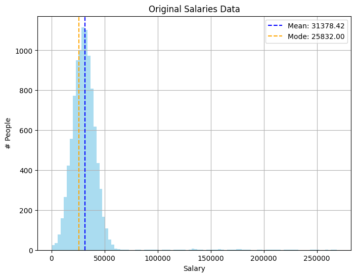
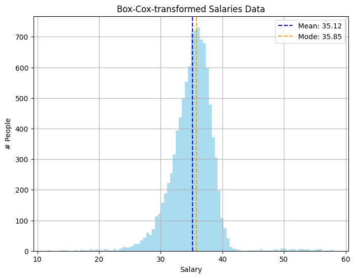

Transformaatiot muokkaavat datan jakautumista (engl. distribution), toisin kuin skaalaukseen käytettävät menetelmät. Tämä on tarpeellista ajoittain, kun data on vinoutunutta (engl. skewed) tai siinä on reilusti poikkeamia, mikä johtaa . Transformatiivinen muunnos voi auttaa tasaamaan vinoutunutta dataa ja tekemään siitä normaalijakautunutta.

## Vinous (skew)

Vinous kuvaa datan jakautumista. Normaalijakautuneessa dataa vinous on nolla. Tosielämän datasetit poikkeavat usein normaalijakautuneesta datasta. Vinous voi olla positiivinen tai negatiivinen.

Vinouman laskemiseksi käytetään seuraavaa kaavaa:

$$
g_1 = \frac{\frac{1}{n} \sum (x_i - \overline{x})^3}{(\frac{1}{n}\sum (x_i - \overline{x})^2)^\frac{3}{2}}
$$

```python title="IPython"

def skew(x):
    n = len(x)
    mean = np.mean(x)

    nominator = 1/n * np.sum((x - mean) ** 3)
    denominator = (1/n * np.sum((x - mean) ** 2)) ** (3/2)

    return nominator / denominator
```

## Huipukkuus (Kurtosis)

Huippuus kuvaa jakauman muotoa. Huipukkuuden kaava on seuraava:

$$
g_2 = \frac{\frac{1}{n} \sum (x_i - \overline{x})^4}{\frac{1}{n}(\sum (x_i - \overline{x})^2)^2} - 3 
$$

```python title="IPython"
def kurtosis(x):
    n = len(x)
    mean = np.mean(x)

    nominator = 1/n * np.sum((x - mean) ** 4)
    denominator = (1/n * np.sum((x - mean) ** 2)) ** 2

    return (nominator / denominator) - 3
```

## Palkkaesimerkki

Generoidaan satunnaisesti dataa, joka edustaa normaalijakaumaa siten, että keskiarvo on 30 000 ja keskihajonta 10 000. Lisätään dataan noin 1 % ihmisiä, joiden keskipalkka on 150 000 ja keskihajonta 50 000. Tämä luo vinoutunutta dataa, jossa vinouma on positiivinen (eli kohti suurempia arvoja).

```python title="IPython"
import numpy as np

# Generate 10k people's salaries
num_samples = 10_000

# Most people have average salaries
low_salaries = np.random.normal(
    loc=30_000, 
    scale=10_000, 
    size=num_samples
    )

# Some people have high salaries
high_salaries = np.random.normal(
    loc=150_000, 
    scale=50_000, 
    size=num_samples // 100
    ) 

# Concatenate the two arrays
salaries = np.concatenate((low_salaries, high_salaries))

# Remove round to nearest dollar
salaries = np.round(salaries, 0)

# Drop negative or zero salaries
salaries = salaries[salaries > 0]
```

Syntyvä data näyttää seuraavalta:



**Kuvio 1:** *Palkkadata, joka on vinoutunut kohti suuria arvoja.*

Huomaa, että suurin osa palkoista sijaitsee välillä 0-60 000. Vasemmalla puolella data leikkautuu nollan kohdalla. Oikealla on hajanaisia suuria palkkoja. Suurin palkka tässä tasasetissä on 268 898. Jos datasetistä lasketaan vinouma ja huipukkuus, saadaan seuraavat tulokset:

```python title="REPL"
>>> skewness(salaries)
6.17
>>> kurtosis(salaries)
62.35
```

Data on kuvitteellista, joten se ei tietenkään noudata tosimaailman monimutkaisuutta, mutta tässä esimerkissä vinouma on 6.17 ja huipukkuus 62.35. Vinouma on positiivinen, mikä johtuu dataan tarkoituksella upotetuista suurista palkoista. Huipukkuus on korkea johtuen samasta syystä: outlierit nostavat huipukkuuden arvoa. Datalla, joka noudattaa keskihajontaa (esim. `np.random.normal(size=100_000)`) kummatkin arvot ovat teoreettisesti 0.

Koneoppimismallit, jotka pyrkivät sovittamaan lineaarisen viivan normaalijakaumaan, kärsivät vinoutuneesta datasta. Tähän lukeutuvat varsinkin lineaariset regressiomallit, mutta edes neuroverkot eivät ole immuuneja vinoutuneelle datalle.

### Vinouman korjaus

Vinoumaa voi pyrkiä korjaamaan useilla eri funktioilla. Idea on simppeli: aja kukin arvo jonkin funktion, kuten neliöjuuren, läpi. Alla on muutama tyypillinen keino esiteltynä.

#### Log transformation

Logaritminen muunnos on yksinkertainen tapa. Kukin arvo asetetaan logaritmiin, jonka kantaluku (engl. base) on yleensä 10 tai e. Logaritmi palauttaa numeron, joka kuvaa, mihin potenssiin kantaluku on korotettava saadakseen alkuperäisen arvon. Lähellä nollaa olevat luvut pienenvät mitättömän vähän, suuret luvut paljon. 

Korjaus on näinkin simppeli:

```python title="REPL"
>>> log_salaries = np.log(salaries)
>>> skew(log_salaries)
-0.98
>>> kurtosis(log_salaries)
8.44
```

#### Juuri

Toinen yleinen muunnos on neliöjuuri tai kuutiojuuri (engl. square or cube root). Kuutiojuuri palauttaa luvun, joka pitäisi kertoa kolmesti itsensä kanssa saadakseen alkuperäisen arvon. Eli `cbrt(8) = 2`, koska $2 * 2 * 2 = 8$. Neliöjuuri toimii samalla tavalla, mutta kantaluku on 2. 

```python title="REPL"
>>> cbrt_salaries = np.cbrt(salaries)
>>> skew(cube_salaries)
0.93
>>> kurtosis(cube_salaries)
9.16
```

#### Box-Cox

Box-Cox-muunnos on suosittu muutos. Se vaatii parametriksi `lambda`-arvon, mikä pitää tavalla tai toisella löytää. Jos parhaan tuloksen antava lambdan arvo on jokin muu kuin 0, Box-Cox muunnos on seuraava:

$$
x_{boxcox} = \frac{x^\lambda - 1}{\lambda}
$$

Jos parhaaksi arvoksi osoittautui 0, kaava on:

$$
x_{boxcox} = \log(x)
$$

Eli Pythonissa:

```python title="IPython"
def custom_boxcox(x, lmbda):
    if lmbda == 0:
        return np.log(x)
    return (x ** lmbda - 1) / lmbda
```

Oikean lambdan löytäminen on haastavaa, joten käytetään tässä yhteydessä Scipyn `boxcox`-funktiota, joka etsii parhaan lambdan automaattisesti. Mikäli haluat kokeilla funktion toteuttamista itse, kannattanee aloittaa log likelihood -funktion toteutuksesta, johon löytyy osviittaa täältä: [SciPy Docs: scipy.stats.boxcox_llf](https://docs.scipy.org/doc/scipy/reference/generated/scipy.stats.boxcox_llf.html). Tämän kurssin puitteissa voimme tyytyä kokeilemaan valmista SciPy-funktiota, kuten alla:

```python title="REPL"
>>> from scipy.stats import boxcox
>>> box_salaries, best_lambda = boxcox(salaries)
>>> skew(box_salaries)
0.19
>>> kurtosis(box_salaries)
6.90
```

Muokattu datasetti voidaan palauttaa takaisin alkuperäiseen skaalaan käyttämällä `scipy.special.inv_boxcox`-funktiota.

```python title="IPython"
from scipy.special import inv_boxcox

# Invert
inverted_salaries = inv_boxcox(boxcox_salaries, best_lambda)

# Compare to original (allowing floating point errors)
np.allclose(salaries, inverted_salaries)
```



**Kuvio 2:** *Palkkadata muunnettuna Box-Cox-muunnoksella.*

Huomaa, että ongelma ei ole täysin hävinnyt, mutta loiventunut huomattavasti.

#### Muut vaihtoehdot

Jatkuvan datan pakottaminen lähemmäs normaalia jakautumista voi parantaa mallin suorituskykyä. Muista kuitenkin, että on olemassa muitakin tapoja käsitellä vinoutunutta dataa.

Näitä ovat muiden muassa:

* Käytä mallia, joka ei ole herkkä vinoutuneelle data
* Ryhmittele data
    * Pienituloiset, keskituloiset, suurituloiset, ...
    * Tai käytä kvantiileja (alin 10 %, seuraava 10 %, ..., ylimmät 10 %)
* Poista outlierit kokonaan (riski!)
