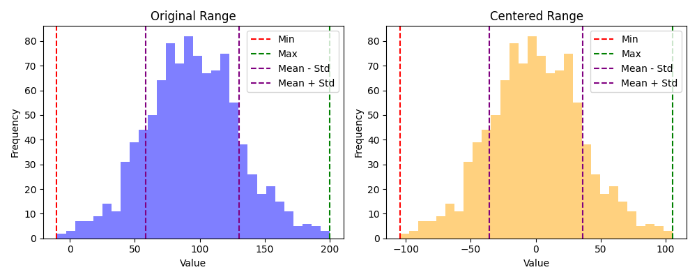
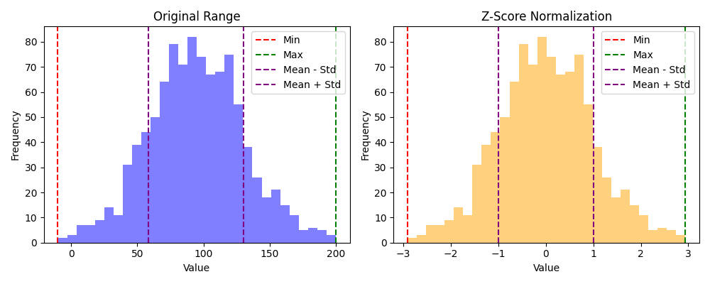

## Skaalan suhteen herkät algoritmit

Osa koneoppimisalgoritmeista ovat herkkiä skaalaukselle. Tämä tarkoittaa, että algoritmin suorituskyky voi rampautua, mikäli eri piirteiden välillä on suuria eroja. Esimerkiksi huoneiden lukumäärä on yleensä pieni luku, kun taas asunnon hinta dollareita on valtava lukema.

Jos mallin virhe perustuu etäisyyteen, skaalaus on tärkeää. Esimerkiksi K-means-algoritmi käyttää etäisyyttä klustereiden muodostamiseen. Jos yksi piirre on suurempi kuin toinen, se vaikuttaa enemmän etäisyyteen. Huomaa, että skaalauksen tarkka muoto vaihtelee. Kenties piirre puristetaan välille `[0,1]`, tai kenties se skaalataan siten, että keskihajonta mahtuu alueelle `[-1,1]`. Näihin tutustutaan alla tarkemmin, mutta tarkistathan aina että valitsemasi datan esikäsittelijä on se, mitä mallisi tarvitsee. Esimerkiksi neuroverkot käyttävät usein Min-Max skaalausta, joka puristaa datan välille `[0,1]`.

!!! tip

    Tämän kurssin puitteissa riittää seuraava karkea listaus, jossa :white_check_mark: tarkoittaa, että skaalaus on suositeltavaa ja :no_entry: tarkoittaa, että skaalaus ei ole tarpeellista.
    
    * Puut :no_entry:
    * Naive Bayes :no_entry:
    * Muut :white_check_mark:


## Skaalauksen apuvälineet

Dataa voi kuvata tilastotieteen avulla. Kuvailevia lukuja ovat keskiarvo, mediaani, moodi, varianssi, keskihajonta ja kvartiilit. Datan skaalauksessa tarvitaan tyypillisesti keskiarvoa, varianssia ja keskihajontaa. Nämä lienevät jo matematiikasta tuttuja, mutta käydään ne läpi kertauksen vuoksi. Kukin näistä esitellään ensin matemaattisessa muodossa ja sen jälkeen Python-koodina. Näitä tarvitaan myöhemmin skaalausta tehdessä.

Tämä materiaali pohjautuu osin [BMC Genomics](https://bmcgenomics.biomedcentral.com/articles/10.1186/1471-2164-7-142/tables/1)-sivuston kaavoihin.

### Keskiarvo (mean)

Keskiarvo on kaikkien otannan (engl. sample) lukujen summa jaettuna lukumäärällä. Jatkossa kun näet `x̄`-symbolin tässä dokumentissa, se tarkoittaa keskiarvoa.

$$
{\overline{x}} = \frac{\sum x_{i}}{N}
$$

```python title="IPython"
from ml.vector import Vector

x = Vector(-1, 0, 1, 2, 3, 4, 5)

def mean(x: Vector):
    return sum(x) / len(x)
```

### Varianssi

Varianssi kertoo, kuinka paljon data poikkea keskiarvosta. Luku on nostettu neliöön, jotta negatiiviset poikkeamat eivät kumoaisi positiivisia, ja jotta suuret poikkeamat painottuisivat enemmän.

$$
s^{2} = \frac{\sum \left( {x_{i} - {\overline{x}} } \right) ^{2}}{N - 1}
$$

```python title="IPython"
def variance(x: Vector, ddof=1):
    return sum((x - mean(x))**2) / (len(x) - ddof)
```

!!! question "Miksi - 1?"

    Jakajassa oleva `N - 1` vähentää populaatiosta yhden asteen vapautta. Tämä yhden vapausaste (engl. degrees of freedom) on käytössä otannan (engl. sample) varianssia laskettaessa. Mikäli N edustaa koko populaatiota, sitä ei käytetä. Huomaa, että koska jakaja on pienempi, varianssi on suurempi kuin jos jakajana olisi `N`. Koko populaation varianssin oletetaan siis olevan suurempi kuin otannan varianssin.

    Jos skaalaat `X`:ää, `ddof=0` on oikea arvo. Jos skaalaat `X_train`-dataa, `ddof=1` on oikea arvo.

### Keskihajonta

Keskihajonta on varianssin neliöjuuri. Se palauttaa neliöön nostetun varianssin takaisin alkuperäiseen mittayksikköön. Esimerkissä oletetaan, että käsittelemme otantaa, joten hyväksymme aiemman toteutuksen `ddof=1` default-arvon.

$$
s = \sqrt{s^{2}}
$$

```python title="IPython"
def std(x: Vector, **kwargs):
    return variance(x, **kwargs) ** 0.5
```


## Piirteiden skaalaus

Piirteiden skaalaus on menetelmä, jolla yhtenäistetään eri muuttujien tai piirteiden alue. Tietojenkäsittelyssä sitä kutsutaan myös datan normalisoinniksi ja se suoritetaan yleensä datan esikäsittelyvaiheessa. Se ottaa datataulukon ja palauttaa uuden taulukon samalla muodolla, mutta skaalattuna standardialueelle.

### Keskitys (centering)

Keskitys ei varsinaisesti skaalaa mitään, mutta se on tärkeä osa alla esiteltyjä skaalauksia. Keskityksessä lukujen keskiarvo vähennetään jokaisesta arvosta. Toisin sanoen keskiarvo siirretään nollaan. Mikäli muuttuja noudattaa normaalijakaumaa, puolet arvoista on positiivisia ja puolet negatiivisia.

$$
{\widetilde{x}} = x - {\overline{x}}
$$

```python title="IPython"
def center(x):
    return x - mean(x)
```



**Kuvio 1:** *Vasemmassa histogrammissa näkyy alkuperäinen data, joka noudattaa suunnilleen normaalijakaumaa. Oikeassa histogrammissa näkyy keskitetty data, jossa keskiarvo on 0.*

### Z-score

BMC's taulukossa tätä kutsutaan autoskaalaukseksi (engl. autoscaling). Tämä on yleisin skaalausmenetelmä. Keskitettu data jaetaan keskihajonnalla, mistä lopputuloksena listan lukujen keskiarvo on 0 ja keskihajonta 1.

$$
{z} = \frac{\widetilde{x}}{s}
$$

```python title="IPython"
def z_score(x: Vector):
    return center(x) / std(x)
```



**Kuvio 2:** *Vasemmassa histogrammissa on sama data kuin Kuviossa 1. Oikeassa histogrammissa näkyy Z-pisteytetty data, jossa keskiarvo on 0 ja keskihajonta on 1.*

!!! tip

    Tulet törmäämään tähän usein eri koneoppimisesimerkeissä. Mikäli näet jossakin esimerkissä käytössä [StandardScaler](https://scikit-learn.org/stable/modules/generated/sklearn.preprocessing.StandardScaler.html)-esikäsittelijän, se on juurikin tämä.

### Min-max skaalaus

Min-max skaalauksessa data skaalataan välille `[0,1]`. Tämä on meidän kurssin kontekstissa eli perinteisessä koneoppimisessa hieman Z-scorea eli standardiskaalausta harvinaisempi, mutta se on hyödyllinen esimerkiksi neuroverkkojen kanssa.

$$
x' = \frac{ x - min(x) }{ max(x) - min(x) }
$$

```python title="IPython"
def min_max(x: Vector):
    return (x - min(x)) / (max(x) - min(x))
```

!!! tip

    Huomaa tämän variantti, jossa skaalaksi voidaan asettaa haluttu alue, esimerkiksi $[a, b]$. Alla funktio kirjoitettu siten, että `minmax()` viittaa yllä näkyvään funktioon:

    $$
    f(x, a, b) = a + (b - a) \cdot minmax(x)
    $$

    ```python title="IPython"
    def minmax_scale(x, a=0, b=1):
        return a + (b - a) * range_scale(x)
    ```

