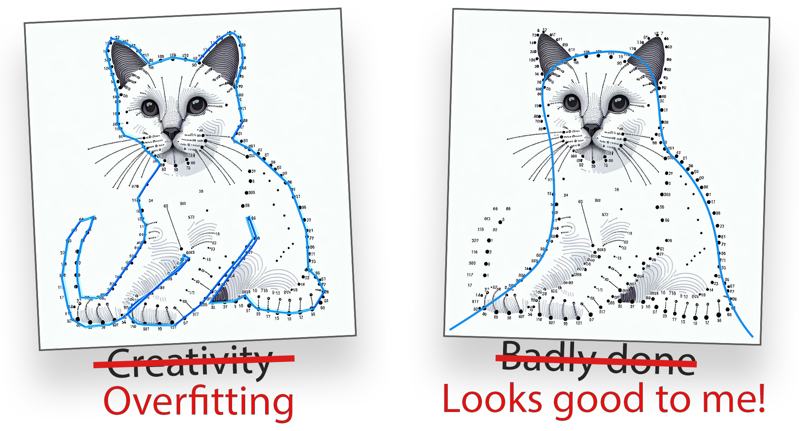
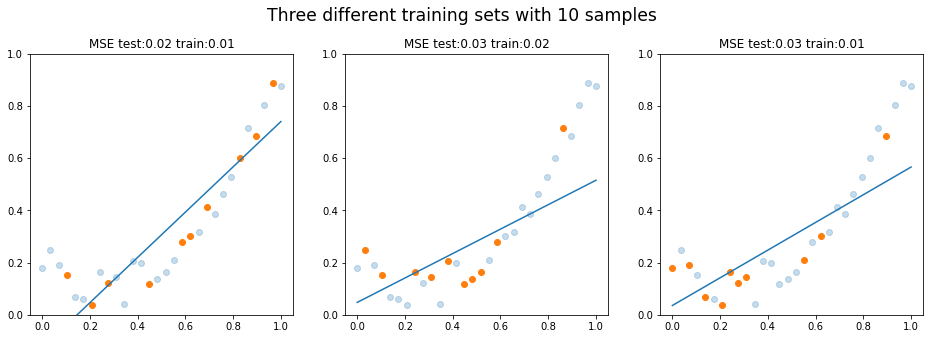
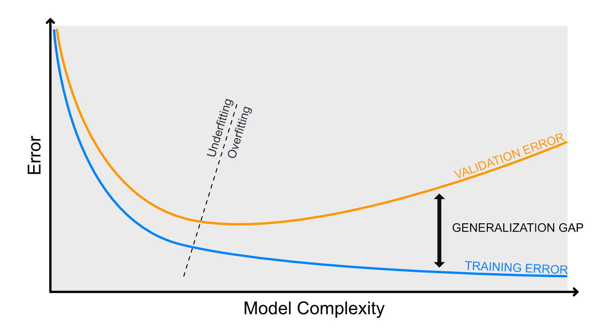

# Mallin suorituskyky

Koneoppimismallit eivät suinkaan automaattisesti ole täydellisiä, vaan niiden suorituskykyä tulee arvioida ja vertailla muihin malleihin. Tämä vaatii mallintajalta ammattitaitoa sekä työkaluja, joilla mallin suorituskykyä voidaan arvioida.

Tämä dokumentti tulee vastaan niin varhaisessa vaiheessa kurssia, että sisältö saattaa tuntua vielä hieman abstraktilta. Palaa tähän materiaaliin myöhemmin kunkin koneoppimismallin kohdalla, kun olet valmis arvioimaan mallin suorituskykyä. On tärkeää miettiä, mistä tiedät, että malli ennustaa hyvin sellaista dataa, jota se ei ole nähnyt ennen.

Tässä dokumentissa käsitellään seuraavia aiheita:

* Alisovittaminen (engl. underfitting)
* Ylisovittaminen (engl. overfitting)
* Vinouma (engl. bias)
* Hajonta (engl. variance)

Koneoppimismallin parametrien optimointi on tasapainoilua ääripäiden välillä. Tavoitteena on löytää optimaalinen malli, joka ennustaa hyvin sekä opetus- että testidataa.

!!! warning

    Huomaa, että tässä luvussa keskitytään ohjatun oppimisen (engl. supervised learning) malleihin. Ohjaamattoman oppimisen (engl. unsupervised learning) malleissa ei ole koulutus- ja testidataa, joten niiden suorituskykyä arviointi on huomatavasti vaikeampaa.

## Koulutus- ja testidata

Ennen kuin pohditaan aihetta yhtään enempää, on hyvä varmistaa, että tiedät, mitä tarkoitetaan koulutus- ja testidatalla. Koulutusdata on dataa, jolla malli opetetaan. Testidata on dataa, jolla mallin suorituskykyä arvioidaan. Testidataa ei saa käyttää mallin opettamiseen, sillä silloin malli ei ole enää riippumaton. Mikäli käytät Pandas-kirjastoa, testidataa voi olla helppo jakaa koulutusdatasta `train_test_split` funktiolla:

```python title="IPython"
import pandas as pd
from sklearn.model_selection import train_test_split

data = pd.read_csv("data.csv")
X_train, X_test = train_test_split(data, test_size=0.2)
```

Usein testi- ja koulutusdata jaetaan suhteessa 80/20 tai 70/30. Tämä tarkoittaa, että 80% tai 70% datasta käytetään koulutukseen ja loput testaukseen. Tämä ei ole kiveen hakattu sääntö, vaan riippuu datasta ja mallista, kuinka paljon dataa tarvitaan koulutukseen. Data tyypillisesti sekoitetaan ennen sen jakamista. Puhdas Python-ratkaisu datan jakamiseksi olisi:

```python title="IPython"
import random

X = [
    (1, 52.7),
    (0, 51.3),
    ...
    (1, 49.2),
    (0, 50.1)
]

# Shuffle
random.shuffle(X)

# Split point
i = int(len(X) * 0.8)

# Split
X_train = X[:i]
X_test = X[i:]

# All samples are included but in two different sets
assert len(X_train) + len(X_test) == len(X)
```


## Ali- ja ylisovittaminen

Alisovittaminen (engl. underfitting) ja ylisovittaminen (engl. overfitting) ovat ongelmatekijää konemalleissa, ja jokainen malli etsii tasapainoa näiden kahden välillä.



**Kuvio 1:** *Yhdistä pisteet -piirroskirjassa ihmisen tehtävä on yhdistää pisteet numeroidusti ja oikein. Koneoppimismallin tehtävä olisi pikemminkin etsiä ympäripyöreä kissan muoto annetuilla havainnoilla.*


**Kuvio 2:** *Scikit-learnin dokumentaatiosta poimittu kuva, joka havainnollistaa alisovittamista ja ylisovittamista. Katso kuvan luonut koodi selityksineen: [Underfitting vs. Overfitting](https://scikit-learn.org/stable/auto_examples/model_selection/plot_underfitting_overfitting.html#sphx-glr-auto-examples-model-selection-plot-underfitting-overfitting-py)*

### Vinouma

Vinouma (engl. bias) on mallin virhe, joka johtuu vääristä oletuksista. Vinouman tapauksessa malli **alisovittaa** dataa, eli malli ei kykene selittämään ilmiön monimutkaisuutta. Malli on siis liian yksinkertainen datan monimutkaisuuteen nähden. Kaikissa maailman malleissa on jokin määrä vinoumaa, hajontaa ja kohinaa. Mallin virheen voi ajatella koostuvan näistä tekijöistä:

$$
\text{Virhe} = \text{Vinouma} + \text{Hajonta} + \text{Kohina}
$$

Vinoumaa voidaan mitata ottamalla satunnaisia otantoja datasta (engl. bootstrapping) ja laskemalla mallin virhe. Jos mallin virhe pysyy otannasta huolimatta suurena, malli on vahvasti vinoutunut (engl. biased). Tästä voidaan tulkita, että myös testidatan virhe on suuri. Täten koulutusdatan lisääminen ei poista ongelmaa; malli on liian yksinkertainen selittämään ongelmaa, joten mitenpä se voisi? Vinoumaa voidaan korjata lisäämällä mallin monimutkaisuutta. Se, miten mallin monimutkaisuutta lisätään, selviää kurssin aikana.

Alla olevassa kuviossa on tilanne, jossa malli on biased. Koulutusdataa on vain 10 pistettä, mutta vaikka kouluttaisit mallin enemmällä datalla, malli ei kykenisi selittämään ilmiötä. Ei ole sellaista suoraa viivaa, joka selittäisi parabolisen käyrän. Huomaa, että vinouma on siis *oletus*, että ilmiö on suora.



**Kuvio 3:** *Malli on yhä liian yksinkertainen eli alisovittaa dataa. Eri otannat (bootstrapit) tuottavat kaikki suuren virheen.*

!!! question "Tehtävä"

    Ihminen on eräänlainen koneoppimismalli, joka osaa luokitella näkemäänsä. Tutustu aiheeseen **kognitiivinen vinouma** ja mieti, miten se suhtautuu koneoppimismallin vinoumaan.

### Hajonta

Hajonta (engl. variance) on vinouman vastakohta.  Hajonnan tapauksessa malli **ylisovittaa** dataa eli se pitää mitättömiäkin yksityiskohtia merkittävinä - jopa pelkkää kohinaa. Hajonta on mallin virhe, joka johtuu siitä, että malli on liian monimutkainen datan monimutkaisuuteen tai määrään nähden.

Hajonnan tunnistaa usein siitä, että koulutusdatan virhe on pieni, mutta testidatan virhe on suuri - ja mallin monimutkaisuuden lisääntyessä tämä ero kasvaa. Mallin parametrit heilahtavat reilusti, jos koulutat mallin useamman kerran saman datan eri subsetilla, koska malli on liian herkkä.

!!! tip

    Bias ja variance eivät ole lukuja, joita saisi yhtä helposti esille kuin vaikkapa tarkkuus tai f1-score. Jos haluat penkoa, voit yrittää käyttää mlxtend-kirjaston [bias_variance_decomp: Bias-variance decomposition for classification and regression losses](https://rasbt.github.io/mlxtend/user_guide/evaluate/bias_variance_decomp/)-artikkelissa esiteltyä funktiota.

### Regularisointi

Regularisointi on menetelmä, jolla voidaan vähentää ylisovittamista. Yleisesti regularisointi on nimenomaan gradient descent -menetelmien yhteydessä käytetty termi, mutta muiden kurssin koneoppimisalgoritmien tapauksessa sille löytyy yleisesti jokin vastine, jolla mallin ylisovittamista voidaan vähentää. Esimerkiksi k-NN -mallissa voidaan säätään `k`:n arvoa. Päätöspuualogritmit ovat luontaisesti herkkiä ja täten ylisovittavia, mutta niiden ylisovittamista voidaan vähentää rajoittamalla puun syvyyttä tai rakentamalla useista pienistä puista koostuva metsä. Tätä harjoitellaan tämän kurssin aikana.

Regularisointi on siis yleinen termi, joka tarkoittaa mallin ylisovittamisen vähentämistä.

### Trade-off

Huomaa, että ylisovittamisen ja alisovittamisen välillä on tasapaino, jota kutsutaan trade-offiksi. Ellei ennustettu malli noudata **täydellisesti** ilman kohinaa jotakin matemaattista kaavaa, malli on aina väkisinkin ali- tai ylisovittava. Tavoitteena on löytää optimaalinen malli, joka ennustaa hyvin sekä opetus- että testidataa. Jos malli ennustaa hyvin opetusdataa, mutta huonosti testidataa, se on ylisovittava. Jos malli ennustaa huonosti sekä opetus- että testidataa, se on alisovittava. Alla on taulukko, joka kuvaa, miten jompaa kumpaa ääripäätä voidaan korjata.

|                           | Ylisovitus             | Alisovitus               |
| ------------------------- | ---------------------- | ------------------------ |
| **Mallin monimutkaisuus** | Laske                  | Nosta                    |
| **...tai regularisaatio** | Nosta                  | Laske                    |
| **# Muuttujaa**           | Poista muuttujia       | Tehtaile lisää muuttujia |
| **# Havaintoa**           | Kerää lisää havaintoja | ---                      |

 Yllä oleva taulukko tarjoaa ratkaisuehdotuksen yli- tai alisovittamisen tapauksessa. Myös ensemble-menetelmät, kuten Random Forest ja Gradient Boosting, ovat hyviä tapoja vähentää ylisovittamista. Nämä menetelmät käyttävät useita malleja, jotka yhdessä ennustavat paremmin kuin yksittäinen malli.

 

 **Kuvio 5:** *Kuvassa on esitetty mallin monimutkaisuuden vaikutus virheeseen. Virhe ilmaistaan sanalla "validation", mutta voit tulkita sen koulutusdatan virheeksi tässä yhteydessä. Kun mallin monimutkaisuutta lisätään koulutusvirhe laskee. Alisovitus vaihtuu vaihtua ylisovitukseksi, kun yleistettävyys heikkenee. Kuvaajassa tätä ilmentää koulutusvirheen ja testivirheen etäisyys toisistaan.*

## Mittariston valinta

Yllä olevissa esimerkeissä käytetty virhe oli `MSE`. Datalla ei ollut luokkaa vaan juokseva arvo, eli kaikissa yllä olevissa kuvissa ongelma oli tyyppiä regressio. Luokitteluongelmissa käytetään erilaisia mittareita. Alla on listattu yleisimmät mittarit, joita käytetään koneoppimismallien suorituskyvyn arvioimiseen kussakin koneoppimismallityypissä.

### Regressiomallit

#### MSE

MSE (Mean Squared Error) on virhefunktio, joka laskee keskimääräisen virheen neliösumman. Se on yksi yleisimmistä virhefunktioista regressiomalleissa, ja se lasketaan seuraavalla kaavalla:

$$
MSE = \frac{1}{n} \sum_{i=1}^{n} (y_i - f(x_i))^2
$$

Kyseistä virhefunktiota käytetään [Normaaliyhtälö](../algoritmit/linear/normal_equation.md) -materiaalissa.

Huomaa, että virhe on nostettu neliöön. Jos ennustat esimerkiksi asunnon hintaa ja MSE on 40,000 euroa, se tarkoittaa, että nimenomaan **neliösumma** virheestä on 40,000 euroa. Neliö voidaan palauttaa alkuperäiseen skaalaan ottamalla neliöjuuri virheestä: `sqrt(40_000)` palauttaa arvon `200`, koska `200 * 200 = 40_000`. Neliösummaa käytetään ==mallin koulutuksessa==, mutta alkuperäiseen skaalaan palautettu `RMSE` (Root Mean Squared Error) on helpompi ymmärtää evaluaatiovaiheessa. Koneoppimismalli ei siis suinkaan tässä tapauksessa ennustanut hintoja 40 000 euroa väärin, jos virhettä käsitellään alkuperäisessä skaalassa (eli euroina eikä neliöeuroina). Alkuperäiseen skaalaan palautettu virhe on 200 euroa, mikä on mitätön ero, olettaen että asunnot maksavat kymmeniä tai satoja tuhansia.

Sekä MSE:n että RMSE:n voi laskea myös Scikit-Learn kirjaston funktioilla:

```python title="IPython"
from sklearn.metrics import mean_squared_error
from sklearn.metrics import root_mean_squared_error

X_train, X_test, y_train, y_test = ... # Load data

# Train any regression model here
#   model = SomeRegressionModel()
#   model.fit(X_train, y_train)
#   y_pred = model.predict(X_test)

# Calculate the Mean Squared Error (MSE)
mse = mean_squared_error(y_test, y_pred)
rmse = np.sqrt(mse)

# These should be equal
assert rmse == root_mean_squared_error(y_test, y_pred)
```

#### R^2

R^2-luku kuvaa selitysastetta (engl. coefficient of determination) prosentteina välillä 0.00 - 1.00. Jos R^2 on 0.75, se tarkoittaa, että 75% muuttujan vaihtelusta voidaan selittää mallilla. Loput ovat virhettä, jonka selittää jokin muu tekijä.

R^2 voidaan laskea seuraavalla kaavalla:

$$
R^2 = 1 - \frac{\text{RSS}}{\text{TSS}}
$$

Jossa: 

* RSS (Residual Sum of Squares) on virheiden neliösumma
* TSS (Total Sum of Squares) on kokonaisneliösumma. 

Huomaa, että RSS on siis sama kuin MSE, mutta jakolasku jätetään tekemättä (eli "mean"). Matemaattisina yhtälöinä RSS ja TSS ovat:

$$
RSS = \sum_{i=1}^{n} (y_i - f(x_i))^2
$$

$$
TSS = \sum_{i=1}^{n} (y_i - mean(y))^2
$$

Pythonina sen voi kirjoittaa alla olevalla tavalla, ja todistaa oikeasi vertaamalla sitä Scikit Learnin `r2_score` -funktion palauttamaan arvoon.

```python
import sklearn
import numpy as np

def rss(y_true, y_pred):
    rss = sum((y_true - y_pred) ** 2)
    return rss

def tss(y_true):
    mean_y = sum(y_true) / len(y_true)
    tss = sum((y_true - mean_y) ** 2)
    return tss

def r_squared(y_true, y_pred):
    rss_value = rss(y_true, y_pred)
    tss_value = tss(y_true)
    r_squared = 1 - (rss_value / tss_value)
    return r_squared

# Fake data and predictions
y_true = np.array([3, -0.5, 2, 7])
y_pred = np.array([2.5, 0.0, 2, 8])

r_squared(y_true, y_pred) == sklearn.metrics.r2_score(y_true, y_pred)
```

### Luokittelumallit

Koska luokittelumallit ennustavat luokkaa, ei jatkuvaa arvoa, mallin tarkkuutta voidaan arvioida laskemalla oikeita ja vääriä ennusteita kokonaisluvuin. Näitä mittareita ei tehdä tällä kurssilla käsin, mutta kun teet harjoituksia scikit-learnin kanssa, sinun tulee osata arvioida luokittelumallin suorituskykyä. Toisin sanoen sinun tulee osata lukkea ja ymmärtää alla esiteltyjen mittareiden tuloksia. Alla on suora esimerkki tulosteesta, joka on lainattu [Recognizing hand-written digits](https://scikit-learn.org/stable/auto_examples/classification/plot_digits_classification.html)-esimerkistä Scikit-learnin dokumentaatiosta.

```plaintext
Classification report for classifier SVC(gamma=0.001):
              precision    recall  f1-score   support

           0       1.00      0.99      0.99        88
           1       0.99      0.97      0.98        91
           2       0.99      0.99      0.99        86
           3       0.98      0.87      0.92        91
           4       0.99      0.96      0.97        92
           5       0.95      0.97      0.96        91
           6       0.99      0.99      0.99        91
           7       0.96      0.99      0.97        89
           8       0.94      1.00      0.97        88
           9       0.93      0.98      0.95        92

    accuracy                           0.97       899
   macro avg       0.97      0.97      0.97       899
weighted avg       0.97      0.97      0.97       899
```

Kyseessä on monen luokan luokitteluongelma, jossa jokaiselle luokalle on laskettu `precision`, `recall` ja `f1-score`. Luokkia eli uniikkeja `y`-arvoja on 10 kappaletta. Huomaa, että monissa tällä kurssilla käytetyissä esimerkeissä on vain kaksi luokkaa. Jotta säästyisimme vähemmällä laskemisella, käännetään sama ongelma siten, että meillä on vain kaksi luokkaa. Ennustetaan sitä, että ==onko numero luku 3 vai jokin muu==.

```python title="IPython"
from sklearn import datasets, metrics, svm
from sklearn.model_selection import train_test_split
from sklearn.metrics import classification_report

digits = datasets.load_digits()

# Convert into binary problem. (1)
y = digits.target == 3

# Fit and predict
X_train, X_test, y_train, y_test = train_test_split(
    digits.data, 
    y, 
    test_size=0.3, 
    random_state=160 # Seed (2)
)
clf = svm.SVC(gamma=0.001)
clf.fit(X_train, y_train)
y_pred = clf.predict(X_test)

print(classification_report(
    y_test, 
    y_pred, 
    target_names=['Luku N', 'Luku 3'] # (3)
))
```

1. Alkuperäinen y sisältää luvut `range(0, 10)`. Luomme uuden `y`:n eli targetin, jossa on arvot `True` ja `False` (lukuina 1 ja 0). Jos y on True, luku on 3. Muutoin se on jokin muu luku (0-2 tai 4-9).
2. Seed on käsin valittu sellaiseksi, että saamme vähintään yhden False Positiven ja False Negativen.
3. Nimitämme lukua 3 `Luku 3` ja kaikkia muita `Luku N`.

```plaintext title="stdout"
              precision    recall  f1-score   support

      Luku N       0.99      1.00      1.00       479
      Luku 3       0.98      0.95      0.97        61

    accuracy                           0.99       540
   macro avg       0.99      0.97      0.98       540
weighted avg       0.99      0.99      0.99       540
```

#### Hämmennysmatriisi

Tarvitsemme precision, recall ja f1-score arvojen laskemiseksi eräänlaisia totuustestien lukemia, joita ovat True Positive (TP), True Negative (TN), False Positive (FP) ja False Negative (FN). Nämä arvot ovat tärkeitä, kun arvioidaan luokittelumallin suorituskykyä. Tässä on lyhyt selitys näille termeille.

* **True Positive (TP)**: Luku 3 ennustettiin 3:ksi.
* **True Negative (TN)**: Luku N ennustettiin N:ksi.
* **False Positive (FP)**: Luku N ennustettiin 3:ksi.
* **False Negative (FN)**: Luku 3 ennustettiin N:ksi.

!!! note

    Kuvittele malli, joka ennustaa laboratoriomittausten valossa, onko sinulla jokin sairaus. Huomaa, että `False Negative` on tilanne, jossa malli ennustaa, että sinulla ei ole sairautta, vaikka todellisuudessa sinulla on. Mikäli saat tämän ennusteen, sinua ei ohjata jatkotutkimuksiin, joten sairaus jää hoitamatta. Mikäli saat `False Positive` ennusteen, sinut ohjataan jatkotutkimuksiin, mutta todellisuudessa sinulla ei ole sairautta. Jatkotutkimukset ovat kalliita ja turhia, mutta eikö ole humaanimpaa olla turhan varovainen kuin jättää sairaus hoitamatta?
    
    Tämä mielikuva osoittaa, että kaikki väärät vastaukset eivät ole samanarvoisia. Usein `False Negative` on pahempi kuin `False Positive`.

Voimme laskea hämmennysmatriisin Scikit-Learnin `confusion_matrix` -funktiolla. Luodaan nämä arvot palauttava funktio selvyyden ja kurssin hengen vuoksi "from scratch".

```python title="IPython"
def tp_fp_tn_fn(y_test, y_pred):
    # Init
    TP, TN, FP, FN = 0, 0, 0, 0

    # Count
    for pair in zip(y_test, y_pred):
        match pair:
            case (1, 1):
                TP += 1
            case (0, 0):
                TN += 1
            case (0, 1):
                FP += 1
            case (1, 0):
                FN += 1

    return TP, FP, TN, FN

TP, FP, TN, FN = tp_fp_tn_fn(y_test, y_pred)
print(f"TP: {TP}, FP: {FP}, TN: {TN}, FN: {FN}")
```

```plaintext title="stdout"
TP: 58, FP: 1, TN: 478, FN: 3
```

Yllä olevassa tulosteessa asetetut luvut laitetaan usein matriisiin, jossa pystyakseli edustaa ennustettua luokkaa ja vaaka-akseli todellista luokkaa. Tämä matriisi on hämmennysmatriisi. Huomaa, että kenttien järjestys voi vaihdella ajoittain. Tässä tapauksessa `TP` on vasemmassa yläkulmassa, `FP` oikeassa yläkulmassa. Järjestys riippuu siitä, miten akselit on määritelty.

|       | Ennustettu True | Ennustettu False |
| ----- | --------------- | ---------------- |
| True  | TP              | FN               |
| False | FP              | TN               |

!!! question "Tehtävä"

    Käy katsomassa yllä mainitusta Scikit-learnin esimerkistä, miltä hämmennysmatriisi näyttää, kun mukana ovat kaikki 10 luokkaa. Tässä vielä linkki uudestaan: [Recognizing hand-written digits](https://scikit-learn.org/stable/auto_examples/classification/plot_digits_classification.html)

Kun syötämme oikeat target-nimet ja arvot, taulukko näyttää tältä:

|        | Ennustettu luku 3 | Ennustettu luku N |
| ------ | ----------------- | ----------------- |
| Luku 3 | 58                | 3                 |
| Luku N | 1                 | 478               |

#### Accuracy

Nyt kun meillä on tiedossa hämmennysmatriisin arvot, voimme helposti laskea tarkkuuden (engl. accuracy). Tarkkuus on prosenttiosuus oikeista ennusteista. Se lasketaan seuraavalla kaavalla:

$$
\begin{align*}
    \text{Accuracy} &= \frac{TP + TN}{TP + TN + FP + FN} \\
                    &= \frac{536}{540} \\
                    &= 0.9926
\end{align*}
$$

Voimme tarkistaa, että laskutoimituksemme täsmää Scikit-learningin `accuracy_score` -funktion palauttamaan arvoon. Huomaa, että `TP + TN + FP + FN` on yhtä suuri kuin `len(y_test)` eli koko testidatan havaintojen määrä. Jakaja on siis *kaikki data*.

```python title="IPython"
acc = (TP + TN) / (TP + TN + FP + FN)
assert metrics.accuracy_score(y_test, y_pred) == acc
```

!!! tip

    Tarkkuus on siis lyhyesti: kuinka monta prosenttia ennusteista oli oikein.

#### Recall

Löytyvyysarvo (engl. recall, sensitivity) on yhtä helppo laskea.

$$
\begin{align*}
    \text{Recall} &= \frac{TP}{TP + FN} \\
                  &= \frac{58}{61} \\
                  &\approx 0.95
\end{align*}
$$

Voimme tarkistaa, että laskutoimituksemme täsmää Scikit-learningin `recall_score` -funktion palauttamaan arvoon.

```python title="IPython"
recall = TP / (TP + FN)
assert metrics.recall_score(y_test, y_pred) == recall
```

!!! tip

    Löytyvyysarvo kertoo, kuinka monta prosenttia me ennustimme oikein, jos huomioidaan vain True caset ("ylempi rivi").

#### Precision

Myös positiivinen ennustearvo (engl. precision) on helppo laskea.

$$
\begin{align*}
    \text{Precision} &= \frac{TP}{TP + FP} \\
                    &= \frac{58}{59} \\
                    &\approx 0.98
\end{align*}
$$

Voimme tarkistaa, että laskutoimituksemme täsmää Scikit-learningin `precision_score` -funktion palauttamaan arvoon.

```python title="IPython"
precision = TP / (TP + FP)
assert metrics.precision_score(y_test, y_pred) == precision
```

!!! tip

    Precision kertoo, kuinka monta prosenttia me ennustimme oikein, jos huomioidaan vain ennustetut Truet ("vasen sarake").


#### F1 score

Yhtenä hyvän mallin mittarina voidaan sanoa sellaista, jolla on korkea tarkkuus ==ja== löytyvyysarvo. Sellainen arvo on nimeltään F1 score. F1 on harmoninen keskiarvo tarkkuudesta ja löytyvyysarvosta. Se lasketaan seuraavalla kaavalla:

$$
\begin{align*}
    \text{F1} &= 2 \times \frac{\text{Precision} \times \text{Recall}}{\text{Precision} + \text{Recall}} \\
              &\approx 0.97
\end{align*}
$$

Voimme tarkistaa, että laskutoimituksemme täsmää Scikit-learningin `f1_score` -funktion palauttamaan arvoon.

```python title="IPython"
f1 = 2 * (precision * recall) / (precision + recall)
assert metrics.f1_score(y_test, y_pred) == f1
```

!!! question "Tehtävä"

    Mikä mahtaa olla F beta score eli $F_{\beta}$ ?Selvitä, mikä on sen laskukaava ja miten se eroaa F1 scoresta.
