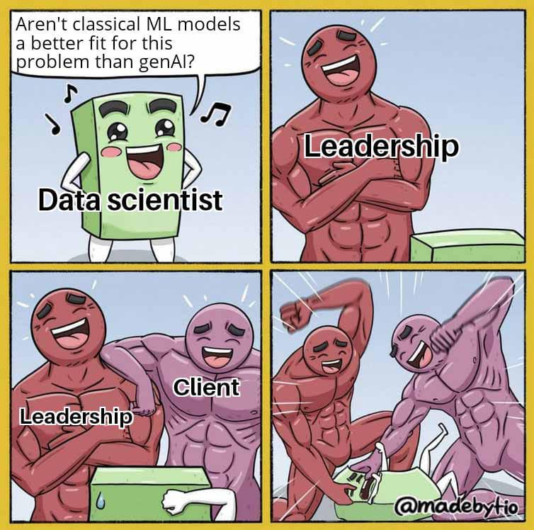

# Tervetuloa kurssille

Oppimateriaali on tarkoitettu Kajaanin Ammattikorkeakoulun opiskelijoille. Huomaa, että tämä kurssi on perinteisen koneoppimisen kurssi. Alla (ks. Kuvio 1) tähän liittyvä humoristinen sarjakuvapiirros. Generatiiviset tekoälyt ovat nyt kovassa huudossa, mutta perinteinen koneoppiminen on edelleen tärkeä osa tekoälyä. Käytännössä tämä tarkoittaa, että voit unohtaa tämän kurssin ajaksi teknologiat ja kirjastot kuten TensorFlow ja PyTorch.

Ohjelmointikielenä kurssilla on Python, joten kursilla oletetaan vähintäänkin Pythonin alkeiden hallintaa. Myös seuraavat teknologiat on hyvä olla hallussa, tai ne pitää valmistautua ottamaan haltuun kurssin aikana: git, Jupyter Notebook, Pip ja Venv. Kurssitehtävissä käytetään myös Numpy-, Pandas- ja Scikit-learn-kirjastoja. Huomaa, että kurssitehtävät eli harjoitustyöt on hostattu muualla, esimerkiksi Moodlessa ja/tai Gitlabissa.

**Kuvio 1.** *Sarjakuvapiirros koneoppimisesta. (Copyright note: The memeified comic is by unknown author, but found from r/machinelearningmemes posted by u/joelllthedestoryer. Published with permission from the creator of the original comic strip MadeByTio.)*

!!! tip

    Pandas- ja Scikit-learn kirjastoja tarvitset harjoitustöissä, joissa sinun tulee käyttää algoritmien valmiita toteutuksia. Näiden käyttöä ei opasteta tässä materiaalissa. Voit kuitenkin tutustua niihin esimerkiksi seuraavien linkkien kautta:

    * [Pandas Cookbook](https://pandas.pydata.org/pandas-docs/stable/user_guide/cookbook.html)
    * [Khuyen Tran's Efficient Python Tricks and Tools for Data Scientists](https://khuyentran1401.github.io/Efficient_Python_tricks_and_tools_for_data_scientists/)
    * [Pandas Cheat Sheet](https://pandas.pydata.org/Pandas_Cheat_Sheet.pdf)

## Faktavirheet

Mikäli oppimateriaali sisältää virheellistä tietoa, tee jompi kumpi:

* Forkkaa GitHubin repository ja tarjoa Pull Request, joka sisältää korjausehdotukset.
* Ota yhteyttä ylläpitoon ja esittele virheellisen tiedon korjaus.