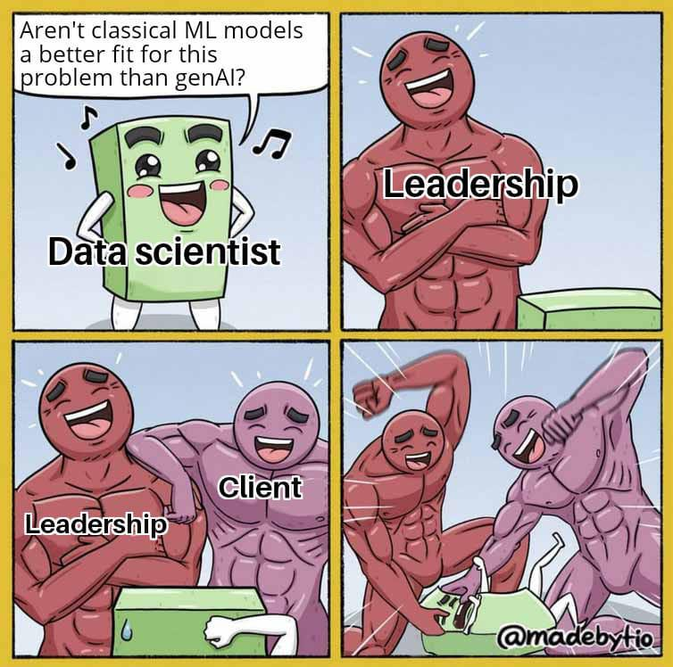

# Tervetuloa kurssille

!!! danger

    Tämä oppimateriaali on refaktoroinnin alla. Rakenne vaihdetaan vastaamaan [Syväoppiminen I](https://sourander.github.io/syvaoppiminen/) -kurssin rakennetta, jossa suuri osa tehtävistä on Marimo Notebookeja, jotka ovat samassa repositoryssa. Päivitys valmistuu syksyllä 2026.

    Jos tarvitset vanhan version auki, käytä git tagia `v2025`. Hoituu näin:

    ```bash
    git clone https://github.com/sourander/ml-perusteet && cd ml-perusteet
    git checkout v2025
    uv run mkdocs serve --open --livereload
    ```

    Tämä varoitus poistuu, kun sivun rakenne on päivitetty lopulliseen muotoonsa.

Tervetuloa kurssille! Aiheita käydään läpi lyhyesti teoreettisesta näkökulmasta, mutta pääpaino on käytännön toteutuksissa. Klassiset koneoppimismallit eivät kenties ole yhtä jännittäviä kuin syväoppimismallit, mutta ne ovat tärkeitä ymmärtää, jotta ymmärrät syväoppimisen perusteet. Lisäksi ne ovat tuotannossa käypiä ratkaisuja yhä vieläkin. Alla on aihetta pohjustava sarjakuvapiirros.



**Kuvio 1.** *Sarjakuvapiirros koneoppimisesta. (Copyright note: The memeified comic is by unknown author, but found from r/machinelearningmemes posted by u/joelllthedestoryer. Published with permission from the creator of the original comic strip MadeByTio.)*


Viralliset oppimistavoitteet löydät OPS:sta, mutta pääpiirteittäin kurssin jälkeen:

* Osaat selittää koneoppimisen keskeiset käsitteet 5-vuotiaalle.
* Olet kouluttanut esimerkkien mukaiset mallit.
* ... joiden pohjalta olet luonut omia malleja.
* Olet luonut oppimispäiväkirjan, joka mahdollistaa kertauksen ja jatko-opiskelun.
* Olet valmis jatkamaan Syväoppiminen I -kurssin suuntaan.


## Tehtävät

Kurssi sisältää tehtäviä, jotka tukevat syväoppimisen keskeisten käsitteiden ja menetelmien ymmärtämistä. Tehtävien tarkoitus ei ole tuottaa yksittäisiä *“oikeita vastauksia”*, vaan toimia lähtökohtana oppimiselle, kokeilulle ja reflektoinnille.

Kurssin lopullinen palautus on oppimispäiväkirja, joka on yhtenäinen, raporttimainen dokumentti. Oppimispäiväkirja ei ole tehtäväkohtainen loki, vaan kokonaisuus, jossa:

* yhdistät kurssimateriaalin, kirjallisuuden ja tehtävien kautta syntyneet havainnot
* perustat esityksesi omaan ymmärrykseesi, kokeiluihisi ja pohdintaasi
* käytät tehtäviä esimerkkeinä, kokeiluina ja havaintojen lähteenä

Tehtäviin ei odoteta kysymys–vastaus-tyyppisiä ratkaisuja oppimispäiväkirjassa. Sen sijaan odotetaan selittävää, perustelevaa ja kokonaisuuksia yhdistelevää tekstiä, hieman opinnäytetyön tapaan, mutta kurssin laajuuteen sopivassa mittakaavassa.

Tehtävät löytyvät kunkin osion lopusta. Lisäksi **kaikki** tehtävät ovat koostettuna [Tehtäväkooste](exercises.md)-sivulle. Tehtävät palautetaan [Oppimispäiväkirja 101](https://sourander.github.io/oat/) -ohjeistuksen mukaisesti eli Gitlab Pages:ssa hostattuna staattisena sivustona.

Useat tehtävät viittaavat [Marimo](https://marimo.io/)-työkalulla tehtyihin notebookeihin. Kyseessä on Jupyter Notebook -työkalun seuraaja. Notebookit löydät kurssin repositoriosta polusta [gh:sourander/syvaoppiminen/notebooks](https://github.com/sourander/syvaoppiminen/tree/main/notebooks).

## Numerointi

Kurssiaiheet ovat numeroitu sataluvuilla. Otetaan esimerkiksi kuvitteelliset luvut 1 ja 2:

```
1. Eläinkunta:
    (100:) Nisäkkäät
    (110:) Linnut
2. Ohjelmointikielet:
    (200:) Python
    (210:) Rust
```

Aiheeseen **Eläinkunta** liittyvät aineistot tunnistat sataluvulla `1xx`, ja aiheeseen **Ohjelmointikielet** liittyvät aineistot tunnistat satakymmenluvulla `2xx`. Esimerkiksi

* `notebooks/nb/100/`
    * `100_marsu.py` 
    * `101_leijona.py`
    * `102_kissa.py`
    * `110_varis.py` (seuraava kymppi eli linnut)
    * `111_kotka.py`
* `notebooks/nb/200/`
    * `200_python_alkeet.py`
    * `210_rust_alkeet.py` (seuraava kymppi eli Rust)

Sama pätee esimerkiksi kurssin videoihin. Jos videon otsikossa on luku välillä `100-199`, tiedät, että se liittyy aiheeseen Eläinkunta. Jos taas videon otsikossa on luku välillä `200-299`, tiedät, että se liittyy aiheeseen Ohjelmointikielet. Kymmenluvusta tunnistat tarkemman aiheen.

## Koodin ajaminen

TODO!

## Kurssikirjallisuus

Kurssin virallinen kirja on Aurélien Géronin *Hands-On Machine Learning with Scikit-Learn and Pytorch : Concepts, Tools, and Techniques to Build Intelligent Systems* ja se löytyy [KAMK Finna](https://kamk.finna.fi/Record/kamk.99669144906247?sid=5292690528)-kirjastosta. Kirjaudu HAKA-tunnuksilla sisään, klikkaa *Hae kokoteksti* ja lue EBSCOhostin kautta in-browser -lukijasovelluksella. Kirjan **Part 1: The Fundamentals of Machine Learning** on tämän kurssin sisältöä. Tätä sisältöä on noin 200–300 sivua, riippuen lasketaanko PCA ja ohjaamaton oppiminen mukaan. 

!!! info

    Jos käyt kurssin suppeampaa 3 opintopisteen toteutusta, luet vähemmän: tarkista Reppu oppimisympäristöstä, mitkä aihealueet kuuluvat 3 opintopisteen toteutukseen. Tällöin sinulla on merkittävästi vähemmän luettavaa.

Voit viitata kirjaan seuraavalla tavalla:

> \[^geronpytorch\]: Géron, A. *Hands-On Machine Learning with Scikit-Learn and PyTorch*. O'Reilly. 2025.

## Faktavirheet

Mikäli oppimateriaali sisältää virheellistä tietoa, tee jompi kumpi:

* Forkkaa GitHubin repository ja tarjoa Pull Request, joka sisältää korjausehdotukset.
* Ota yhteyttä ylläpitoon ja esittele virheellisen tiedon korjaus.