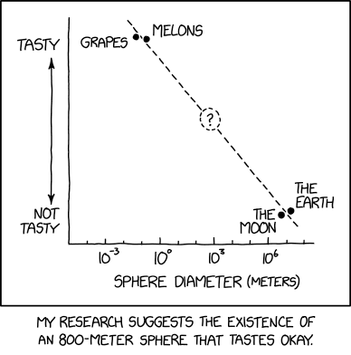
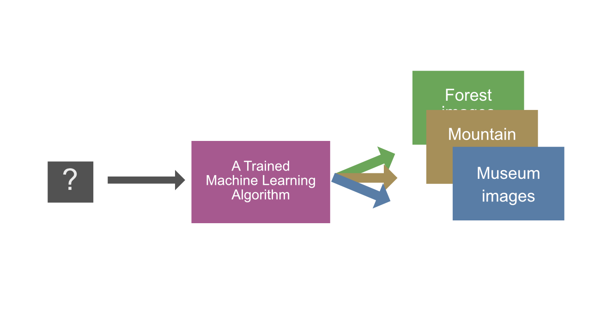

## Miksi koneoppimista käytetään?

Koneoppiminen keskittyy algoritmien kehittämiseen, jotka voivat oppia tietoa datasta. Koneoppimista käytetään monenlaisiin ongelmiin, kuten luokitteluun, regressioon, klusterointiin ja suosittelujärjestelmiin. Syy koneoppimisen käyttämiseen on usein se, että algoritmi auttaa automatisoimaan monimutkaisia tehtäviä. Alan asiantuntija voi tyypillisestä tehdä saman tehtävän käsin, mutta usein tämä on taloudellisesti kannattamatonta. On esimerkiksi täysin mahdollista, että musiikkistriimauspalvelun (Spotify, Apple Music yms.) palkkaama asiantuntija analysoisi sinun kuunteluhistoriasi ja suosittelisi sinulle musiikkia, josta sinä saattaisit pitää. Kuinka paljon palvelun kuukausimaksu olisi, jos jokaiselle resursoitaisiin 2 tuntia asiantuntijatyötä per kuukausi?

!!! question

    Kuinka varmistaisit, että asiantuntija ei suosi omia mieltymyksiään? Koneoppimismallin objektiivisuus on numeraalisesti mitattavissa, mutta ei suinkaan vaivatonta. Kuinka tekisit tämän ihmisen kanssa?


!!! tip

    :book: Kannattaa tutustua myös Oulun Yliopiston julkaisemaan  kirjaan [Miten tekoäly vaikuttaa elämäämme 2050-luvulla?](https://oulurepo.oulu.fi/handle/10024/46333).

Koneoppiminen voi myös auttaa löytämään uusia tietoa datasta, jota ihmiset eivät ole huomanneet. Koneoppimista käytetään monilla eri aloilla, kuten terveydenhuollossa, finanssialalla, markkinoinnissa ja teollisuudessa.



**Kuvio 1:** *Koneoppimista ja tilastotiedettä voi käyttää muun muassa luokitteluun. Lähde: [xkcd 2893 (CC BY-NC)](https://xkcd.com/2893/)*

## Esimerkki: Kuvien luokittelu


**Kuvio 2:** *Kuvien luokittelu käsin on aikaa vievää ja tylsää. Tässä DALL-E 3:n näkemys.*

Kuvittele, että olet ollut lomalla ja ottanut kuvia. Kävit lomalla kolmessa lokaatiossa: metsässä, vuorella ja museossa. Sinulla on yhteensä ==10,000 valokuvaa==. Kävit kussakin kohteessa useina eri päivinä, joten et voi tunnistaa kuvia helposti järjestämällä niitä päivämäärän tai juoksevan numeroinnin mukaan.

**Nykytilanne**: kaikki 10,000 kuvaa ovat hakemistossa `vacation_pictures/`.

**Tavoitetilanne**: kuvat on luokiteltuina kolmeen kansioon: `forest/`, `mountain/` ja `museum/`.

### Ratkaisu 1: Käsin luokittelu

Yksi ratkaisu on luokitella kuvat käsin. Käytät tunteja tai päiviä katsomalla kuvia ja siirtämällä ne oikeisiin kansioihin. Tämä on aikaa vievää ja tylsää. Entä jos kuvia onkin 100,000? Tai 1,000,000?

### Ratkaisu 2: Rautakoodattu logiikka

Toinen ratkaisu on kirjoittaa ohjelma, joka luokittelee kuvat automaattisesti. Voit esimerkiksi kirjoittaa ohjelman, joka noudattaa kuvan väriin sekä kuvan metatietoihin perustuvaa logiikkaa. Jokainen if-else sääntö kirjoitetaan käsin. Alla esimerkki, jossa tämä logiikka on kuvattuna pseudokoodina:

```pseudocode
procedure classify_pictures():
    for each picture in vacation_pictures:
        if picture.median_color == "green":
            move picture to forest/
        else if picture.median_color == "brown":
            if picture.iso_sensitivity > 800:
                move picture to museum/
            else:
                move picture to mountain/
        else if picture.median_color == "grey":
            move picture to museum/
```

### Ratkaisu 3: Koneoppiminen

Kolmas ratkaisu on käyttää koneoppimista. Työhön soveltuvia algoritmeja on useita. Näistä kaksi merkittävästi poikkeavaa lähestymistapaa ovat:

- [ ] **Syväoppiminen.** Voisimme käyttää syväoppimista ja siirto-oppimsita (engl. transfer learning). Tällöin lataisimme valmiin mallin, joka on opetettu tunnistamaan kuvia. Alkuperäinen malli on koulutettu miljoonilla kuvilla, joten se on oppinut tehokkaasti erilaisia piirteitä kuvista. Voimme käyttää tätä mallia pohjana ja opettaa sen tunnistamaan metsä-, vuori- ja museokuvia. Koulutusdata on kuvan raakapikselit tiettyyn resoluutioon skaalattuna. ==Tämä malli ei käy tälle kurssille==: neuroverkot esitellään syväoppimiseen liittyvillä kurssilla.
- [x] **Perinteiset koneoppimismallit.** Voimme käyttää perinteisiä koneoppimismalleja, kuten logistista regressiota, tukivektorikoneita tai päätöspuita. Koulutusdata **ei ole** raakaa pikselidataa, vaan kuvan pikselidatasta tulee luoda piirteitä (features). Tähän käytetään käyttäjän valitsemia menetelmiä. Voimme luomme piirteitä esimerkiksi kuvan pikseleiden väreistä histogrammin avulla tai kuvan reunapiirteistä käyttämällä valittua visuaalisten piirteiden kuvailuun (engl. visual feature descriptor) sopivaa menetelmää. Vaihtoehtoja olisivat esimerkiksi ORB ja BRIEF. Näillä työkaluilla luotu piirre syötettäisiin valitsemallemme koneoppimismallille, joka oppisi tunnistamaan kuvia.

#### Vaihe 3.1: Kuvan piirteiden luominen

Kuvitellaan, että meillä on koodattuna piirrekuvaus, joka palauttaa aina tasan 10 piirrettä kuvasta. Kuvitelluista piirteistä kolme ensimmäistä ovat jatkuvia (engl. continuous features) ja loput seitsemän ovat kategorisia (enlg. categorical features.) Funktiota kutsuttaisiin näin:

```python  title="IPython"
picture = load_picture("vacation_pictures/IMG_0001.jpg")
features = describe_features(picture)
print(features)
```

```txt  title="stdout (kommentoituna)"
     jatkuvat
 ┌───────┴─────────┐
[0.123, 0.555, 0.991, 1, 0, 0, 1, 0, 1, 1]
                      └────┬────────────┘
                        kategoriset
```

!!! note

    Koneoppimismallille ei siis syötetä suoraan kuvan RGB-dataa vaan kuvasta lasketut piirteet. Syväoppimismallit ovat poikkeus, sillä ne voivat käyttää raakaa pikselidataa, ja ne oppivat luomaan piirteet itse. Ne eivät ole tämän kurssin aihealue.

#### Vaihe 3.2: Koneoppimismallin kouluttaminen


**Kuvio 2:** *Koneoppimismallin koulutus hoituisi syöttämällä mallille metsä-, vuori- ja museokuvien (vihreät, ruskeat, siniset neliöiden) piirrevektoreita.*

Vaiheessa kaksi koulutamme koneoppimismallin. Koulutusdata koostuu kuvien piirteistä ja niiden luokista. Voisimme esimerkiksi luokitella käsin 200 metsä-, vuori- ja museokuvaa ja kouluttaa mallin näiden avulla. Näin meidän tarvisisi luokitella (engl. to label) vain 600 kuvaa käsin, eikä kaikkia 10,000 kuvaa. Malli oppii koulutusdatasta korrelaatioita piirteiden ja luokkien välillä. 

!!! tip

    Esimerkiksi `features[7] == 1` voi viitata vahvasti siihen, että kuva on metsäkuva. Kenties kyseinen feature on binaarinen `is_bad_compress_ratio` ja se on saanut arvon 1, koska metsäkuvat pakkautuvat huonommin kuin vuori- ja museokuvat.

#### Vaihe 3.3: Koneoppimismallin testaus

Voimme testata mallin antamalla sille esimerkiksi 100 metsä-, vuori- ja museokuvaa, joita se ei ole nähnyt koulutusvaiheessa. Aivan kuten koulutusdata, myös nämä on pitänyt käsin luokitella.

Kuvitellaan, että testaus on mennyt hyvin, ja malli on tunnistanut kuvat seuraavanlaisesti:

* Metsäkuvat:
    - [x] 92/100 metsä
    - [ ] 6/100 vuori
    - [ ] 2/100 museo
* Vuorikuvat:
    - [ ] 4/100 metsä
    - [x] 95/100 vuori
    - [ ] 1/100 museo
* Museokuvat:
    - [ ] 1/100 metsä
    - [ ] 2/100 vuori
    - [x] 97/100 museo

#### Vaihe 3.4: Koneoppimismallin käyttö



**Kuvio 3:** *Koneoppimismallin käyttö. Kuvien piirteet syötetään mallille, joka antaa luokituksen.*

Lopulta mallia voi käyttää tunnistamaan kuvia, joita se ei ole nähnyt. Näin voimme käyttää sitä luokittelemaan ne 9,100 kuvaa, joita emme ole käsin luokitelleet koulutus- tai testausvaiheessa. Alla vielä selvyyden vuoksi koodiesimerkki, joka luokittelee kuvat:

```python title="IPython"
from models import VacationModel as model

# Load
picture = load_picture("vacation_pictures/IMG_09999.jpg")
features = describe_features(picture)

# Infer
predicted_class = model.predict(features)
print(predicted_class)
```

```txt title="stdout"
"forest"
```