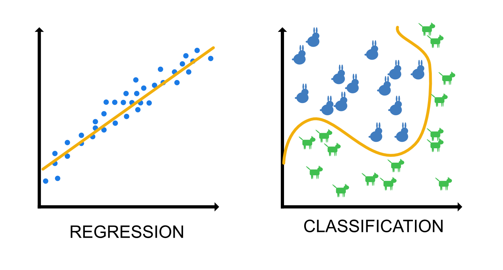
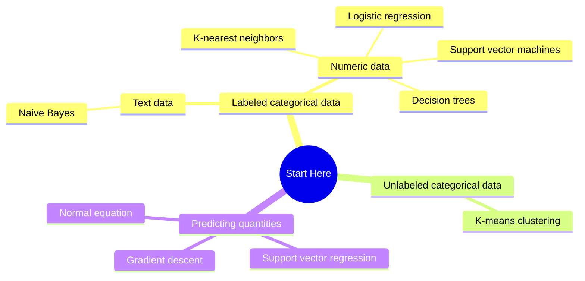

Koneoppimisen suhteen on tärkeä tunnistaa ja osata selittää kaksi termiä:

* **Algoritmi** (engl. algorithm) on matemaattinen kaava tai tilastollinen kaava.
* **Malli** (engl. model) on algoritmin koulutuksen tuloksena syntynyt koneoppimismalli, joka osaa tehdä luokituksia aikaisemmin näkemättömille syötteille.

Kun sinulla on jokin koneoppimisen ongelma, sinun tulee valita ongelmaan sopiva malli. Mallin valitsemisen jälkeen koulutat algoritmin koulutusdatalla. Koulutuksen jälkeen voit testata mallin suorituskykyä testidatalla. Testidata on tismalleen samanlaista dataa kuin koulutusdata, mutta sitä ei ole paljastettu algoritmille koulutusvaiheessa. Lopuksi voit käyttää mallia tunnistamaan uusia syötteitä.

## Kolme koneoppimisen päätyyppiä

Koneoppiminen voidaan jakaa kolmeen päätyyppiin: 

* **ohjattu** (engl. supervised learning)
* **ohjaamaton** (engl. unsupervised learning)
* **vahvistusoppiminen** (engl. reinforcement learning)

### Ohjattu oppiminen

**Kuvio 1.** *Talon hinnan arviointi DALL-E 3:n maalaamana. Huomaa talosta lentävät numerot, jotka edustavat joitakin talon piirteitä, kuten sijaintia, huoneiden määrää ja pinta-alaa.*

Ohjattu oppiminen on koneoppimisen tyypeistä ilemisin. Se on yleisesti käytössä ja se on helppo ymmärtää: opetusdata sisältää oikean vastauksen. Koulutusvaiheessa algoritmi pyrkii löytämään korrelaatioita piirteiden ja oikean vastauksen välillä. Lineaarinen regressio (ks. Kuvio 2) eli suoran sovitus on yksi yksinkertaisimmista ohjatun oppimisen algoritmeista. Huomaa, että kone ei tässä tapauksessa opi mitään ilmiöiden kausaalisuhteista, vaan ainoastaan korrelaatioista. Kone ei tiedä mitään logiikasta: se vain palauttaa x:n perusteella y:n - eikä edes *oikeaa* y:n arvoa, vaan jonkin sortin mediaanin.

Käytännön esimerkkejä:

* Kuvien luokittelu (forest, mountain, museum)
* Sähköpostien luokittelu (spam, ei-spam)
* Asunnon hinnan ennustaminen
* Käsin kirjoitetun numeron tunnistaminen

**Kuvio 2.** *Regressio- ja luokitteluongelmien ero. Huomaa, että kumpikin näistä ongelmista on ohjattua oppimista. Regressio-ongelmassa y-akseli on se, mitä ennustetaan. Luokitteluongelmassa eläinlaji on se, mitä ennustetaan. Kumpikin näistä on tiedossa.*

### Ohjaamaton oppiminen

**Kuvio 2.** *DVD-elokuvien luokittelu DALL-E 3:n maalaamana. Huomaa, että algoritmi tuskin päätyisi ihmisen tuntemiin genreihin kuten draama, komedia ja animaatio. Luokitteluun vaikuttaa merkittävästi se, mitä piirteitä algoritmille syötetään. Jos piirrevektori sisältää pelkän elokuvan keston ja leikkauksien määrän, saat luokkia kuten "Pitkät elokuvat, joissa on vähän leikkauksia"*

Ohjaamaton oppiminen on ohjatun oppimisen vastakohta. Ohjaamattomassa oppimisessa **oikea vastaus puuttuu** kokonaan koulutusdatasta. Valittu algoritmi pyrkii tunnistamaan jonkin sortin rakenteita datasta. Käyttötarpeita ovat esimerkiksi:

* **klusterointi** (engl. clustering)
* **poikkeuksien tunnistaminen** (engl. anomaly detection)
* **ulottuvuuksien vähentäminen** (engl. dimensionality reduction)

Käytännön tasolla tehtävät oivat olla:

* **Asiakassegmentointi** (klusterointi)
* **Vikojen tunnistaminen teollisuudessa** (poikkeuksien tunnistaminen)
* **Piirteiden yhdistäminen datasetistä** (ulottuvuuksien vähentäminen)

Klassinen esimerkki asiakassegmentoinnista ovat t-paidat. Kuvittele, että sinulla on 1000 ihmistä, joilla haluat valmistaa t-paitoja. Sinulla on kunkin ihmisen mitat, kuten rinnanympärys, tiedossa. Kenties haluat kaavoittaa kolmenlaisia paitoja: S, M ja L. Ohjaamattomassa oppimisessa malli luokittelee ihmiset kolmeen ryhmään niin, että keskimääräisin samankokoiset ihmiset ovat samassa ryhmässä. Mikäli valmistat tämän keskiarvon mukaan t-paitoja, ne todennäköisesti sopivat hyvin suurimmalle osalle ihmisistä. 

!!! warning

    Huomaa, että kussakin luokassa on kuitenkin yksilöitä, joille vaatturi olisi mitannut eri kokoisen paidan. Virhe on aina olemassa. Mikä määrä virhettä on ok? Jos suunnittelet L-koon paidan kyseisen kategorian mukaan, onko ok, että 10 ihmiselle paita ei mahdu ylle rikkomatta saumoja?

### Vahvistusoppiminen

<iframe width="560" height="315" src="https://www.youtube.com/embed/SX08NT55YhA?si=C_5s8YsUEo2J_xDX" title="YouTube video player" frameborder="0" allow="accelerometer; autoplay; clipboard-write; encrypted-media; gyroscope; picture-in-picture; web-share" referrerpolicy="strict-origin-when-cross-origin" allowfullscreen></iframe>

**Video 1.** *Vahvistusoppiminen Trackmania-pelin avulla. (Lähde: Yosh, Youtube)*

Vahvistusoppimisessa malli oppii toimimaan ympäristössä, jossa se saa palkkion tai rangaistuksen toiminnastaan. Yllä on YouTube-video, jossa Yosh esittelee vahvistusoppimista Trackmania-pelin avulla. Porkkanana on radalla eteneminen ja rangaistuksena on radalta putoaminen. Jos video ei toimi, etsi vastaava video esimerkiksi hakusanoilla *"Reinforcement learning racing game"*.

## Algoritmin valinta

Huomaa, että kukin yllä mainituista päätyypeistä rajaa algoritmin valintaa. Tiettyjä termejä voi esiintyä sekä luokitteluun että regressioon liittyvissä ongelmissa, mikä voi alkuun hämmentää. Esimerkiksi `Support Vector <something>` voi esiintyä sekä luokittelu- että regressioalgoritmeissa, kuten myös `K-<something>`.

!!! question "Tehtävä"

    Selvitä, mitä eroa on `Support Vector Classifier` ja `Support Vector Regressor` -algoritmeilla. Mikä on niiden yhteinen piirre? Mikä on `support vector`?

    Selvitä, mitä eroa on `K-Nearest Neighbors` ja `K-Means` -algoritmeilla. Mikä on niiden yhteinen piirre? Mikä on `k`?

Alla on miellekartta, joka auttaa valitsemaan oikean algoritmin ongelmaasi. Huomaa, että miellekartan kolme haaraa riippuvat siitä, onko ongelmasi luokittelu, regressio vai klusterointi.

!!! question "Tehtävä"

    Yllä oleva miellekartta pohjautuu vahvasti Scikit Learnin [Choosing the right estimator](https://scikit-learn.org/stable/tutorial/machine_learning_map/index.html) -sivun kaavioon. Tutustu myös tähän alkuperäiseen, hieman laajempaan kaavioon.

## Tehtävät

Alla on kuusi ongelmatilannetta. Pohdi voiko ongelman ratkaista koneoppimisella? Jos, niin minkä tyyppisellä koneoppimisella? Ohjattu, ohjaamaton vai vahvistusoppiminen? Nämä pohdinnat ovat hyvää sisältöä oppimispäiväkirjaan.

### Ongelma 1: Uutisryhmäviestit

Datasetti sisältää uutisryhmäviestejä ja niiden luokituksia. Luokituksia ovat aiheet (kuten urheilu, pelit, taide, ...). Sinun tulee luoda sovellus, joka ennustaa uutisryhmäviestin aiheen, jos viestillä ei vielä ole aiheen luokitusta.

### Ongelma 2: Ruusutarha

Datasetti sisältää kasvihuoneen ruusujen parametreja `[lämpötila, kosteus, valon määrä... kasvu päivässä]`. Sinun tulee luoda sovellus, joka ennustaa kuinka paljon annettu ruusu kasvaa päivässä.

### Ongelma 3: Kissanruoka

Datasetti sisältää kuvia kissoista. Kuvat ovat 50x50 pikselin RGB-kuvia ilman muuta dataa. Sinun tulee luoda sovellus, joka ennustaa, pitääkö kissa tietystä kissanruokamerkistä.

### Ongelma 4: Palvelinkeskus

Datasetti sisältää palvelimen metriikoita [CPU-lämpötila, HDD-lämpötila, HDD-kuorma, ...]. Sinun tulee luoda sovellus, joka varoittaa, jos palvelin käyttäytyy epätavallisesti.

!!! note

    Kenties nämä oudosti käyttäytyvät palvelimet ovat joko hyökkäyksen kohteena tai ovat hajoamassa!

### Ongelma 5: Pac-Man

Sinulla ei ole datasettiä. Haluat luoda sovelluksen, joka osaa pelata Pac-Man -peliä.

### Ongelma 6: Ostoshistoria

Datasetti sisältää käyttäjien selaus- sekä ostoshistoriaa yrityksenne verkkokaupassa. Markkinointiosasto on aiempina vuosina luonut vain yhden Black Friday -kampanjamainoksen, joka on näytetty kaikille kaikille käyttäjille. Markkinointi haluaisi kohdentaa mainoksen paremmin, mutta heillä on resursseja luoda vain noin 10 erilaista mainosta. He haluavat tietää, millaisia tuotteita katselevia ja ostavia asiakkailla heillä on.