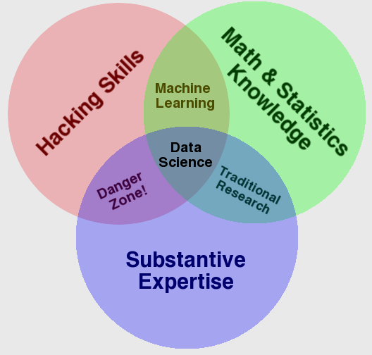
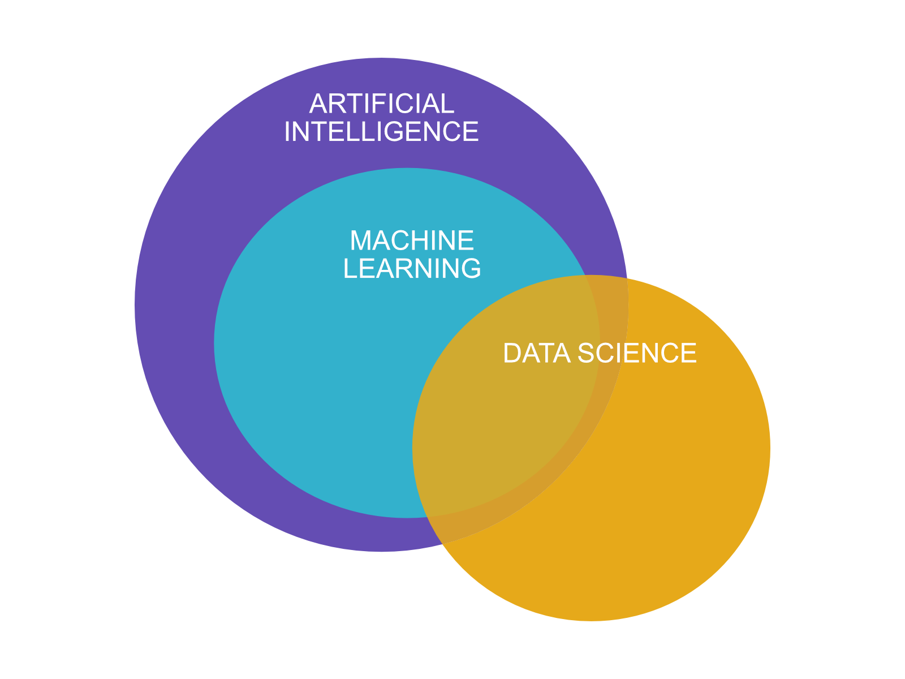

# Yleistä

Keskitymme tässä ensimmäisessä luvussa alan tärkeimpiin termeihin ja määritelmiin.

## Datatieteet

Tämä on kurssi koneoppimisesta ja tekoälystä, ja niihin vahvasti liittyvä käsite sekä tieteenala on *datatieteet (engl. data sciences)*.

> "Data science is the field of study that combines domain expertise, programming skills, and knowledge of mathematics and statistics to extract meaningful insights from data. Data science practitioners apply machine learning algorithms to numbers, text, images, video, audio, and more to produce artificial intelligence (AI) systems to perform tasks that ordinarily require human intelligence. In turn, these systems generate insights which analysts and business users can translate into tangible business value." - [DataRobot](https://www.datarobot.com/wiki/data-science/)

**Kuvio 1:** *Venn-diagrammi datatieteistä. [Lähde: Dren Conway, The Data Science Venn Diagram (CC-BY)](http://drewconway.com/zia/2013/3/26/the-data-science-venn-diagram)*

Datatieteet ovat tieteenala, joka laittaa koneoppimisen käytäntöön. Konteksti, jossa koneoppiminen laitetaan käytäntöön liike-elämässä on jokin substanssiosaamista vaativa toimiala. Koneoppiminen tai tekoäly auttaa ratkaisemaan ongelmia. Henkilöt, jotka työskentelevät datatieteiden parissa ovat titteleiltään esimerkiksi data scientist, data analyst tai data engineer. Työnkuvissa voi olla päällekäisyyttä, mutta niissä on myös nyanssieroja.

!!! question

    Pohdi ja selvitä, mitä eroa on data scientistin, data analystin ja data engineerin työnkuvilla. Kenen työkalupakkiin kuuluisi todennäköisimmin ohjelmisto Tableau ja mitä se tekee? Kuka kirjoittaisi koodia, joka hyödyntää jotakin nimeltään Apache Spark? Entä pärjääkö yhden roolin osaaja ilman kahta muuta?

## Tekoäly

Tekoäly on vahvasti elokuvateollisuuden ja muun fiktion värittämä käsite. Osa fiktion tarjoamasta tiedosta on toki täyttä humpuukia, ja todellisuudessa tekoälyn hupun alta paljastuu pikemminkin tilastotiedettä ja matematiikkaa. Tämä ei kuitenkaan vähennä tekoälyn arvoa liiketoiminnan kannalta tärkeiden ongelmien ratkaisijana. Tekoäly itsessään on kattotermi koneoppimiselle, ja se sisältää kaiken sellaisen teknologian, joka matkii ihmisenkaltaista älykkyyttä tavalla tai toisella. Näihin tapoihin kuuluvat myös sääntöpohjaiset järjestelmät (if-elif-elif-else).

Tekoäly ei ole uusi keksintö. Ihmismielen päättelyn ymmärtämistä tai sitä vastaavan mekaanisen laitteen rakentamista on yritetty satoja ellei jopa tuhansia vuosia. Ensimmäinen neuroverkkotietokone, SNARC, rakennettiin vuonna 1950 Minskyn ja Edmondsin toimesta. Se koostui 40:stä keinotekoisesta neuronista, joiden rakennetta insiroivat ihmisaivojen neuronit. Vertailun vuoksi hedelmäkärpäsellä on noin 100 000 neuronia. 1950-luvulla ja 1960-luvulla tietokoneet olivat jo ratkaisseet tarinallisia ongelmia ja pelanneet shakkia. Nämä vuodet olivat täynnä toivoa ja suuria unelmia. Tekoälyn tutkijat tekivät ennusteita ja lupauksia tulevista menestystarinoistaan: tietokone voittaisi ihmisen shakissa 10 vuoden kuluessa. 1960-luvun puolivälistä 2000-luvun alkuun oli ajanjakso, joka sisälsi monia nousuja ja laskuja tai "hype-syklejä". Tämän aikakauden keskellä, 1980-luvulla, oli lyhyt hetki innostusta ja suuria toiveita. Miljardeja dollareita käytettiin erilaisiin tekoälyn sovelluksiin, mikä seurasi pettymystä. Tämä käynnisti uuden laskusuhdanteen tai *"tekoälyn talven"* (engl. AI winter). Tällä hetkellä koemme uutta tekoälyn saapumista, "tekoälyn kevättä". Toiveet ja odotukset ovat jälleen korkealla. Meillä on enemmän dataa ja laskentatehoa kuin koskaan, ja tekoälyn sovellukset ovat osoittautuneet liiketoiminnan kannalta hyödylliseksi, joten hypeen on varmasti syitä.

### Tekoälyn määritelmä

Jotta meillä voisi olla ristiriidaton määritelmä tekoälylle, meillä tulisi olla ensin ristiriidaton määritelmä (ihmisen) älykkyydelle. Tällaista ei ole, joten myös AI:n suhteen joudumme tyytymään vaihteleviin määritelmiin. Kirjassa "Artificial Intelligence: A Modern Approach" (S. Russell & P. Norvig, 3. painos, 2010) esitetään, että tekoäly on ala, joka pyrkii ei vain ymmärtämään, vaan myös rakentamaan älykkäitä toimijoita." Tekoälyn määritelmiä voidaan järjestää neljään kategoriaan: ihmismäisesti ajattelemiseen, rationaalisesti ajattelemiseen, ihmismäisesti toimimiseen ja rationaalisesti toimimiseen. Näiden neljän kategorian jakautuminen perustuu kahteen akseliin: ==rationaali-ihmismäinen== (enlg. rational-humanly) ja ==ajattelu-toiminta== (engl. thinking-acting). Jos tekoäly *toimii ihmismäisesti* (engl. acting humanly), sen käyttäytyminen on vaikea erottaa ihmisen käyttäytymisestä. Esimerkiksi kuulustelija ei tietäisi, käykö hän keskustelua botin vai ihmisen kanssa. Vastakohta tälle molemmilla akselilla on *rationaalisesti ajattelu* (engl. thinking rationally). Tämän määritelmän mukaan botti noudattaisi täydellistä päättelyprosessia. Kaikki olisi täysin virheetöntä logiikkaa.

!!! question "Tehtävä"

    Pohdi, mitä esteitä tulisi vastaan, jos yrittäisit ratkaista todellisen maailman ongelmia käyttäen bottia, joka pyrkii täydellisesti aukottomaan, rationaaliseen ajatteluun?

*Rationaalinen toiminta* (engl. rational-acting) vaikuttaa olevan parhaiten soveltuva lähestymistapa käytännön tekoälylle. Rationaalinen toimija on olio, joka havaitsee ympäristönsä erilaisten antureiden avulla ja toimii sen mukaisesti, mutta pystyy sopeutumaan muutoksiin ja tavoittelee päämääriä. Tämän kurssin aikana luomme useita erilaisia rationaalisia toimijoita ja niiden komponentteja: yksi niistä on koneoppiminen, joka on tällä hetkellä hallitseva tapa rakentaa tekoälyä.

Tämän materiaalin puitteissa voit luottaa seuraavaan määritelmään: *AI eli tekoäly on mitä tahansa, mikä ulkoapäin vaikuttaa joltakin, mikä tyypillisesti vaatii ihmisen älykkyyttä*. Esimerkiksi kielioppivirheitä tai syntaksivirheitä voi poistaa tekstistä sääntöpohjaisella logiikalla käyttämättä koneoppimista laisinkaan. Myös esimerkiksi "älyliikennevaloja" voi ohjata hyvinkin sääntöpohjaisesti.

!!! question

    Onko jokin alla listatuista teoksista tuttu? Mitä tekoäly tarkoittaa kyseisessä tarinassa? Mitkä muut elokuvat, tv-sarjat tai kirjat kuuluisivat listalle?

    * 2001: A Space Odyssey (1968)
    * Hitchhiker's Guide to the Galaxy (1978/...)
    * Terminator (1984/...)
    * The Matrix (1999/...)
    * Moon (2009)
    * Her (2013)

### Tekoälyn haarat

Tekoäly on kattokäsite ja sen alle lukeutuu eri aloja. Kirjassa Artificial Intelligence with Python (Joshi, P. 2017) esitellään tekoälyn eri haarat seuraavasti:

* Koneoppiminen ja hahmontunnistus (engl. machine learning and pattern recognition): datasta oppiminen ja siitä ennustaminen. Tämän kurssin AI edustaa pääasiassa tätä.
* Logiikkapohjainen AI (engl. logic-based AI): sääntöpohjaiset järjestelmät, jotka perustuvat logiikkaan. Käytetään esimerkiksi kielen parsimiseen.
* Haku (engl. search): algoritmit, jotka etsivät esimerkiksi optimaalista reittiä. Peleistä ja navigaattoreista tuttuja.
* Tiedon esittäminen (enlg. knowledge representation): yhteyksien luominen tiedon välille taksonomian tai muun hierarkisen järjestelmän avulla.
* Suunnittelu (engl. planning): algoritmit, jotka suunnittelevat toimintaa tavoitteiden saavuttamiseksi.
* Heurestiikka (engl. heuristics): reittien tai ratkaisuiden etsiminen tilanteessa, jossa optimaalista ratkaisua ei ole mahdollista tai käytännöllistä löytää.
* Geneettinen ohjelmointi (engl. genetic programming): algoritmit, jotka käyttävät evoluutioteoriaa ratkaisujen löytämiseen.

## Koneoppiminen

*Kuvio 2:* Koneoppiminen, tekoäly ja datatiede.

Koneoppiminen on tekoälyn osa-alue. Kaikki koneoppiminen on tekoälyä, mutta kaikki tekoäly ei ole koneoppimista. Koneoppimisen määritelmään kuuluu, että tekoälymalli oppii datasta. Malli oppii siis kokemuksesta. Koneoppimismallin luominen ("mallinnus") on prosessi, jossa valittu koneoppimisalgoritmi oppii datasta. Ihminen valitsee sekä algoritmin että datan - ja näiden valinnalla on merkittävä vaikutus valmiin mallin laatuun.

### Määritelmiä

> "Machine learning (ML) is a collection of algorithms and techniques used to design systems that learn from data. These systems are then able to perform predictions or deduce patterns from the supplied data."

Lähde: Lee, W. 2019. Python Machine Learning. Wiley. 

---

> The machine learning portion of the picture enabled an AI to perform these tasks:
> 
> * Adapt to new circumstances that the original developer didn't envision
> * Detect patterns in all sorts of data sources
> * Create new behaviors based on the recognized patterns
> * Make decisions based on the success of failure of these behaviors.

Lähde: Mueller, P & Massaron, L. 2016. Machine Learning for Dummies. No Starch Press. [Löytyy Finna-palvelusta](https://kamk.finna.fi/).

---

> "Difference between machine learning and AI: 
> 
> If it is written in Python, it's probably machine learning 
>
> If it is written in PowerPoint, it's probably AI" 

Lähde: [Matt Velloso:n Twitter-viesti marraskuulta 2018](https://twitter.com/matvelloso/status/1065778379612282885?)

---

> "Machine learning is a field of study concerned with giving computers the ability to learn without being explicitly programmed."

Lähde: Arthur Smith, 1959.

---

> "A computer program is said to learn from experience, E, with respect to a task, T, and a performance measure, P, if its performance on T, as measured by P, improves with experience E."

Lähde: Tom Mitchell, 1998.

---

> "A program or system that builds (trains) a predictive model from input data. The system uses the learned model to make useful predictions from new (never-before-seen) data drawn from the same distribution as the one used to train the model. Machine learning also refers to the field of study concerned with these programs or systems."

Lähde: [Google Developers Machine Learning Glossary](https://developers.google.com/machine-learning/glossary#m)